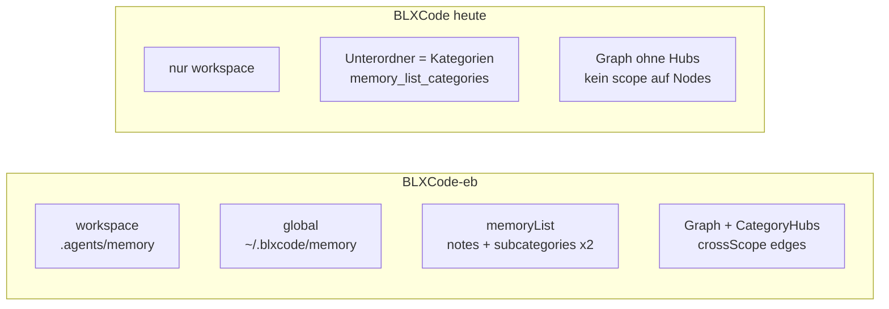

# Memory-System: Parität BLXCode-eb → BLXCode (Tauri)

## Referenz (Source of Truth)

BLXCode-eb implementiert das vollständige Modell. Diese Dateien sind die Spezifikation zum Portieren:

| Bereich | EB-Referenz |
|---------|-------------|
| Typen/Konstanten | [`src/shared/memory.ts`](c:/Users/quork/Entwicklung/BLXCode-eb/src/shared/memory.ts) |
| Pfade & Scopes | [`src/bun/memory/paths.ts`](c:/Users/quork/Entwicklung/BLXCode-eb/src/bun/memory/paths.ts) |
| CRUD/List/Graph | [`src/bun/memory/store.ts`](c:/Users/quork/Entwicklung/BLXCode-eb/src/bun/memory/store.ts) |
| Graph-Builder | [`src/bun/memory/graph.ts`](c:/Users/quork/Entwicklung/BLXCode-eb/src/bun/memory/graph.ts) |
| Wikilinks | [`src/bun/memory/wikilinks.ts`](c:/Users/quork/Entwicklung/BLXCode-eb/src/bun/memory/wikilinks.ts) |
| Frontmatter | [`src/bun/memory/frontmatter.ts`](c:/Users/quork/Entwicklung/BLXCode-eb/src/bun/memory/frontmatter.ts) |
| UI-Sidebar/Kategorien | [`src/views/.../Memory/files/MemorySidebar.tsx`](c:/Users/quork/Entwicklung/BLXCode-eb/src/views/app/layout/SidePanel/Memory/files/MemorySidebar.tsx), [`memoryScopeCategories.ts`](c:/Users/quork/Entwicklung/BLXCode-eb/src/views/app/layout/SidePanel/Memory/memoryScopeCategories.ts) |
| Graph-UI | [`MemoryGraphView.tsx`](c:/Users/quork/Entwicklung/BLXCode-eb/src/views/app/layout/SidePanel/Memory/graph/MemoryGraphView.tsx) |

## Ist-Zustand BLXCode (Gap-Analyse)



**Bereits vorhanden (behalten/erweitern):**
- Workspace-Roots: `.agents/memory/`, `.agents/learnings/` ([`memory.rs`](c:/Users/quork/Entwicklung/BLXCode/src-tauri/src/memory.rs))
- Dynamische Kategorien via Unterordner + `.gitkeep` (`memory_list_categories`, `memory_create_category`)
- Memory-Tab mit Files / Graph / Search ([`memory_panel.rs`](c:/Users/quork/Entwicklung/BLXCode/src/workbench/memory_panel.rs))
- `graph_category_for` identisch zu EB (erster Pfadsegment = Kategorie)

**Fehlt für 1:1-Parität:**

| Feature | EB | BLXCode |
|---------|----|---------|
| `MemoryScope` (`workspace` \| `global`) | überall | fehlt |
| Global-Roots `~/.blxcode/{memory,learnings}` | ja | nein |
| `memoryList` → `{ notes, memorySubcategories }` pro Scope | ja | getrennte Calls, nur workspace |
| `NoteMeta`: `scope`, `title`, `enabled`, `tags`, `category`, `isLearning`, `isOverview` | ja | nur `path`, `name`, `size`, `modified`, `isTemplate` |
| Frontmatter (`title`, `enabled`, `tags`) | ja | nein |
| Wikilinks `[[global:…]]` / `[[workspace:…]]` | ja | nur basename/pfad |
| Graph: Category-Hub-Knoten (`hub:cat`), `crossScope`, `hubScopes` | ja | nein |
| Sidebar: zwei Sektionen (Projekt / Global) | ja | eine flache Kategorie-Liste |
| Note-Keys `scope:path` | ja | nur `path` |
| `memory_bootstrap` / `memory_status` (global) | ja | nur `workspace_ensure_agents` |
| Export/Import/Pointers mit Scope-Auswahl | UI + RPC | Backend teils da, UI fehlt |

---

## Entscheidungen (abgestimmt)

| Thema | Entscheidung |
|-------|----------------|
| Workspace-Legacy `<projekt>/.blxcode/memory/` | **Entfernen** — keine automatische Migration mehr nach `.agents/memory/` |
| Global Memory | **1:1 EB:** `~/.blxcode/memory` + `~/.blxcode/learnings` (User-Home, nicht im Projektordner) |
| `memory_list` API | **Breaking Change** — nur noch `{ notes, memorySubcategories }`, alle Aufrufer anpassen |
| UI-Struktur | **Volle EB-Parität** — `src/workbench/memory/` mit Untermodulen (panel, files/, graph/, search/, dialogs) statt monolithischem `memory_panel.rs` |
| Kategorie-Einstellungen | Alte Keys `decisions` → **`workspace:decisions`** beim Laden; Global-Keys `global:…` |

---

## Ziel-Architektur

```mermaid
flowchart TB
  subgraph storage [Dateisystem]
    WSM["workspace/.agents/memory"]
    WSL["workspace/.agents/learnings"]
    GLM["~/.blxcode/memory"]
    GLL["~/.blxcode/learnings"]
  end
  subgraph tauri [src-tauri/src/memory/]
    paths[paths.rs]
    store[store.rs]
    graph[graph.rs]
    wikilinks[wikilinks.rs]
    frontmatter[frontmatter.rs]
  end
  subgraph ui [src/workbench/memory/]
    panel[memory_panel / useMemory-äquivalent]
    sidebar[Scope-Sektionen + Kategorien]
    graphUi[memory_graph mit Hubs]
  end
  WSM --> paths
  WSL --> paths
  GLM --> paths
  GLL --> paths
  paths --> store
  store --> graph
  wikilinks --> graph
  store --> panel
  graph --> graphUi
```

**Pfad-Regeln (wie EB):**
- API-Pfad `learnings/foo.md` → Kategorie `learnings`, Scope je nach Root
- `decisions/note.md` unter memory → Kategorie `decisions`
- Root-`.md` → Kategorie `memory`
- Unterordner von `.agents/memory` (ohne `_templates`, ohne `.`) → `memorySubcategories`
- Node-IDs: `{scope}:{apiPath}`; Hub-IDs: `hub:{category}`

---

## Implementierung (Phasen)

### Phase 1 — Backend: Scope & Typen

**Refactor** [`src-tauri/src/memory.rs`](c:/Users/quork/Entwicklung/BLXCode/src-tauri/src/memory.rs) in Module (analog EB):

- `memory/paths.rs` — `get_global_roots()`, `get_workspace_roots()`, `list_memory_subcategories()`, `graph_category_for()`, `node_id`/`parse_node_id`, `validate_category_name`
- `memory/types.rs` — Serde-Structs spiegeln [`shared/memory.ts`](c:/Users/quork/Entwicklung/BLXCode-eb/src/shared/memory.ts): `MemoryScope`, `NoteMeta`, `MemoryListResponse`, `GraphNode` (+ `isCategoryHub`, `hubScopes`), `GraphEdge` (+ `crossScope`), `SearchHit` (+ `scope`, `category`), `MemoryStatusResponse`

**Neue/erweiterte Commands** in [`lib.rs`](c:/Users/quork/Entwicklung/BLXCode/src-tauri/src/lib.rs):

- `memory_status(workspace_cwd?)` → workspace + global Ordner-Status
- `memory_bootstrap(target, workspace_cwd?)` — `workspace` | `global` | `all` (Seed README in memory/learnings wie EB `store.ts`)
- `memory_list` → `{ notes, memorySubcategories: { workspace, global } }` (ersetzt flaches `Vec<NoteMeta>`)
- Alle bestehenden Commands um Parameter `scope: MemoryScope` erweitern (`memory_read`, `write`, `create`, `delete`, `rename`, `create_category`, `graph`, `search`, `backlinks`, `export`, `import`)

**`collect_notes`:** Notizen aus beiden Roots sammeln, `scope` setzen, Frontmatter parsen, `category`/`isLearning`/`isOverview`/`enabled`/`title`/`tags` befüllen (Logik aus EB `collectNotes` in `store.ts`).

**Kompatibilität:** Bestehende Workspace-Dateien unter `.agents/` bleiben unverändert; Global wird bei erstem Bootstrap unter `~/.blxcode/` angelegt.

**Legacy entfernen:** `migrate_legacy_memory` und `LEGACY_MEMORY_REL` aus [`agents_layout.rs`](c:/Users/quork/Entwicklung/BLXCode/src-tauri/src/agents_layout.rs) streichen; Test `memory_list_includes_learnings_and_legacy_migrates` ersetzen. Nutzer mit altem `<projekt>/.blxcode/memory/` müssen Inhalt **manuell** nach `.agents/memory/` verschieben (einmalig, in Doku erwähnen).

### Phase 2 — Graph, Wikilinks, Suche

Port aus EB:

- [`graph.rs`](c:/Users/quork/Entwicklung/BLXCode-eb/src/bun/memory/graph.ts): Hub-Knoten, Note→Hub-Kanten, Wikilink-Auflösung, `orphan`, `crossScope`
- [`wikilinks.rs`](c:/Users/quork/Entwicklung/BLXCode-eb/src/bun/memory/wikilinks.ts): `global:`/`workspace:`-Prefix, Auflösung über `scopePaths`-Map beider Scopes
- `memory_graph(workspace_cwd)` nutzt dieselbe Hub-Map-Logik wie `memoryGraph` in `store.ts` (Zeilen 434–496)

`memory_backlinks` → `Vec<{ scope, path }>` statt nur Pfad-Strings.

`memory_search` → Treffer mit `scope` + `category` für Filter `workspace:decisions` etc.

### Phase 3 — Tauri-Bridge & Frontend-Typen

[`src/tauri_bridge.rs`](c:/Users/quork/Entwicklung/BLXCode/src/tauri_bridge.rs):

- Alle `memory_*`-Wrapper um `scope` ergänzen
- `memory_list` → neues Response-Struct
- Hilfsfunktionen wie EB [`memoryRpc.ts`](c:/Users/quork/Entwicklung/BLXCode-eb/src/views/app/lib/memoryRpc.ts): `note_key(scope, path)`, `parse_note_key`

Optional kleines Rust→WASM-geteiltes Modul oder Duplikat der Konstanten in [`src/config/app.config.rs`](c:/Users/quork/Entwicklung/BLXCode/src/config/app.config.rs): `CATEGORY_HUB_PREFIX`, `MEMORY_GRAPH_MODE_KEY` (bereits vorhanden prüfen).

### Phase 4 — Memory-UI (Files-Tab)

**Neue Modulstruktur** (analog EB `SidePanel/Memory/`), Leptos statt React:

```
src/workbench/memory/
  mod.rs              — MemoryPanel, TabBar (files|graph|search)
  use_memory.rs       — State, load/save, bootstrap (≈ useMemory.ts)
  scope_categories.rs — build_scope_categories (≈ memoryScopeCategories.ts)
  files/
    sidebar.rs        — Dual-Scope-Sektionen + Kategorie-Gruppen
    editor.rs
    new_category_dialog.rs
  graph/              — ggf. memory_graph/ hierher ziehen oder re-export
  search/
  dialogs/            — export, import, pointers, no-folder
```

[`memory_panel.rs`](c:/Users/quork/Entwicklung/BLXCode/src/workbench/memory_panel.rs) wird auf dünnen Re-Export reduziert oder entfernt.

1. **State:** `memorySubcategories: Record<Scope, Vec<String>>`, `activeKey: Option<String>` (`scope:path`), Bootstrap beim Panel-Mount (`memory_bootstrap("all")`)
2. **`build_scope_categories`** — Port von [`memoryScopeCategories.ts`](c:/Users/quork/Entwicklung/BLXCode-eb/src/views/app/layout/SidePanel/Memory/memoryScopeCategories.ts): learnings immer, + Unterordner + Kategorien aus Notizen
3. **Sidebar:** Zwei collapsible Sektionen „Projekt“ / „Global“ (i18n-Keys neu in [`src/i18n/`](c:/Users/quork/Entwicklung/BLXCode/src/i18n/)), pro Scope:
   - Root-Notizen (`category == "memory"`)
   - Collapsible Gruppen pro Kategorie (`groups_open` Key: `scope:category`)
   - „Neue Kategorie“ pro Scope
   - Global-Sektion: „Global Memory anlegen“ wenn noch nicht gebootstrappt (wie `MemoryNoFolderState` / `showCreateGlobal` in EB)
4. **Editor:** Frontmatter-aware Titel, `enabled`-Toggle, Wikilink-Klick mit Scope-Auflösung (`memory_resolve_link` neu, analog EB)
5. **`memory_note_groups`:** um `scope` erweitern oder durch EB-äquivalente Gruppierung ersetzen

### Phase 5 — Graph-Tab

[`src/workbench/memory_graph/mod.rs`](c:/Users/quork/Entwicklung/BLXCode/src/workbench/memory_graph/mod.rs):

- Node-IDs als `scope:path`; Hub-Klicks → `overviewPathForCategory` + `preferredScopeForHub` (Port aus `shared/memory.ts`)
- `GraphNode.category` + Hub-Styling (Farben aus bestehenden `memory_category_settings`, Key ggf. `global:decisions`)
- `graph_selected_node` / Preview / Handoff: Scope mitgeben
- 2D/3D: Hub-Knoten visuell unterscheiden (EB trennt Hub vs. Note)

### Phase 6 — Search-Tab

- Scope-/Kategorie-Filter-Chips (`all` | `workspace:cat` | `global:cat`) wie [`MemorySearchView.tsx`](c:/Users/quork/Entwicklung/BLXCode-eb/src/views/app/layout/SidePanel/Memory/search/MemorySearchView.tsx)
- Treffer-Öffnen mit korrektem Scope

### Phase 7 — Agent-Integration

- **Tools** [`src-tauri/src/agent/tools.rs`](c:/Users/quork/Entwicklung/BLXCode/src-tauri/src/agent/tools.rs): `scope`-Parameter bei allen Memory-Tools; Pfade als `global:learnings/…` oder absoluter Workspace-Pfad dokumentieren
- **Client tools** [`client_tools.rs`](c:/Users/quork/Entwicklung/BLXCode/src-tauri/src/agent/client_tools.rs): Kontext-Items mit Scope-Prefix in `paths`/`source`
- **System prompt** + [`harness_skills/memory.md`](c:/Users/quork/Entwicklung/BLXCode/src-tauri/src/agent/harness_skills/memory.md): Global vs. Workspace, Kategorien, Hub-Graph
- **Deep links** [`state.rs`](c:/Users/quork/Entwicklung/BLXCode/src/workbench/state.rs): `pending_memory_note` → `(scope, path)`

### Phase 8 — Export/Import/Pointer-UI

Backend existiert teils; ergänzen:

- Bridge-Wrapper für `memory_export` / `memory_import` (falls noch `dead_code`)
- Dialoge analog EB [`MemoryExportDialog.tsx`](c:/Users/quork/Entwicklung/BLXCode-eb/src/views/app/layout/SidePanel/Memory/MemoryExportDialog.tsx) / Import + Pointer-Installer im Memory-Panel-Menü

### Phase 9 — Tests & Doku

- Rust-Tests in `memory/`: Scope-Trennung, `list_memory_subcategories`, Hub-Graph, cross-scope Wikilink, bootstrap global
- [`docs/user/memory-and-tasks.md`](c:/Users/quork/Entwicklung/BLXCode/docs/user/memory-and-tasks.md) + [`docs/developer/tauri-ipc.md`](c:/Users/quork/Entwicklung/BLXCode/docs/developer/tauri-ipc.md) aktualisieren

---

## Wichtige Portierungs-Details (nicht vergessen)

1. **Learnings** bleiben separater Root (nicht Unterordner von memory), API-Prefix `learnings/` — in beiden Repos gleich.
2. **Reservierte Kategorien:** `_templates`, `memory`, `learnings` — keine neuen Ordner mit diesen Namen.
3. **Overview-Notizen:** `README.md` in Kategorie-Ordner → `isOverview`, Hub-Label im Graph.
4. **Learning-Dateinamen:** `learning-<slug>.md` (EB validiert in `validateLearningName`).
5. **Kategorie-Einstellungen:** Beim Deserialisieren/Lesen alte Keys ohne `:` → `workspace:<key>`; neue Keys immer `workspace:…` oder `global:…`.

---

## Zwei verschiedene `.blxcode`-Pfade (häufige Verwechslung)

| Pfad | Bedeutung | Nach Umsetzung |
|------|-----------|----------------|
| `<projekt>/.blxcode/memory/` | **Altes** projekt-lokales Memory (frühere BLXCode-Generation) | **Nicht mehr** automatisch gelesen/migriert — manuell nach `.agents/memory/` verschieben |
| `~/.blxcode/memory/` + `~/.blxcode/learnings/` | **Global Memory** (EB-Modell, app-weit) | Neuer Scope `global` in UI/Graph/Agent |

Global Memory liegt absichtlich **nicht** im Workspace, sondern im Home-Verzeichnis — wie in EB.

---

## Nicht im Scope (bewusst)

- Semantische Suche / Embeddings
- Rules/Skills/Plans in Memory-Graph (EB schließt das ebenfalls aus)
- Automatische Migration von `<projekt>/.blxcode/memory/` (bewusst entfernt, siehe Entscheidungen)

---

## Empfohlene Reihenfolge & Risiko

1. Backend + Legacy-Entfernung + `memory_list` Breaking Change  
2. Bridge  
3. Neues `workbench/memory/`-Modul (Files → Graph → Search)  
4. Agent, Export/Import, Doku  

Größter Aufwand: UI-Neustrukturierung + Scope durchgängig; dafür kein paralleles Pflegen von Alt-`memory_panel.rs`.
