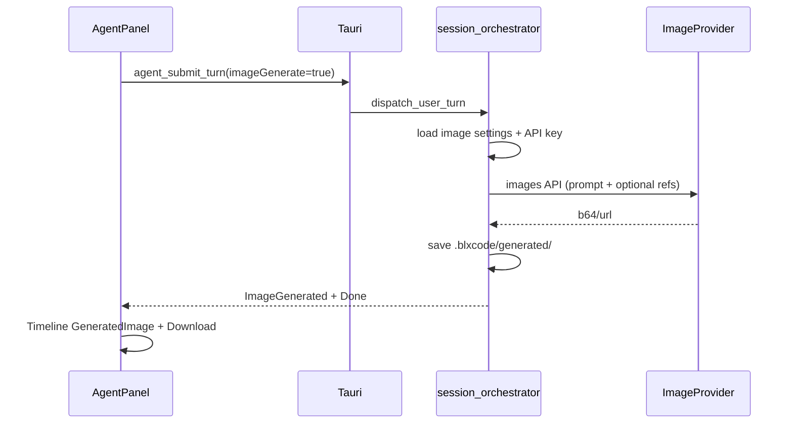

# Agent Image-Modus (Chat-Toggle + Settings-Tab)

## Zielbild



Der Text-Agent-Pfad ([`session_orchestrator.rs`](src-tauri/src/agent/session_orchestrator.rs)) bleibt unverändert; Image-Turns werden früh abgezweigt (kein Tool-Loop, kein `conversation`-Append mit Base64).

---

## 1. Persistente Image-Settings (Backend)

**Vorbild:** [`src-tauri/src/voice/settings.rs`](src-tauri/src/voice/settings.rs) — `voice`-Subobjekt in [`agent_provider_settings.json`](src-tauri/src/agent_settings.rs).

Neues Modul `src-tauri/src/image/`:

| Typ | Inhalt |
|-----|--------|
| `ImageProviderKind` | `Openai`, `Openrouter` (wie Voice; kein Anthropic in v1) |
| `ImageSettings` | `{ provider, model_id }` + Defaults z. B. OpenAI `gpt-image-1` |
| `load` / `save` | Envelope `image` in derselben JSON-Datei |
| `provider_key` | Reuse [`agent_settings::provider_key_pub`](src-tauri/src/agent_settings.rs) |

**Tauri-Commands** (in `lib.rs` registrieren): `image_settings_get`, `image_settings_save`.

**Model-Liste:** Wiederverwendung von `agent_provider_models` mit Frontend-Filter (analog [`ModelKind` in `harness_voice_pane`](src/workbench/harness_voice_pane/mod.rs)):

- Heuristik: `dall-e`, `gpt-image`, `flux`, `stable-diffusion`, `image` im Modell-ID/Label
- Fallback-Curated-Liste pro Provider in Settings (wie `curated_models` für Text)

---

## 2. Image-Generierung (Backend)

Neues Modul `src-tauri/src/image/generate.rs` — **zwei getrennte Provider-Pfade** (nicht ein gemeinsames JSON):

### OpenAI (direkt)

- `POST https://api.openai.com/v1/images/generations` (Bearer = OpenAI-Key aus Image-Settings-Provider)
- Request: `model`, `prompt`, `n: 1`
- Img2img: modellabhängig oft `POST /v1/images/edits` (nicht dasselbe Body wie Chat-Referenzen) — Referenzen aus `AgentImageContextItem` in passendes Format mappen
- Response: `data[].b64_json` oder URL → Bytes

### OpenRouter (Review-Blocker)

- **Kein** `/v1/images/generations` — OpenRouter erzeugt Bilder über `POST https://openrouter.ai/api/v1/chat/completions` mit `modalities: ["image"]` (ggf. `["image","text"]`)
- Ausgabe: `choices[0].message.images[]` mit `image_url.url` (Data-URL)
- Img2img: Referenzbilder in `messages` wie [`openrouter.rs::openai_user_content`](src-tauri/src/agent/openrouter.rs); optional `image_config`
- Header: `Authorization`, `HTTP-Referer`, `X-Title` wie bestehender OpenRouter-Client
- Modell-Discovery: `GET /models?output_modalities=image` oder Curated-Liste + Frontend-Heuristik

**Speichern:** Wenn `workspace_root` gesetzt → `{root}/.blxcode/generated/{timestamp}-{slug}.png` (Verzeichnis anlegen). Sonst nur In-Memory für Chat.

**Orchestrierung** in [`dispatch_user_turn`](src-tauri/src/agent/session_orchestrator.rs):

```rust
if turn.image_generate {
    let voice_input = turn.voice_input;
    spawn image turn (busy flag wie Text);
    // nach Erfolg: if voice_input { emit_tts_confirmation(...) }
    return Ok(());
}
```

- **API-Key:** `image::settings::load` + `provider_key_pub` für **Image-**`provider` — nicht Text-`AgentProviderSettings.provider` (Review-Blocker)
- **Busy/Cancel:** wie `run_chat_turn` (`set_busy`, `clear_cancel`, Poll `cancelled()` während HTTP)
- **`ImageContextConsumed`:** erst nach 2xx + dekodierbaren Bildbytes (bei Fehler Referenzen pending lassen)
- **`ImageGenerated`:** bevorzugt `{ mime, saved_path, optional preview }`; `bytes_b64` nur ohne Workspace oder expliziter Fallback (große IPC-Payloads vermeiden)
- Backend-Validierung von `image_context_items` (8 MiB/Bild, max. 4, MIME) vor API-Call
- Workspace-Write: `WorkspaceRootGuard` + `sanitize_image_stem` / `extension_for_mime` aus [`commands.rs`](src-tauri/src/commands.rs)
- **`agent_settings_save`:** Envelope round-trip (`voice`/`image` nicht löschen) — gemeinsamer Writer oder Merge wie Voice (Review should-fix)
- **`voice_input` durchreichen** (wie Text-Turn): Image-Turn spawnt mit `turn.voice_input`
- **TTS nach Image-Turn:** nur wenn `voice_input == true` **und** `voice_settings.tts.enabled` — analog Text-Pfad, aber **nicht** `last_assistant_text` (gibt es bei Image-Turns nicht). Stattdessen kurzer Bestätigungstext für TTS, z. B. „Bild erstellt.“ (+ optional Dateiname/Pfad aus `saved_path`). Dafür `maybe_emit_tts` refactoren → `emit_tts_for_text(app, state, text)` und im Image-Branch nach `ImageGenerated` + `Done` aufrufen

Limits aus Image-Context-Plan beibehalten (8 MiB/Bild, max. 4 pending).

---

## 3. Protokoll & IPC

**`UserTurn`** erweitern (Backend + Frontend):

```rust
#[serde(default)]
pub image_generate: bool,
```

Bestehendes `image_context_items` wird im Image-Modus als Referenz genutzt (User-Wunsch: Img2Img mit Pending-Kontext).

**`AgentEvent`:** `ImageGenerated { ... }` (siehe oben).

[`tauri_bridge.rs`](src/tauri_bridge.rs): Typen + keine neuen invoke-Namen außer Settings-Commands.

---

## 4. Settings-UI: Tab „Image“

| Datei | Änderung |
|-------|----------|
| [`HarnessSettingsCategory`](src/workbench/state.rs) | `Image` |
| [`harness_ui.rs`](src/workbench/harness_ui.rs) | Nav-Button + `match`-Arm; Icon z. B. `LuImage` |
| Neues [`src/workbench/harness_image_pane/`](src/workbench/harness_image_pane/) | Provider-Buttons, Save via `image_settings_save`; CSS eigene Datei (`.agents/rules`) |
| [`src/workbench/model_picker/`](src/workbench/model_picker/) | **Shared `ModelPicker`** aus `harness_voice_pane` extrahieren (Regel: keine Duplikation); Voice-Pane refactoren |
| [`workbench/mod.rs`](src/workbench/mod.rs) | Modul exportieren |

**i18n:** Neue Keys (`HsCatImage`, `ImageProviderField`, `ImageModelField`, …) in [`keys.rs`](src/i18n/keys.rs) + alle [`locales/*.rs`](src/i18n/locales/) (exhaustive match).

CSS: `voice-pane`-Klassen wiederverwenden oder schmale `image-pane__*` Ergänzung in [`styles.css`](styles.css).

---

## 5. Agent-Chat: Toggle + UX

**Ort:** [`agent_panel/mod.rs`](src/workbench/agent_panel/mod.rs) — `agent-chat-head__actions` neben Reset (Zeilen 270–310).

- Toggle-Button (`LuImage` / `LuImagePlus`), `aria-pressed`, Klasse `agent-chat-head__image-mode--active`
- State: `image_mode: RwSignal<bool>` **pro Workspace** — Feld `agent_image_mode: bool` in [`WorkspaceEntry`](src/workbench/state.rs) + Getter/Setter wie `agent_compose_draft`
- Beim Workspace-Wechsel Mode laden; beim Toggle speichern
- `submit_turn`: `UserTurn { image_generate: image_mode.get(), voice_input, ... }` — **`voice_input` unverändert** aus `voice_handle.voice_pending` (bestehende Logik Zeilen 491–497)
- **Voice-Orb / STT:** unverändert nutzbar; Transkript landet im Draft oder wird per `PostSttFlow::AutoSend` direkt als Image-Turn abgeschickt, wenn Image-Mode aktiv ist (kein Sonderfall im Orb nötig, solange `submit_turn` `image_generate` vom Workspace-Toggle liest)
- Placeholder/Status-Hinweis wenn Mode aktiv (neuer i18n-Key, z. B. auch für Voice-Hinweis)
- Reset-Button: Mode **nicht** zurücksetzen (nur Chat wie heute)
- Frontend: `agent_drain_turn_opts(voice_input, …)` bleibt — `VoiceReady` nach Image-Turn wie bei Text

Optional: Modell-Label in Chat-Head bei aktivem Image-Mode aus `image_settings_get` (parallel zu Text-`model_label`).

---

## 6. Timeline & Darstellung

**Daten:** [`TimelineItem`](src/workbench/agent_timeline.rs) um Variante erweitern:

```rust
GeneratedImage {
    prompt_summary: String,
    mime: String,
    /// data URL oder relativer Pfad für 
    preview_src: String,
    saved_path: Option<String>,
}
```

**Events → UI** in [`timeline.rs`](src/workbench/agent_panel/timeline.rs):

- `apply_agent_event`: `ImageGenerated` → `TimelineItem::GeneratedImage`
- **`compact_timeline` + `DisplayTimelineItem` + `TimelineRow`** erweitern (sonst verschwindet Bild nach Render/Reload — Review kritisch)
- **`AgentEvent::Done`:** kein synthetischer Assistant-Text wenn letztes Item `GeneratedImage` ist
- User-Zeile bleibt `User { text: prompt }`
- **Preview nach Reload:** relativer Pfad reicht im WASM nicht für `` — Tauri-Command `generated_image_preview(path)` oder Lazy-Load; Timeline persistiert nur `saved_path` + Metadaten (kein Base64 in Snapshot)

**Rendering** in `TimelineRow`:

- `` mit `max-width`, `alt` aus Prompt
- **Download-Button** (Icon `LuDownload`): Tauri `invoke` neuer Command `image_reveal_in_folder` oder `save_generated_image_as` (Dialog) — minimal: `open_path` / reveal wenn `saved_path` gesetzt; sonst Blob-Download im WASM via `web_sys` + Base64

**Persistenz:** `GeneratedImage` in `WorkspaceEntry.agent_timeline` serialisieren (relativer Pfad bevorzugen, kein Base64 in localStorage-Snapshot — nur `saved_path` + kurzer Marker; bei fehlender Datei Fallback-Text).

---

## 7. Voice-Integration (Image-Mode)

| Aspekt | Verhalten |
|--------|-----------|
| Eingabe | Push-to-talk / STT wie heute; Prompt = Transkript |
| Submit | `image_generate` vom Workspace-Toggle + `voice_input` wenn Turn aus Voice kam |
| TTS-Ausgabe | **Nur** wenn User per Voice gesendet hat (`voice_input`) und TTS in Voice-Settings aktiv — Bestätigungssprache, kein Beschreiben des Bildinhalts per LLM |
| Fehler | Image-API-Fehler → `AgentEvent::Error`; bei `voice_input` optional kurzes TTS „Bild konnte nicht erstellt werden“ (gleiche Hilfsfunktion) |

Abgrenzung: Kein separates „Voice-Image“-Settings-Tab; STT/TTS bleiben im Voice-Tab, Bildmodell im Image-Tab.

---

## 8. Abgrenzung / Nicht-Ziele (v1)

- Kein Anthropic-Image-Provider
- Kein Streaming-Delta; ein Request → ein Bild
- Text-`conversation` wird bei Image-Turns nicht mit vollem Bildkontext aufgebläht (nur optional kurzer Text-Marker in History, analog Image-Context-Plan)
- TTS spricht **keinen** generierten Bildinhalt vor (nur Bestätigung/Fehler)

---

## 9. Dokumentation & Tests

- Kurz in [`docs/user/agent-providers.md`](docs/user/agent-providers.md) oder neues `docs/user/image.md`
- Rust: Unit-Tests für Modell-Filter + Pfad-Sanitisierung (`sanitize_image_stem` aus [`commands.rs`](src-tauri/src/commands.rs) wiederverwenden)
- Manuell: Toggle → Prompt → Bild in Chat + Datei unter `.blxcode/generated/`; Img2Img mit 1 Pending-Bild; Download-Button; Settings-Tab Provider/Model wechseln
- Manuell Voice: Image-Mode an → PTT → gesprochener Prompt → Bild + TTS-Bestätigung; Image-Mode + Text-Tastatur → kein TTS

---

## 10. Review-Ergebnisse (2 Subagenten)

### Blocker (vor Implementierung klären)

| Thema | Maßnahme |
|-------|----------|
| OpenRouter API | Chat-Completions + `modalities`, nicht `images/generations` |
| API-Key-Quelle | Image-Settings-`provider`, nicht Text-Agent-Provider |
| Timeline-Pipeline | `compact_timeline`, `Done`-Handler, `apply_agent_event` für `ImageGenerated` |

### Should-fix

- Envelope: `agent_settings_save` darf `voice`/`image` nicht überschreiben
- `WorkspaceRootGuard` für `.blxcode/generated/`
- Server-Validierung `image_context_items`
- `ImageContextConsumed` erst nach Erfolg
- Toggle `disabled` bei `busy`; fehlender Workspace-Root → UI-Hinweis
- Rollout: Frontend `AgentEvent`/`UserTurn` **vor** Backend-Events deployen
- Optional: Img2img mit leerem Prompt (nur Referenzbilder) — Produktentscheidung

### Nice-to-have

- `image_provider_models` Command; Palette „Settings: Image“; Orb-ARIA im Image-Mode
- Fehler-TTS bei `voice_input` + Image-API-Fehler

---

## Wichtigste Dateien (Überblick)

| Bereich | Dateien |
|---------|---------|
| Backend Settings | `src-tauri/src/image/settings.rs`, `commands.rs` |
| Backend Gen | `src-tauri/src/image/generate.rs`, `session_orchestrator.rs`, `protocol.rs` |
| Frontend Settings | `harness_image_pane/mod.rs`, `harness_ui.rs`, `tauri_bridge.rs` |
| Frontend Chat | `agent_panel/mod.rs`, `agent_timeline.rs`, `timeline.rs`, `state.rs` |
| i18n | `keys.rs`, `locales/*.rs` |
