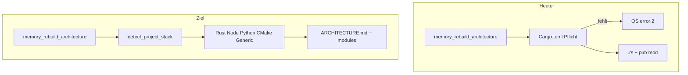

# Architecture-Map: mehrsprachige Plugin-Registry

**Status:** done  
**Related:** [code-wiki-architecture-map.md](code-wiki-architecture-map.md) (done — Rust-only MVP; this plan fixes multi-language workspaces)

## Overview

`memory_rebuild_architecture` fails when the workspace has no root `Cargo.toml` (e.g. TypeScript/Electrobun in `blxcode-eb`). Refactor the static indexer to a **plugin registry** (Rust, Node/TS, Python, CMake, Generic) with unified output. Rebuild must never error solely because a manifest is missing.

## Todos

- [x] `arch-unit-model` — `ProjectUnit` + `RebuildReport.warnings`; `detect_project_stack` in `detect.rs`
- [x] `arch-generic-indexer` — `generic.rs`: git ls-files/walk, depth-2 modules, never fail rebuild
- [x] `arch-rust-extract` — `rust.rs`: extract current Cargo/mod logic without root Cargo hard-error
- [x] `arch-node-indexer` — `node.rs`: `package.json` + workspaces + `src/` top-level modules
- [x] `arch-python-cmake` — `python.rs` + `cmake.rs` indexers
- [x] `arch-render-unify` — kind-aware `ARCHITECTURE.md` + module notes in `static_index.rs`
- [x] `arch-tests-docs` — fixtures + tests; update `memory-architecture.md`, `CLAUDE.md`, `CHANGELOG`

---

## Ursache (Bug)

In [`src-tauri/src/memory/architecture/static_index.rs`](../../src-tauri/src/memory/architecture/static_index.rs) ist `detect_crates` **hart an Rust gebunden**:

```rust
fn detect_crates(workspace_root: &Path) -> Result<Vec<CrateInfo>, String> {
    let root_manifest = workspace_root.join("Cargo.toml");
    let root_body = fs::read_to_string(&root_manifest)
        .map_err(|e| format!("read {}: {e}", root_manifest.display()))?;
```

- Kein `Cargo.toml` → **sofortiger Fehler** (z. B. `blxcode-eb`: nur `package.json` + `src/bun`, `src/views`, …).
- `enumerate_rust_sources` listet nur `.rs`; `index_crate` parst nur `pub mod`.
- Der ursprüngliche Plan (Root-Package + `src-tauri`-Member) war **repo-spezifisch**, nicht workspace-generisch.



---

## Zielverhalten

| Workspace | Erkennung | Beispiel-Module |
|-----------|-----------|-----------------|
| blxcode (Rust) | `Cargo.toml` | `blxcode-ui`, `blxcode` (wie heute) |
| blxcode-eb (TS/Electrobun) | `package.json` | `bun`, `views`, `shared`, `harness` unter `src/` |
| Python | `pyproject.toml` / `setup.py` | Top-Level-Packages unter `src/` |
| C/C++ | `CMakeLists.txt` | `src`, `include`, … |
| Gemischt / unbekannt | mehrere Plugins + **Generic** | Verzeichnisbaum + Dateityp-Statistik |

**Regel:** Rebuild **darf nie** fehlschlagen, nur weil ein Manifest fehlt. Mindestens **Generic** liefert immer eine Karte.

---

## Architektur: Plugin-Registry

Modul-Split unter [`src-tauri/src/memory/architecture/`](../../src-tauri/src/memory/architecture/):

| Datei | Rolle |
|-------|--------|
| `detect.rs` | `detect_project_stack(workspace)` |
| `unit.rs` | `ProjectUnit { kind, name, root_rel, manifest_rel?, source_paths, modules }` |
| `indexers/mod.rs` | Registry + `run_all_indexers` |
| `indexers/rust.rs` | Cargo/mod-Logik (extrahiert) |
| `indexers/node.rs` | `package.json` (+ npm/pnpm workspaces) |
| `indexers/python.rs` | `pyproject.toml` / `setup.py` |
| `indexers/cmake.rs` | `CMakeLists.txt` |
| `indexers/generic.rs` | Immer verfügbar; git ls-files oder Walk |
| `static_index.rs` | Orchestrierung, Render, State |

Gemeinsame Hilfen:

- `enumerate_tracked_files(workspace, extensions)` — `git ls-files` oder Walk + Skip (`target`, `node_modules`, `dist`, `build`, `.git`, …)
- `group_by_top_segments(paths, depth)`

### `detect_project_stack` (Priorität)

1. Root + member **`Cargo.toml`** → Rust
2. Root **`package.json`** (+ Workspace-Packages) → Node
3. **`pyproject.toml`** / **`setup.py`** → Python
4. Root **`CMakeLists.txt`** → CMake
5. **Immer:** Generic (ergänzt oder allein)

### Pro Indexer (Kurzspec)

**Rust:** Root-Package und `[workspace].members`; kein Hardcoding `blxcode-ui` / `src-tauri`.

**Node:** `name` aus `package.json`; Module = direkte Kinder von `src/`; Counts `.ts`/`.tsx`/`.js`/…

**Python:** `[project].name`; Packages mit `__init__.py` (max. 2 Ebenen).

**CMake:** `project(Name)`; Module unter `src/`, `include/`, `lib/`.

**Generic:** tracked files (cap ~2000); Module = erste 1–2 Pfadsegmente; Extension-Tabelle; Slug `generic-<sanitized>`.

### Einheitliche Ausgabe

- `ARCHITECTURE.md` **Generated**: **Unit | Kind | Root | Map**
- `architecture/modules/<slug>.md`: Frontmatter `kind: rust|node|python|cmake|generic`
- Slug: `<kind>-<name>` (z. B. `node-blxcode-eb`, `rust-blxcode`)

---

## Fehlerbehandlung

| Situation | Verhalten |
|-----------|-----------|
| Kein Cargo.toml | Kein Error; Node/Generic |
| Leeres Repo | Generic mit Hinweis |
| Indexer-Fehler | `RebuildReport.warnings`; andere laufen weiter |

`RebuildReport` erweitern: `unit_count`, `kinds`, `warnings`.

---

## Tests

Fixtures (inline `temp_dir` oder `fixtures/`):

| Fixture | Erwartung |
|---------|-----------|
| `rust-workspace/` | 2 Rust units |
| `node-only/` | Nur `package.json` + `src/*` |
| `no-manifest/` | Nur Generic, kein Err |
| `mixed/` | Cargo + package.json |

Manuell: `memory_rebuild_architecture` auf `blxcode-eb` → `node-blxcode-eb` + Module `bun`, `views`, …

---

## Docs / Agent

- [`src-tauri/src/agent/harness_skills/memory-architecture.md`](../../src-tauri/src/agent/harness_skills/memory-architecture.md)
- [`CLAUDE.md`](../../CLAUDE.md)
- [`CHANGELOG.md`](../../CHANGELOG.md) → **Fixed**

---

## Nicht im Scope

- AST (tree-sitter, tsserver)
- Bazel, Meson, Xcode
- LLM-Prosa / `architecture_llm_prose` (unverändert)

---

## Umsetzungsreihenfolge

1. `unit.rs` + `detect.rs` + Generic (Fix blxcode-eb)
2. Rust extrahieren (Parität)
3. Node (+ blxcode-eb verifizieren)
4. Python + CMake
5. Render/Report + Tests + Docs
