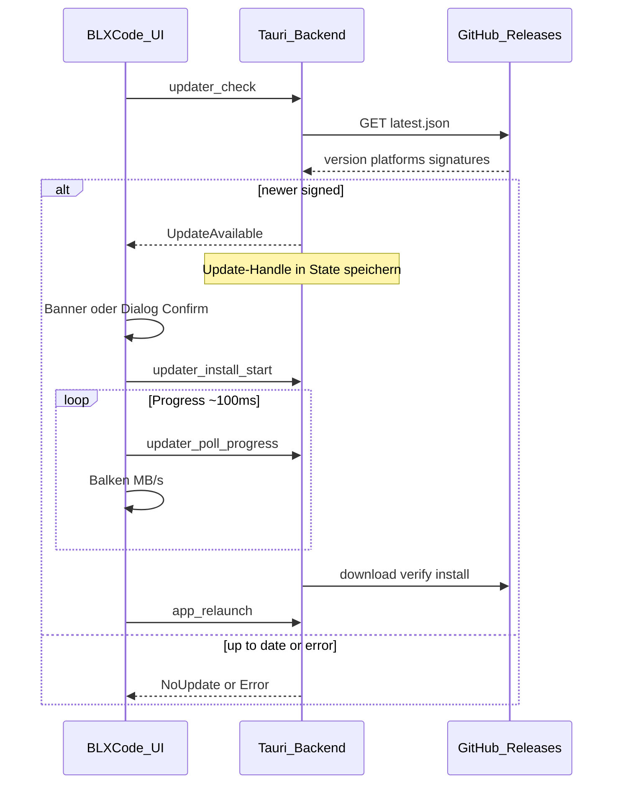
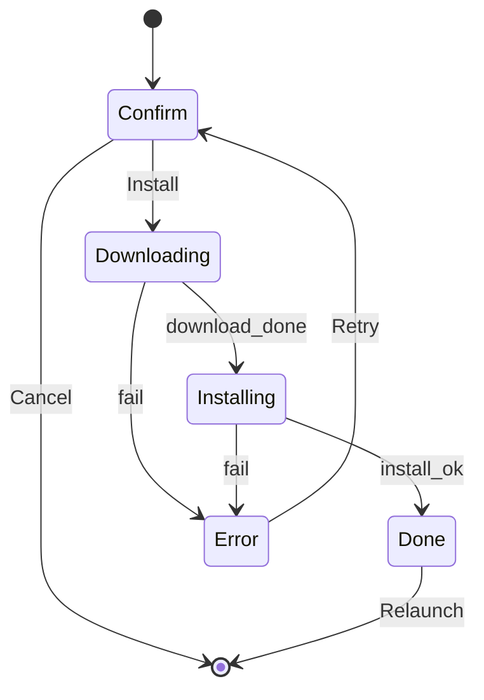

# Auto-Update via GitHub Releases

## Summary

Cross-platform Auto-Update fuer die installierte BLXCode-App mit **Tauri v2 Updater** (`tauri-plugin-updater`), `latest.json` von **GitHub Releases**, signierten Build-Artefakten, stiller Pruefung beim Start und manueller Pruefung in **Einstellungen → App**.

UI: **eigener Leptos-Dialog** im BLXCode-Look (Theme-Tokens, Lucide-Icons, Fortschrittsbalken + Download-Geschwindigkeit) plus kompakter Startup-Banner — kein nativer Tauri-Dialog (`dialog: false`).

Updates greifen erst, wenn ein GitHub-Release **manuell veroeffentlicht** wurde (CI erzeugt weiterhin **Draft**-Releases).

**Ops-Blocker:** Signing-Keys und GitHub Secret muessen **vor dem ersten nutzbaren Release** stehen — ohne `.sig` + `pubkey` schlaegt der Updater in Produktion fehl.

## Decisions

- **Tauri Updater Plugin** statt eigenem HTTP-Download — Signaturpruefung, Plattform-Mapping und Installer-Logik sind eingebaut.
- Endpoint: `https://github.com/Bitslix/BLXCode/releases/latest/download/latest.json` (Repo aus `.env.release.example`).
- `dialog: false` — **Leptos-Modal** fuer i18n, Release-Notes, Fortschritt, MB/s.
- **Draft-Releases bleiben**; Endnutzer-Updates erst nach manuellem „Publish release“ auf GitHub.
- **Signing ist Pflicht** (`createUpdaterArtifacts`, `.sig`, `TAURI_SIGNING_PRIVATE_KEY` in CI). Private Key nie committen.
- Linux-Updater-Artifact: **AppImage** in `latest.json`; deb/rpm bleiben zusaetzliche manuelle Downloads (nach erstem signierten Release JSON-Keys verifizieren).
- Startup: Auto-Check (Default an), bei Update nur **Banner** — kein Auto-Install.
- Dev/`cargo tauri dev`: Updater deaktiviert oder graceful no-op mit Hinweis in Settings.
- **Cancel:** Dialog schliessen versteckt UI; Download-Task kann im Hintergrund weiterlaufen — `busy`-Flag verhindert Doppelstart bis Task endet.
- **Optional (nicht MVP):** Countdown vor Relaunch; Mock-Progress im Dev.

## Implementation Notes

### Architektur

### Backend (`src-tauri/`)

- `cargo tauri add updater` + `cargo tauri add process`
- `tauri.conf.json`: `bundle.createUpdaterArtifacts: true`, `plugins.updater` mit `pubkey` + `endpoints`
- Neues Modul `src-tauri/src/updater.rs` + `UpdaterState` (Mutex):
  - **`pending_update`:** `Update`-Handle von `check()` bis `download_and_install` (nicht nur Version serialisieren)
  - **Progress:** `phase`, `downloaded_bytes`, `total_bytes`, `error`, `busy`
- IPC: `app_version`, `updater_check`, `updater_install_start`, `updater_poll_progress`, `app_relaunch`
- Progress-Callback: `Started` (total_bytes), `Progress` (chunk), `Finished` → `Downloading` / `Installing` / `Done` / `Error`
- `capabilities/default.json`: `updater:default`, `process:default`
- macOS universal: `.custom_target("darwin-universal")` beim `check()` falls `latest.json` diesen Key nutzt — **Acceptance-Check** nach erstem signierten Release
- Windows: optional `on_before_exit` + Dialog-Hinweis (Workbench speichern vor Installer)

### Release-Pipeline

- `.github/workflows/release.yml`: `TAURI_SIGNING_PRIVATE_KEY`, `tauri-action` mit `uploadUpdaterJson: true`
- `docs/user/building.md`: Signing, `latest.json`, **Publish draft** vor Nutzer-Updates
- `scripts/release.sh`: bei `--require-signing` auch `latest.json` hochladen

### Frontend — Service & IPC

- `src/updater_wire.rs` + `src/tauri_bridge.rs`
- `src/workbench/update_service.rs` — Signals: `status`, `available_version`, `notes`, `phase`, `progress_pct`, `speed_label`, `dialog_open`
- Methoden: `check_silent`, `check_manual`, `open_install_dialog`, `start_install`, `relaunch`
- Progress-Polling ~100 ms; Speed aus Poll-Deltas (geglattet, MB/s oder KB/s)
- `UpdateBanner` in `workbench/mod.rs` (Startup nach EULA + Workbench ready)
- `AppSettingsPane` in `harness_ui.rs` (bleibt kompatibel mit geplantem inline Settings-Tab aus settings-tabs-themes-refactor)
- `UPDATE_AUTO_CHECK_KEY` in `src/config/app.config.rs`

### Frontend — Dialog & Banner (UI)

Module: `src/workbench/update_dialog.rs` + `src/workbench/update_dialog.css` (import in `styles.css`).

**Design:** wie Quick-Open/Settings — `harness-overlay`, `harness-sheet harness-sheet--update`, `workbench-mini-btn--primary`, CSS-Variablen (`--bg-panel`, `--accent`, …), `LxIcon` / Lucide, JetBrains Mono, 4px radius, Blur-Scrim.

| Phase | UI | Icons |
|-------|-----|-------|
| Confirm | Version-Badge `v0.2.1 → v0.3.0`, scrollbare Notes, Install / Später | `LuPackage`, `LuDownload` |
| Downloading | Gradient-Progress, „MB / MB“, Speed-Pill | `LuDownload` |
| Installing | Shimmer-Bar | `LuLoader` |
| Done | Erfolg + Neu starten | `LuCheck`, `LuRefreshCw` |
| Error | Fehlertext, Erneut | `LuCircleAlert` |

- A11y: `role="dialog"`, `aria-modal`, Focus-Trap (wie `trap_settings_tab`), Escape = Abbrechen (Confirm/Error)
- Motion: 150–200ms Sheet-Enter; `prefers-reduced-motion` ohne Slide
- Banner: `blx-update-banner`, `LuArrowDownToLine`, oeffnet denselben Dialog

### i18n

`I18nKey` in `keys.rs` + alle `locales/*.rs` (mindestens `en_us`, `de_de`; Rest via `scripts/render_i18n_locales_from_en.py`):

- Settings: Heading, Version, Auto-Check, Check-Button, Status-Chips
- Dialog: Titel, Notes, Phasen, Buttons
- Banner: Titel mit Version

## Tests

- **Ops:** Signierter CI-Build; Release **publish**; aeltere App zeigt Banner
- Dialog: Confirm → Progress + Speed → Relaunch
- Settings: manuelle Pruefung, Auto-Check-Toggle persistiert
- Draft ohne Publish: wie „aktuell“
- macOS universal + Linux AppImage + Windows: JSON-Platform-Keys passen
- `cargo tauri dev`: kein Crash, klarer Hinweis
- UI: Keyboard Escape/Tab; `prefers-reduced-motion`
- `cargo check -p blxcode` und `cargo check -p blxcode-ui --target wasm32-unknown-unknown`

## Tasks

- [ ] `signing-keys` - Signer-Keys erzeugen (Ops), pubkey in tauri.conf.json, GitHub Secret TAURI_SIGNING_PRIVATE_KEY — vor erstem nutzbaren Release
- [ ] `tauri-updater-plugin` - tauri-plugin-updater + process, UpdaterState mit pending Update-Handle, IPC, Progress-Callback
- [ ] `ci-latest-json` - release.yml Signing + uploadUpdaterJson; building.md Draft publish; latest.json Platform-Keys verifizieren
- [ ] `frontend-update-service` - updater_wire, tauri_bridge, UpdateService, Startup-Check, AppSettingsPane, UpdateBanner
- [ ] `update-dialog-ui` - update_dialog.rs + CSS: themed sheet, icons, progress/speed, banner, a11y, reduced-motion
- [ ] `i18n-update-keys` - I18nKey + alle locale-Dateien fuer Update-UI
