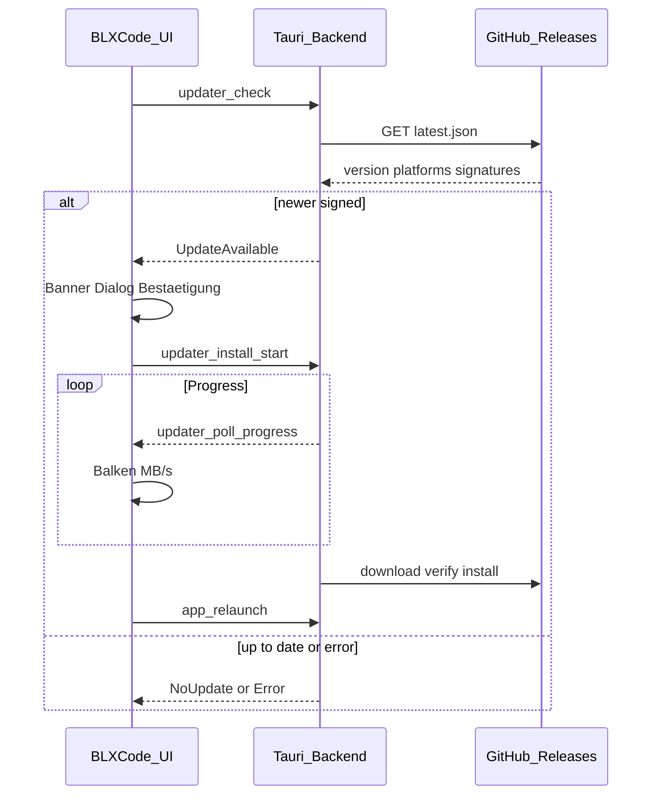

# Auto-Update via GitHub Releases

## Summary

Cross-platform Auto-Update fuer die installierte BLXCode-App mit **Tauri v2 Updater** (`tauri-plugin-updater`), `latest.json` von **GitHub Releases**, signierten Build-Artefakten, stiller Pruefung beim Start und manueller Pruefung in **Einstellungen → App**. UI ist vollstaendig **i18n** (eigener Leptos-Modal mit Fortschrittsbalken und Download-Geschwindigkeit, kein nativer Tauri-Dialog).

Updates greifen erst, wenn ein GitHub-Release **manuell veroeffentlicht** wurde (CI erzeugt weiterhin **Draft**-Releases).

## Decisions

- **Tauri Updater Plugin** statt eigenem HTTP-Download — Signaturpruefung, Plattform-Mapping und Installer-Logik sind eingebaut.
- Endpoint: `https://github.com/Bitslix/BLXCode/releases/latest/download/latest.json` (Repo aus `.env.release.example`).
- `dialog: false` in `tauri.conf.json` — **eigener Leptos-Modal** fuer i18n, Release-Notes, Fortschritt und MB/s.
- **Draft-Releases bleiben**; Endnutzer-Updates erst nach manuellem „Publish release“ auf GitHub.
- **Signing ist Pflicht** fuer produktive Updates (`createUpdaterArtifacts`, `.sig`, `TAURI_SIGNING_PRIVATE_KEY` in CI).
- Linux-Updater-Artifact: **AppImage** in `latest.json`; deb/rpm bleiben zusaetzliche manuelle Downloads.
- Startup: Auto-Check (Default an), bei Update nur **Banner** — kein Auto-Install.
- Dev/`cargo tauri dev`: Updater deaktiviert oder graceful no-op.

## Implementation Notes

### Architektur

### Backend (`src-tauri/`)

- `cargo tauri add updater` + `cargo tauri add process`
- `tauri.conf.json`: `bundle.createUpdaterArtifacts: true`, `plugins.updater` mit `pubkey` + `endpoints`
- Neues Modul `src-tauri/src/updater.rs` + `UpdaterProgressState` (Mutex)
- IPC: `app_version`, `updater_check`, `updater_install_start`, `updater_poll_progress`, `app_relaunch`
- Progress-Callback: `Started` (total_bytes), `Progress` (chunk), `Finished` → Phasen `Downloading` / `Installing` / `Done` / `Error`
- `capabilities/default.json`: `updater:default`, `process:default`
- macOS universal: ggf. `.custom_target("darwin-universal")` beim `check()` — nach erstem signiertem Release verifizieren

### Release-Pipeline

- `.github/workflows/release.yml`: `TAURI_SIGNING_PRIVATE_KEY`, `tauri-action` mit `uploadUpdaterJson: true`
- `docs/user/building.md`: Signing, `latest.json`, **Publish draft** vor Nutzer-Updates
- `scripts/release.sh`: bei `--require-signing` auch `latest.json` hochladen

### Frontend (`src/`)

- `src/updater_wire.rs` + Erweiterung `src/tauri_bridge.rs`
- `src/workbench/update_service.rs` — Status-Signals, `check_silent` / `check_manual` / `start_install`
- `src/workbench/update_dialog.rs` — Modal: Bestaetigung → Fortschritt (%, MB/MB, MB/s) → Install → Neustart
- Progress-Polling ~100 ms via `updater_poll_progress`; Speed aus Poll-Deltas (geglattet)
- `UpdateBanner` in `workbench/mod.rs`; Startup-Check nach EULA + Workbench ready
- `AppSettingsPane` in `harness_ui.rs`: Version, Auto-Check-Pref (`UPDATE_AUTO_CHECK_KEY` in `app.config.rs`), Pruefen-Button
- `src/config/app.config.rs`: Endpoint-Konstante (optional)

### i18n

Neue `I18nKey`-Eintraege in `keys.rs` + alle `locales/*.rs` (mindestens `en_us`, `de_de`; Rest via `scripts/render_i18n_locales_from_en.py`):

- Settings: Heading, Version, Auto-Check, Check-Button, Statuszeilen
- Dialog: Titel, Notes, Phasen, Abbrechen/Installieren/Neustart
- Banner: Titel mit Version

## Tests

- Signierter Build: aeltere Version installiert → Release publish → App-Start zeigt Banner
- Dialog: Bestaetigung → Fortschrittsbalken + Speed sichtbar → Neustart
- Settings: manuelle Pruefung, Auto-Check-Toggle persistiert
- Draft-Release ohne Publish: Verhalten wie „aktuell“
- `cargo tauri dev` / trunk serve: kein Crash, Hinweis „nur installierte App“
- `cargo check -p blxcode` und `cargo check -p blxcode-ui --target wasm32-unknown-unknown`
- Plattformen: Linux AppImage, Windows, macOS universal (CI-Artefakte)

## Tasks

- [ ] `signing-keys` - Signer-Keys erzeugen, pubkey in tauri.conf.json, GitHub Secret TAURI_SIGNING_PRIVATE_KEY
- [ ] `tauri-updater-plugin` - tauri-plugin-updater + process, createUpdaterArtifacts, capabilities, updater.rs + IPC commands
- [ ] `ci-latest-json` - release.yml Signing-Env + uploadUpdaterJson; building.md Draft manuell publish
- [ ] `frontend-update-service` - tauri_bridge, UpdateService, UpdateDialog Fortschritt MB/s, UpdateBanner, Startup-Check, AppSettingsPane
- [ ] `i18n-update-keys` - I18nKey + alle locale-Dateien fuer Update-UI
