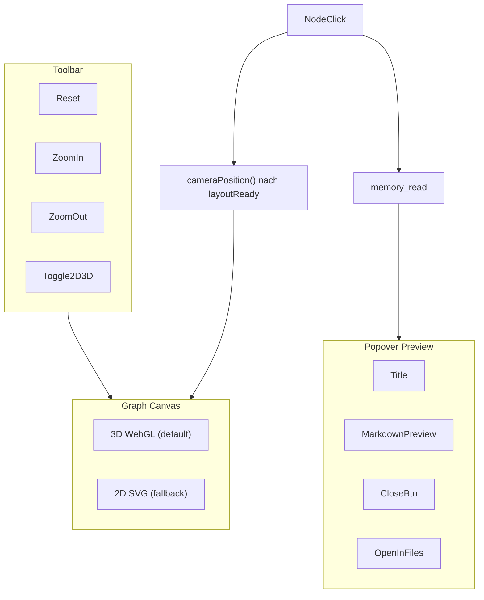

# Graph 3D + Toolbar + Popover-Flow-Preview

**Status:** pending  
**Overview:** Memory-Graph erweitern: Icon-Toolbar (Zoom, 2D/3D), 3D-Orb als Standard via lokalem `3d-force-graph`-Bundle mit Lazy-Load, Layout-gated Fly-to, Popover-Preview beim Knotenklick — inkl. vollständiger `memory_panel.rs`-Auslagerung.

## Todos

- [ ] `js-bundle-offline` — `package.json` + esbuild: `3d-force-graph`/`three` lokal nach `public/graph3d.bundle.mjs`; `npm run build:graph3d` in dev/build/CI
- [ ] `split-memory-graph-module` — Phasen-Migration `memory_panel.rs` → `memory_graph/` (layout, 2d, toolbar, popover, glue, css)
- [ ] `lazy-script-loader` — `graph_glue.rs`: `ensure_graph3d_script()` — dynamisches `<script>` nur bei Graph-Tab + 3D-Mode
- [ ] `graph3d-bootstrap` — orb nodes, `layoutReady`-Gate, `pendingFlyTo`-Queue, zoom, reset, click event
- [ ] `graph-glue-rust` — Reflect-Bridge, `wait_api_ready`, create/dispose/setData/flyTo, zoom, ResizeObserver
- [ ] `toolbar-icons` — Icon-Toolbar: Reset, Zoom In/Out, 2D/3D-Toggle mit i18n + CSS
- [ ] `preview-popover` — Popover-Flow-Preview: `memory_read`, markdown render, Close, Open in Files, Wikilink-Navigation
- [ ] `wire-integration` — `mod.rs`, MemoryGraphView 3D default, 2D-Klick auf Popover-Flow, `tauri.conf` + `release.yml` npm build step

## Zielbild



**Klick-Verhalten (Option B):** Fly-to + Notiz laden + im Graph-Tab bleiben + **Popover-Flow-Preview** mit Close-Button.

---

## Technologie: 3D-Orb

**`3d-force-graph` + Three.js** via JS-Embed — gleiches Reflect-Muster wie [`src/workbench/terminal_glue.rs`](../../src/workbench/terminal_glue.rs).

| Aspekt | Entscheidung |
|--------|--------------|
| Library | `3d-force-graph` (Obsidian-Plugin-Stack) |
| Bridge | `window.__blxcodeGraph3d` via `js_sys::Reflect` |
| Orb-Look | `nodeThreeObject`: `SphereGeometry` + `MeshPhongMaterial` mit `emissive` |
| Bundle | **Lokal via esbuild** — kein CDN, offline-fähig in Tauri |
| Lazy-Load | Script **nicht** in `index.html`; dynamisch bei Graph-Tab + 3D-Mode |

**Nicht:** Rust-WebGL, `leptos_three`, esm.sh/CDN.

---

## Migration 1: Lokales JS-Bundle (offline Tauri)

```
frontend-js/
  package.json          # deps: 3d-force-graph, three, three-spritetext (optional)
  graph3d_entry.mjs     # import ForceGraph3D, export bootstrap API
  build.mjs             # esbuild → ../public/graph3d.bundle.mjs (ESM, minified)
public/
  graph3d.bundle.mjs    # committed oder CI-generiert (Trunk copy-dir)
```

**Build-Hooks:**
- [`src-tauri/tauri.conf.json`](../../src-tauri/tauri.conf.json): `beforeDevCommand` / `beforeBuildCommand` um `npm run build:graph3d &&` erweitern
- [`.github/workflows/release.yml`](../../.github/workflows/release.yml): Node + `npm run build:graph3d` vor `tauri-action`
- [`index.html`](../../index.html): **kein** eager `<script>` — Lazy-Load über Rust

---

## Migration 2: Lazy Script Loader

In [`graph_glue.rs`](../../src/workbench/memory_graph/graph_glue.rs):

```rust
pub async fn ensure_graph3d_script() -> Result<(), String> {
  // 1. if graph3d_api_ready() → Ok
  // 2. if script tag exists → await blxcode-graph3d-api-ready event
  // 3. else: createElement("script"), src="/public/graph3d.bundle.mjs", type="module"
  // 4. appendChild, await api-ready (wie terminal_wait_api_ready)
}
```

**Trigger:** `Effect` wenn `view == Graph && mode == ThreeD`. Beim Wechsel zu 2D → `graph3d_dispose(id)`.

---

## Migration 3: Layout-gated Fly-to

In `graph3d_bootstrap.mjs`:

- `layoutReady: false` bis `onEngineStop`
- `pendingFlyTo` Queue — Klicks vor Stabilisierung werden nachgeholt
- Bei `setData()` → `layoutReady = false`, `pendingFlyTo` behalten

---

## Migration 4: memory_panel.rs auslagern

```
src/workbench/memory_graph/
  mod.rs
  graph_mode.rs
  graph_layout.rs
  graph_2d.rs
  graph_3d.rs
  graph_toolbar.rs
  graph_preview_popover.rs
  graph_glue.rs
  memory_graph.css
```

**Phasen:** layout → 2d → toolbar/popover → glue/3d → mod.rs → memory_panel bereinigen  
**Ziel:** `memory_panel.rs` < 800 Zeilen

---

## Toolbar (Icons Only)

| Button | Icon | Aktion |
|--------|------|--------|
| Reset | `LuRefreshCw` | 2D: `fit_viewbox`; 3D: `resetView()` |
| Zoom In | `LuZoomIn` | 2D: viewBox × 0.87; 3D: `zoom(1.2)` |
| Zoom Out | `LuZoomOut` | 2D: viewBox × 1.15; 3D: `zoom(0.8)` |
| Toggle 2D/3D | `LuBox` / `LuSquare` | `GraphMode::ThreeD` ↔ `TwoD` |

Default: `GraphMode::ThreeD`, optional `localStorage`-Persistenz ([`app.config.rs`](../../src/config/app.config.rs)).

---

## Popover-Flow-Preview

```rust
struct GraphPreviewState {
  open: RwSignal<bool>,
  path: RwSignal<Option<String>>,
  label: RwSignal<String>,
  content: RwSignal<String>,
  loading: RwSignal<bool>,
}
```

- Knotenklick → `flyToNode` (gated) + `memory_read` → Popover slide-up/fade
- Markdown via [`render_markdown_to_html`](../../src/workbench/chat_markdown.rs)
- **Close (`LuX`):** Popover schließen, Graph bleibt
- **„In Dateien öffnen“:** `load_note()` + `MemoryView::Files`
- **Wikilinks im Preview:** gleicher Flow (Fly-to + neuer Inhalt)
- **2D:** gleicher Popover-Flow statt Tab-Wechsel

---

## 3D JS-API

```javascript
window.__blxcodeGraph3d = {
  create(container),
  dispose(id),
  setData(id, graphJson),
  zoom(id, factor),
  resetView(id),
  flyToNode(id, nodeId, ms),
  resize(id),
};
```

Event: `blxcode-graph3d-api-ready`

---

## i18n

Neue Keys: `MemGraphReset`, `MemGraphZoomIn`, `MemGraphZoomOut`, `MemGraphMode3d`, `MemGraphMode2d`, `MemGraphPreviewClose`, `MemGraphOpenInFiles`

---

## Testplan

1. App-Start ohne Graph-Tab → kein `graph3d.bundle.mjs` geladen
2. Graph-Tab → Bundle lazy, 3D-Orb sichtbar
3. Knoten vor Layout-Ende → Fly-to nach Stabilisierung (nicht zu Origin)
4. Toggle 2D ↔ 3D ohne Leaks
5. Zoom In/Out, Reset in beiden Modi
6. Knotenklick → Fly-to + Popover; Close; Wikilink-Navigation
7. „In Dateien öffnen“ → Files-Tab
8. Offline Tauri-Build → Graph 3D funktioniert
9. `memory_panel.rs` < 800 Zeilen
10. `cargo check -p blxcode-ui --target wasm32-unknown-unknown`
