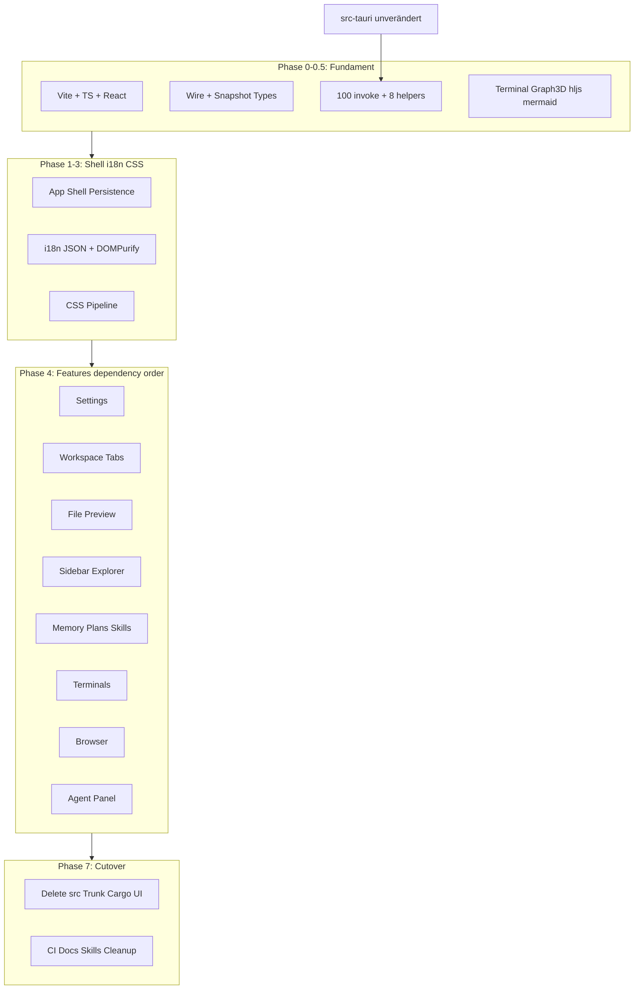

# Leptos restlos entfernen — TypeScript-Migrationsplan

> **Validierungsstand:** Gegen die Codebase geprüft durch 5 parallele Subagent-Reviews (Modul-Inventar, IPC/Bridge, Build/CI/Docs, State/Persistenz, Tests/Edge-Cases). Korrekturen unten eingearbeitet.

## Summary

**Ziel:** Das gesamte Frontend-Crate `blxcode-ui` ([Cargo.toml](Cargo.toml), [src/](src/)) durch ein natives TypeScript-Frontend ersetzen und **alle** Leptos/WASM/Trunk-Artefakte restlos entfernen — kein toter Code, keine Dual-Runtime.

**Scope heute (validiert):**

| Bereich | Umfang |
|---------|--------|
| Rust-Frontend | **53.539 LOC**, **112** `.rs`-Dateien, ~161 `#[component]` |
| IPC-Bridge | [src/tauri_bridge.rs](src/tauri_bridge.rs) — **100** `pub fn` (+ **8** Nicht-invoke-Helfer, ~~135~~ korrigiert) |
| Tauri-Commands | **136** registriert, **125** mit Bridge-Wrapper, **11** backend-only |
| Zentraler State | [src/workbench/state.rs](src/workbench/state.rs) — **4.079 LOC** |
| CSS | [styles.css](styles.css) ~10.516 LOC + **14** Modul-CSS + [themes/tokens.css](themes/tokens.css) |
| i18n | **747** `I18nKey`-Varianten × **13** Locales |
| Frontend-Unit-Tests | **72** Tests in **7** Dateien (exakt) |
| Backend | [src-tauri/](src-tauri/) — bleibt unverändert |
| Bereits JS | [public/terminal_bootstrap.mjs](public/terminal_bootstrap.mjs), [frontend-js/](frontend-js/) (Graph3D) |

**Empfohlene Technologie:**

| Option | Pro | Contra |
|--------|-----|--------|
| **React + Zustand** (Empfehlung) | Ökosystem, Hiring, Lucide-React, Vitest | ~94 Effects / ~230 spawn_local → Re-Render-Risiko bei Agent/Terminal |
| SolidJS | Näher an Leptos-Signals | Kleineres Ökosystem — optional Pilot nur für Agent-Timeline |
| Vue 3 + Pinia | Gute Forms-DX | Weniger Team-Fit |

**Strategie:** Paralleler Aufbau in `frontend/` auf Branch `feat/ts-frontend-migration`, Feature-Parität, dann **atomarer Hard-Cutover** (ein PR: Hook + Config + CI + Docs + Löschungen).



---

## Plan-Validierung — Korrekturen aus 5 Subagent-Reviews

### Bestätigt (Plan war korrekt)

- **112/112 Dateien** indirekt abgedeckt; Backend bleibt stabil
- **72 Unit-Tests** — Zählung exakt, vollständig gelistet
- **agent_wire.rs / skills_rules_wire.rs** — vollständig gegen Backend gespiegelt
- **Pull-IPC** (Agent/PTY/Updater) — portierbar
- **CSS** framework-neutral, 1:1 übernehmbar
- **Hard-Cutover** besser als Dual-Runtime wegen monolithischem State

### Korrigierte Fehler im ursprünglichen Plan

| Thema | Alt (falsch) | Neu (korrekt) |
|-------|--------------|---------------|
| Bridge-Funktionen | 135 `pub fn` | **100** `pub fn` + **8** Helfer |
| `WorkbenchSnapshot`-Quelle | Wire-Typen Phase 0.3 | **`state.rs`** → `workbench-snapshot.ts` |
| Persistenz-Ziel | „byte-kompatibel" | **deserialisierungskompatibel** (Key-Reihenfolge differiert) |
| Modul-CSS | 15 Dateien | **14** unter `src/workbench/` |
| `tasks.ts` | Volles CRUD | Nur **`tasks_list`** (CRUD = backend-only Agent-Tools) |
| `util.rs` Tests | 20 | **19** |
| `reducer.rs` LOC | ~921 | **1.008** |
| `client_tools.rs` LOC | ~300 | **878** — **Tier 1** |
| `chat_markdown.rs` LOC | ~400 | **641** |
| `pointer_agents.rs` LOC | ~200 | **47** |
| Phase-5 im Mermaid | „Cutover" | Cutover = **Phase 7** |
| DOMPurify/CSP | Phase 8 | **Phase 2** (Agent-Chat heute unsanitized) |
| Phase 5 parallel bis Woche 20 | OK | **Snapshot/Hydration vor Agent/Terminals finalisieren** |

### Fehlende Module (neu im Plan)

| Modul | LOC | Nutzung |
|-------|-----|---------|
| [src/memory_paths.rs](src/memory_paths.rs) | 33 | `slug_to_filename`, Pfad-Sanitizer — Memory, Chat, open_http |
| [src/workbench/agent_accent.rs](src/workbench/agent_accent.rs) | 37 | Terminal-Key-Format, Accent-Klassen |
| [src/workbench/mod.rs](src/workbench/mod.rs) Orchestrierung | 549 | Auto-Save, Legacy-Migration, globaler Click-Router, Sidebar-Resize — **nicht nur Layout** |

### Fehlende public/-Assets

- `public/flags/` (13 SVG Locale-Flags)
- `public/brand-icons/` (Provider-Icons)
- `public/leptos.svg` → **löschen**
- xterm via **esm.sh CDN** in terminal_bootstrap → **lokal vendoren** (offline + PERF)

### Phase-7-Lücken (neu ergänzt)

- [skills-lock.json](skills-lock.json) — leptos-guide entfernen
- [scripts/release/build.ps1](scripts/release/build.ps1)
- [frontend-js/scripts/tauri-before-build.cjs](frontend-js/scripts/tauri-before-build.cjs)
- [.gitignore](.gitignore) — `frontend/node_modules/`
- [docs/developer/architecture.md](docs/developer/architecture.md), [themes.md](docs/developer/themes.md), [agent-harness.md](docs/developer/agent-harness.md), [voice.md](docs/developer/voice.md)
- [docs/user/voice.md](docs/user/voice.md), [image.md](docs/user/image.md), [file-preview.md](docs/user/file-preview.md)
- [src-tauri/src/agent/system_prompt.rs](src-tauri/src/agent/system_prompt.rs) — Kommentar „Leptos workbench"
- ~15 historische `.agents/plans/*.md` — archivieren oder Grep schlägt fehl
- [scripts/tools/render_i18n_locales_from_en.py](scripts/tools/render_i18n_locales_from_en.py) — nach JSON-Migration löschen

---

## Decisions

- **Backend bleibt Rust/Tauri** — optional `typeshare`/`ts-rs` für Typ-Codegen
- **Frontend-Root:** `frontend/` (Vite), Output `dist/`
- **State neu:** Zustand-Slices gemäß [rule-no-monolith-structure.md](.agents/rules/rule-no-monolith-structure.md)
- **Agent-Felder im Snapshot bleiben pro `WorkspaceEntry`** — nicht in separaten `agent-session-store` auslagern
- **`recent_workspaces`** + `sessions_terminals_json`-Rewrite im `workbench-store`
- **i18n:** JSON + CI-Key-Checker
- **Markdown:** `marked` + **DOMPurify auf allen inner_html-Pfaden** (Timeline, Memory, Plans, Skills, Graph-Preview)
- **Nicht portieren:** `timeline.rs::apply_agent_event` (toter Code — nur `reducer::apply_envelope`)
- **Graph3D:** Option A — `build.mjs` nach `frontend/scripts/`, Output weiter `public/graph3d.bundle.mjs`
- **Backend-only Commands dokumentieren** (bewusst ohne Bridge): `greet`, `frontend_console_log`, `pty_drain`, `memory_root/export/import`, `tasks_get/create/update/delete/reorder`

---

## Phase 0 — Projekt-Fundament (Woche 1–2)

### 0.1 Vite-Projekt

```text
frontend/
  package.json, vite.config.ts, tsconfig.json
  index.html              # portiert: Boot, Theme anti-flash, frontend_console_log Queue
  scripts/build-graph3d.mjs   # migriert aus frontend-js/
  src/
    main.tsx, app/, tauri/, i18n/, workbench/, config/, theme/, lib/
  publicDir → ../public/  # terminal_bootstrap, vendor, flags, brand-icons
```

Dependencies: `@tauri-apps/api`, `react`, `react-dom`, `zustand`, `immer`, `lucide-react`, `marked`, `dompurify`, `isomorphic-dompurify` (Tests)

### 0.2 Build-Hook

[scripts/tauri-before-build.cjs](scripts/tauri-before-build.cjs):

1. `npm run build:graph3d --prefix frontend`
2. `npm run dev` / `npm run build --prefix frontend`

[tauri.conf.json](src-tauri/tauri.conf.json): `devUrl: http://localhost:5173`

### 0.3 Typ-Generierung

| Rust-Quelle | TS-Ziel |
|-------------|---------|
| [agent_wire.rs](src/agent_wire.rs) | `tauri/types/agent.ts` |
| [skills_rules_wire.rs](src/skills_rules_wire.rs) | `tauri/types/skills-rules.ts` |
| Inline-Structs in [tauri_bridge.rs](src/tauri_bridge.rs) (~50) | `tauri/types/{fs,git,workbench,memory,...}.ts` |
| **`WorkbenchSnapshot` in [state.rs](src/workbench/state.rs)** | **`workbench/types/workbench-snapshot.ts`** |

Serde-Fallen dokumentieren: snake_case Top-Level, camelCase nested (`ChatUsageStats`, `CenterTab`), `TimelineDoc` Legacy-Array vs `{version, turns}`, `current_turn_generation` **skip**.

### 0.4 Tauri-Bridge (100 + 8)

```text
frontend/src/tauri/
  invoke.ts          # isTauriShell, invoke, invokeUnit
  events.ts          # listenGitStatusDirty + git_status_watch_start Pattern
  agent.ts           # inkl. hooks, settings, api_keys, drainAgentTurnOpts
  harness.ts         # harness_ensure_default_sandbox, harness_user_home_dir
  voice.ts, image.ts, browser.ts, pty.ts, git.ts, fs.ts
  workbench.ts       # inkl. workspace_ensure_agents, sessions/notifications
  memory.ts          # memory_* (nicht rules_pointer — die → skills-rules.ts)
  plans.ts, skills-rules.ts
  tasks.ts           # NUR tasks_list
  app.ts             # exit, updater, clipboard compat, open_external_url
```

**Polling-Helfer:**

- `drainAgentTurn(opts)` — 50 ms, **Voice-Tail ~30 s nach Done**
- `pollPtyOutput(sid)` — 250 ms
- `pollUpdaterProgress()` — 120 ms

**Arg-Naming-Tabelle** (nicht-offensichtlich):

- `skills_rules_bootstrap({ ws })` — nicht `workspaceCwd`
- `path_nav_exec_cmd` — Wrapper heißt `path_nav_invoke`
- `pty_spawn` — Wrapper heißt `pty_spawn_with_env`
- `agent_environment_invalidate(null)` — **null**, nicht undefined

### 0.5 JS-Bridge-Verträge (NEU)

#### `window.__blxcodeTerminal` ([terminal_bootstrap.mjs](public/terminal_bootstrap.mjs))

| Methode | Verwendung |
|---------|------------|
| `create/dispose/fit/requestFit/writeBytesB64/showFallback/setStdinEnabled` | TerminalCell |
| `getSelection/paste/selectAll/clearSelection/focus` | Context Menu |
| `observeWorkspaceGrid/unobserveWorkspaceGrid` | WorkspacePanel |

**Custom Events:** `blxcode-terminal-api-ready`, `blxcode-pty-input`, `blxcode-pty-title`, `blxcode-pty-resize`, `blxcode-ws-term-grid-ready`, `blxcode-open-http`, `blxcode-terminal-contextmenu`, `-paste-request`, `-copy-request`, `blxcode-theme-changed`

#### `window.__blxcodeGraph3d`

| Methode | Events |
|---------|--------|
| `create/dispose/setData/zoom/resetView/flyToNode/resize` | `blxcode-graph3d-api-ready`, `blxcode-graph3d-node-click` |

#### Vendor-Glue

- **hljs:** Poll 25 ms, `ignoreIllegals: true`
- **mermaid:** Poll 50 ms, `securityLevel: 'strict'`, Theme-Sync bei `blxcode-theme-changed`

Implementierung: `frontend/src/lib/terminal-bridge.ts`, `graph-bridge.ts`, `hljs-loader.ts`, `mermaid-loader.ts`

---

## Phase 1 — App-Shell + Persistenz (Woche 2–5)

### 1.1 Entry & Boot

- EULA-Gate ([config/app.config.rs](src/config/app.config.rs))
- `#blx-static-boot` aus [index.html](index.html)
- **`frontend_console_log`** Queue + Error-Hooks portieren
- Google Fonts JetBrains Mono preconnect

### 1.2 Theme + 20 Themes

[theme_service.rs](src/workbench/theme_service.rs) + [theme/catalog.rs](src/theme/catalog.rs) + [theme/i18n.rs](src/theme/i18n.rs)

### 1.3 WorkbenchShell — Orchestrierung (nicht nur Layout)

Aus [workbench/mod.rs](src/workbench/mod.rs):

- 9 Context-Provider → Zustand + React Context
- Hydration → `backfillStorageKeys` → `migrateLegacySessions` → `hydrate` → `pruneSessions/Notifications`
- Auto-Save 500 ms debounced mit Token-Guard
- `beforeunload`-Flush
- Globaler Click-Router: HTTP-Links + Memory-Wikilinks ([open_http.rs](src/open_http.rs))
- Sidebar-Resize-Logik (teilweise im Shell-mod.rs, nicht nur sidebar_resizer)

### 1.4 Shared Utils (NEU)

- `lib/memory-paths.ts` ← [memory_paths.rs](src/memory_paths.rs)
- `lib/agent-accent.ts` ← [agent_accent.rs](src/workbench/agent_accent.rs)

### 1.5 localStorage-Keys (18 Keys aus app.config.rs)

Alle in `app-prefs-store` oder `layout-store`: EULA, Locale, Theme, Graph-Mode, Memory-Color-Presets, Harness-Root, Default-Project-Dir, Browser-URL, Toast/Sound-Toggles, Update-Auto-Check, Shortcut-Mode, Sidebar-Höhen/Breite/Show-Hidden.

**Dual-Write:** `sidebar_width_px` in Snapshot **und** localStorage.

---

## Phase 2 — i18n + Security-Grundlage (Woche 4–6)

- Export 747×13 Keys → JSON
- [render_i18n_locales_from_en_json.py](scripts/tools/render_i18n_locales_from_en_json.py) (neu)
- CI: [scripts/ci/check-i18n-keys.ts](scripts/ci/check-i18n-keys.ts)
- **DOMPurify-Config** + Tests (Sanitizer-Parität zu 4 `sanitize_markdown_*` + 2 `sanitize_svg_*` Tests)
- CSP-Grundlage ([security-hardening.md](.agents/plans/security-hardening.md) SEC-05/06) — **vor** Feature-Panels

---

## Phase 3 — CSS (Woche 5–6)

- [styles.css](styles.css) → `frontend/src/styles/global.css`
- [themes/tokens.css](themes/tokens.css) → `frontend/src/styles/tokens.css`
- **14** Modul-CSS → Komponenten-Ordner
- Root-`styles.css`/`themes/` nach Migration **löschen**

---

## Phase 4 — Feature-Panels (Woche 6–22+) — **UMGEORDNET**

```mermaid
flowchart LR
  Infra[4.1 Infra] --> Settings[4.2 Settings]
  Settings --> WSTabs[4.3a Workspace Tabs]
  WSTabs --> Preview[4.3b File Preview]
  Preview --> Side[4.3c Sidebar Explorer Git]
  Side --> Memory[4.4 Memory Plans Skills]
  Memory --> Term[4.5 Terminals]
  Term --> Br[4.6 Browser]
  Br --> Agent[4.7 Agent]
  Agent --> Right[4.8 Right Panel]
```



### 4.1 Infrastruktur-UI

toast, update, boot, notification_sound, harness_chords

### 4.2 Settings (~4.5k LOC gesamt)

| Modul | LOC |
|-------|-----|
| harness_ui.rs | **1.318** |
| harness_voice_pane | **1.081** |
| agent_provider_pane | 733 |
| harness_image_pane | 671 |
| api_keys_pane | 457 |
| appearance + workspace + Submodules | ~620 |

### 4.3a Workspace Tabs minimal

[workspace_panel.rs](src/workbench/workspace_panel.rs) — Tab-Grid ohne volle Terminal-Integration

### 4.3b File Preview (vor Sidebar — Explorer braucht Preview)

[file_preview/](src/workbench/file_preview/) — 19 Tests aus util.rs

### 4.3c Sidebar & Explorer

| Modul | LOC |
|-------|-----|
| sidebar.rs | **1.011** |
| create_workspace_wizard | 660 |
| file_diff_section | 551 |
| project_explorer | 455 |
| git_graph, file_diff, resizer, view_section, path_nav | ~600 |

### 4.4 Memory, Plans, Skills

| Modul | LOC |
|-------|-----|
| memory_panel.rs | **2.738** |
| plans_panel | **1.117** |
| memory_graph + graph_glue | ~1.400 |
| skills_rules_panel (6 Submodule) | ~1.450 |

### 4.5 Terminals — Tier 1

- terminal-bridge.ts mit **vollständigem Event-Mapping**
- xterm **lokal vendoren** (nicht esm.sh)
- 15 state.rs-Tests für Slot-Logik
- DnD: generation-guard aus terminal_slot_dnd

### 4.6 Browser — Tier 1

- [browser_tab.rs](src/workbench/browser_tab.rs) + **[right_panel.rs](src/workbench/right_panel.rs) sticky `browser_dock_mounted`**
- `BLXCODE_OPEN_HTTP_EVENT` von Terminal
- Acceptance: [linux-browser-iframe-boot-fix.md](.agents/plans/linux-browser-iframe-boot-fix.md)

### 4.7 Agent — Tier 1

| Datei | LOC | Hinweis |
|-------|-----|---------|
| timeline.rs | 1.885 | DOMPurify + stable React keys |
| reducer.rs | 1.008 | **Nur** `apply_envelope` |
| client_tools.rs | **878** | Braucht Browser + Terminal fertig |
| agent_context_handoff | 1.443 | 14 Tests |
| chat_markdown | 641 | 11 Tests, marked-Parität |
| mod.rs | 723 | Event-Drain |
| image_context | 488 | |
| ask_user_card | 321 | |
| voice_orb | 441 | |
| rest | ~800 | |

**PERF-P0 als DoD** ([performance-optimization.md](.agents/plans/performance-optimization.md)):

- Debounced Timeline-Persist (nicht pro Delta)
- Auto-Save entkoppeln von Agent-Streaming
- Inkrementelles Markdown wo möglich

### 4.8 Right Panel + Voice Controls

[right_panel.rs](src/workbench/right_panel.rs), [voice_app_controls/](src/workbench/voice_app_controls/)

---

## Phase 5 — State-Slices (VOR Agent/Terminals-Finalisierung, nicht „parallel bis Woche 20")

```text
frontend/src/workbench/stores/
  workbench-store.ts       # workspaces, active_id, workspace_next_id, recent_workspaces
  layout-store.ts          # sidebar/right dimensions, right_tab, localStorage splits
  browser-runtime-store.ts # Runtime-Tabs (Snapshot speichert [] — bewusst)
  terminal-runtime-store.ts# PTY registry, slot grid (Runtime, nicht Snapshot)
  persistence-store.ts     # load → backfill → migrate → hydrate → prune → enable save
  app-prefs-store.ts       # 18 localStorage keys
  types/workbench-snapshot.ts
```

**Agent-Daten in `WorkspaceEntry`:** `agent_timeline`, `agent_compose_draft`, `agent_context_items`, `agent_chat_usage`, `agent_image_mode`, `memory_category_settings`

**Hydration-Reparaturen portieren:** Terminals-Tab-Reinsert, `repair_center_tab_state`, `workspace_drafts`-Reseed, `persistence_enabled=false` bei Parse-Fehler

**Golden-File-Tests:** anonymisierte echte `workbench.json`-Fixtures

**Reine Logik-Funktionen (ohne Tests, snapshot-kritisch):**

`backfill_storage_keys`, `rewrite_sessions_terminals_json`, `normalize_hex_color`, `workspace_color_from_presets`, `derive_workspace_name`, `TimelineDoc`-Deserializer

---

## Phase 6 — Tests (72 exakt)

| Quelle | Tests |
|--------|-------|
| state.rs | 15 |
| agent_context_handoff.rs | 14 |
| file_preview/util.rs | 19 |
| chat_markdown.rs | 11 |
| agent_panel/reducer.rs | 4 |
| agent_timeline.rs | 2 |
| i18n/locale.rs | 7 |

**Backend ~150+ Tests unverändert.**

Neu: DOMPurify-Sanitizer-Parität, Golden-File Snapshot-Tests, `@testing-library/react` für EULA/Timeline/Terminal-Grid.

---

## Phase 7 — Atomarer Hard-Cutover (Woche 24–25)

**Reihenfolge:** Feature-Parität → **ein PR** mit Hook + Config + CI + Setup + Docs + Löschungen → `Cargo.lock` regenerieren → Grep.

### 7.1 Löschen

- [src/](src/) (112 Dateien)
- Root [Cargo.toml](Cargo.toml), [Trunk.toml](Trunk.toml)
- [frontend-js/](frontend-js/) (nach Migration nach frontend/scripts/)
- [index.html](index.html) Root
- [.agents/skills/leptos-guide/](.agents/skills/leptos-guide/)
- [public/leptos.svg](public/leptos.svg)
- [scripts/tools/render_i18n_locales_from_en.py](scripts/tools/render_i18n_locales_from_en.py)
- Root [styles.css](styles.css), [themes/tokens.css](themes/tokens.css) (nach Copy nach frontend/)

### 7.2 CI — pr-check.yml (Soll)

1. checkout, setup-node@22, `npm ci --prefix frontend`
2. `npm run test && npm run build --prefix frontend`
3. `tsc --noEmit`, optional `check-i18n-keys.ts`
4. Rust stable **ohne wasm32**, `cargo check -p blxcode`

### 7.3 CI — release.yml + build-windows

- wasm32-Target entfernen
- `cargo install trunk` entfernen
- `npm ci --prefix frontend` statt frontend-js

### 7.4 Setup + Release

- [setup-linux.sh](scripts/setup/setup-linux.sh), [setup-macos.sh](scripts/setup/setup-macos.sh), [setup-windows.ps1](scripts/setup/setup-windows.ps1)
- [build.sh](scripts/release/build.sh), **[build.ps1](scripts/release/build.ps1)**

### 7.5 Docs (vollständige Liste)

CLAUDE.md, README.md, CONTRIBUTING.md, CHANGELOG.md, docs/developer/{setup,contributing,i18n,tauri-ipc,architecture,themes,agent-harness,voice}.md, docs/user/{building,getting-started,troubleshooting,voice,image,file-preview}.md

### 7.6 Agent-Artefakte

- [skills-lock.json](skills-lock.json), [.agents/skills/index.json](.agents/skills/index.json)
- Rules: Leptos → React/TS
- [PLANS.md](.agents/plans/PLANS.md) — diesen Plan indexieren; leptos-0.8-upgrade → cancelled
- Historische Pläne mit `wasm32 check` → archivieren oder Header „historisch"

### 7.7 Grep-Verifikation

```bash
rg -i 'leptos|trunk|wasm32|blxcode-ui|wasm-bindgen|web-sys|gloo-timers|leptos_icons|icondata|pulldown-cmark|serde-wasm-bindgen|send_wrapper' \
  --glob '!*.lock' --glob '!CHANGELOG.md' --glob '!.agents/plans/archive/**'
```

### 7.8 Backend-Kommentare

[protocol.rs](src-tauri/src/agent/protocol.rs), [skills_rules/types.rs](src-tauri/src/skills_rules/types.rs), [system_prompt.rs](src-tauri/src/agent/system_prompt.rs)

---

## Phase 8 — Härtung (Woche 25–26)

- Bundle-Analyse, Lazy-Loading (Graph, Mermaid, Preview)
- Performance-Baseline vs. WASM
- Cross-Platform Release (Linux/macOS/Windows)
- CSP verschärfen falls noch offen

---

## Risiken (aktualisiert nach Review)

| Risiko | Schwere | Mitigation |
|--------|---------|------------|
| Erster Auto-Save überschreibt gültige workbench.json | **Kritisch** | Golden-File-Tests + Hydration vor UI |
| Agent-Timeline + PERF in TS | **Sehr hoch** | PERF-P0 als DoD; debounced persist |
| client_tools 878 LOC | **Hoch** | Nach Browser+Terminal |
| Terminal Event-Bridge | **Hoch** | Phase 0.5 Verträge + terminal-bridge.ts |
| Linux Browser sticky mount | **Hoch** | right_panel.tsx explizit |
| XSS unsanitized Markdown | **Hoch** | DOMPurify Phase 2, alle Pfade |
| xterm esm.sh CDN | **Mittel** | Lokal vendoren Phase 4.5 |
| 6–9 Monate / 1 Dev | **Optimistisch** | eher 9–12 Monate realistisch |
| Grep scheitert an historischen Plänen | **Niedrig** | Archiv-Ordner |

---

## Aufwandsschätzung (revidiert)

| Phase | Dauer |
|-------|-------|
| 0 + 0.5 | 2–3 Wochen |
| 1 + 5 (Persistenz) | 3–5 Wochen |
| 2 + Security | 2–3 Wochen |
| 3 CSS | 1–2 Wochen |
| 4 Features | 12–18 Wochen |
| 6 Tests | parallel + 2 Wochen |
| 7 Cutover | 1–2 Wochen |
| 8 Härtung | 1–2 Wochen |
| **Gesamt** | **~9–12 Monate** (1 Dev) |

---

## Akzeptanzkriterien (Definition of Done)

- [ ] `cargo tauri dev/build` ohne Trunk/wasm32
- [ ] Kein `src/*.rs` Frontend, kein Root-UI-Cargo.toml
- [ ] CI: `npm test && npm run build` + `cargo check -p blxcode`
- [ ] **72/72** portierte Unit-Tests grün
- [ ] Golden-File workbench.json lädt + re-save ohne Datenverlust
- [ ] Manuelle Acceptance-Matrix bestanden
- [ ] Grep-Cleanup = 0 Treffer (exkl. CHANGELOG + Archiv)
- [ ] DOMPurify auf allen Markdown-Render-Pfaden
- [ ] Dokumentation vollständig aktualisiert

## Tests

- **72 Vitest-Tests** portiert aus 7 Rust-Dateien (state, agent_context_handoff, file_preview/util, chat_markdown, reducer, agent_timeline, locale)
- **Golden-File-Tests** mit anonymisierten `workbench.json`-Fixtures (Hydration + Re-Save ohne Datenverlust)
- **DOMPurify-Sanitizer-Parität** zu bestehenden `sanitize_markdown_*` / `sanitize_svg_*` Tests
- **Manuelle Acceptance-Matrix** (EULA, Theme, Workspace, Terminal, Agent, Browser, Memory, Git, i18n, Updater)
- **Backend ~150+ Tests** bleiben unverändert (`cargo test --workspace`)
- **CI:** `npm test && npm run build` in `frontend/` + `cargo check -p blxcode`

## Tasks

- [ ] `phase0-vite-scaffold` - Vite+React+TS unter frontend/
- [ ] `phase0-build-hook` - tauri-before-build.cjs + tauri.conf.json
- [ ] `phase0-graph3d-migrate` - frontend-js → frontend/scripts/
- [ ] `phase0-wire-types` - Wire + WorkbenchSnapshot Types
- [ ] `phase0-tauri-bridge` - 100 invoke + 8 Helfer
- [ ] `phase0-polling-helpers` - drainAgentTurnOpts Voice-Tail
- [ ] `phase0-js-bridge-contracts` - Terminal/Graph3D/hljs/mermaid API
- [ ] `phase1-app-shell` - EULA, Boot, frontend_console_log
- [ ] `phase1-workbench-orchestration` - Shell-Effekte, Auto-Save, Router
- [ ] `phase1-stores-foundation` - Stores + memory-paths + agent-accent
- [ ] `phase1-persistence-snapshot` - hydrate + Golden-File-Tests
- [ ] `phase2-i18n-export` - JSON-Export 13 Locales
- [ ] `phase2-i18n-runtime` - I18nProvider + EULA
- [ ] `phase2-i18n-tooling` - JSON render script + docs
- [ ] `phase2-security-dompurify` - DOMPurify + CSP-Grundlage
- [ ] `phase3-css-pipeline` - 14 Modul-CSS + flags + brand-icons
- [ ] `phase4-infra-ui` - Toast, Update, Sound, Chords
- [ ] `phase4-settings` - Alle Settings-Panes
- [ ] `phase4-workspace-tabs` - WorkspacePanel minimal
- [ ] `phase4-file-preview` - Preview + glue + 19 Tests
- [ ] `phase4-sidebar-explorer` - Sidebar 1k LOC + Explorer + Git
- [ ] `phase4-memory-plans-skills` - Memory 2.7k + Plans + Skills
- [ ] `phase4-terminals` - PTY + Events + xterm vendored
- [ ] `phase4-browser` - Browser + right_panel sticky mount
- [ ] `phase4-agent-panel` - Reducer + Timeline + client_tools + PERF-P0
- [ ] `phase4-right-panel` - RightPanel + VoiceControls
- [ ] `phase5-state-slices` - recent_workspaces + Snapshot-Felder
- [ ] `phase6-unit-tests` - 72 Vitest-Tests
- [ ] `phase6-acceptance-matrix` - Manuelle Tests
- [ ] `phase7-cutover-atomic` - Atomarer Cutover-PR
- [ ] `phase7-delete-leptos` - Alle Leptos-Artefakte löschen
- [ ] `phase7-ci-docs` - CI, Setup, Docs, skills-lock
- [ ] `phase7-grep-verify` - Grep = 0
- [ ] `phase8-hardening` - Performance + Release all platforms
