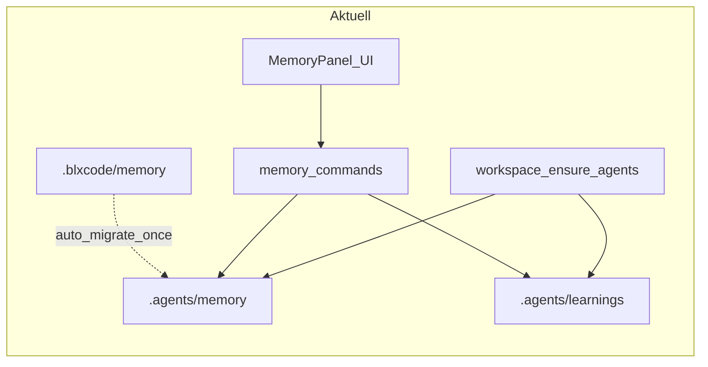

# Memory nach `.agents/` mit integrierten Learnings

**Status:** done  
**Overview:** Workspace-Memory von `.blxcode/memory/` nach `.agents/memory/` verlegen, Learnings unter `.agents/learnings/` in dieselbe Memory-API und UI einbinden (ohne neuen Unterordner), mit automatischer Einmal-Migration beim ersten Zugriff.

## Todos

- [x] `agents-bootstrap` — `ensure_agents_layout` + Tauri-Command `workspace_ensure_agents`; Aufruf beim Workspace-Pfad setzen (commit, active switch, restore)
- [x] `paths-resolve` — `MEMORY_REL` / `LEARNINGS_REL` + `resolve_note_abs` + `ensure_workspace_memory` mit Legacy-Migration in `memory.rs`
- [x] `commands-multiroot` — Alle `memory_*` Commands, graph/search/rename/export/import auf zwei Roots umstellen
- [x] `agent-pointers` — `system_prompt.rs`, `tools.rs`, `pointer_body` für `.agents/memory` + `.agents/learnings`
- [x] `frontend-paths` — `memory_paths.rs`, `chat_markdown.rs` (neue + Legacy-Prefixe), MemoryPanel-Gruppierung
- [x] `docs-changelog` — User-/Dev-Docs und CHANGELOG auf neue Pfade aktualisieren
- [x] `learnings-wikilinks` — `upgrade_learnings_graph_links` — bestehende Learnings (Index + Topic-MD) idempotent auf `[[wikilinks]]` für Graph umstellen
- [x] `tests` — Rust-Tests: Migration, learnings/-Pfad, kombinierte list/graph, Wikilink-Upgrade

## Umsetzung (Ist)

| Bereich | Pfad / Verhalten |
|---------|------------------|
| Memory-Root (Backend) | `MEMORY_REL = ".agents/memory"` in [`src-tauri/src/agents_layout.rs`](../../src-tauri/src/agents_layout.rs), re-export in [`memory.rs`](../../src-tauri/src/memory.rs) |
| Learnings | `LEARNINGS_REL = ".agents/learnings"` — gleiche Memory-API, API-Pfade `learnings/…` |
| Legacy | `.blxcode/memory/` wird einmalig nach `.agents/memory/` kopiert, wenn das neue Verzeichnis leer ist |
| Tasks | unverändert [`.blxcode/tasks`](../../src-tauri/src/tasks.rs) |
| UI + Wikilinks | [`src/memory_paths.rs`](../../src/memory_paths.rs), [`chat_markdown.rs`](../../src/workbench/chat_markdown.rs) — `.agents/memory/`, `.agents/learnings/` + Legacy-Prefix |
| Agent | [`system_prompt.rs`](../../src-tauri/src/agent/system_prompt.rs), [`tools.rs`](../../src-tauri/src/agent/tools.rs) — beide Roots |
| Externe Pointer | [`pointer_body`](../../src-tauri/src/memory.rs) → `.agents/memory` + `.agents/learnings` in `CLAUDE.md` / `AGENTS.md` |
| Bootstrap | `workspace_ensure_agents` — Frontend [`state.rs`](../../src/workbench/state.rs) beim Workspace-Pfad setzen |



## Zielbild (umgesetzt)

> Entspricht dem Abschnitt **Umsetzung (Ist)** oben — Plan abgeschlossen.

- **Memory-Notizen:** `<workspace>/.agents/memory/` (inkl. `_templates/`)
- **Learnings:** bleiben bei `<workspace>/.agents/learnings/` (kein neuer Ordner unter memory)
- **Einheitliche API:** `memory_list` / `read` / `write` / `search` / `graph` / … decken **beide** Wurzeln ab
- **Rules / Skills / Plans:** explizit ausgenommen (später separat)
- **Migration:** automatisch beim ersten Zugriff, wenn neues Memory leer und Legacy-Inhalt vorhanden ist
- **Bootstrap:** Beim Öffnen/Setzen eines Workspace-Pfads wird fehlendes `.agents/` inkl. Unterordnern angelegt (nicht erst beim Öffnen des Memory-Tabs)
- **Learnings-Graph:** Alle bereits vorhandenen Learning-Dateien werden automatisch mit Obsidian-`[[wikilinks]]` angereichert, damit sie im Memory-Graph Kanten bilden (nicht als isolierte Orphans)

## Learnings: automatisches Wikilink-Upgrade (Graph)

Der Graph (`memory_graph`) erzeugt Kanten **nur** aus `[[Ziel]]` / `[[Ziel|Alias]]` im Markdown — nicht aus normalen Links `[Text](datei.md)`. Bestehende Learnings nutzen im Index typischerweise klassische Markdown-Links:

```markdown
- [shadcn Tailwind Setup](shadcn-tailwind.md) — …
```

Ohne Upgrade erscheinen Topic-Dateien im Graph als **orphans**.

### Funktion: `upgrade_learnings_graph_links(workspace_cwd)`

Wird in `ensure_agents_layout` **nach** Ordner-Anlage und Legacy-Migration ausgeführt (idempotent).

**Betroffene Dateien:** alle `.md` unter `.agents/learnings/` (inkl. `LEARNINGS.md` / Legacy `LEARNIGS.md`).

| Regel | Aktion |
|-------|--------|
| Index-Zeilen `[Label](topic.md)` | Ersetzen durch `[[learnings/topic\|Label]]` (API-Pfad ohne `.md`, Alias = Label) |
| Bereits `[[…]]` auf dasselbe Ziel | Unverändert lassen |
| Topic-`.md` ohne Link zum Index | Am Ende optionaler Block `## Related` mit `[[learnings/LEARNINGS]]` oder `[[LEARNINGS]]`, falls Index existiert |
| Relative Links zwischen Topics `[…](andere.md)` | In `[[learnings/andere\|…]]` wandeln, wenn Ziel im Learnings-Ordner liegt |
| Code-Fences | Nicht anfassen |

**Zielpfad-Konvention:** Wikilinks verwenden den API-Pfad `learnings/<stem>` (ohne `.md`).

**Optional:** Wenn nur `LEARNIGS.md` existiert → einmalig nach `LEARNINGS.md` umbenennen.

## `.agents`-Bootstrap beim Workspace-Öffnen

### Backend: `ensure_agents_layout(workspace_cwd)`

```text
<workspace>/
  .agents/
    memory/           # inkl. _templates/ (leer ok)
    learnings/        # ggf. LEARNINGS.md seed
```

Schritte:

1. `validate_workspace_cwd` (absolut, existiert)
2. `fs::create_dir_all` für `.agents`, `.agents/memory`, `.agents/memory/_templates`, `.agents/learnings`
3. Legacy-Migration `.blxcode/memory` → `.agents/memory`
4. Optional: `LEARNINGS.md` seed wenn Ordner keine `.md` hat
5. `upgrade_learnings_graph_links`

**Nicht** anlegen: `.agents/rules`, `.agents/skills`, `.agents/plans`.

Neuer Tauri-Command `workspace_ensure_agents`. `ensure_workspace_memory` ruft intern zuerst `ensure_agents_layout` auf.

### Frontend: wann aufrufen?

| Trigger | Ort |
|---------|-----|
| Neuer Workspace bestätigt | `commit_inline_configure` in `state.rs` |
| Aktiver Workspace wechselt | `select_workspace` / Effect auf `active_id` |
| App-Start mit gespeicherten Workspaces | Nach Workbench-Restore |

Fehler blockieren den Workspace nicht.

## Pfad-Auflösung (Kern-Design)

```rust
const MEMORY_REL: &str = ".agents/memory";
const LEARNINGS_REL: &str = ".agents/learnings";
const LEGACY_MEMORY_REL: &str = ".blxcode/memory";
const LEARNINGS_PREFIX: &str = "learnings/";
```

| API-Pfad | Physische Datei |
|----------|-----------------|
| `foo.md`, `notes/bar.md` | `.agents/memory/foo.md` |
| `learnings/topic.md` | `.agents/learnings/topic.md` |
| `_templates/x.md` | nur unter Memory-Root |

## Abnahme-Checkliste

- Projekt **ohne** `.agents/`: nach Workspace-Pfad setzen existieren `.agents/`, `.agents/memory/`, `.agents/learnings/` — **ohne** Memory-Tab
- Legacy `.blxcode/memory` wird nach `.agents/memory` migriert
- `memory_list` zeigt `learnings/*.md` und Memory-Notizen
- Graph: Index ↔ Topics nach Wikilink-Upgrade
- `cargo test` in `src-tauri`
