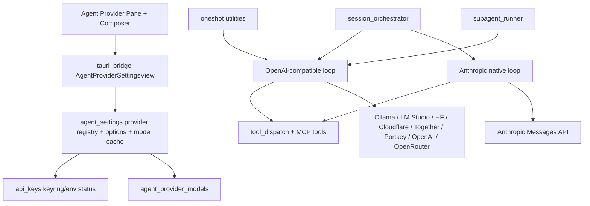

# New BLXCode Agent Providers

## Summary

BLXCode currently supports three text-agent providers: OpenRouter, Anthropic, and OpenAI. The runtime has two real HTTP paths: a native Anthropic Messages loop and an OpenAI-compatible Chat Completions loop used by OpenRouter/OpenAI. API keys are centralized in the OS keyring with `BLX_*` environment fallbacks, while text, image, and voice each have their own provider enums and settings.

This plan adds local text-agent providers Ollama, LM Studio, and Hugging Face local/router usage, plus cloud providers Cloudflare Workers AI, Together AI, and Portkey. v1 scope is the BLXCode Agent text chat and every existing text-provider reuse path: main chat, one-shot completions, prompt enhancement, AI plans/tasks, AI commit messages, compaction, MCP tool loops, and subagents. Image and Voice provider lists remain unchanged in v1.

## Decisions

- Treat all six new providers as OpenAI-compatible text providers unless a provider-specific incompatibility is proven during implementation.
- Keep Anthropic as the only native non-OpenAI-compatible text provider path.
- Add a provider registry instead of extending more hard-coded `match` blocks across settings, model fetching, runtime, subagents, and UI.
- Use no required API key for Ollama and LM Studio. If the generic compatible client needs an Authorization value, use an internal dummy value and do not surface it as a required key.
- Store Cloudflare Account ID as a non-secret provider option; store the Cloudflare API token in the API Keys pane.
- Keep Image and Voice integration for new providers out of v1. The UI/docs must make this explicit so LLM API-key rows do not imply image/STT/TTS support.
- Preserve existing settings compatibility. Existing `agent_provider_settings.json` installs must continue loading with OpenRouter as the default and with existing OpenRouter/Anthropic/OpenAI model caches preserved.

## Current App Map

- Backend settings and keys: `src-tauri/src/agent_settings.rs`, `src-tauri/src/api_keys.rs`, `src-tauri/src/media_keys.rs`
- Runtime provider loops: `src-tauri/src/agent/openrouter.rs`, `src-tauri/src/agent/anthropic.rs`
- Runtime entrypoints: `src-tauri/src/agent/session_orchestrator.rs`, `src-tauri/src/agent/oneshot.rs`, `src-tauri/src/agent/subagent_runner.rs`
- Metrics and context metadata: `src-tauri/src/agent/pricing.rs`, `src-tauri/src/agent/context_window.rs`
- Frontend IPC mirrors: `src/tauri_bridge.rs`
- Agent settings UI: `src/workbench/agent_provider_pane/mod.rs`
- Composer model picker: `src/workbench/agent_panel/composer/mod.rs`
- Shared model picker: `src/workbench/agent_model_picker/mod.rs`
- API Keys UI: `src/workbench/api_keys_pane/mod.rs`
- Image/Voice areas to keep separate: `src-tauri/src/image/settings.rs`, `src-tauri/src/voice/settings.rs`, `src/workbench/harness_image_pane/mod.rs`, `src/workbench/agent_voice_settings.rs`

## Provider Matrix

| Provider | Class | API shape | Default base URL | Auth | Model discovery |
|---|---|---|---|---|---|
| Ollama | Local | OpenAI-compatible | `http://localhost:11434/v1` | None required | `GET /v1/models` |
| LM Studio | Local | OpenAI-compatible | `http://localhost:1234/v1` | None required | `GET /v1/models` |
| Hugging Face | Cloud | OpenAI-compatible router | `https://router.huggingface.co/v1` | `BLX_HUGGINGFACE_API_KEY` | `/v1/models` or curated fallback |
| Cloudflare | Cloud | OpenAI-compatible Workers AI | `https://api.cloudflare.com/client/v4/accounts/{account_id}/ai/v1` | `BLX_CLOUDFLARE_API_TOKEN` + Account ID | Cloudflare AI model-list API plus curated fallback |
| Together | Cloud | OpenAI-compatible | `https://api.together.ai/v1` | `BLX_TOGETHER_API_KEY` | `GET /v1/models` |
| Portkey | Cloud gateway | OpenAI-compatible | `https://api.portkey.ai/v1` | `BLX_PORTKEY_API_KEY` | `GET /v1/models` or curated/custom |

## Architecture



```mermaid
sequenceDiagram
  participant UI as BLXCode Agent Chat
  participant IPC as Tauri command
  participant Orch as session_orchestrator
  participant Reg as Provider registry
  participant Loop as Compatible loop
  participant API as Provider API
  participant Tools as BLXCode tools/MCP

  UI->>IPC: agent_submit_turn(provider, model)
  IPC->>Orch: dispatch_user_turn
  Orch->>Reg: resolve endpoint/auth/capabilities
  Orch->>Loop: run_chat_turn(endpoint_config)
  Loop->>API: /chat/completions stream:true tools:[]
  API-->>Loop: deltas/tool_calls/usage
  Loop->>Tools: dispatch_tool(...)
  Tools-->>Loop: tool result
  Loop-->>UI: AgentEvent stream via poll
```

## Implementation Notes

### Phase 1 - Registry and settings foundation

- Add a central provider registry with id, label key, local/cloud class, default base URL, auth mode, model discovery strategy, and capability flags.
- Extend backend and frontend `AgentProviderKind` with `Ollama`, `LmStudio`, `HuggingFace`, `Cloudflare`, `Together`, and `Portkey`.
- Add provider options for local base URL overrides, Portkey base URL override, and Cloudflare Account ID.
- Replace fixed cache access with provider-keyed model cache helpers while keeping old fields readable for migration.
- Add API-key rows and env vars for Hugging Face, Cloudflare, Together, and Portkey.

### Phase 2 - OpenAI-compatible transport

- Rename or extract the current `openrouter.rs` client into an OpenAI-compatible client that accepts endpoint config rather than enum-only URLs.
- Implement auth modes: required bearer, optional bearer, no-auth local, and provider-specific headers.
- Send OpenRouter-specific `usage.include`, referer/title headers, and cost handling only for OpenRouter.
- Send OpenAI `reasoning_effort` only for providers marked as supporting that field.
- Normalize missing-key, missing-account-id, local-server-unreachable, HTTP error body, malformed SSE, and tool-call parse errors.

### Phase 3 - Model discovery and picker

- Implement live model refresh per provider: local `/v1/models`, HF/Together/Portkey `/v1/models`, and Cloudflare model-list API.
- Add curated fallback model entries for each provider.
- Update Agent Provider Pane and Composer to read `models_for_provider(provider)` instead of fixed OpenRouter/Anthropic/OpenAI fields.
- On provider switch, preserve current model only if valid or custom; otherwise choose the first refreshed model when available.
- Populate context length and pricing only when provider metadata supplies it; otherwise use existing fallback tables or display raw token counts/no cost.

### Phase 4 - UI, i18n, icons, docs

- Add all providers to Settings -> BLXCode Agent and the Composer model picker.
- Group provider picker options by Local and Cloud in the UI.
- Add provider-specific controls for base URL and Cloudflare Account ID.
- Add API-key pane icon mappings where brand assets exist; use the existing key fallback icon otherwise.
- Add i18n keys for provider labels, base URL/account fields, local connection errors, model-refresh source messages, and "text only" hints.
- Update user/developer docs for setup, env vars, supported feature matrix, model refresh, and local troubleshooting.

### Phase 5 - Runtime coverage

- Route main BLXCode Agent Chat through the generalized endpoint resolver.
- Update `oneshot::complete_text` so AI commit, AI plans/tasks, prompt enhancement, and compaction work with new compatible providers.
- Update `SubagentProvider::from_settings` to accept all compatible providers.
- Verify OpenAI tool schemas, tool-call parsing, MCP tool names, and tool-result message shape across providers.
- Keep image-context payloads on compatible providers but document model-dependent vision support.

### Phase 6 - Validation and hardening

- Add unit tests for enum serde, settings migration, provider options defaults, key env fallback, and no-key local auth behavior.
- Add model-list parser tests using representative fixtures per provider.
- Add request-building tests for URL, headers, auth, reasoning omission, OpenRouter extras, and Cloudflare account URL construction.
- Add runtime tests for SSE deltas, tool-call aggregation, tool-result append, missing usage, and provider HTTP errors.
- Run `cargo test --workspace`, `cargo check -p blxcode-ui --target wasm32-unknown-unknown`, and the existing theme/i18n lint scripts.

## Tests

- Existing users with only OpenRouter settings load unchanged and keep the same selected model.
- Selecting Ollama with a running local server lists local models and completes a simple chat turn without a configured API key.
- Selecting LM Studio with a running local server lists local models and completes a simple chat turn without a configured API key.
- Hugging Face, Together, and Portkey show missing-key status until their key is configured, then refresh models and run a basic non-tool turn.
- Cloudflare shows a clear error until both Account ID and API token are configured.
- Tool-calling models can call `list_tools`, one workspace read tool, and one MCP tool through the compatible loop.
- Models without tool support fail gracefully with provider error text rather than corrupting conversation state.
- One-shot paths work with at least one local and one cloud compatible provider.
- Subagents run on compatible providers and preserve tool-group filtering.
- Image and Voice panes continue to show only their existing providers.
- `cargo test --workspace`
- `cargo check -p blxcode-ui --target wasm32-unknown-unknown`

## References

- Ollama OpenAI compatibility: https://docs.ollama.com/openai
- LM Studio OpenAI-compatible server: https://lmstudio.ai/docs/app/api/endpoints/openai
- Hugging Face Inference Providers / OpenAI compatibility: https://huggingface.co/docs/inference-providers/en/index
- Cloudflare Workers AI OpenAI compatibility: https://developers.cloudflare.com/workers-ai/configuration/open-ai-compatibility/
- Cloudflare AI model-list API: https://developers.cloudflare.com/api/resources/ai/subresources/models/methods/list/
- Together OpenAI API compatibility: https://docs.together.ai/docs/openai-api-compatibility
- Portkey OpenAI-compatible gateway: https://portkey.ai/docs/product/ai-gateway-streamline-llm-integrations/openai

## Tasks

- [ ] `prov-registry` - Add central provider registry with endpoint, auth, model discovery, and capability metadata
- [ ] `prov-enum-mirror` - Extend backend and frontend provider enums with Ollama, LM Studio, Hugging Face, Cloudflare, Together, and Portkey
- [ ] `prov-options` - Add provider options for base URLs and Cloudflare Account ID with backward-compatible serde defaults
- [ ] `prov-cache-map` - Migrate fixed model caches to provider-keyed cache helpers while preserving old settings
- [ ] `prov-key-catalog` - Add cloud provider key rows, keyring accounts, and `BLX_*` env fallbacks
- [ ] `compat-loop` - Extract the OpenAI-compatible runtime from the OpenRouter/OpenAI-specific enum path
- [ ] `compat-auth` - Implement required bearer, optional bearer, and no-auth local request modes
- [ ] `compat-reasoning` - Gate reasoning request fields by provider capability
- [ ] `compat-errors` - Normalize provider setup and HTTP/SSE errors for user-facing chat events
- [ ] `compat-usage` - Preserve usage/cost metrics when reported and avoid fake pricing when missing
- [ ] `models-refresh` - Implement live model refresh for all new providers
- [ ] `models-curated` - Add curated fallback entries and custom-model behavior for all new providers
- [ ] `models-ui-cache` - Update Settings and Composer to use provider-keyed model cache access
- [ ] `models-selection` - Make provider switching preserve valid/custom models and choose a sensible fallback
- [ ] `models-metadata` - Resolve context/pricing metadata only from provider data or existing fallback tables
- [ ] `ui-provider-picker` - Add Local/Cloud grouped provider choices to Agent settings and Composer
- [ ] `ui-provider-options` - Add provider-specific base URL, Account ID, key status, and refresh/test controls
- [ ] `ui-api-keys` - Add API Keys pane rows and icons/fallbacks for new cloud providers
- [ ] `i18n-provider-keys` - Add provider labels, hints, errors, and option labels across locales
- [ ] `docs-provider-guide` - Update user/developer docs for setup, env vars, feature support, and troubleshooting
- [ ] `chat-main` - Route main Agent Chat through the generalized endpoint resolver
- [ ] `chat-oneshot` - Route one-shot utilities through the generalized endpoint resolver
- [ ] `chat-subagents` - Enable compatible providers in subagent runner
- [ ] `chat-tools` - Verify tool schemas, MCP tools, and tool-result messages across compatible providers
- [ ] `chat-images` - Preserve compatible image-context behavior and document provider/model variance
- [ ] `tests-settings` - Add settings, serde migration, and key-resolution tests
- [ ] `tests-models` - Add model-list parser tests and fixtures
- [ ] `tests-requests` - Add request URL/header/body generation tests
- [ ] `tests-runtime` - Add streaming/tool/error runtime tests
- [ ] `checks` - Run workspace backend/frontend checks and existing lint scripts
