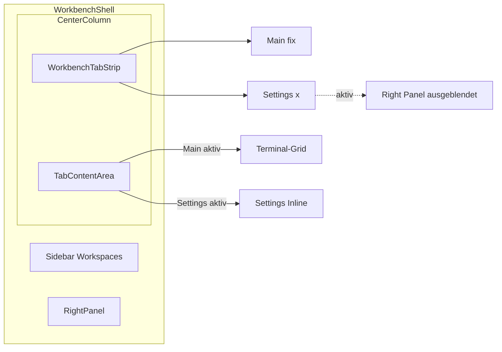

# Settings-Refactor: Tabs + Theme-System

## Summary

Refactor der BLXCode Settings von Modal-Overlay zu einem Tab-System in der Workbench-Mitte: Workspaces bleiben im fixen Main-Tab, Settings oeffnen als schliessbarer Tab (aehnlich Agent-Tabs). Im Settings-Modus wird das Right Panel ausgeblendet. Neuer Appearance/Theme-Tab mit ~12 App-Themes, Suche, Dark/Light-Filter und Preview-Karten. Das heutige Design bleibt unveraendert als Default-Theme `blxcode-dark` (Anzeigename „BLXCode“).

## Decisions

- Settings-Tab **blendet Right Panel aus** und nutzt die volle Breite Mitte+Rechts.
- **~12 Starter-Themes** im ersten Release.
- Default-Theme: **`blxcode-dark`** (Anzeigename **„BLXCode“**). Erststart und fehlender localStorage-Eintrag → immer dieses Theme; kein visueller Regressions-Diff zum Ist-Zustand.
- `:root`-Tokens werden **1:1** nach `[data-theme="blxcode-dark"]` kopiert; `:root` bleibt als Fallback mit identischen Werten.
- Workbench-Tab-Zustand ist **session-only** (nicht in `WorkbenchSnapshot`).
- `blxcode-light` ist eine neu designte Light-Variante, nicht ein invertiertes Dark.

## Implementation Notes

### Ziel-Architektur



### Phase 1: Workbench-Tab-Infrastruktur

Neues Modul `src/workbench/workbench_tabs.rs`:

```rust
pub enum WorkbenchTabKind {
    Main,     // immer vorhanden, nicht schliessbar
    Settings, // singleton, schliessbar
}

pub struct WorkbenchTab {
    pub id: u64,
    pub kind: WorkbenchTabKind,
    pub label_key: I18nKey,
}
```

State in `WorkbenchService` (analog `embedded_browser_tabs`):
- `workbench_tabs`, `workbench_active_tab_id`
- API: `open_settings_tab(cat)`, `close_tab(id)`, `select_workbench_tab(id)`, `active_tab_kind()`

UI: `WorkbenchTabStrip` + `WorkbenchTabHost` ersetzen direktes `<WorkspacePanel />` in `mod.rs`. Right Panel conditional:

```rust
<Show when=move || wb.active_tab_kind() != Settings>
    <RightPanel />
</Show>
```

CSS: `.workbench-center-tabs`, `.workbench-center-tab`, `.workbench-center-tab--active` — Top-Accent-Linie wie Agent-Tabs.

Navigation: `HarnessUiService.open_settings(cat)` → `WorkbenchService.open_settings_tab(cat)`; `settings_open` entfernen. Escape schliesst Settings-Tab. `harness_chords.rs` anpassen.

### Phase 2: Settings inline

Aufteilen in `src/workbench/settings/`:
- `mod.rs` — `SettingsTabView` (inline, kein Overlay)
- `settings_nav.rs` — linke Kategorie-Nav
- `panes/` — App, Workspace, Agent, Memory, Voice, Image (aus `harness_ui.rs`)
- `theme_pane.rs` — Appearance/Theme

Entfernen: `.harness-overlay`, Scrim, `role="dialog"`, Tab-Trap. `HarnessHost` rendert Settings nicht mehr. Neuer `HarnessSettingsCategory::Appearance`.

### Phase 3: Theme-System

Neues Modul `src/theme/` mit `AppTheme`, `ThemeMode`, `DEFAULT_THEME_ID = "blxcode-dark"`.

**12 Themes (MVP):**

| ID | Anzeigename | Modus |
|---|---|---|
| `blxcode-dark` | BLXCode | Dark — exakt heutiger Look |
| `blxcode-light` | BLXCode Light | Light |
| `dracula` | Dracula | Dark |
| `gruvbox-dark` | Gruvbox Dark | Dark |
| `gruvbox-light` | Gruvbox Light | Light |
| `solarized-dark` | Solarized Dark | Dark |
| `solarized-light` | Solarized Light | Light |
| `nord` | Nord | Dark |
| `one-dark` | One Dark | Dark |
| `catppuccin-mocha` | Catppuccin Mocha | Dark |
| `catppuccin-latte` | Catppuccin Latte | Light |
| `tokyo-night` | Tokyo Night | Dark |

CSS: `themes/tokens.css` mit `[data-theme="…"]` Bloecken. `ThemeService` in `src/workbench/theme_service.rs` — `set_theme(id)` setzt DOM + localStorage (`blxcode_theme_v1`) + xterm-Event. Boot-Script in `index.html` vor CSS-Load.

Terminal: `public/terminal_bootstrap.mjs` — Theme-Map + Listener auf `blxcode-theme-changed`.

### Phase 4: Theme-Settings-UI

`settings/theme_pane.rs`: Header mit Active-Preview, Suchfeld, Filter (All/Dark/Light), responsive Theme-Grid mit `ThemePreviewCard`, ACTIVE-Badge. i18n-Keys in allen 13 Locales.

### Betroffene Kern-Dateien

| Datei | Aenderung |
|---|---|
| `src/workbench/mod.rs` | TabHost, conditional RightPanel |
| `src/workbench/state.rs` | Tab-State, `open_settings_tab` |
| `src/workbench/harness_ui.rs` | Settings-Modal entfernen, Panes extrahieren |
| `src/workbench/harness_chords.rs` | Escape/Overlay-Logik |
| `styles.css` | Tab-Strip, Settings-Inline, Theme-Grid |
| `themes/tokens.css` | 12 Theme-Definitionen |
| `index.html` | Theme-Boot-Script |
| `src/config/app.config.rs` | `THEME_STORAGE_KEY` |
| `src/i18n/locales/*.rs` | Appearance + Theme-Strings |

### Risiken / Follow-ups

- ~104 hardcodierte Farben in `styles.css` schrittweise tokenisieren; MVP fokussiert sichtbare UI.
- Nicht eingebundene CSS-Duplikate (`sidebar_resizer.css`, `sidebar_view_section.css`) beim Token-Refactor pruefen.
- `WorkbenchTabKind` enum erweiterbar halten fuer kuenftige Tabs.

### Empfohlene Reihenfolge

1. Tab-Infrastruktur + Settings inline (ohne Theme)
2. Theme-Token-System + ThemeService + Boot-Script
3. Theme-Pane UI + 12 Themes
4. CSS-Hardening + i18n + manuelle Abnahme

## Tests

- Tab-Wechsel: Main ↔ Settings, Close-Button, Escape, Befehlspalette
- Right Panel ausgeblendet bei Settings, wieder sichtbar nach Tab-Close
- Theme-Auswahl persistiert nach Reload, kein Flash beim Start
- Erststart/Reset → `blxcode-dark` pixelgleich zum heutigen UI
- Terminal-Farben passen zum gewaehlten Theme
- Alle Settings-Panes (App, Workspace, Agent, Memory, Voice, Image) funktionieren inline
- `cargo check -p blxcode-ui --target wasm32-unknown-unknown`

## Tasks

- [ ] `tab-infra` - WorkbenchTab-Modell + State-API + WorkbenchTabStrip/Host in workbench_tabs.rs; Integration in mod.rs mit conditional RightPanel
- [ ] `settings-inline` - SettingsChrome aus Modal extrahieren → settings/ Modul; HarnessHost bereinigen; open_settings → Tab oeffnen; Escape/Chords anpassen
- [ ] `theme-tokens` - themes/tokens.css mit 12 Theme-Sets; blxcode-dark 1:1 aus aktuellem :root; data-theme auf html; THEME_STORAGE_KEY + ThemeService; Boot-Script in index.html
- [ ] `theme-pane-ui` - HarnessSettingsCategory::Appearance + ThemePane mit Suche, Dark/Light-Filter, Preview-Grid; i18n fuer alle Locales
- [ ] `terminal-theme-sync` - terminal_bootstrap.mjs: Theme-Map + blxcode-theme-changed Event fuer live xterm-Updates
- [ ] `css-polish` - Tab-Strip/Settings-Inline/Theme-Grid CSS; kritische hardcoded Farben in styles.css auf Tokens umstellen
- [ ] `manual-qa` - Manuelle Abnahme: Tab-Wechsel, Settings-Panes, Theme-Persistenz, Right-Panel-Toggle, wasm32 check
