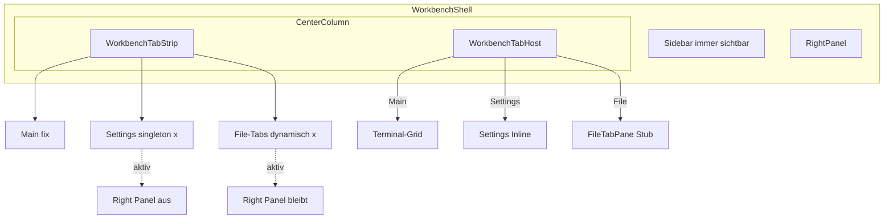

# Settings-Refactor: Tabs + Theme-System

## Summary

Refactor der BLXCode Settings von Modal-Overlay zu einem **dynamischen Tab-System** in der Workbench-Mitte: Main-Tab (fix, Terminals/Workspaces), Settings als schliessbarer Singleton-Tab, und vorbereitete **File-Tabs** (Explorer-Klick oeffnet Tab mit Stub-Editor). Settings blendet nur das Right Panel aus; linke Sidebar bleibt immer sichtbar. Neuer Appearance/Theme-Tab mit ~12 App-Themes, Suche, Dark/Light-Filter und Preview-Karten. Default-Theme `blxcode-dark` (Anzeigename „BLXCode“) ist der heutige Look 1:1.

## Decisions

- **Dynamisches Tab-Modell** von Anfang an (`Main` / `Settings` / `File` + spaeter erweiterbar), Vorbild: `EmbeddedBrowserTab` in `WorkbenchService`.
- Settings-Tab **blendet nur das Right Panel aus**; **linke Sidebar bleibt immer sichtbar** (Workspaces, Explorer — kein Auto-Collapse).
- File-Tabs: schliessbar, **Dedupe** bei gleichem `(workspace_id, rel_path)` solange Tab offen ist; Editor-Inhalt ist initial ein Stub (Follow-up: echter Editor).
- Settings ist **Singleton** — erneutes Oeffnen fokussiert bestehenden Tab.
- Main-Tab ist **fix** (Index 0, nicht schliessbar).
- **~12 Starter-Themes** im ersten Release.
- Default-Theme: **`blxcode-dark`** (Anzeigename **„BLXCode“**). Erststart und fehlender localStorage-Eintrag → immer dieses Theme; kein visueller Regressions-Diff.
- `:root`-Tokens werden **1:1** nach `[data-theme="blxcode-dark"]` kopiert; `:root` bleibt als Fallback.
- Workbench-Tab-Zustand ist **session-only** (nicht in `WorkbenchSnapshot`).
- `blxcode-light` ist eine neu designte Light-Variante, nicht ein invertiertes Dark.

## Implementation Notes

### Ziel-Architektur



### Phase 1: Dynamische Workbench-Tabs

Neues Modul `src/workbench/workbench_tabs.rs`:

```rust
pub enum WorkbenchTabKind {
    Main,     // genau 1x, Index 0, nicht schliessbar
    Settings, // singleton: erneutes Oeffnen fokussiert
    File,     // dynamisch, 0..n, schliessbar
}

pub enum WorkbenchTabPayload {
    None,
    Settings { category: HarnessSettingsCategory },
    File { workspace_id: u64, rel_path: String },
}

pub struct WorkbenchTab {
    pub id: u64,
    pub kind: WorkbenchTabKind,
    pub label: String,
    pub payload: WorkbenchTabPayload,
    pub icon: WorkbenchTabIcon,
}
```

| Kind | Anzahl | Schliessbar | Dedupe |
|---|---|---|---|
| `Main` | immer 1 | nein | — |
| `Settings` | max 1 | ja | `open_settings_tab()` fokussiert |
| `File` | 0..n | ja | gleicher `(workspace_id, rel_path)` → fokussieren |

State in `WorkbenchService` (analog `embedded_browser_*`):
- `workbench_tabs`, `workbench_active_tab_id`, `workbench_next_tab_id`

API:
- `open_settings_tab(category)`, `open_file_tab(workspace_id, rel_path) -> u64`
- `close_workbench_tab(id)`, `select_workbench_tab(id)`, `active_tab_kind()`
- `tabs_hide_right_panel()` — `true` nur fuer `Settings`

UI: `WorkbenchTabStrip` + `WorkbenchTabHost` ersetzen direktes `<WorkspacePanel />` in `mod.rs`:

```rust
<Show when=move || !wb.tabs_hide_right_panel().get()>
    <RightPanel />
</Show>
```

Tab-Strip: horizontal scrollbar, Icon + Label + Close (ausser Main), Top-Accent-Linie.
Mount: Main + Settings gemountet halten; File-Tabs lazy mount / unmount beim Schliessen.

**Project Explorer Hook** (`src/workbench/project_explorer/mod.rs`): File-Click ruft `open_file_tab(ws.id, rel_path)` auf.

Navigation: `HarnessUiService.open_settings(cat)` → `open_settings_tab(cat)`; `settings_open` entfernen. Escape schliesst Settings-Tab. `harness_chords.rs` anpassen.

### Phase 2: Settings inline

Aufteilen in `src/workbench/settings/`:
- `mod.rs` — `SettingsTabView` (inline, kein Overlay)
- `settings_nav.rs` — linke Kategorie-Nav
- `panes/` — App, Workspace, Agent, Memory, Voice, Image (aus `harness_ui.rs`)
- `theme_pane.rs` — Appearance/Theme

Entfernen: `.harness-overlay`, Scrim, `role="dialog"`, Tab-Trap. `HarnessHost` rendert Settings nicht mehr. Neuer `HarnessSettingsCategory::Appearance`.

### Phase 3: Theme-System

Neues Modul `src/theme/` mit `AppTheme`, `ThemeMode`, `DEFAULT_THEME_ID = "blxcode-dark"`.

**12 Themes (MVP):**

| ID | Anzeigename | Modus |
|---|---|---|
| `blxcode-dark` | BLXCode | Dark — exakt heutiger Look |
| `blxcode-light` | BLXCode Light | Light |
| `dracula` | Dracula | Dark |
| `gruvbox-dark` | Gruvbox Dark | Dark |
| `gruvbox-light` | Gruvbox Light | Light |
| `solarized-dark` | Solarized Dark | Dark |
| `solarized-light` | Solarized Light | Light |
| `nord` | Nord | Dark |
| `one-dark` | One Dark | Dark |
| `catppuccin-mocha` | Catppuccin Mocha | Dark |
| `catppuccin-latte` | Catppuccin Latte | Light |
| `tokyo-night` | Tokyo Night | Dark |

CSS: `themes/tokens.css` mit `[data-theme="…"]`. `ThemeService` in `src/workbench/theme_service.rs`. Boot-Script in `index.html` vor CSS-Load (`blxcode_theme_v1`, Default `blxcode-dark`).
Terminal: `public/terminal_bootstrap.mjs` — Theme-Map + `blxcode-theme-changed` Event.

### Phase 4: Theme-Settings-UI

`settings/theme_pane.rs`: Header mit Active-Preview, Suchfeld, Filter (All/Dark/Light), Theme-Grid mit `ThemePreviewCard`, ACTIVE-Badge. i18n in allen 13 Locales.

### Betroffene Kern-Dateien

| Datei | Aenderung |
|---|---|
| `src/workbench/workbench_tabs.rs` | Tab-Modell, Strip, Host, File-Stub |
| `src/workbench/mod.rs` | TabHost, conditional RightPanel |
| `src/workbench/state.rs` | Tab-CRUD-API |
| `src/workbench/project_explorer/mod.rs` | File-Click → `open_file_tab` |
| `src/workbench/harness_ui.rs` | Settings-Modal entfernen, Panes extrahieren |
| `src/workbench/harness_chords.rs` | Escape/Overlay-Logik |
| `styles.css` | Tab-Strip, Settings-Inline, Theme-Grid |
| `themes/tokens.css` | 12 Theme-Definitionen |
| `index.html` | Theme-Boot-Script |
| `src/config/app.config.rs` | `THEME_STORAGE_KEY` |
| `src/i18n/locales/*.rs` | Appearance + Theme-Strings |

### Follow-ups (nicht in diesem Refactor)

- `file-tab-editor` — echter Editor/Viewer (Monaco, Markdown-Preview, Binary)
- Tab-Persistenz in `WorkbenchSnapshot` / `workbench.json`
- Explorer-Kontextmenue: „In neuem Tab“ vs. „Im Terminal“
- Pin-Tabs, Tab-Reorder per Drag
- ~104 hardcodierte Farben in `styles.css` schrittweise tokenisieren

### Empfohlene Reihenfolge

1. Tab-Infrastruktur + Settings inline + File-Stub
2. Theme-Token-System + ThemeService + Boot-Script
3. Theme-Pane UI + 12 Themes
4. CSS-Hardening + i18n + manuelle Abnahme

## Tests

- Tab-Wechsel: Main ↔ Settings ↔ File-Stub; Close, Escape, Befehlspalette
- Main nicht schliessbar; Settings-Singleton; File-Dedupe bei gleichem Pfad
- Right Panel ausgeblendet nur bei Settings; Sidebar bei allen Tabs sichtbar
- Explorer File-Click oeffnet/fokussiert File-Tab
- Theme-Auswahl persistiert nach Reload, kein Flash; `blxcode-dark` pixelgleich zum Ist-Zustand
- Terminal-Farben passen zum gewaehlten Theme
- Alle Settings-Panes funktionieren inline
- `cargo check -p blxcode-ui --target wasm32-unknown-unknown`

## Tasks

- [ ] `tab-infra` - Dynamisches Tab-Modell (Main/Settings/File), CRUD-API, TabStrip/Host, FileTabPane-Stub, Explorer-Hook, RightPanel nur bei Settings ausblenden
- [ ] `settings-inline` - SettingsChrome aus Modal extrahieren → settings/ Modul; HarnessHost bereinigen; open_settings → Tab oeffnen; Escape/Chords anpassen
- [ ] `theme-tokens` - themes/tokens.css mit 12 Theme-Sets; blxcode-dark 1:1 aus aktuellem :root; data-theme auf html; THEME_STORAGE_KEY + ThemeService; Boot-Script in index.html
- [ ] `theme-pane-ui` - HarnessSettingsCategory::Appearance + ThemePane mit Suche, Dark/Light-Filter, Preview-Grid; i18n fuer alle Locales
- [ ] `terminal-theme-sync` - terminal_bootstrap.mjs: Theme-Map + blxcode-theme-changed Event fuer live xterm-Updates
- [ ] `css-polish` - Tab-Strip mit Scroll, Settings-Inline, Theme-Grid CSS; kritische hardcoded Farben tokenisieren
- [ ] `manual-qa` - Abnahme: dynamische Tabs, Dedupe, Main nicht schliessbar, Settings/File/Theme-Flows, Sidebar sichtbar, wasm32 check
