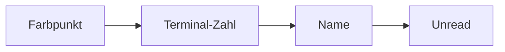

# Workspace-Farbe und Terminal-Badge in der Sidebar

## Summary

Workspaces erhalten ein persistentes `color`-Feld, dessen Startwert rotierend aus **Settings → Workspace → Category colors** kommt. Die Farbe ist über den bestehenden Kontextmenü-Dialog änderbar. In der Sidebar erscheinen ein Farbpunkt links, eine Terminal-Slot-Zahl vor dem Namen (nur bei mehr als einem Slot) und ein farblich passendes Unread-Badge rechts. Persistenz über `workbench.json`; keine Backend-Änderungen.

## Decisions

- **Terminal-Zahl:** zählt Terminal-Slots (`slot_ids.len()`), nicht Split-Panes oder laufende PTY-Sessions.
- **Anzeige Terminal-Badge:** nur wenn `slot_ids.len() > 1` (bei einem Slot ausblenden).
- **Default-Farbe:** neue und backgefüllte Workspaces rotieren durch `memory_color_presets()`; Fallback ist die Default-Preset-Liste.
- **Farb-Presets:** bestehende `memory_color_presets()` aus Settings → Workspace wiederverwenden (kein neuer localStorage-Key).
- **Preset-Bindung:** Workspace-Farben speichern den ausgewählten Hex-Wert; spätere Preset-Änderungen überschreiben bestehende Workspaces nicht.
- **Kontextmenü:** Rename-Dialog wird zu „Workspace bearbeiten" mit Name + Farbe (wie `MemoryCategoryEditDialog`).
- **Terminal-Badge-Farbe:** fest orange `#e8954a` (Mockup); Unread-Badge rechts nutzt Workspace-Farbe.

## Implementation Notes

### Datenmodell — [`src/workbench/state.rs`](../../src/workbench/state.rs)

- `WorkspaceEntry.color: String` mit `#[serde(default)]` (leer = noch nicht gesetzt).
- `workspace_color_from_presets(presets, index)` — rotierende Preset-Farbe mit Default-Preset-Fallback.
- Backfill leerer/ungültiger `color`-Felder beim Hydrieren.
- `create_workspace`, `start_inline_configure` und Workspace-Commit setzen initiale Farbe.
- Setter: `set_workspace_display(id, title, color)`.
- `normalize_hex_color` liegt shared in `state.rs` und wird von Memory-/Workspace-Farbpfaden genutzt.

### Kontextmenü & Dialog — [`src/workbench/sidebar.rs`](../../src/workbench/sidebar.rs)

- Rechtsklick-Menü: Eintrag „Bearbeiten" öffnet Dialog mit Name, `<input type="color">`, Hex-Feld, Swatches aus `wb.memory_color_presets()`.
- Speichern schreibt Titel + normalisierte Farbe → debounced Auto-Save in [`mod.rs`](../../src/workbench/mod.rs).

### Sidebar-Rendering — [`src/workbench/sidebar.rs`](../../src/workbench/sidebar.rs)

Zeilenlayout (expanded):



- Farbpunkt: `.workbench-sidebar__color-dot` mit `--workspace-color`.
- Terminal-Badge: `.workbench-sidebar__terminal-count` vor dem Namen.
- `▸`-Bullet entfernen oder durch Farbpunkt ersetzen.
- Unread-Badge: inline-style mit Workspace-Farbe statt festem Orange.
- Collapsed-Modus: Farbe am Icon-Rand oder als Hintergrund des Initialen-Kästchens.

### CSS — [`styles.css`](../../styles.css)

Neue/angepasste Klassen: `__color-dot`, `__terminal-count`, dynamisches `__badge--total`, optional `__row--active` mit `--workspace-color` für `border-left-color`.

### i18n — [`src/i18n/keys.rs`](../../src/i18n/keys.rs) + alle `locales/*.rs`

Neue/angepasste Keys: bestehende Rename-Keys zeigen „Edit/Save“-Text; zusätzlich `SbWorkspaceColorLabel`, `SbTerminalCountAria`.

## Tests

- Neuer Workspace: Farbpunkt sichtbar, nutzt die nächste Preset-Farbe und persistiert nach Neustart.
- Bestehende Workspaces ohne `color` in JSON: Backfill weist rotierende Preset-Farben zu.
- Kontextmenü → Bearbeiten → Farbe ändern → Neustart → Farbe bleibt.
- Terminal-Slots hinzufügen/entfernen: Zahl vor Name aktualisiert sich reaktiv.
- Unread-Badge rechts nutzt Workspace-Farbe.
- Collapsed-Sidebar: Farbe weiterhin erkennbar.

```bash
cargo check -p blxcode-ui --target wasm32-unknown-unknown
cargo test --workspace
```

## Tasks

- [x] `model-color` - WorkspaceEntry.color, rotierender Preset-Backfill und Setter in state.rs
- [x] `shared-color-util` - normalize_hex_color aus memory_panel extrahieren und gemeinsam nutzen
- [x] `edit-dialog` - Rename-Dialog in sidebar.rs zu Edit-Dialog mit Color-Picker und Presets erweitern
- [x] `sidebar-ui` - Farbpunkt, Terminal-Slot-Badge und farbiges Unread-Badge rendern
- [x] `css` - Neue Sidebar-Klassen in styles.css; Active-State mit Workspace-Farbe
- [x] `i18n` - Neue I18nKeys in keys.rs und allen locales/*.rs
