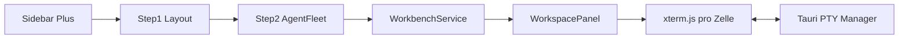
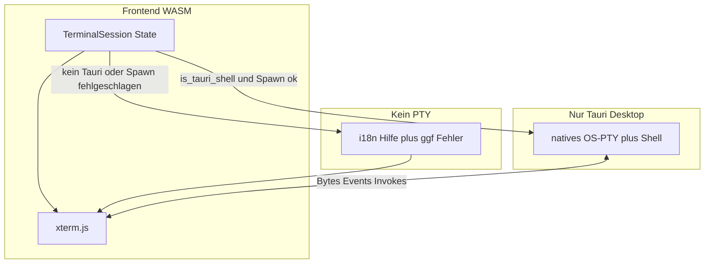

# Workspace anlegen: Wizard + Terminal-Grid (PTY + xterm)

## Ausgangslage

- Das „+“ ist aktuell nur ein [``](../../src/workbench/sidebar.rs) ohne Klickhandler; [`WorkspaceEntry`](../../src/workbench/state.rs) hat nur `id` und `title`, die Liste startet leer.
- Ziel: **Zwei klar getrennte Ebenen** — (A) **Darstellung:** immer **xterm.js** pro Rasterzelle. (B) **Transport:** unter Tauri ein **natives OS-PTY** mit Shell-Prozess; sonst bzw. bei Fehler **kein PTY**, aber weiterhin xterm mit dokumentiertem Fallback (siehe unten **Terminal-Stack**).

## Architektur (Datenfluss)

## Terminal-Stack (verbindlich): natives PTY + xterm.js + Fallback

**Kernregel:** Es gibt **keine** „nur-Div-Placeholder“-Zelle für das Produkt-Terminal. **Jede** Zelle mountet **xterm.js**. Unterschied ist nur, ob ein **Byte-Stream** vom OS-PTY angebunden ist oder nicht.

| Modus | Bedingung | Verhalten |
|--------|-----------|-------------|
| **Live** | `is_tauri_shell()` und `pty_spawn` erfolgreich | natives PTY (z. B. `portable-pty` + Login-Shell), stdin/stdout/stderr des Kindes mit PTY verbunden; Frontend schreibt Tastatur/Paste per `pty_write`, empfängt Rohbytes per Event, `term.write(Uint8Array)` |
| **Fallback** | reiner CSR-Browser **oder** Tauri aber PTY-Spawn fehlgeschlagen **oder** `pty_kill`/Verlust der Session | xterm bleibt offen: `term.reset()` oder `clear`, dann **nur** `writeln` mit i18n (z. B. „Shell nur in der Desktop-App“ / „Terminal konnte nicht gestartet werden“); **kein** simulierter Shell-Stream; Tastatur optional komplett ignorieren oder kurze Stub-Antwort vermeiden (lieber `disableStdin` o. Ä., falls unterstützt) |

**Implementierung:** Kleine Schicht im UI, z. B. Enum `TerminalSession { Connected { session_id }, Disconnected { reason } }` oder Trait „Transport“ mit `attach_pty` / `show_fallback`. Beim Workspace-Wechsel, Zellen-Unmount und App-Exit: PTY immer **kill** + xterm **dispose**, damit keine Zombie-Prozesse.

**Wichtig:** „xterm als Fallback“ ist **nicht** „statt xterm etwas anderes“, sondern **„xterm ohne natives PTY-Backend“**. Das native PTY existiert **ausschließlich** im Tauri-Rust-Prozess, nie im WASM.

## 1. Domänenmodell erweitern

**Datei:** [`src/workbench/state.rs`](../../src/workbench/state.rs)

- `WorkspaceEntry` erweitern um mindestens:
  - `terminal_count: u8` (1–16, validiert beim Anlegen),
  - `cwd: String` (Arbeitsverzeichnis aus Schritt 1),
  - `grid_rows`, `grid_cols: u8` (aus Vorlage bzw. Heuristik),
  - `slot_agent_labels: Vec<String>` (Länge = `terminal_count`; bei „Agents überspringen“ leere Strings oder Platzhalter),
  - optional: stabile **Terminal-Session-IDs** pro Slot (`Vec<u64>` oder Map), um PTY-Lebenszyklus an UI zu koppeln (Spawn beim Workspace-Öffnen, Kill beim Schließen/Wechsel).
- `WorkbenchService` um Wizard-Signale und Methoden ergänzen (wie zuvor): `workspace_next_id`, Modal offen, Schritt, Draft, `open_` / `close_` / `commit_workspace()`.

**Raster-Geometrie:** Feste Vorlagen **1, 2, 4, 6, 8, 10, 12, 14, 16**; sonst Heuristik `cols = ceil(sqrt(n))`, `rows = ceil(n/cols)`.

**Persistenz:** Workspaces bleiben session-lokal im Speicher, bis ihr explizit `localStorage`/Backend ergänzt (nicht Teil dieses Plans, außer ihr entscheidet es später).

## 2. Tauri: nativer OS-PTY-Manager

**Bezug:** Erfüllt den **Live**-Modus aus **Terminal-Stack** (natives PTY nur hier, nie im WASM).

**Dateien:** [`src-tauri/Cargo.toml`](../../src-tauri/Cargo.toml), neues Modul z. B. `src-tauri/src/pty_host.rs`, Eintrag in `lib.rs` / Commands.

- Pro Rasterzelle: **OS-natives PTY** (z. B. `portable-pty` o. ä.) + Kindprozess (Login-Shell oder Shell aus Umgebung), Start-`cwd` = Workspace-`cwd`.
- **IPC:** `pty_spawn { workspace_id, slot, cwd }` → `{ session_id }` oder **expliziter Fehler** (Frontend wechselt dann in **Fallback**-Modus mit i18n, xterm bleibt); `pty_write`, `pty_resize { cols, rows }`, `pty_kill`; **Events** mit Roh-PTY-Ausgabe (`Vec<u8>` / base64) → `term.write`.
- Reader-Loop im Rust-Task: PTY-stdout/-stderr in Events pumpen; App-/Window-Close: alle Sessions beenden.

## 3. Frontend: xterm.js immer + Bridge zum PTY

**Bezug:** Setzt **Terminal-Stack** um — xterm ist **immer** gemountet; anbinden an PTY nur im Live-Modus.

- **Abhängigkeit:** `@xterm/xterm`, optional `@xterm/addon-fit` (Build: npm+Bundler oder Trunk-Strategie — bei Implementierung festlegen).
- **Leptos:** pro Zelle `NodeRef`/`Effect`: `Terminal.open(container)`, `FitAddon.fit()`; bei Fenster-Resize erneut `fit` und nur bei `Connected` → `pty_resize`.
- **Live:** `listen` auf PTY-Output → `term.write(Uint8Array)`; `onData` / Paste → `pty_write` (nur wenn `Connected`).
- **Fallback:** gleiche Instanz: nach `clear`/`reset` nur i18n-`writeln`; Tastatur nicht an Backend senden (`onData` leer oder `options.disableStdin`, je nach API-Version).
- **Kein** paralleler „HTML-only“-Terminalersatz — verhindert doppelte Codepfade.

## 4. UI: Wizard-Overlay

**Neue Datei:** z. B. [`src/workbench/create_workspace_wizard.rs`](../../src/workbench/create_workspace_wizard.rs) (in [`src/workbench/mod.rs`](../../src/workbench/mod.rs) einbinden, in [`WorkbenchShell`](../../src/workbench/mod.rs) rendern).

- Overlay wie [`harness_ui.rs`](../../src/workbench/harness_ui.rs): `harness-overlay`, `harness-scrim`, breites `harness-sheet--wizard`.
- **Schritt 0 – Layout:** optionaler Name; **Arbeitsverzeichnis nicht als `rfd`-Dialog**, sondern wie Referenz **terminalartig**:
  - Oben: editierbares Anzeige-/Pfadfeld (aktueller Kanon-Pfad), Button **GO**.
  - Darunter: Eingabezeile im Stil `>_$ …` (oder einzeiliges xterm nur für Navigation — möglich, aber schwerer; ausreichend ist **semantisch korrektes Verhalten**): Nutzer tippt z. B. `cd ~/proj`, `cd ..`, `cd /abs/path`; **GO** wertet aus:
    - **Tauri (empfohlen):** `invoke("path_nav_exec", { base, line })` führt im Backend eine sichere Navigation aus (chdir in einem kurzlebigen Check oder rein stringbasiertes `PathBuf`-Join mit Normalisierung) und liefert neues `cwd` + Fehlertext für die Logzeile.
    - **Rein WASM:** gleiche Logik nur mit String-Pfaden (kein echter FS-Check), Tauri-Pfad hat Vorrang wenn verfügbar.
  - Scroll-/Logbereich für letzte Befehle und Fehler (wie Mini-Terminalausgabe).
  - Rechts weiterhin **Layout-Vorlagen**; Footer Abbrechen / Weiter.
- **Schritt 1 – Agent Fleet:** unverändert zur vorherigen Planung (Summe = N oder Skip mit leeren Labels); **„Workspace starten“** startet PTYs mit finalem `cwd`.

## 5. Sidebar: echtes Plus

Unverändert zur Vorversion: Button + `aria-label` + Styles in [`sidebar.rs`](../../src/workbench/sidebar.rs) / [`styles.css`](../../styles.css).

## 6. Mitte: Terminal-Grid

**Datei:** [`src/workbench/workspace_panel.rs`](../../src/workbench/workspace_panel.rs)

- CSS-Grid aus `grid_rows` / `grid_cols`; pro Zelle Kopfzeile (gekürzter `cwd`, Badge aus `slot_agent_labels[i]`) + **Container für xterm** (Pflicht, siehe **Terminal-Stack**).
- **Reihenfolge beim Öffnen eines Workspace:** (1) xterm mounten und anzeigen, (2) wenn `is_tauri_shell()` → `pty_spawn` versuchen und bei Erfolg `Connected` setzen, bei Misserfolg **Fallback**-Text, (3) wenn kein Tauri → sofort **Fallback** ohne `invoke`.
- Beim Verlassen/Wechsel des Workspace: `pty_kill` (falls verbunden) + `term.dispose()`.

## 7. Internationalisierung (Pflicht, wie bestehende Workbench)

**Konvention** (wie [`src/i18n/keys.rs`](../../src/i18n/keys.rs), [`de_de.rs`](../../src/i18n/locales/de_de.rs), [`en_us.rs`](../../src/i18n/locales/en_us.rs)): Alle sichtbaren UI-Strings und **alle** `aria-label` / `title`-Tooltips über `I18nKey` + `I18nService::tr` — keine englischen/deutschen Literale in `view! { … }` außer technisch neutralen Symbolen.

**Neue Keys gruppieren** (einmalig in Keys + beiden Locales einpflegen):

| Bereich | Beispiele (keine finalen Wortlaute hier festnageln) |
|--------|------------------------------------------------------|
| Sidebar | Plus-Button `aria-label`, ggf. Tooltip |
| Wizard Schritt 0 | Titel, Untertitel, Name-Label/Placeholder, Arbeitsverzeichnis, GO, Navigations-Hinweis (`cd` / `cd ..`), Validierungsfehler `cwd` leer, Layout-Vorlagen-Labels (1 / 2 / … Sessions, Zeilen×Spalten in **einer** Sprache pro Locale formatiert) |
| Wizard Schritt 1 | Fleet-Titel, Untertitel mit Platzhalter **N** → entweder zwei Keys (`… {n} …`) mit `format!`/`replace` im UI oder kleine Hilfsfunktion, die nur die Zahl einsetzt; Quick-Actions; Utilization-Karte; „Summe ≠ N“ |
| Wizard Footer | Abbrechen, Zurück, Weiter, Agents überspringen, Workspace starten |
| PTY / Terminal | Fallback-Zeile(n) ohne Desktop; optional Verbindungs-/Trenn-Meldung; generierter Workspace-Titel „Workspace {id}“ |
| Grid | Kurzlabel pro Zelle (z. B. „Terminal {i}“ / `aria-label` auf Schließen falls aktiv) |

**Backend-Fehlertexte:** Tauri kann technische Meldungen auf Englisch liefern; nutzerrelevante Fehler im Wizard (Pfad ungültig, PTY-Spawn fehlgeschlagen) sollten im Frontend **gemappt** oder mit i18n-Key übergeben werden, damit DE/EN konsistent bleiben.

**Implementierungsreihenfolge:** Bei jedem neuen UI-Block zuerst Keys anlegen, dann Komponente — vermeidet Nachziehen und Mischsprachen.

## Randfälle / UX

- Leerer Workspace-Name → generierter Titel.
- `cwd` vor Start: validieren (nicht leer nach Trim); Navigation darf schrittweise gesetzt werden.
- Wizard öffnen: andere Modals ggf. schließen; `z-index` unter/über Harness-Palette klären.
- Escape: Wizard schließen (optional).
- **PTY:** Spawn-Fehler unter Tauri → Zelle bleibt xterm, Zustand **Disconnected** + i18n (kein stilles Leeren).
- **Sicherheit:** `path_nav` im Backend keine beliebige Shell — nur erlaubte Tokens (`cd`, `cd ..`, absolute/relative Segmente) oder striktes Path-API, kein `eval` der ganzen Zeile.

## Bewusst kein Scope

- Kein separates natives „Ordner wählen“-Dialogfenster (`rfd`) — Navigation bleibt **cd-orientiert** wie gewünscht.
- Kein xterm für den Wizard zwingend nötig, solange Verhalten und Optik der Referenz erreicht werden (einfache UI reicht, echtes xterm im Wizard nur optional).
