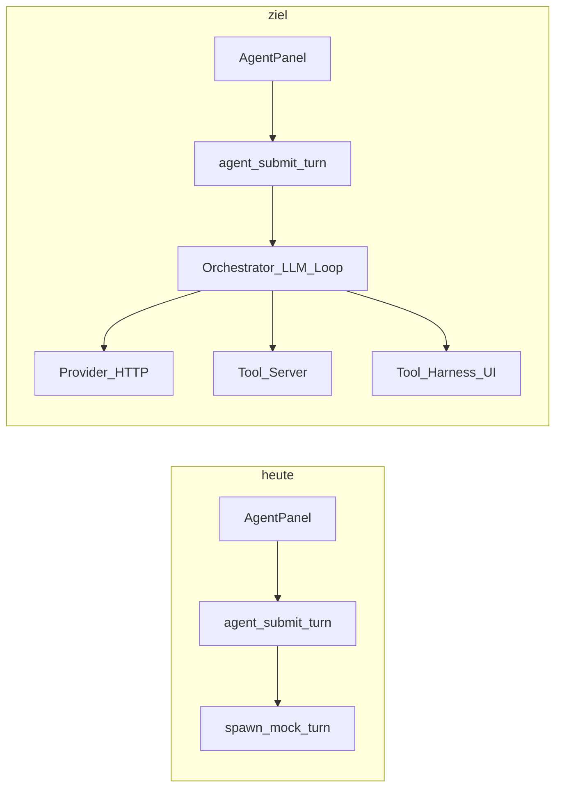

# Agent-Chat mit Harness-Settings, Provider und Tool-Calls

## Ausgangslage

- **UI**: [`src/workbench/agent_panel.rs`](src/workbench/agent_panel.rs) sendet [`UserTurn`](src/agent_wire.rs) per [`agent_submit_turn`](src/tauri_bridge.rs) und pollt mit [`agent_drain_turn`](src/tauri_bridge.rs) bis `Done`/`Error`. Transcript/Tool-Zeilen sind rudimentär; es gibt **keine** Anbindung an Provider/Modell aus den Settings.
- **Backend**: [`src-tauri/src/agent/session_orchestrator.rs`](src-tauri/src/agent/session_orchestrator.rs) ruft ausschließlich [`spawn_mock_turn`](src-tauri/src/agent/orchestrator.rs) — simulierte Deltas, `READ:`-Inline-Pfad, [`ScopedReadOps`](src-tauri/src/agent/tools.rs) nur wenn `workspace_root` gesetzt. [`src-tauri/src/agent/provider.rs`](src-tauri/src/agent/provider.rs) ist noch Stub (Anthropic-Env-Key), **ohne** Nutzung von [`AgentProviderSettings`](src-tauri/src/agent_settings.rs) (OpenRouter/Anthropic/OpenAI + Keyring).
- **Settings-UI**: [`AgentProviderPane`](src/workbench/harness_ui.rs) lädt/speichert Provider, `model_id`, `thinking_level` via `agent_settings_*` — das ist die Quelle für Modellwahl; sie ist vom Agent-Lauf **entkoppelt**.
- **Workspace**: [`WorkbenchService`](src/workbench/state.rs) kennt `active_id`, `WorkspaceEntry.cwd`, `slot_ids` / `slot_agent_labels`. Der Agent nutzt heute nur [`harness_workspace_root()`](src/workbench/agent_panel.rs) als `workspace_root` — **nicht** zwingend den CWD des aktiven Workspaces. Ein **„Terminal-Slot nachträglich hinzufügen“**-API fehlt (Slots entstehen primär über den Inline-Wizard / `commit_inline_configure`); `close_terminal` existiert, aber kein symmetrisches `append_terminal_slot`.

---

## 1. Workspace-Kontext und Sandboxing („nur geöffneter Workspace“)

**Ziel**: Jeder Turn bezieht sich standardmäßig auf den **aktiven** Workspace (`active_id` → `cwd`), nicht nur auf den Harness-Sandbox-String in localStorage.

- **Protokoll / Payload**: `UserTurn` in [`src/agent_wire.rs`](src/agent_wire.rs) und [`src-tauri/src/agent/protocol.rs`](src-tauri/src/agent/protocol.rs) erweitern um z. B. `active_workspace_id: Option<u64>`, `workspace_cwd: Option<String>` (kanonischer/verifizierter Pfad aus dem UI). `workspace_root` für Datei-Tools = **`workspace_cwd` falls gesetzt**, sonst weiterhin optionaler Harness-Root (Abwärtskompatibilität).
- **UI**: In [`submit_turn`](src/workbench/agent_panel.rs) `active_id` + zugehöriges `cwd` lesen. **Effektiver Tool-Root** (Priorität): nicht-leerer `workspace_cwd` des aktiven Workspaces → sonst persistierter Harness-Sandbox-Pfad → sonst **AppData-Spielwiese** (siehe unten; nach Phase A nie „stilles Nirgendwo“). Bei leerem `cwd` kein Zugriff auf fremde Pfade außerhalb dieser Kette.
- **System-/Developer-Prompt** (serverseitig, fest im Orchestrator): Kurzer, nicht verhandelbarer Block: *Arbeite nur unter dem mitgelieferten Workspace-Pfad; andere Repos/Verzeichnisse nur, wenn der Nutzer das ausdrücklich verlangt; keine Annahmen über Pfade außerhalb.* Zusätzlich: Tool-Argumente für Pfade immer relativ zum Workspace-CWD validieren (bestehendes [`WorkspaceRootGuard`](src-tauri/src/agent/tools.rs)-Muster wiederverwenden, Root = aktivierter CWD).

### Sandbox-Pfad im Harness („Workspace / sandbox root“) — Rolle

Der Wert in [`harness_workspace_root`](src/workbench/state.rs) (localStorage-Key [`HARNESS_WORKSPACE_ROOT_KEY`](src/config/app.config.rs)) ist **nicht** dasselbe wie der CWD eines konkreten Sidebar-Workspaces, erfüllt aber drei Funktionen:

1. **Agent-Dateizugriff (heute / Fallback)**: [`agent_panel.rs`](src/workbench/agent_panel.rs) übergibt ihn als `workspace_root` an Tauri; [`ScopedReadOps`](src-tauri/src/agent/tools.rs) erlaubt Reads nur unter diesem Root. **Ohne** gesetzten Pfad greifen Read-Tools nicht sinnvoll — der Sandbox-Pfad ist damit die **technische Obergrenze** für serverseitige Pfad-Tools, solange kein schärferer `workspace_cwd` aus dem aktiven Workspace mitläuft.
2. **Wizard-Voreinstellung**: [`create_workspace_wizard.rs`](src/workbench/create_workspace_wizard.rs) nutzt denselben Wert als Start für `cwd_display` — praktischer Default für neue Workspaces.
3. **Klarheit für Nutzer**: Sichtbarer „Home“-Ordner für Harness/Agent-Spielwiese vs. beliebiges Dateisystem.

**Priorität für den geplanten Agenten**: Zuerst **`workspace_cwd` des aktiven Workspaces** (echtes Repo) als Root für Tools und Prompt; der Harness-Sandbox-Pfad bleibt **Fallback**, wenn noch kein Workspace mit gesetztem `cwd` aktiv ist (oder für reine Sandbox-Szenarien).

### AppData-Spielwiese — **Pflicht in Phase A** (nicht optional)

Ziel: Out-of-the-box **geprüfte** Spielwiese: Ordner existiert, ist persistiert sichtbar, und Agent/Wizard können sofort darunter arbeiten, ohne dass der Nutzer zuerst einen Pfad tippt.

- **Pfad**: Deterministischer Unterordner unter `app.path().app_data_dir()` (Tauri), z. B. `{app_data}/sandbox`, per `create_dir_all` idempotent.
- **Backend**: Command z. B. `harness_ensure_default_sandbox() -> String` (Pfad zurück + Ordner anlegen) **oder** gleichwertig beim ersten Aufruf aus dem Frontend; Fehler sauber nach UI propagieren.
- **Frontend**: Beim App-/Workbench-Start: wenn `read_local_storage(HARNESS_WORKSPACE_ROOT_KEY)` leer → Command aufrufen → `persist_harness_workspace_root` + Harness-„Workspace / sandbox root“-Feld zeigt den Pfad ([`harness_ui.rs`](src/workbench/harness_ui.rs)).
- **Abnahme Phase A**: (1) Frische Installation: Feld ist befüllt, Ordner auf Platte vorhanden. (2) `READ:` / Scoped Reads im Agent funktionieren ohne manuelle Sandbox-Eingabe, solange kein anderer Workspace-CWD Vorrang hat. (3) Neuer-Workspace-Wizard übernimmt denselben Default ([`create_workspace_wizard.rs`](src/workbench/create_workspace_wizard.rs)).
- **Hinweis**: Spielwiese ≠ Git-Repo — für echtes Repo weiterhin Workspace-CWD setzen; die Kette oben regelt Vorrang.

---

## 2. Harness-Settings in den Agent-Lauf einbinden

- Beim Start eines Turns (in Tauri, nicht im WASM): **persistierte** [`AgentProviderSettings`](src-tauri/src/agent_settings.rs) laden (gleiche Quelle wie `agent_settings_get`), API-Keys aus Keyring wie bei den bestehenden Commands.
- **Modell/Provider**: Request an OpenRouter bzw. provider-spezifische Chat-Completions-API mit `model_id` aus Settings.
- **Kein Thinking in der Antwort**: `thinking_level` aus Settings für APIs nutzen, die „Reasoning“/Thinking-Blöcke kennen (z. B. auf **Off** mappen oder entsprechende API-Flags setzen). Zusätzlich: Stream-Parser so, dass **nur** sichtbare Assistenz-Inhalte als `AssistantDelta` emittiert werden — keine separaten „Thinking“-Kanäle ins UI ([`apply_agent_event`](src/workbench/agent_panel.rs)).

---

## 3. Agent-Schleife mit Tool-Calls (Architektur)

Heute endet ein Turn, sobald der Mock fertig ist; es gibt **keine** Rückkopplung vom UI in die laufende LLM-Konversation.

**Empfohlenes Muster** (ein Turn = eine Session mit mehreren LLM-Runden):

1. Orchestrator hält **Konversationszustand** (Messages + Tool-Results) pro Turn in [`AgentEngineState`](src-tauri/src/agent/state.rs) oder separatem `TurnSession`-Struct (Mutex), bis `Done`.
2. LLM-Antwort wird gestreamt: weiterhin `AssistantDelta` / `ToolCall` über die bestehende Queue ([`agent_poll_events`](src-tauri/src/commands.rs)).
3. **Tool-Typen** (explizit im Code, nicht nur freier String):
   - **Server-Tools** (Rust): z. B. erweiterte Reads/Listings unter Workspace-CWD, ggf. später `git_status` — Ausführung in Tauri, danach `ToolResult` in die Queue. **Memory-Server-Tools** (siehe Abschnitt 8 — Harness-Memory): dünne Wrapper um die bestehenden Funktionen in [`src-tauri/src/memory.rs`](src-tauri/src/memory.rs) (nicht die Logik duplizieren); `workspace_cwd` muss mit dem effektiven Agent-Workspace übereinstimmen (absolute Pfade, Verzeichnis existiert — gleiche Regeln wie `validate_workspace_cwd` dort).
   - **Harness-Tools** (UI): z. B. `harness.open_terminal` mit Args `{ "agentSlug": "claude" | "codex" | … | null }`. Backend emittiert nur `ToolCall` und setzt Turn in **„wartet auf Client“**; Frontend führt Aktion auf [`WorkbenchService`](src/workbench/state.rs) aus und ruft neues Command **`agent_submit_tool_result`** (oder ähnlich) mit `callId`/`tool`/`ok`/`message` auf; Orchestrator hängt Result an Messages an und **ruft das Modell erneut** auf.
4. **Draining**: [`agent_drain_turn`](src/tauri_bridge.rs) bleibt grundsätzlich; ggf. kurze Pause wenn Queue leer und State „pending_client_tool“, damit nicht CPU-spinnend — oder explizites `Wake`-Event nach `agent_submit_tool_result`.

[`dispatch_user_turn`](src-tauri/src/agent/session_orchestrator.rs) wird zur echten Facade: Settings laden → Turn-Session anlegen → ersten LLM-Call starten (async), Mock optional als Fallback ohne Key.

---

## 4. Harness-spezifische Tools (Beispiel: neues Terminal)

**Fachlich**: „Neues Terminal zum Workspace“ = neuer **Slot** (neues Rasterfeld), mit optionalem CLI-Agent (`WORKSPACE_FLEET_AGENT_SLUGS` in [`state.rs`](src/workbench/state.rs): `claude`, `codex`, …).

**Workbench-API** (neu, in [`src/workbench/state.rs`](src/workbench/state.rs)):

- `append_terminal_slot(workspace_id, agent_slug: Option<String>)` (oder fester Empty-String für „reines Shell“): erhöht `terminal_count` wo sinnvoll, weist neue `slot_id` via `next_terminal_id` zu, `slot_agent_labels.push(...)`, `slot_pane_states.push(SlotPaneState::default_for_slot(...))`, Grid-Dimensionen via bestehende `set_count_and_dims`-Logik analog zu `commit_inline_configure`.
- Grenzen: max. Slots (z. B. 16 wie im Wizard) und kein Aufruf während `configuring == true` (klarer Fehler-`ToolResult`).

**Frontend-Handler**: In [`agent_panel.rs`](src/workbench/agent_panel.rs) (oder ausgelagert in `src/workbench/agent_tools.rs` gemäß [`.agents/rules/rule-no-monolith-structure.md`](.agents/rules/rule-no-monolith-structure.md)) auf `ToolCall` matchen, `WorkbenchService` mutieren, dann `agent_submit_tool_result`.

**Terminal-Verhalten**: Bestehendes Auto-Launch in [`terminal_cell.rs`](src/workbench/terminal_cell.rs) (`format!("{slug}\r")`) nutzt den Slug — für „ohne CLI-Agent“ leeres Label / kein Auto-Launch definieren (falls noch nicht sauber getrennt, explizit festziehen).

---

## 5. Provider-Implementierung (kurz, technisch)

- Neues Modul z. B. `src-tauri/src/agent/openrouter.rs` / `anthropic_chat.rs` (klein halten): HTTP mit `reqwest`, Streaming-Chunk-Parser, Abbildung auf `AssistantDelta` + strukturierte `ToolCall`s (je nach API: OpenAI-kompatibles `tool_calls` vs. Anthropic `tool_use`).
- **Secrets**: Nur Keyring + bestehende [`agent_settings`](src-tauri/src/agent_settings.rs)-Hilfen; niemals Keys ins WASM.
- **Fehlerfälle**: Rate Limits, leeres Modell, fehlender Key → `AgentEvent::Error` + `Done`.

---

## 6. UI/UX und Transparenz

- Chat-Log: User-Nachricht + gestreamte Antwort beibehalten; Tool-Zeilen aus [`activity`](src/workbench/agent_panel.rs) verbessern (optional strukturiert: Tool-Name, Args-Kurzform, Ergebnis).
- Rechts-Panel bleibt in [`right_panel.rs`](src/workbench/right_panel.rs) eingebunden — keine neue Registerkarte nötig.
- Optional: kleiner Hinweis im Agent-Panel „Modell: … (Harness)“, aus `agent_settings_get` beim Mount — reduziert Verwirrung, ob Settings greifen.

---

## 7. Sicherheit und Governance

- Alle **Pfad**-Tools: nur unter validiertem `workspace_cwd` (symlink-/`..`-Härtung wie in [`tools.rs`](src-tauri/src/agent/tools.rs)).
- **Harness-Tools**: nur Aktionen, die das UI ohnehin darf (kein beliebiges `eval`); keine freien Shell-Befehle aus dem Modell ohne separates, später zu definierendes Risiko-Review.
- **Expliziter Fremd-Workspace**: nur wenn Nutzer es im Prompt fordert — trotzdem technisch optional zweites Feld `override_workspace_root` nur setzen, wenn UI eine explizite Bestätigung einführt (sonst Policy rein promptbasiert lassen).
- **Memory-Schreibzugriff**: `memory_write` / `memory_create` nur mit Größen-/Rate-Limits und gleicher Pfad-Sandbox wie in `memory.rs` (bereits gegen Escape aus `.blxcode/memory` gehärtet).

---

## 8. Harness-Memory (`.blxcode/memory`) und Agent

**Ist-Zustand**: Workspace-scoped Obsidian-artige Notizen unter `<workspace_cwd>/.blxcode/memory/` ([`src-tauri/src/memory.rs`](src-tauri/src/memory.rs), Konstante `MEMORY_REL`). Alle Tauri-Commands nehmen `workspace_cwd: String`, validieren absolutes existierendes Verzeichnis, legen bei Bedarf `.blxcode/memory` an. Das UI ([`memory_panel.rs`](src/workbench/memory_panel.rs)) nutzt denselben Scope wie der aktive Sidebar-Workspace (`current_workspace_cwd` → `memory_list` / `memory_read` / … in [`tauri_bridge.rs`](src/tauri_bridge.rs)).

**Bereits registrierte Commands** (Auszug, vollständig in [`src-tauri/src/lib.rs`](src-tauri/src/lib.rs)): `memory_root`, `memory_list`, `memory_read`, `memory_write`, `memory_create`, `memory_delete`, `memory_rename`, `memory_graph`, `memory_backlinks`, `memory_search`, `memory_export`, `memory_import`, `memory_install_pointers`, `memory_uninstall_pointers`, `memory_pointer_status`.

**Agent-Integration (empfohlen)**:

1. **Gleicher `workspace_cwd` wie der effektive Agent-Turn** (Prioritätskette aus Abschnitt 1): Nur so sind Datei-Reads, Git und Memory konsistent. Die AppData-Spielwiese zählt als gültiger `workspace_cwd`, sobald der Pfad existiert — dann liegt Memory automatisch unter `{sandbox}/.blxcode/memory/`.
2. **Server-Tools im Orchestrator** mappen auf dieselben Rust-Einstiege wie die Commands (interne Funktionen auslagern oder direkt aufrufen, **keine** zweite Sandbox-Implementierung). Mindest-Set für sinnvolle Agenten: `memory_list`, `memory_read`, `memory_search`; optional `memory_graph` / `memory_backlinks` (kann groß sein — truncaten); Schreibende Tools (`memory_write`, `memory_create`) erst mit klaren Limits und Nutzer-Vertrauensniveau.
3. **System-Prompt**: Kurz erklären, dass projektgebundene Notizen unter `.blxcode/memory` liegen und Wikilinks/Tags wie im Harness-Memory-Panel gelten.
4. **Harness/UI-Optional**: Tool `harness.focus_memory_tab` → [`WorkbenchService::set_right_tab(RightPanelTab::Memory)`](src/workbench/state.rs) (vgl. [`right_panel.rs`](src/workbench/right_panel.rs)). **Stale UI**: Wenn der Agent per Tauri eine Datei schreibt, sieht das offene Memory-Panel die Änderung ggf. erst nach Reload — entweder dokumentieren, leichtes `memory_reload`/`emit` Harness-Tool, oder Nutzer wechselt den Tab (Folgearbeit).

---

## 9. Umsetzungsphasen (empfohlen)

| Phase | Inhalt |
|-------|--------|
| **A** | `UserTurn` + UI: effektive Root-Kette (Workspace-CWD → Harness-Sandbox → **AppData-Spielwiese inkl. Anlage + Persistenz + UI**); System-Prompt + Root-Guard; Abnahme-Spielwiese wie oben. |
| **B** | Settings in Session-Orchestrator laden; erster echter HTTP-Stream (ein Provider, z. B. OpenRouter) ohne Tools. |
| **C** | Tool-Loop + `agent_submit_tool_result`; Server-Tool `read_workspace_file` (bestehende Logik) in generisches Tool-Schema überführen; **Memory-Server-Tools** an [`memory.rs`](src-tauri/src/memory.rs) anbinden (siehe Abschnitt 8). |
| **D** | `append_terminal_slot` + Harness-Tool `open_terminal`; Dokumentation der Tool-Liste im System-Prompt. |
| **E** | Thinking aus / UI-Filter; weiter Provider (Anthropic/OpenAI) angleichen. |
| **F** (optional) | Harness-Tool `focus_memory_tab`; Schreib-Tools/Pointer-Installer nur nach Bedarf und Risiko-Review. |

---

## 10. Wichtige Dateien (Referenz)

| Bereich | Dateien |
|---------|---------|
| UI Agent | [`src/workbench/agent_panel.rs`](src/workbench/agent_panel.rs), [`src/tauri_bridge.rs`](src/tauri_bridge.rs) |
| Protokoll | [`src/agent_wire.rs`](src/agent_wire.rs), [`src-tauri/src/agent/protocol.rs`](src-tauri/src/agent/protocol.rs) |
| Orchestrierung | [`src-tauri/src/agent/session_orchestrator.rs`](src-tauri/src/agent/session_orchestrator.rs), neu: Provider-Stream + Turn-State |
| Settings | [`src-tauri/src/agent_settings.rs`](src-tauri/src/agent_settings.rs), UI: [`src/workbench/harness_ui.rs`](src/workbench/harness_ui.rs) |
| Workspace / Terminals | [`src/workbench/state.rs`](src/workbench/state.rs), [`src/workbench/terminal_cell.rs`](src/workbench/terminal_cell.rs) |
| Tauri-Commands | [`src-tauri/src/commands.rs`](src-tauri/src/commands.rs), [`src-tauri/src/lib.rs`](src-tauri/src/lib.rs) |
| Harness-Memory | [`src-tauri/src/memory.rs`](src-tauri/src/memory.rs), [`src/workbench/memory_panel.rs`](src/workbench/memory_panel.rs), Rechts-Panel: [`src/workbench/right_panel.rs`](src/workbench/right_panel.rs) |

---

## 11. Plan-Review (Zwei-Subagente — hier manuell)

**Hinweis**: Parallele Subagenten-Reviews waren in dieser Session technisch nicht startbar (Limit). Stattdessen: Querlesen von Plan + Codepfaden (Agent, Memory, Workbench).

**Stärken des Plans**: Klare Trennung Server- vs. Harness-Tools; Root-Kette inkl. AppData-Spielwiese; bestehende Sandboxes (`tools.rs`, `memory.rs`) wiederverwenden.

**Lücken / Risiken (ergänzt)**:

- **Memory ohne Sidebar-Workspace**: Solange der Nutzer nur die Spielwiese als Harness-Pfad nutzt, aber keinen `WorkspaceEntry` mit passendem `cwd` anlegt, zeigt das Memory-Panel keinen CWD ([`current_workspace_cwd`](src/workbench/memory_panel.rs)). Der Agent kann trotzdem per Tauri mit `workspace_cwd = sandbox` arbeiten — UI und Agent sollten dieselbe effektive CWD-Quelle teilen (Plan Abschnitt 1 mit Phase A adressiert das für Reads; für Memory-Panel ggf. denselben effektiven Pfad anzeigen oder virtuellen Workspace vorschlagen).
- **Turn-State + Abbruch**: Mutex/Lifecycle von `pending_client_tool` und `agent_abort` explizit testen, damit keine Zombie-Turns entstehen.
- **I18n**: Neue Fehlertexte weiterhin in allen `locales/*.rs` ([`CLAUDE.md`](CLAUDE.md)).

**Memory ↔ Agent**: In Abschnitt 8 und Todo `memory-tools` festgehalten.
