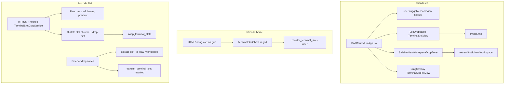
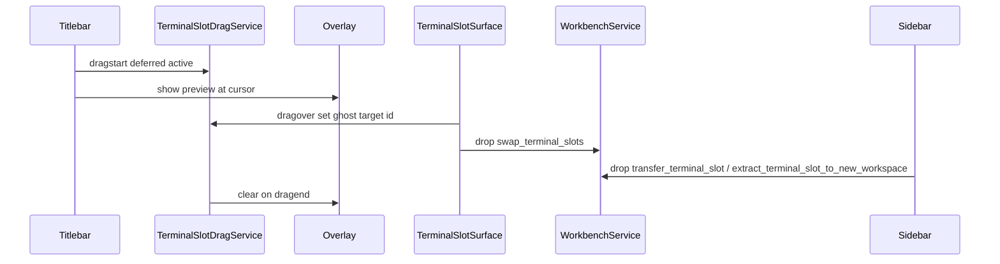

# Terminal Drag & Drop: EB-Analyse, UX-Parität und Workspace-Transfer für blxcode

## Kurzfazit

[blxcode-eb](file:///home/iptoux/Development/blxcode-eb) liefert ein **poliertes, zustandsreiches** Slot-DnD mit `@dnd-kit/core`. [blxcode](file:///home/iptoux/Development/blxcode) hat bereits **funktionierendes Grid-Reorder** per HTML5, aber eine **deutlich dünnere UX** (kleiner Grip, Grid-Ghost statt Cursor-Overlay, kein „Drop to swap“, keine Sidebar-Dropzone) und aktuell **keinen Cross-Workspace-Terminal-Transfer**. Technisch kann blxcode **kein** `@dnd-kit` nutzen (Leptos/WASM) — Parität bedeutet: **gleiche Interaktions- und State-Semantik** mit HTML5 + Leptos-Overlay nachbauen. Für die gewünschte Produkt-UX gehört zusätzlich Terminal-DnD in bestehende Workspaces zum Pflichtumfang, inklusive PTY-/Session-Adoption.

### Korrekturen aus Codeprüfung

- `TerminalSlotDragService` existiert bereits, wird aber aktuell in `WorkspaceTerminalsGrid` erzeugt (`workspace_panel.rs` ~227). Für Sidebar-Drops und ein globales Overlay muss er **einmalig in `WorkbenchShell`** erzeugt und per Context über `Sidebar`, `WorkspacePanel` und Overlay bereitgestellt werden.
- `slot_drag_enabled` ist aktuell ein **globales Grid-Gate**. Split-/Leaf-Parität darf nicht dort allein hängen, sondern braucht ein **per-slot Gate** aus `pane_ids.len() == 1`, `terminal_count > 1`, `!is_full_size`, `!is_configuring`.
- `swap_terminal_slots` darf nicht “by id” in den Vektoren suchen und dann einzelne Werte austauschen, ohne die Parallelität mitzudenken. Korrekt ist: `slot_a/slot_b -> index_a/index_b`, dann dieselben Indizes in `slot_ids`, `slot_agent_labels` und `slot_pane_states` swappen, fehlende Pane-States vorher auffüllen.
- Sidebar “Neues Workspace” und Drop auf bestehende Workspaces sind keine reinen UI-Features: Ein Slot-Umzug remountet `WorkspaceTerminalCell`; dessen Cleanup ruft heute `pty_kill`. Für echtes Cross-Workspace-DnD muss der Plan daher **PTY-/Terminal-Key-Adoption** als gemeinsamen Pflichtbaustein berücksichtigen.
- Der vorhandene i18n-Key heißt `WsTermDragHandleAria`; nicht zusätzlich `WsTermDragHandle` anlegen, sondern Text/Semantik dieses Keys anpassen, falls nötig. Das Locale-Script liegt unter `scripts/tools/render_i18n_locales_from_en.py`.



---

## 1. Tiefgreifende Analyse: blxcode-eb (Referenz)

### Stack und Orchestrierung

| Aspekt | Implementierung |
|--------|-----------------|
| Bibliothek | [`@dnd-kit/core`](file:///home/iptoux/Development/blxcode-eb/package.json) — kein `@dnd-kit/sortable` |
| Root | [`App.tsx`](file:///home/iptoux/Development/blxcode-eb/src/views/app/App.tsx): `DndContext`, `PointerSensor` mit **6px** `activationConstraint`, `closestCenter`, `DragOverlay` (180ms Drop-Animation) |
| Cursor | `document.body.style.cursor = "grabbing"` während Slot-Drag |
| Slot-Drop | `swapSlots` — **Tausch** zweier Indizes, kein Insert |
| Sidebar | `extractSlotToNewWorkspace` bei Drop auf `sidebar-new-workspace` |

### Drag-Start (Grab)

- **Handle:** gesamte **Titlebar** in [`PaneView.tsx`](file:///home/iptoux/Development/blxcode-eb/src/views/workspaces/components/terminals/PaneView.tsx) (Zeilen 89–109), zentriertes `GripHorizontal`, `cursor-grab` / `active:cursor-grabbing`
- **Aktions-Buttons:** `onPointerDown` → `stopPropagation()` (128), damit Split/Close nicht draggen
- **Erlaubt:** `canDragSlot = slot.root.kind === "leaf" && !isOnlySlot` ([`TerminalSlotView.tsx`](file:///home/iptoux/Development/blxcode-eb/src/views/workspaces/components/terminals/TerminalSlotView.tsx) 62) — Split-Kinder in [`PaneRenderer`](file:///home/iptoux/Development/blxcode-eb/src/views/workspaces/components/terminals/PaneRenderer.tsx) bekommen `canDragSlot={false}`
- **Quelle während Drag:** `opacity-40` auf draggable Pane (`draggable.isDragging`)

### Preview (das „coole“ Gefühl)

- [`TerminalSlotPreview.tsx`](file:///home/iptoux/Development/blxcode-eb/src/views/workspaces/components/terminals/TerminalSlotPreview.tsx): **schwebendes** 256px-Breite-Karten-UI (`w-64`), leichte Rotation (`-1.5deg`), Accent-Border/Ring, Platzhalter-Body statt xterm, Label + `#index`
- Gerendert nur in **`DragOverlay`** — folgt dem **Cursor**, nicht der Grid-Zelle

### Drop-Zonen und Feedback

[`TerminalSlotView.tsx`](file:///home/iptoux/Development/blxcode-eb/src/views/workspaces/components/terminals/TerminalSlotView.tsx):

| Zustand | CSS / UI |
|---------|----------|
| Quell-Slot (`isMyDrag`) | `opacity-40`, `scale-[0.98]`, gestrichelter Accent-Rand |
| Potenzielle Ziele (anderer Slot, gleicher WS) | `border-dashed border-accent/30`, dezenter Hintergrund |
| Hover-Ziel (`isOver`) | `ring-2 ring-accent/40`, `scale-[1.01]`, Overlay „Drop to swap“ + `ArrowLeftRight` |
| Transition | `transition-all duration-150` |

[`SidebarNewWorkspaceDropZone.tsx`](file:///home/iptoux/Development/blxcode-eb/src/views/app/layout/Sidebar/SidebarNewWorkspaceDropZone.tsx): gestrichelter Rahmen über der Workspace-Liste, `Plus`-Hint, `workspace.dropToCreate`, nur sichtbar wenn `active.kind === "slot"`.

### State

[`useWorkspaces.ts`](file:///home/iptoux/Development/blxcode-eb/src/views/workspaces/hooks/useWorkspaces.ts) 400–492: `swapSlots`, `extractSlotToNewWorkspace` (bricht ab wenn `slots.length <= 1`).

### i18n (EB)

`workspace.terminals.dragHandle`, `dropHere`, `dragging`, `dragHandleDisabled`, `workspace.dropToCreate` — siehe [`en_US.json`](file:///home/iptoux/Development/blxcode-eb/src/views/i18n/locales/en_US.json).

---

## 2. Tiefgreifende Analyse: blxcode (Ist)

### Stack

| Aspekt | Implementierung |
|--------|-----------------|
| API | Native **HTML5** `DragEvent` / `DataTransfer` |
| Modul | [`terminal_slot_dnd.rs`](file:///home/iptoux/Development/blxcode/src/workbench/terminal_slot_dnd.rs) |
| UI | [`workspace_panel.rs`](file:///home/iptoux/Development/blxcode/src/workbench/workspace_panel.rs), [`terminal_cell.rs`](file:///home/iptoux/Development/blxcode/src/workbench/terminal_cell.rs) |
| State | [`reorder_terminal_slots`](file:///home/iptoux/Development/blxcode/src/workbench/state.rs) → `reorder_workspace_slots` (**remove + insert**) |
| WebKit | Kein `setDragImage`; `active` per deferred `TimeoutFuture(0)` nach `dragstart` |

### Drag-Start

- Nur **kleines** `LuGripVertical` in [`.ws-term-cell__drag-handle`](file:///home/iptoux/Development/blxcode/styles.css) (6208+), nicht die ganze Titlebar
- **Jede Split-Pane** hat einen eigenen Handle, alle ziehen dieselbe `slot_id` (kein EB-„nur Root-Leaf“-Gate)
- Kein globaler `grabbing`-Cursor am `body`

### Preview

- [`TerminalSlotGhost`](file:///home/iptoux/Development/blxcode/src/workbench/workspace_panel.rs) (1162+): **absolut im Grid** positioniert (`ghost_style` Prozent-Math), zeigt Titel/Badge **in der Zielzelle** — folgt **nicht** dem Cursor
- Quelle: nur `opacity: 0.55` (`.ws-term-slot--drag-source`)

### Drop-Feedback

- Ziel: nur `.ws-term-slot--drag-over` (3px dashed outline)
- **Fehlt:** gestrichelte „potenzielle Ziele“ auf allen anderen Slots, Ring/Scale, Text-Overlay „Drop to swap“
- **Fehlt:** Sidebar-Dropzone für Terminals
- **Fehlt:** `dragleave` außerhalb — Ghost bleibt bis `clear`

### Sidebar

[`sidebar.rs`](file:///home/iptoux/Development/blxcode/src/workbench/sidebar.rs): nur **Workspace-Reorder** (`text/plain` workspace-id), kein Terminal-MIME. Aktuell kann ein Terminal daher **nicht** per DnD in einen anderen Workspace geschoben werden.

### Bereits vorbereitet, ungenutzt

- Plan [`.agents/plans/terminal-grid-drag-drop.md`](file:///home/iptoux/Development/blxcode/.agents/plans/terminal-grid-drag-drop.md): Transfer, PTY-Adoption, Notifications
- i18n: `WsTermDropCreateNewAria`, `WsTermDragMaxSlots` in [`keys.rs`](file:///home/iptoux/Development/blxcode/src/i18n/keys.rs) — noch nicht verdrahtet

---

## 3. UX-Lücken (priorisiert für 1:1)

| # | EB-Verhalten | blxcode heute | Priorität |
|---|--------------|---------------|-----------|
| 1 | Cursor-following `DragOverlay`-Karte | Grid-Ghost | **P0** |
| 2 | Ganze Titlebar + GripHorizontal zentriert | Nur Grip-Icon links | **P0** |
| 3 | 3 Slot-Zustände + „Drop to swap“-Banner | Nur source + over outline | **P0** |
| 4 | **Swap** statt Insert-Reorder | Insert | **P0** |
| 5 | Sidebar „Neues Workspace“-Dropzone | fehlt | **P0** |
| 6 | Drag nur bei ≥2 Slots, disabled bei Splits | Handle auf jedem Pane | **P1** |
| 7 | `body { cursor: grabbing }` | fehlt | **P1** |
| 8 | Drop-Animation / easing | keins | **P2** (CSS transition auf Overlay hide) |
| 9 | Transfer → bestehendes WS | fehlt / nur im alten Plan | **P0/P1 Pflicht** |

### Preview beim Ziehen — enthalten (Kernfeature, P0)

Die **kleine statische Karte am Cursor** ist **explizit Phase A1** (`TerminalSlotDragOverlay`), 1:1 angelehnt an EB [`TerminalSlotPreview.tsx`](file:///home/iptoux/Development/blxcode-eb/src/views/workspaces/components/terminals/TerminalSlotPreview.tsx) + [`DragOverlay`](file:///home/iptoux/Development/blxcode-eb/src/views/app/App.tsx):

- Feste Breite (~16rem), leichte Rotation, Accent-Border/Ring, Titlebar (Grip + Label + `#index`)
- Body: Icon + Text „Moving terminal…“ (`WsTermDragging`) — **kein** live xterm (EB macht das auch so)
- `position: fixed`, folgt `drag`-Events (`client_x` / `client_y` + Offset), `z-index` über Grid/Sidebar
- Quell-Slot bleibt halbtransparent im Grid (`.ws-term-slot--drag-source`)

**Verwechslung vermeiden:** In A3 heißt „Overlay-Hint“ nur das **Drop-Banner im Ziel-Slot** („Drop to swap“), nicht die Drag-Preview.

#### Warum nicht `DataTransfer.setDragImage()`?

| API | Rolle | Im Plan? |
|-----|--------|----------|
| **`setDragImage()`** | Browser-eigenes Drag-Ghost-Bild (ein Canvas/IMG, den das OS mitzieht) | **Nein** — in Tauri/WebKitGTK kann das `dragstart` abbrechen oder crashen (deshalb schon heute tabu in blxcode) |
| **`DragOverlay` (EB)** / **`TerminalSlotDragOverlay` (blxcode)** | Normales DOM-Element, per CSS unter dem Cursor positioniert | **Ja — das ist die gewünschte Preview** |

EB nutzt **ebenfalls kein** `setDragImage`, sondern `@dnd-kit` **`DragOverlay`**. Unser Äquivalent ist eine Leptos-Komponente + `drag`-Listener — gleiches Ergebnis für den Nutzer, ohne WebKit-Risiko.

**Nur ausgeschlossen:** echtes xterm *inside* der Preview (unnötig + schwer); statische Karte ist gewollt und in EB identisch.

---

## 4. Architektur-Entscheidung für blxcode

**@dnd-kit nicht portieren.** Stattdessen:

1. **HTML5 DnD behalten** (bestehende WebKit-Workarounds, MIME `application/x-blxcode-terminal-slot`).
2. **`TerminalSlotDragService` nach [`WorkbenchShell`](file:///home/iptoux/Development/blxcode/src/workbench/mod.rs) hoisten** — ein globaler Kontext wie `DndContext` in EB (Grid + Sidebar + Overlay). Das lokale `provide_context(slot_dnd)` in `workspace_panel.rs` entfernen, damit es keinen Schatten-Context gibt.
3. **Neue Komponente `TerminalSlotDragOverlay`** (fixed, `pointer-events: none`, Position aus `drag`-Event `client_x/y` mit Offset).
4. **Slot-Chrome** auf `TerminalSlotSurface`-Ebene (nicht pro Pane): EB-äquivalente CSS-Klassen + optionales Hint-`div`.
5. **Semantik:** `swap_terminal_slots` ergänzen; Grid-Drop ruft Swap; optional Reorder-Helper deprecaten oder intern auf Swap mappen wo äquivalent.
6. **Cross-Workspace-Semantik:** `transfer_terminal_slot` und `extract_terminal_slot_to_new_workspace` nutzen denselben Move-/Adopt-Unterbau, damit laufende PTYs, Session-Keys und Notifications erhalten bleiben.



---

## 5. Implementierungsplan

### Phase A — EB-Parität (P0/P1)

#### A1 — Globaler DnD-Kontext + Floating-Preview (ersetzt `setDragImage` / EB `DragOverlay`)

**Lieferumfang:** sichtbare **statische Terminal-Karte unter dem Cursor** während des gesamten Drags — das Haupt-UX-Ziel aus EB.

- `TerminalSlotDragService` in `WorkbenchShell` erzeugen und `provide_context`; aus `WorkspaceTerminalsGrid` entfernen.
- Modulregistrierung ergänzen: `mod terminal_slot_drag_overlay;` in `workbench/mod.rs`.
- Neue Felder: `overlay_pos: RwSignal<Option<(f64, f64)>>`, optional `phase: RwSignal<DragOverlayPhase>` für Exit-Animation.
- `terminal_slot_drag_overlay.rs` — 1:1-Inhalt wie `TerminalSlotPreview`:
  - Klassen z. B. `.ws-term-drag-preview` (fixed, `pointer-events: none`, `w-64`, `rotate(-1.5deg)`, accent border + ring, backdrop-blur)
  - Titlebar: Grip-Icon, `meta.title`, `#{grid_index + 1}`
  - Body: Terminal-Icon + `WsTermDragging`
- Mount in `WorkbenchShell` **als Sibling nach** `<main class="container app-shell workbench-root">` (portal-äquivalent, immer sichtbar auch über Sidebar/RightPanel, vor `ToastHost` ok).
- `window`/`document` `dragover`- oder `drag`-Listener (in `Effect` bei `active.is_some()`): `overlay_pos` aus `DragEvent::client_x/y` (-~half width für Zentrierung). Nur Werte übernehmen, wenn `client_x/client_y` plausibel > 0 sind; WebKit kann am Ende eines Native-Drags 0/0 liefern.
- Zusätzlich in bestehenden `dragover`-Handlern von Slot/Sidebar `slot_dnd.set_overlay_pos_from_event(&de)` aufrufen. Native HTML5-DnD unterdrückt normale `pointermove`-Events, also nicht auf Pointer-Tracking bauen.
- `dragend` / `drop` / `clear()`: Overlay ausblenden mit ~180ms CSS transition (EB `dropAnimation`). `clear()` darf die Preview-Daten nicht sofort löschen, wenn eine Exit-Animation sichtbar sein soll; entweder `phase=Dropping` + Timeout oder ohne Exit-Animation sofort entfernen.
- **`setDragImage` bewusst nicht** — Preview kommt ausschließlich aus dieser DOM-Komponente.
- **`TerminalSlotGhost` im Grid entfernen** — war der falsche Ansatz (Karte in Zielzelle statt am Cursor); durch A1 ersetzt.

**Dateien:** [`terminal_slot_dnd.rs`](file:///home/iptoux/Development/blxcode/src/workbench/terminal_slot_dnd.rs), neu `terminal_slot_drag_overlay.rs`, [`workbench/mod.rs`](file:///home/iptoux/Development/blxcode/src/workbench/mod.rs), [`workspace_panel.rs`](file:///home/iptoux/Development/blxcode/src/workbench/workspace_panel.rs), [`styles.css`](file:///home/iptoux/Development/blxcode/styles.css).

#### A2 — Titlebar als Drag-Handle (wie `PaneView`)

- In [`terminal_cell.rs`](file:///home/iptoux/Development/blxcode/src/workbench/terminal_cell.rs): `draggable` + `dragstart`/`dragend` von `.ws-term-cell__drag-handle` auf **`.ws-term-cell__head`** verlagern oder eine neue `.ws-term-cell__titlebar-drag-zone` innerhalb des Headers einziehen. Bestehender Header heißt nicht `titlebar`.
- Zentriertes `LuGripHorizontal` in der Header-Zone (EB-Layout), `LuGripVertical` ersetzen.
- Action-Buttons (`TerminalSlotHandoffButton`, Fullscreen, Split, Close) müssen `prop:draggable=false` und `on:mousedown=stop_propagation` bekommen, sonst startet Drag vom draggable Header.
- Drag-Gate als `can_drag_slot` aus `WorkspacePanel` nach `WorkspaceTerminalCell` reichen:
  - `slot_drag_enabled` global: nicht configuring, Sidebar nicht collapsed, kein Fullscreen.
  - `can_drag_slot` per Slot: global Gate **und** `workspace.slot_ids.len() > 1` **und** `pane_ids.len() == 1` **und** `!is_full_size`.
  - Split-Panes zeigen disabled Handle/Tooltip oder keinen Handle, aber dürfen keinen Drag starten.

#### A3 — Drei Zustände + „Drop to swap“ auf Slot-Wrapper

- In `TerminalSlotSurface` Klassen ergänzen:
  - `--drag-source` (opacity ~0.4, scale ~0.98, dashed border)
  - `--drag-potential` (dashed accent/30 auf **allen** anderen Slots desselben WS während Drag)
  - `--drag-over` (ring, scale ~1.01)
- Overlay-Hint im Slot (absolute bottom, `ArrowLeftRight`-Icon via `icondata`, Text aus neuem i18n-Key `WsTermDropHere`).
- `is_potential_target`: `active.workspace_id == workspace_id && active.slot_id != slot_id` (Memo auf `slot_dnd.active`).
- Bei `dragenter`/`dragover` die Drop-Erlaubnis nicht nur vom globalen `slot_drag_enabled` abhängig machen. Ziel-Slot darf nur annehmen, wenn Quelle und Ziel im selben Workspace liegen, Ziel nicht Source ist und aktiver Drag ein Terminal-Slot ist.

#### A4 — Swap-Semantik

- In [`state.rs`](file:///home/iptoux/Development/blxcode/src/workbench/state.rs):

```rust
pub fn swap_terminal_slots(&self, workspace_id: u64, slot_a: u64, slot_b: u64) {
    // resolve ids to indices, normalize slot_pane_states length, then swap all parallel vectors
}
```

- `TerminalSlotSurface::on:drop` → `swap_terminal_slots` statt `reorder_terminal_slots`.
- `reorder_terminal_slots` nicht zwingend löschen: Workspace-Reorder und alte Tests können bleiben. Grid-Drop nutzt aber nur noch Swap.
- Unit-Test: drei Slots, `swap_terminal_slots(1, 1, 3)` ergibt IDs `[3,2,1]`, Labels und Pane-States tauschen dieselben Indizes.
- Unit-Test: fehlende `slot_pane_states` werden vor Swap mit `SlotPaneState::default_for_slot(slot_id)` normalisiert, damit kein Parallelvektor auseinanderläuft.

#### A5 — Sidebar: „Neues Workspace“

- Wrapper um Workspace-Liste in [`sidebar.rs`](file:///home/iptoux/Development/blxcode/src/workbench/sidebar.rs) (wie `SidebarNewWorkspaceDropZone`).
- `TerminalSlotDragService` per `expect_context` in `Sidebar`.
- `dragenter`/`dragover`: `is_terminal_drag` oder `slot_dnd.active`; `drop`: `extract_terminal_slot_to_new_workspace(workspace_id, slot_id)` in `state.rs` (analog EB 449–492: Quelle muss >1 Slot haben, neues WS, Fokus wechseln).
- CSS: gestrichelter inset-Rahmen + Bottom-Hint (`WsTermDropCreateNewAria` / neuer Key `WsWorkspaceDropToCreate` aligned mit EB `dropToCreate`).
- `body.cursor` grabbing via Effect auf `slot_dnd.active`.
- Minimale Preserve/Adopt-Arbeit für A5:
  - State-Operation muss Slot-ID, Agent-Label und `SlotPaneState` aus Quelle entfernen und in ein neu erzeugtes Workspace übernehmen.
  - Während des Umzugs darf `WorkspaceTerminalCell`-Cleanup die zugehörigen PTYs nicht killen. Dafür braucht `WorkbenchService` einen kurzlebigen `pending_slot_move`/`adopted_terminal_keys`-Mechanismus oder eine `TerminalMoveGuard`-Map.
  - Neue `terminal_key`s nutzen `storage_key` des neuen Workspaces (`{storage_key}:{slot_id}:{pane_id}`). Daher müssen Live-PTY-Registry, Fokus-Key, unread counts und Session/Notification-Dateien entweder umgeschrieben oder bewusst als Phase-B-Risiko markiert werden. Für A5 mindestens Live-PTY-Registry + Fokus-Key umschreiben, damit laufende Terminals nicht sterben.
  - Wenn diese Preserve/Adopt-Arbeit nicht umgesetzt wird, A5 als UI-Dropzone **nicht aktivieren**. Der Move-/Adopt-Unterbau aus Phase B ist Pflicht vor aktivem Cross-Workspace-Drop.

#### A6 — i18n

Neue/anzupassende Keys in [`keys.rs`](file:///home/iptoux/Development/blxcode/src/i18n/keys.rs) + **alle** `locales/*.rs`:

- `WsTermDropHere` („Drop to swap“ / DE „Ablegen zum Tauschen“)
- `WsTermDragging` („Moving terminal…“)
- vorhandenen `WsTermDragHandleAria` weiterverwenden oder Text ändern (Titlebar-Tooltip, EB `dragHandle`)
- `WsTermDragHandleDisabled` (Splits / einziger Slot)
- `WsWorkspaceDropToCreate` (Sidebar)

Script-Hinweis: nach `en_us.rs` ggf. `scripts/tools/render_i18n_locales_from_en.py` für fehlende Keys.

---

### Phase B — Pflicht: Cross-Workspace-Transfer

Aus [`.agents/plans/terminal-grid-drag-drop.md`](file:///home/iptoux/Development/blxcode/.agents/plans/terminal-grid-drag-drop.md), aber nicht mehr optional: Terminal-DnD muss sowohl in ein **neues Workspace** als auch in ein **bestehendes Workspace** funktionieren. Phase B ist daher Pflichtumfang der Umsetzung, nicht “später nice-to-have”.

#### B0 — Gemeinsamer Move-/Adopt-Unterbau

Alle Slot-Umzüge (`extract_terminal_slot_to_new_workspace`, `transfer_terminal_slot`) müssen denselben Unterbau nutzen, damit es keinen Sonderfall gibt, bei dem laufende PTYs sterben.

- Neuer interner Move-Typ, z. B.:

```rust
struct TerminalSlotMove {
    from_workspace_id: u64,
    to_workspace_id: u64,
    old_storage_key: String,
    new_storage_key: String,
    old_slot_id: u64,
    new_slot_id: u64,
    pane_ids: Vec<u64>,
    agent_slug: String,
}
```

- `WorkbenchService` braucht eine kurzlebige MoveGuard-/Adopt-Map:
  - markiert alte `terminal_key`s (`old_storage_key:old_slot_id:pane_id`) als “moving”
  - liefert dem neu gemounteten `WorkspaceTerminalCell` die bestehende PTY-Session für den neuen Key
  - verhindert im alten Cell-Cleanup `pty_kill`, solange der Key als moving/adoptable markiert ist
- Live-Registry umschreiben:
  - `pty_sessions`: alte Keys entfernen, neue Keys mit gleicher `session_id` eintragen
  - `focused_terminal_by_workspace`: Fokus vom alten Key auf neuen Key umbiegen
  - `terminal_unread_counts`: alte Keys auf neue Keys migrieren
- State-Operationen müssen `slot_ids`, `slot_agent_labels`, `slot_pane_states`, `terminal_count`, Grid-Dims und aktives Workspace konsistent aktualisieren.
- Nach erfolgreicher Adoption MoveGuard entfernen; bei Abbruch/Fehler MoveGuard ebenfalls bereinigen und DnD-State clearen.

#### B1 — State `transfer_terminal_slot`

- Signatur: `transfer_terminal_slot(from_workspace_id, to_workspace_id, slot_id) -> Result<TerminalSlotMove, String>` oder äquivalente Rückgabe für die Adopt-Schicht.
- Validierung:
  - `from_workspace_id != to_workspace_id`
  - Quelle existiert und hat mehr als einen Slot
  - Slot existiert in Quelle
  - Ziel existiert und hat weniger als 16 Slots
  - Ziel ist kein Shell-/ephemeres Workspace, falls solche Einträge in der Sidebar sichtbar werden könnten
- Umsetzung:
  - Agent-Label und `SlotPaneState` aus Quelle entfernen
  - Ziel-Slot-ID erzeugen über `target.next_terminal_id` (keine ID-Kollision mit Ziel)
  - Slot ans Ende des Ziel-Workspace anhängen
  - `target.set_count_and_dims(target.slot_ids.len() as u8)`
  - `source.set_count_and_dims(source.slot_ids.len() as u8)`
  - `select_workspace(to_workspace_id)` und Terminal-Tab aktiv lassen
  - `TerminalSlotMove` mit alter/neuer Key-Basis zurückgeben
- Tests:
  - erfolgreicher Transfer ändert beide Workspaces und hält Parallelvektoren synchron
  - Quelle mit einem Slot wird geblockt
  - Ziel mit 16 Slots wird geblockt
  - Slot-ID im Ziel wird neu vergeben, nicht aus Quelle blind übernommen

#### B2 — Sidebar-Drop auf Workspace-Zeilen

- `Sidebar` erhält `TerminalSlotDragService` per Context.
- In Workspace-`li` `dragenter`/`dragover`/`drop` Terminal-MIME **vor** Workspace-Reorder prüfen:
  - Wenn `TERMINAL_SLOT_MIME` vorhanden oder `slot_dnd.active.is_some()`: Terminal-Drop behandeln, `prevent_default`, `stop_propagation`
  - Workspace-Reorder nur ausführen, wenn **kein** Terminal-DnD aktiv ist
- Drop-Ziele:
  - anderer Workspace: `transfer_terminal_slot(from, target_workspace_id, slot_id)`
  - gleicher Workspace: kein Cross-Workspace-Transfer; visuell als kein gültiges Ziel behandeln und Drop als Noop clearen
  - neues Workspace Dropzone: `extract_terminal_slot_to_new_workspace`
- Klasse `.workbench-sidebar__item--terminal-drop-target` für potenzielle Ziel-Workspaces.
- Klasse `.workbench-sidebar__item--terminal-drop-over` für Hover-Ziel.
- Ziel-Workspace muss max-slot-Validierung bereits in `dragover` reflektieren, wenn möglich (`dropEffect = "none"` oder disabled Styling bei 16 Slots).
- Nach erfolgreichem Drop:
  - MoveGuard/Adopt starten
  - State transferieren
  - Session/Notification-Key-Rewrite anstoßen
  - `slot_dnd.clear()`

#### B3 — PTY + Backend

- [`terminal_cell.rs`](file:///home/iptoux/Development/blxcode/src/workbench/terminal_cell.rs):
  - Cleanup prüft vor `pty_kill`, ob der `terminal_key` gerade bewegt wird.
  - Bootstrap prüft vor neuem `pty_spawn_with_env`, ob für den neuen `terminal_key` eine adoptierbare PTY existiert.
  - Bei Adoption: `term_id`/PTY-State weiterverwenden oder xterm neu an bestehende PTY anbinden, ohne Agent neu zu starten.
- [`tauri_bridge.rs`](file:///home/iptoux/Development/blxcode/src/tauri_bridge.rs) + `src-tauri/src/workbench_state.rs`:
  - `workbench_rewrite_terminal_keys(old_keys, new_keys)` oder spezifische Commands für Sessions/Notifications.
  - `sessions.json`: Terminal-Key-Einträge von alt nach neu verschieben, damit Resume weiterhin exakt denselben Agent-Slot findet.
  - `notifications.json`: unread/notification entries von alt nach neu verschieben.
- Toasts / Fehler:
  - `WsTermDragMaxSlots` bei Ziel mit 16 Slots
  - neuer Key für letzter-Slot-Block, falls noch nicht vorhanden
  - kein Toast bei Noop-Drop auf gleichen Workspace, nur DnD-State clearen

#### B4 — Umsetzung Reihenfolge für Transfer

1. State-Transfer + Unit-Tests ohne UI.
2. MoveGuard/Adopt-Map in `WorkbenchService` + Cleanup-Gate in `terminal_cell.rs`.
3. Sidebar Workspace-Drop UI inklusive MIME-Priorität.
4. Tauri-Key-Rewrite für `sessions.json` und `notifications.json`.
5. Manuelle Tauri/WebKit-Verifikation mit laufender Shell: Befehl starten, Slot in anderes Workspace ziehen, Ausgabe/PTY bleibt aktiv.

---

## 6. Testplan

| Test | Phase |
|------|-------|
| 2+ Slots: Drag von Titlebar, Overlay folgt Cursor, Swap tauscht Positionen, PTY läuft weiter | A |
| 1 Slot: kein Drag / disabled Tooltip | A |
| Split-Pane: kein Drag, `dragHandleDisabled`-Text | A |
| Drop auf Sidebar-Zone: neues WS, Quell-WS ≥1 Slot übrig, laufende PTY bleibt erhalten | A/B |
| Sidebar Workspace-Reorder unverändert (nur `text/plain` WS-id) | A |
| Drop auf anderen WS-Zeile: Transfer, Fokus, Session-Prefix, Shell-Eingabe | B |
| Drop auf gleiches Workspace in Sidebar: Noop, kein Reorder, kein Toast, DnD-State cleared | B |
| Drop auf volles Ziel-Workspace: geblockt, PTY/State unverändert, Max-Slots-Hinweis | B |
| `cargo test --workspace` für `swap_terminal_slots` + Transfer-Validierung | A/B |
| Manuell `cargo tauri dev` auf Linux (WebKitGTK): kein Abbruch bei `dragstart`, Transfer erhält laufende PTY | A/B |

---

## 7. Risiken und Mitigationen

| Risiko | Mitigation |
|--------|------------|
| WebKit bricht bei Re-Render in `dragstart` | Deferred `try_set_active` beibehalten; Overlay-Updates in `drag`-Handler, nicht in `dragstart` |
| `setDragImage` bricht WebKit-/dragstart-Flow | Stattdessen **`TerminalSlotDragOverlay`** (DOM + `drag`-Events) — gleiche Nutzer-Preview wie EB `DragOverlay`, ohne native Ghost-API |
| Swap vs. Nutzer-Gewohnheit (bisher Insert) | 1:1 EB; kurz in CHANGELOG |
| Zwei DnD-Typen in Sidebar | MIME-Check-Reihenfolge + `stop_propagation` auf Terminal-Drop |
| Extract/Transfer killt laufende PTY beim Remount | A5/B nur mit MoveGuard/Adopt-Mechanismus aktivieren; Cross-Workspace-Drop bleibt bis dahin gegated |
| `text/plain` wird von Terminal-Drag gesetzt und kann Workspace-Reorder triggern | In Sidebar-Drops zuerst `TERMINAL_SLOT_MIME` prüfen und Terminal-Drop vollständig behandeln/stoppen; Workspace-Reorder nur wenn kein Terminal-MIME vorliegt |

---

## 8. Datei-Übersicht (Reihenfolge)

1. [`state.rs`](file:///home/iptoux/Development/blxcode/src/workbench/state.rs) — `swap_terminal_slots`, `extract_terminal_slot_to_new_workspace`, `transfer_terminal_slot`, MoveGuard-/Adopt-State
2. [`terminal_slot_dnd.rs`](file:///home/iptoux/Development/blxcode/src/workbench/terminal_slot_dnd.rs) + `terminal_slot_drag_overlay.rs`
3. [`workbench/mod.rs`](file:///home/iptoux/Development/blxcode/src/workbench/mod.rs) — globaler Context + Overlay mount
4. [`workspace_panel.rs`](file:///home/iptoux/Development/blxcode/src/workbench/workspace_panel.rs) — Slot-States, Swap-Drop, Ghost entfernen
5. [`terminal_cell.rs`](file:///home/iptoux/Development/blxcode/src/workbench/terminal_cell.rs) — Titlebar-Drag, Split-Gate
6. [`sidebar.rs`](file:///home/iptoux/Development/blxcode/src/workbench/sidebar.rs) — Drop-Zonen für neues und bestehendes Workspace, MIME-Priorität vor Workspace-Reorder
7. [`styles.css`](file:///home/iptoux/Development/blxcode/styles.css)
8. i18n `keys.rs` + `locales/*.rs`
9. Pflicht-Transfer: `terminal_cell.rs`, `src-tauri/src/workbench_state.rs`, `tauri_bridge.rs`

**Referenz-Dateien EB (nur lesen, nicht kopieren 1:1):** [`App.tsx`](file:///home/iptoux/Development/blxcode-eb/src/views/app/App.tsx), [`TerminalSlotView.tsx`](file:///home/iptoux/Development/blxcode-eb/src/views/workspaces/components/terminals/TerminalSlotView.tsx), [`TerminalSlotPreview.tsx`](file:///home/iptoux/Development/blxcode-eb/src/views/workspaces/components/terminals/TerminalSlotPreview.tsx), [`SidebarNewWorkspaceDropZone.tsx`](file:///home/iptoux/Development/blxcode-eb/src/views/app/layout/Sidebar/SidebarNewWorkspaceDropZone.tsx).
