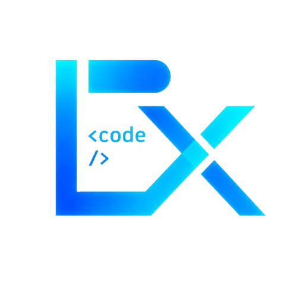

<p align="center">
  
</p>

<h1 align="center">BLXCode</h1>

<p align="center">
  <strong>Local-first desktop workbench for AI-assisted development</strong><br/>
  Terminals · Agent · Memory · Plans · Git · File preview — in one Tauri shell
</p>

<p align="center">
  <a href="LICENSE"></a>
  <a href="CHANGELOG.md"></a>
  
  
  
</p>

<p align="center">
  
  <a href="docs/user/language.md"></a>
  <a href="docs/user/appearance-themes.md"></a>
  <a href=".github/workflows/pr-check.yml"></a>
</p>

<p align="center">
  <a href="#quick-start">Quick Start</a> ·
  <a href="#features">Features</a> ·
  <a href="#screenshots">Screenshots</a> ·
  <a href="docs/README.md">Documentation</a> ·
  <a href="CHANGELOG.md">Changelog</a> ·
  <a href="#community">Community</a> ·
  <a href="https://github.com/Bitslix/BLXCode/wiki">Wiki</a>
</p>

---

**BLXCode** is an open-source desktop workbench for running AI coding agents beside real terminals, project memory, Markdown plans, tasks, and an embedded browser. Built with **Tauri 2**, **Rust**, **Leptos**, and **Trunk**.

Create a workspace, assign terminal slots to Claude, Codex, Gemini, OpenCode, or Cursor, keep durable notes under `.agents/`, track work with plans and a Kanban board, preview and diff files in the center pane, and talk to model providers from the same interface — all local-first, with data you can inspect on disk.

## Features

### Workbench

| | |
|---|---|
| 🖥️ **Native shell** | Tauri 2 + Leptos 0.8 WASM (Trunk) on Linux, macOS, and Windows |
| 📑 **Center tabs** | VS Code–style tab strip: Terminals, file preview, diff viewer, Settings |
| 🧩 **Multi-terminal grids** | Preset layouts, split panes, drag-and-drop slot reorder, session resume |
| 📂 **Sidebar** | Project Files tree, **File Diff** panel with stage/unstage, Git commit graph |
| ⌨️ **Shortcuts** | tmux-style `Ctrl+b` chords (default) or legacy direct chords |
| 🎨 **20 themes** | BLXCode, Dracula, Catppuccin, Nord, Rosé Pine, GitHub Dark, and more |

### Files & Git

| | |
|---|---|
| 👁️ **Rich preview** | Images, video, Markdown, Mermaid, syntax-highlighted code (highlight.js) |
| 📜 **Policy docs** | `LICENSE`, `README`, `CONTRIBUTING`, `SECURITY` — rendered with hero banners |
| 🔀 **Diff viewer** | Unified diffs in center tabs; live refresh via filesystem watcher |
| 🌿 **Git graph** | Swim-lane commit history; auto-refresh on working-tree changes |
| ✂️ **Code handoff** | Drag-select line ranges → insert into terminal or attach to agent |

### Plans, memory & tasks

| | |
|---|---|
| 📋 **Plan Manager** | Markdown plans under `.agents/plans/`, task syntax, load-into-agent |
| 📊 **Kanban board** | Drag-and-drop columns across plan tasks with Markdown write-back |
| 🧠 **Memory** | Dynamic categories, learnings, 2D/3D graph with category clustering |
| ✅ **Tasks** | `.blxcode/tasks/` with plan-linked grouping in the agent panel |

### BLXCode Agent

| | |
|---|---|
| 🤖 **Providers** | OpenRouter, Anthropic, OpenAI-compatible; thinking levels; OS keyring |
| 🛠️ **Better Harness** | Slim system prompt + **11 core skills**; shell, git, workspace search, web tools |
| 🔍 **Subagents** | Parallel `scout` / `review` / `security_analyst` runs with timeline cards |
| 🖼️ **Image mode** | Inline chat images; fal.ai support; output under `.blxcode/generated/` |
| 🎙️ **Voice** | STT, TTS, push-to-talk; OpenAI, OpenRouter, AWS Polly |
| 📊 **Turn metrics** | Per-row tokens, TTFT, decode speed, and session cost chip |
| ❓ **Ask user** | Multiple-choice clarifying questions inline in the chat timeline |
| 📜 **Rules & skills** | `.agents/rules/` and `.agents/skills/` with install dialog |

### Platform

| | |
|---|---|
| 🌍 **14-language UI** | Compile-time translations and localized EULA |
| 🔄 **Auto-updater** | Signed GitHub Releases via Tauri v2 updater |
| 🛠️ **Setup scripts** | `scripts/setup/` for Linux, macOS, and Windows |
| ✅ **CI** | PR workflow runs `cargo check` for backend and `wasm32` frontend |

## What's new

**Latest release: [0.2.6](CHANGELOG.md#026---2026-05-23)** — terminal slot drag-and-drop, code preview with syntax highlighting and context-menu handoff, policy-doc preview (`LICENSE`, `README`, …), closeable Terminals tab, and documentation sync.

**[0.2.3](CHANGELOG.md#023---2026-05-22)** — center multi-view tabs, rich file preview, docked Settings, 20 themes, GitHub auto-updater, centralized API Keys, per-turn chat metrics, agent question cards.

**[0.2.0](CHANGELOG.md#020---2026-05-21)** — Kanban board, expandable Rules/Skills cards, agent chat maximize, Leptos 0.8 upgrade.

See [CHANGELOG.md](CHANGELOG.md) for the full history and [Unreleased](CHANGELOG.md#unreleased) for work in progress (sidebar File Diff, center diff viewer).

## Screenshots

<p align="center">
  
</p>

| Workbench | Sidebar explorer & Git |
|:---:|:---:|
|  |  |

| Plan Manager | Agent panel |
|:---:|:---:|
|  |  |

| Memory & graph | Skills panel |
|:---:|:---:|
|  |  |

<details>
<summary>More screenshots (boot screen, settings, providers, voice)</summary>

<p align="center">
  
</p>

| Welcome | Workspace setup |
|:---:|:---:|
|  |  |

| Provider settings | Voice settings |
|:---:|:---:|
|  |  |

</details>

## Quick Start

After cloning, run the setup script for your platform:

```bash
./scripts/setup/setup-linux.sh
./scripts/setup/setup-macos.sh
```

```powershell
powershell -ExecutionPolicy Bypass -File scripts/setup/setup-windows.ps1
```

Use `--check-only` to inspect missing prerequisites, or `--with-bundle` to run `cargo tauri build` after checks.

### Prerequisites

- Rust stable and Cargo
- `wasm32-unknown-unknown` Rust target
- Trunk and Cargo Tauri CLI
- Tauri 2 system dependencies for your OS

```bash
rustup target add wasm32-unknown-unknown
cargo install trunk tauri-cli
```

On Linux, install WebKitGTK and build dependencies for your distribution.

### Run

```bash
cargo tauri dev
```

Tauri starts Trunk automatically via `src-tauri/tauri.conf.json`. The frontend serves at `http://localhost:1420`.

> **First-build tip:** Tauri's dev connection times out after 180 seconds. On slower machines, warm the WASM cache first:
>
> ```bash
> trunk build
> cargo tauri dev
> ```

### Build

```bash
cargo tauri build
```

### Release automation

```bash
./scripts/release.sh
./scripts/release-macos.sh
```

```powershell
scripts\release.cmd
powershell -ExecutionPolicy Bypass -File scripts/release.ps1 --platform windows
```

Copy `.env.release.example` to `.env.release` only when you need signing keys or GitHub upload overrides.

### Checks

```bash
cargo test --workspace
cargo check -p blxcode
cargo check -p blxcode-ui --target wasm32-unknown-unknown
trunk build
```

## Documentation

Full index: [Documentation Home](docs/README.md) · [GitHub Wiki](https://github.com/Bitslix/BLXCode/wiki)

**User guides**

| Topic | Guide |
|-------|-------|
| Getting started | [docs/user/getting-started.md](docs/user/getting-started.md) |
| Workspaces & center tabs | [docs/user/workspaces.md](docs/user/workspaces.md) |
| Settings & API keys | [docs/user/settings.md](docs/user/settings.md) |
| Themes | [docs/user/appearance-themes.md](docs/user/appearance-themes.md) |
| File preview & handoff | [docs/user/file-preview.md](docs/user/file-preview.md) |
| Memory & tasks | [docs/user/memory-and-tasks.md](docs/user/memory-and-tasks.md) |
| Plans & Kanban | [docs/user/plans.md](docs/user/plans.md) |
| Rules & skills | [docs/user/rules-and-skills.md](docs/user/rules-and-skills.md) |
| Agent harness | [docs/user/agent-harness.md](docs/user/agent-harness.md) |
| Subagents | [docs/user/subagents.md](docs/user/subagents.md) |
| Providers & hooks | [docs/user/agent-providers.md](docs/user/agent-providers.md) |
| Image mode | [docs/user/image.md](docs/user/image.md) |
| Voice | [docs/user/voice.md](docs/user/voice.md) |
| Keyboard shortcuts | [docs/user/keyboard-shortcuts.md](docs/user/keyboard-shortcuts.md) |
| UI language | [docs/user/language.md](docs/user/language.md) |
| Building | [docs/user/building.md](docs/user/building.md) |
| Troubleshooting | [docs/user/troubleshooting.md](docs/user/troubleshooting.md) |

**Developer guides**

- [Setup](docs/developer/setup.md) · [Architecture](docs/developer/architecture.md) · [Agent Harness](docs/developer/agent-harness.md) · [Subagents](docs/developer/subagents.md)
- [Tauri IPC](docs/developer/tauri-ipc.md) · [Voice](docs/developer/voice.md) · [i18n](docs/developer/i18n.md) · [Themes](docs/developer/themes.md) · [Contributing](docs/developer/contributing.md)

## Repository layout

```text
.
├── src/                    # Leptos CSR frontend (blxcode-ui)
├── src-tauri/              # Tauri 2 backend (blxcode)
├── content/                # EULA markdown and bundled agent hook scripts
├── src-tauri/src/agent/harness_skills/  # Embedded core skill Markdown
├── public/                 # Static assets (Trunk)
├── themes/                 # CSS theme tokens
├── scripts/                # Setup, release, and maintainer scripts
├── docs/                   # User and developer documentation
├── Cargo.toml              # Workspace manifest
├── Trunk.toml              # Frontend build config
└── styles.css              # Global app styling
```

## Workspace data

```text
<workspace>/.agents/memory/       # notes; subfolders = categories
<workspace>/.agents/learnings/    # repo learnings
<workspace>/.agents/plans/        # Markdown plans
<workspace>/.agents/rules/        # binding rule-*.md files
<workspace>/.agents/skills/       # user skills
<workspace>/.blxcode/tasks/       # task files
<workspace>/.blxcode/generated/   # image mode output
<workspace>/.blxcode/agent-context/  # handoff exports
```

API keys are stored in the OS keyring when available, with a private file fallback under the app config directory.

## Internationalization

BLXCode ships **14 locales** with compile-time string checks. Change language via **Ctrl+Shift+P** → **BLXCode settings** → **App** → **UI language**.

- [UI Language guide](docs/user/language.md)
- [Contributor i18n guide](docs/developer/i18n.md)

## Status

BLXCode is early-stage open source. The workbench, agent harness, file preview, Git tooling, and settings revamp are in active use on `main`; APIs and on-disk formats may still evolve. Current crate version: **0.2.6**.

## Community

| | |
|---|---|
| 🐛 **Bug reports** | [GitHub Issues](https://github.com/Bitslix/BLXCode/issues) — use the **Bug report** template |
| 💬 **Questions & ideas** | [GitHub Discussions](https://github.com/Bitslix/BLXCode/discussions) — **Q&A**, **Ideas**, and **General** templates |
| 📦 **Downloads** | [GitHub Releases](https://github.com/Bitslix/BLXCode/releases) — installers for Linux, macOS, and Windows |
| 🆘 **Help** | [SUPPORT.md](SUPPORT.md) — docs, troubleshooting, and where to ask |
| 🤝 **Contributing** | [CONTRIBUTING.md](CONTRIBUTING.md) — setup, conventions, PR checklist |

The in-app auto-updater pulls signed builds from GitHub Releases. Release notes live in [CHANGELOG.md](CHANGELOG.md).

## Contributing

Contributions welcome. Start with [Developer Setup](docs/developer/setup.md) and [Contributing](docs/developer/contributing.md). For code changes, open a pull request; for bugs and feature requests, use [Issues](https://github.com/Bitslix/BLXCode/issues) or [Discussions](https://github.com/Bitslix/BLXCode/discussions).

- Keep frontend (`blxcode-ui`) and backend (`blxcode`) boundaries clear
- Register Tauri commands in `src-tauri/src/lib.rs` and add wrappers in `src/tauri_bridge.rs`
- Update docs when user-facing behavior changes
- Run relevant checks before opening a pull request

## License

BLXCode is released under the [MIT License](LICENSE).
