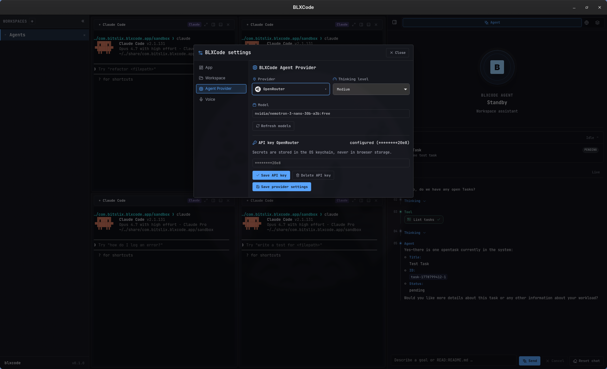
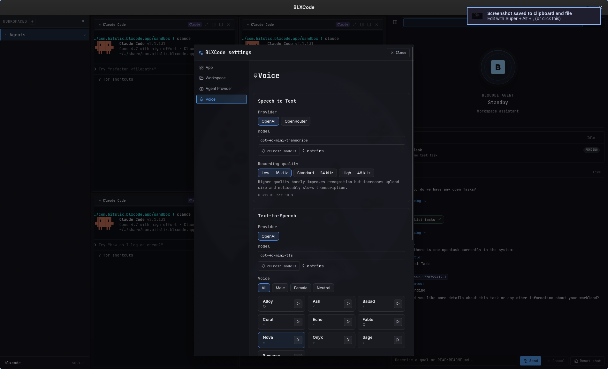

# BLXCode

[](LICENSE)


**BLXCode** is an open-source desktop workbench for running AI coding agents beside real terminals, project memory, tasks, and an embedded browser. It is built with **Tauri 2**, **Rust**, **Leptos**, and **Trunk**.

The project is designed for people who want one focused local cockpit for agent-assisted development: create a workspace, assign terminal slots to tools such as Claude, Codex, Gemini, OpenCode, or Cursor, keep durable project notes in `.blxcode/memory`, and talk to model providers from the same interface.

## Highlights

- **Native desktop shell** powered by Tauri 2 with a Leptos/WASM frontend.
- **Multi-terminal workspaces** with preset grids, split panes, recent workspaces, and persisted layout state.
- **Agent panel** with OpenRouter, Anthropic, and OpenAI-compatible provider settings.
- **Voice input and voice replies** with microphone STT, OpenAI/OpenRouter transcription, and OpenAI TTS playback.
- **Sandbox-aware agent tools** for listing and reading workspace files.
- **Workspace memory** stored as Markdown notes under `.blxcode/memory`.
- **Workspace tasks** stored under `.blxcode/tasks`.
- **Embedded browser** for links and research, with native child webviews on supported platforms and iframe fallback where needed.
- **Agent hooks** for Claude, Codex, Gemini, OpenCode, and Cursor session/title capture.
- **14-language UI** with compile-time translations, localized EULA on first launch, and a language picker in app settings (Deutsch, English, Español, Français, Magyar, Italiano, 日本語, 한국어, Polski, Português, Русский, 简体中文, 繁體中文).

## Internationalization

BLXCode is built for multilingual use out of the box. The workbench UI, settings, and first-run EULA are translated into **14 locales**; strings are checked at compile time so incomplete translations fail the build instead of showing blanks. On first launch, BLXCode picks a language from your saved preference, system/browser language, or English as fallback. Change it anytime via **Ctrl+Shift+P** → **BLXCode settings** → **App** → **UI language**.

User guide: [UI Language](docs/user/language.md) · Contributor guide: [Internationalization](docs/developer/i18n.md)

## Status

BLXCode is early-stage open source software. Core desktop, workspace, memory, task, provider-settings, and agent orchestration pieces are present, but APIs and file formats may still evolve before a stable release.

## Screenshots

<p align="center">
  
</p>

| Workspace Setup | Agent Fleet |
|---|---|
|  |  |

| Terminal Grid | Agent And Tasks |
|---|---|
|  |  |

| Provider Settings | Voice And Memory |
|---|---|
|  |  |

## Quick Start

### Prerequisites

- Rust stable and Cargo.
- `wasm32-unknown-unknown` Rust target.
- Trunk.
- Tauri system dependencies for your OS.
- Cargo Tauri CLI.

```bash
rustup target add wasm32-unknown-unknown
cargo install trunk tauri-cli
```

On Linux, install the WebKitGTK and build dependencies required by Tauri 2 for your distribution.

### Run The App

```bash
cargo tauri dev
```

The Tauri dev command starts Trunk automatically through `src-tauri/tauri.conf.json`. The frontend serves on `http://localhost:1420`.

### Build

```bash
cargo tauri build
```

### Useful Checks

```bash
cargo test --workspace
cargo check -p blxcode
cargo check -p blxcode-ui --target wasm32-unknown-unknown
trunk build
```

## Documentation

- [Documentation Home](docs/README.md)
- [User Guide](docs/user/getting-started.md)
- [Build From Source](docs/user/building.md)
- [UI Language](docs/user/language.md)
- [Voice: STT And TTS](docs/user/voice.md)
- [Workspace Guide](docs/user/workspaces.md)
- [Agent Providers](docs/user/agent-providers.md)
- [Memory And Tasks](docs/user/memory-and-tasks.md)
- [Troubleshooting](docs/user/troubleshooting.md)
- [Developer Setup](docs/developer/setup.md)
- [Architecture](docs/developer/architecture.md)
- [Tauri IPC Reference](docs/developer/tauri-ipc.md)
- [Voice Architecture](docs/developer/voice.md)
- [Internationalization](docs/developer/i18n.md)
- [Contributing](docs/developer/contributing.md)

## Repository Layout

```text
.
├── src/                 # Leptos CSR frontend crate: blxcode-ui
├── src-tauri/           # Tauri 2 backend crate: blxcode
├── content/             # EULA markdown and bundled agent hook scripts
├── public/              # Static frontend assets copied by Trunk
├── scripts/             # Maintainer scripts
├── docs/                # User and developer documentation
├── Cargo.toml           # Workspace + frontend crate manifest
├── Trunk.toml           # Frontend build/dev server config
└── styles.css           # Global app styling
```

## Configuration

Most user-facing configuration is managed in the app UI and persisted in the platform app config/data directories. Workspace-local data is stored under the selected workspace:

```text
<workspace>/.blxcode/memory/
<workspace>/.blxcode/tasks/
```

API keys are stored through the OS keyring when possible, with a private file fallback under the app config directory.

## Contributing

Contributions are welcome. Please start with [Developer Setup](docs/developer/setup.md) and [Contributing](docs/developer/contributing.md).

Important project conventions:

- Keep the frontend (`blxcode-ui`) and Tauri backend (`blxcode`) boundaries clear.
- Register every Tauri command in `src-tauri/src/lib.rs`.
- Prefer focused modules over monolithic files.
- Add or update docs when user-facing behavior changes.
- Run the relevant checks before opening a pull request.

## License

BLXCode is released under the [MIT License](LICENSE).
