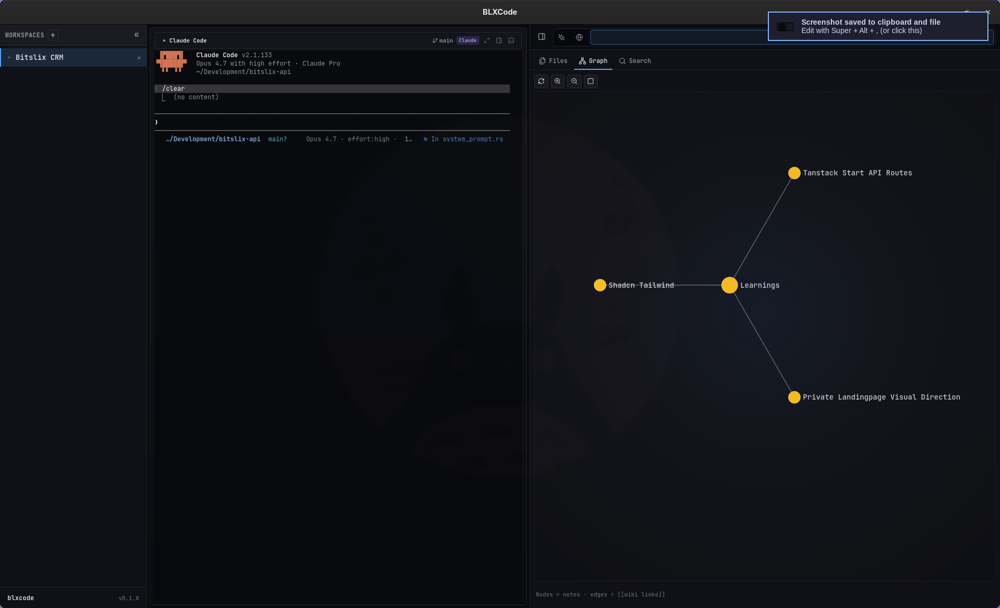
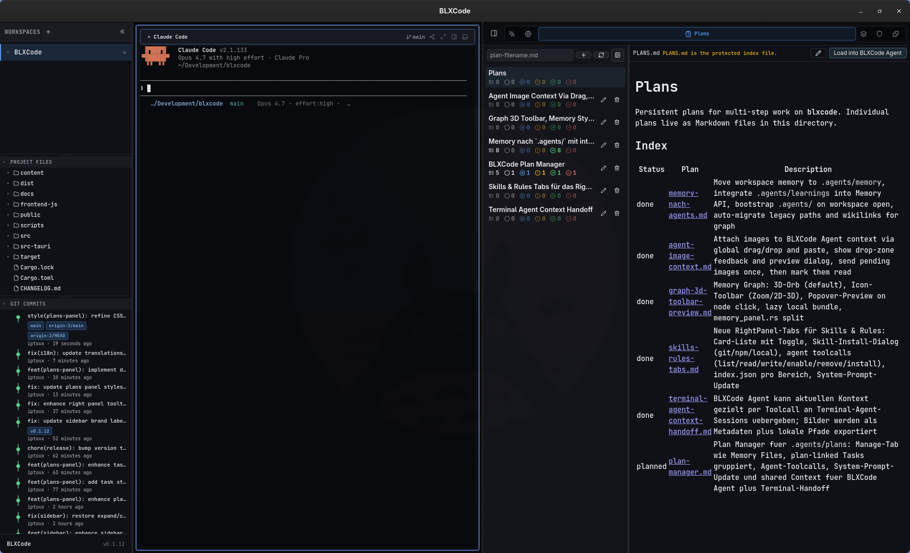
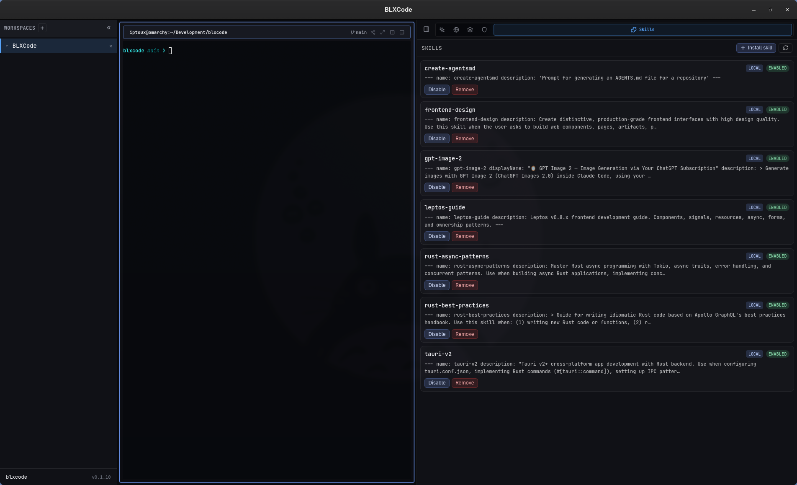

# BLXCode

[](LICENSE)


[](docs/user/language.md)


**BLXCode** is an open-source desktop workbench for running AI coding agents beside real terminals, project memory, Markdown plans, tasks, and an embedded browser. It is built with **Tauri 2**, **Rust**, **Leptos**, and **Trunk**.

The project is designed for people who want one focused local cockpit for agent-assisted development: create a workspace, assign terminal slots to tools such as Claude, Codex, Gemini, OpenCode, or Cursor, keep durable notes under `.agents/`, track work with plans and tasks, and talk to model providers from the same interface.

## Highlights

- **Native desktop shell** powered by Tauri 2 with a Leptos/WASM frontend.
- **Multi-terminal workspaces** with preset grids, split panes, session resume, and persisted layout.
- **Sidebar explorer and Git graph** — project file tree, hidden-file toggle, resizable panels, commit swim-lanes.
- **Agent panel** with OpenRouter, Anthropic, and OpenAI-compatible providers; workspace rules and skills; **image generation mode**.
- **Plans panel** — Markdown plans under `.agents/plans/` with task sync to `.blxcode/tasks/`.
- **Memory panel** — dynamic categories under `.agents/memory/`, learnings, 2D/3D graph, search, agent context attach.
- **Terminal context handoff** — send memory, plans, tasks, and images to live CLI agents via UI or `harness.send_agent_context`.
- **Voice input and replies** with STT, transcription, and TTS.
- **Keyboard shortcuts** — tmux-style `Ctrl+b` chords (default) or legacy direct chords.
- **14-language UI** with compile-time translations and localized first-run terms.

## Internationalization

BLXCode ships **14 locales**; strings are checked at compile time. Change the language via **Ctrl+Shift+P** → **BLXCode settings** → **App** → **UI language** (or tmux: `Ctrl+b` then `:` → settings).

- User guide: [UI Language](docs/user/language.md)
- Contributor guide: [Internationalization](docs/developer/i18n.md)

## Status

BLXCode is early-stage open source. Core desktop, workspace, memory, plans, tasks, provider settings, and agent orchestration are in place; APIs and on-disk formats may still evolve.

## Screenshots

<p align="center">
  
</p>

| Workbench | Sidebar explorer and Git |
|---|---|
|  |  |

| Plan Manager | Agent panel |
|---|---|
|  |  |

| Memory files and graph | Skills panel |
|---|---|
|  |  |

<details>
<summary>More screenshots (setup, providers, voice)</summary>

<p align="center">
  
</p>

| Workspace Setup | Agent Fleet |
|---|---|
|  |  |

| Provider Settings | Voice Settings |
|---|---|
|  |  |

</details>

## Quick Start

### Prerequisites

- Rust stable and Cargo.
- `wasm32-unknown-unknown` Rust target.
- Trunk.
- Tauri system dependencies for your OS.
- Cargo Tauri CLI.

```bash
rustup target add wasm32-unknown-unknown
cargo install trunk tauri-cli
```

On Linux, install the WebKitGTK and build dependencies required by Tauri 2 for your distribution.

### Run The App

```bash
cargo tauri dev
```

The Tauri dev command starts Trunk automatically through `src-tauri/tauri.conf.json`. The frontend serves on `http://localhost:1420`.

> **First-build tip:** Tauri's `devUrl` connection has a hard 180-second timeout. The cold WASM build can exceed that on slower machines. If `cargo tauri dev` fails with *"Could not connect to `http://localhost:1420/` after 180s"*, warm the Trunk cache once, then re-run:
>
> ```bash
> trunk build
> cargo tauri dev
> ```

### Build

```bash
cargo tauri build
```

### Useful Checks

```bash
cargo test --workspace
cargo check -p blxcode
cargo check -p blxcode-ui --target wasm32-unknown-unknown
trunk build
```

## Documentation

Full index: [Documentation Home](docs/README.md)

**User guides**

- [Getting Started](docs/user/getting-started.md)
- [Workspaces](docs/user/workspaces.md)
- [Memory And Tasks](docs/user/memory-and-tasks.md)
- [Plans](docs/user/plans.md)
- [Rules And Skills](docs/user/rules-and-skills.md)
- [Keyboard Shortcuts](docs/user/keyboard-shortcuts.md)
- [Image Mode](docs/user/image.md)
- [Agent Providers](docs/user/agent-providers.md)
- [Voice](docs/user/voice.md)
- [UI Language](docs/user/language.md)
- [Building](docs/user/building.md)
- [Troubleshooting](docs/user/troubleshooting.md)

**Developer guides**

- [Developer Setup](docs/developer/setup.md)
- [Architecture](docs/developer/architecture.md)
- [Tauri IPC](docs/developer/tauri-ipc.md)
- [Voice Architecture](docs/developer/voice.md)
- [Internationalization](docs/developer/i18n.md)
- [Contributing](docs/developer/contributing.md)

## Repository Layout

```text
.
├── src/                 # Leptos CSR frontend crate: blxcode-ui
├── src-tauri/           # Tauri 2 backend crate: blxcode
├── content/             # EULA markdown and bundled agent hook scripts
├── public/              # Static frontend assets copied by Trunk
├── scripts/             # Maintainer scripts
├── docs/                # User and developer documentation
├── Cargo.toml           # Workspace + frontend crate manifest
├── Trunk.toml           # Frontend build/dev server config
└── styles.css           # Global app styling
```

## Configuration

Most user-facing configuration is managed in the app UI and persisted in platform app config/data directories. Workspace-local data:

```text
<workspace>/.agents/memory/
<workspace>/.agents/learnings/
<workspace>/.agents/plans/
<workspace>/.agents/rules/
<workspace>/.agents/skills/
<workspace>/.blxcode/tasks/
<workspace>/.blxcode/generated/       # image mode output
<workspace>/.blxcode/agent-context/   # handoff exports
```

API keys are stored through the OS keyring when possible, with a private file fallback under the app config directory.

## Contributing

Contributions are welcome. Start with [Developer Setup](docs/developer/setup.md) and [Contributing](docs/developer/contributing.md).

Conventions:

- Keep the frontend (`blxcode-ui`) and Tauri backend (`blxcode`) boundaries clear.
- Register every Tauri command in `src-tauri/src/lib.rs` and add wrappers in `src/tauri_bridge.rs`.
- Prefer focused modules over monolithic files.
- Add or update docs when user-facing behavior changes.
- Run relevant checks before opening a pull request.

## Changelog

See [CHANGELOG.md](CHANGELOG.md) for release notes.

## License

BLXCode is released under the [MIT License](LICENSE).
