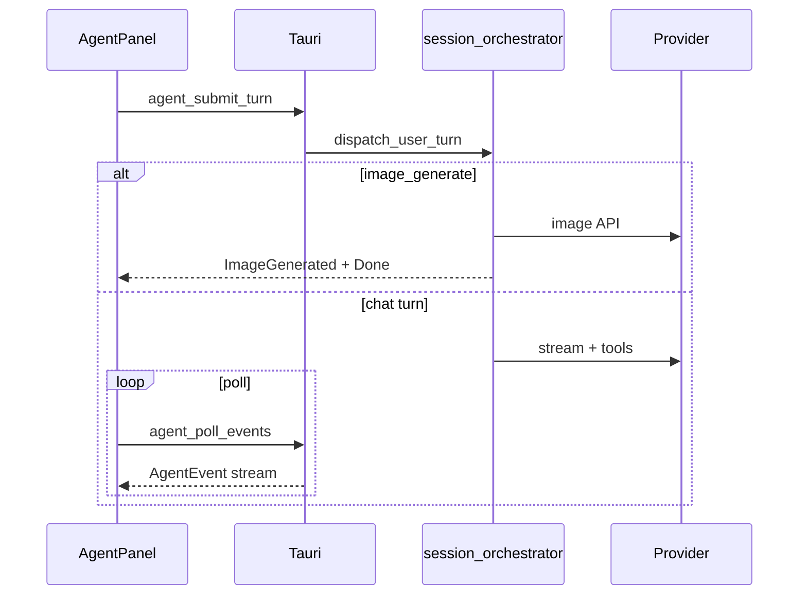
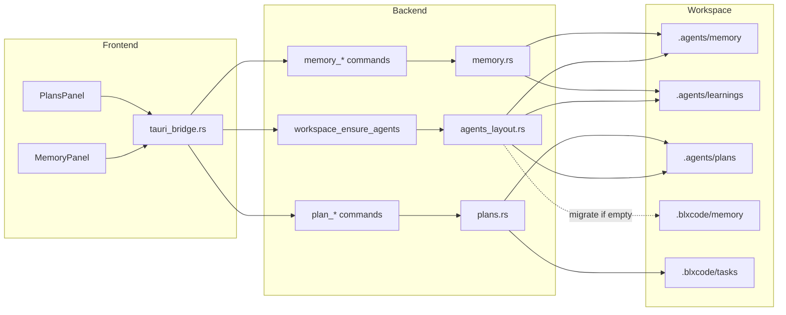
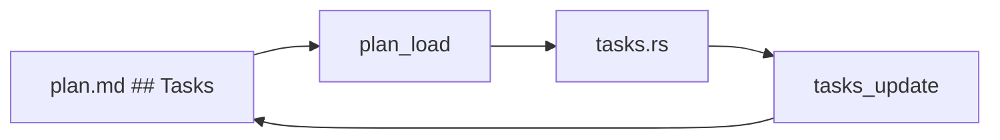
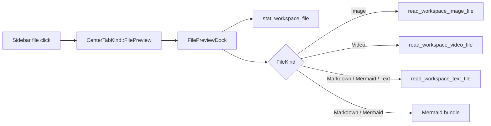
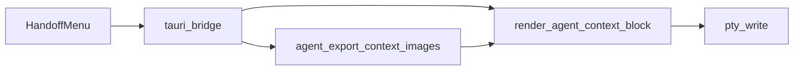

# Architecture

BLXCode is a local-first Tauri desktop app with a Leptos/WASM frontend and a Rust backend. The frontend owns UI state and rendering. The backend owns native capabilities such as PTYs, filesystem access, app config storage, keyring access, browser host integration, provider HTTP calls, memory, and tasks.

## High-Level Flow

```text
Leptos UI
  -> tauri_bridge.rs invoke wrappers
  -> Tauri commands registered in src-tauri/src/lib.rs
  -> Backend modules and managed state
  -> Serialized responses/events back to the UI
```

## Frontend Entry Points

- `src/main.rs`: mounts the Leptos app.
- `src/app.rs`: sets up i18n, **ThemeService**, EULA gating, and renders `WorkbenchShell`.
- `src/workbench/mod.rs`: workbench context, state hydration, auto-save, embedded browser event handling.
- `src/workbench/state.rs`: workspace state, snapshots, workspace creation draft, layout and browser state.
- `src/tauri_bridge.rs`: typed wrappers around Tauri `invoke()` calls.
- `src/agent_wire.rs`: frontend mirror of backend agent protocol types.

## Backend Entry Points

- `src-tauri/src/main.rs`: thin binary entry point.
- `src-tauri/src/lib.rs`: Tauri builder, managed state, plugin setup, command registration.
- `src-tauri/src/commands.rs`: general app commands, agent command shims, browser commands, directory picker helpers, PTY command wrappers, and git helpers.
- `src-tauri/src/workbench_state.rs`: persisted workbench snapshot/session storage.
- `src-tauri/src/pty_host.rs`: terminal session lifecycle and PTY IO.
- `src-tauri/src/browser_host.rs`: native or iframe browser embedding support.
- `src-tauri/src/voice/`: microphone recording, voice settings, STT, TTS, and voice catalog.

## Agent Subsystem

The agent subsystem lives under `src-tauri/src/agent/`. See [Agent Harness](agent-harness.md) for Better Harness; [Subagents](subagents.md) for coordinated parallel runs.

### Core runtime

- `state.rs`: shared event queue, busy/cancel flags, provider environment status, and conversation state.
- `protocol.rs`: `UserTurn` and `AgentEvent` types (including subagent events).
- `session_orchestrator.rs`: loads provider settings/key, `note_workspace_change`, dispatches the turn.
- `openrouter.rs` / `anthropic.rs`: streaming tool-call loops via `tool_dispatch.rs`.
- `tools.rs`: full tool registry and sandboxed `execute_server_tool`.
- `system_prompt.rs`: slim shared prompt (checklist + tool name index; docs in core skills).

### Harness extensions

- `harness_skills/*.md`: eleven embedded core skill documents.
- `tool_groups.rs` / `tool_dispatch.rs`: filtered catalogs for coordinator vs subagents.
- `environment.rs`, `shell_exec.rs`, `git_agent.rs`, `workspace_agent.rs`: server tools.
- `web_settings.rs`, `web_tools.rs`, `web_commands.rs`: Tavily/Brave keys and search.
- `subagents.rs`, `subagent_runner.rs`, `subagent_prompts.rs`: parallel subagent runs — [Subagents](subagents.md).

The frontend submits turns through `agent_submit_turn` and polls `agent_poll_events`. Subagent timeline updates are debounced 50 ms ([Subagents](subagents.md)). Tool results that need client execution are returned through `agent_submit_tool_result`.

Voice-originated turns set `voice_input=true`. After the provider turn finishes, the session orchestrator can synthesize the final assistant text and emit `AgentEvent::VoiceReady` for frontend playback.

When `UserTurn.image_generate` is true, the orchestrator takes an early exit: calls `src-tauri/src/image/generate.rs`, saves to `<workspace>/.blxcode/generated/`, emits `AgentEvent::ImageGenerated`, and skips the tool loop. Image settings live in the `image` envelope of `agent_provider_settings.json` (`src-tauri/src/image/settings.rs`).



Client-only tools (context attach, plan context, image context list) execute in the frontend; results return via `agent_submit_tool_result`.

## Voice Subsystem

The voice subsystem lives under `src-tauri/src/voice/` with frontend support in `src/workbench/agent_panel/voice_orb/` and `src/workbench/harness_voice_pane/`.

It captures microphone audio with `cpal`, writes temporary mono WAV files with `hound`, sends STT requests to OpenAI or OpenRouter, and sends TTS requests to OpenAI. Voice settings are persisted as a `voice` sub-object inside `agent_provider_settings.json` and reuse the existing provider keyring entries.

See [Voice Architecture](voice.md) for the detailed flow.

## Workbench State

Workbench snapshots are serialized from frontend state and saved through backend commands. The snapshot version is defined by `WORKBENCH_SNAPSHOT_VERSION` in `src/workbench/state.rs`.

The state model includes workspaces, active workspace ID, recent workspaces, sidebar/right-panel layout, browser tabs, agent timeline, and terminal pane layout.

## Memory And Tasks

Memory lives in `src-tauri/src/memory.rs` and `src-tauri/src/agents_layout.rs`. Notes are stored under `<workspace>/.agents/memory/` and learnings under `<workspace>/.agents/learnings/` (API paths `learnings/…`). Legacy `.blxcode/memory/` is migrated on workspace bootstrap via `workspace_ensure_agents`.



Tasks live in `src-tauri/src/tasks.rs` and store JSON under `<workspace>/.blxcode/tasks/index.json`. `plan_load` replaces tasks matching a plan path; `tasks_update` can write status markers back into plan Markdown.



## Plans

`src-tauri/src/plans.rs` parses and writes the canonical `## Tasks` / `## Todos` section. `PLANS.md` is protected. Path traversal is rejected relative to the plans root.

## Skills And Rules

`src-tauri/src/skills_rules/` implements list/read/write, enable flags in `index.json`, and install staging (`git`, `npm`, local). **Core skills** are embedded via `CORE_SKILLS` in `store.rs` (`SkillSourceKind::Core`) and merged into `skills_list` on every workspace. `skills_rules_bootstrap` runs on workspace open via `workspace_ensure_agents` / layout helpers.

## Sidebar Explorer And Git Graph

- `src-tauri/src/fs_entries.rs` — `list_path_entries` (sandboxed directory listing), `read_workspace_text_file` (UTF-8 text preview, 512 KiB cap), and the file-preview trio:
  - `stat_workspace_file` → `FileMeta { name, relPath, byteLen, modifiedMs, kind, mime }` with `FileKind` (`Image` / `Video` / `Markdown` / `Mermaid` / `Text` / `Binary`).
  - `read_workspace_image_file` → base64 + MIME, **16 MiB** cap (`MAX_IMAGE_PREVIEW_BYTES`).
  - `read_workspace_video_file` → base64 + MIME, **64 MiB** cap (`MAX_VIDEO_PREVIEW_BYTES`).
  All four commands reuse the same `canonical_root` / `resolve_under_root` sandbox so traversal-out-of-root, missing files, and non-files behave identically.
- `src-tauri/src/git_graph.rs` — `git_is_repository`, `git_commit_graph` (lane layout, unit-tested).

Frontend:

- `src/workbench/sidebar_view_section/` — explorer and graph panels in the workbench sidebar.
- `src/workbench/file_preview/` — center-tab preview dispatcher:
  - `mod.rs` loads `FileMeta` once and routes to `ImageView` / `VideoView` / `MarkdownView` / `MermaidView` / `TextFallbackView` / `UnsupportedView`.
  - `header.rs` renders the topbar (icon, name, path, size, mtime, Copy path, Refresh).
  - `markdown_view.rs` runs `pulldown-cmark` (tables, strikethrough, task lists, footnotes, smart-punctuation), detects ```` ```mermaid ```` fences and replaces them with `<pre class="mermaid">` sentinels that the post-mount effect hands to `mermaid.run({ nodes })`.
  - `mermaid_glue.rs` lazy-loads the vendored bundle `public/vendor/mermaid/mermaid.min.js`, calls `mermaid.initialize({ startOnLoad: false, securityLevel: 'strict', theme: 'dark' })`, and exposes `run_mermaid_on(&[HtmlElement])`.
  - `util.rs` ships `format_bytes`, `format_mtime` (`js_sys::Date.to_locale_string`), `icon_for_kind`, allowlist-based `sanitize_svg` + `sanitize_markdown_html` (strips `<script>` / `<style>` / `<iframe>` / `<object>` / `<embed>` / `<foreignObject>` blocks, `on*=` event handlers, and `javascript:` / `vbscript:` URIs while preserving multi-byte UTF-8), plus a shared `FilePreviewError` enum (`NoTauri` / `WorkspaceNotFound` / `TooLarge(u64)` / `Failed(String)`) and `render_load_error(i18n, failed_label, error)` helper used by every renderer for consistent localized banners.



## Terminal Context Handoff

- Frontend: `src/workbench/agent_context_handoff.rs` — `render_agent_context_block`, `HandoffMenu`, `perform_handoff` (single renderer for tool and UI).
- Backend: `agent_export_context_images` writes `<workspace>/.blxcode/agent-context/images/` plus manifest JSON.
- PTY env: `BLX_AGENT_CONTEXT_DIR`, `BLX_AGENT_CONTEXT_MANIFEST`.



Both memory and plan modules validate workspace paths and sandbox file operations to workspace-local directories.

## Browser Embedding

The browser host supports native child webviews on platforms where Tauri's unstable child-webview API works well. Linux currently uses iframe fallback. The frontend stores the detected embedding kind in `BrowserEmbedSurface`.

## Internationalization

The i18n service lives under `src/i18n/` and `src/service/`. Locale tables are Rust source files, while EULA source content is Markdown under `content/eula/`.

## Theming

Themes are frontend-only. `ThemeService` (`src/workbench/theme_service.rs`) sets `html[data-theme]` from `themes/tokens.css` and persists to `localStorage`. The Appearance settings pane reads the catalog from `src/theme/catalog.rs`. JavaScript subsystems (xterm, 3D memory graph) listen for `blxcode-theme-changed` and read computed CSS variables.

See [Themes](themes.md) and [Theme exceptions](../THEME_EXCEPTIONS.md).

## Boundaries To Preserve

- UI code should not perform native filesystem or keyring operations directly.
- Backend modules should not depend on Leptos signals or DOM concepts.
- `src-tauri/src/lib.rs` should register and wire modules, not accumulate feature implementation.
- Shared protocol types should be mirrored intentionally, as with `agent_wire.rs` and `agent/protocol.rs`.
