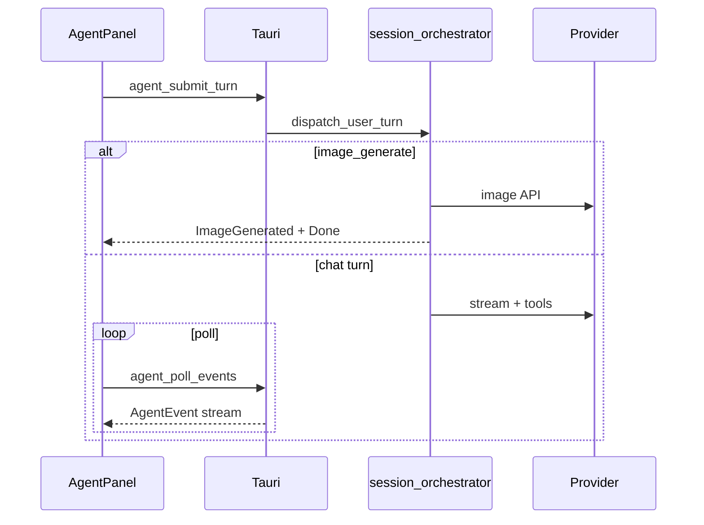
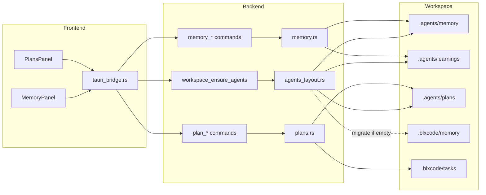
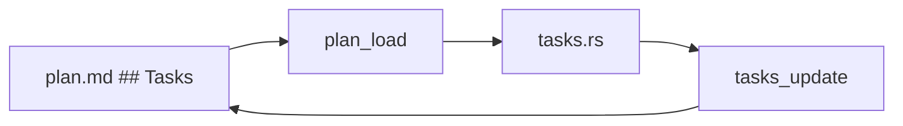
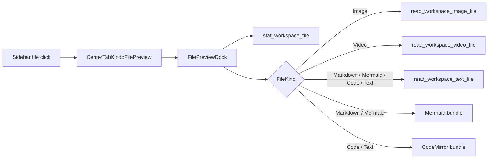
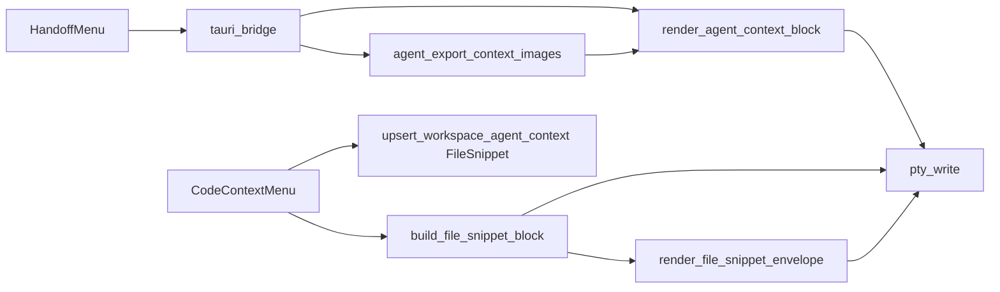

# Architecture

BLXCode is a local-first Tauri desktop app with a Leptos/WASM frontend and a Rust backend. The frontend owns UI state and rendering. The backend owns native capabilities such as PTYs, filesystem access, app config storage, keyring access, browser host integration, provider HTTP calls, memory, and tasks.

## High-Level Flow

```text
Leptos UI
  -> tauri_bridge.rs invoke wrappers
  -> Tauri commands registered in src-tauri/src/lib.rs
  -> Backend modules and managed state
  -> Serialized responses/events back to the UI
```

## Frontend Entry Points

- `src/main.rs`: mounts the Leptos app.
- `src/app.rs`: sets up i18n, **ThemeService**, EULA gating, and renders `WorkbenchShell`.
- `src/workbench/mod.rs`: workbench context, state hydration, auto-save, embedded browser event handling.
- `src/workbench/state.rs`: workspace state, snapshots, workspace creation draft, layout and browser state.
- `src/tauri_bridge.rs`: typed wrappers around Tauri `invoke()` calls.
- `src/agent_wire.rs`: frontend mirror of backend agent protocol types.

## Backend Entry Points

- `src-tauri/src/main.rs`: thin binary entry point.
- `src-tauri/src/lib.rs`: Tauri builder, managed state, plugin setup, command registration.
- `src-tauri/src/commands.rs`: general app commands, agent command shims, browser commands, directory picker helpers, PTY command wrappers, and git helpers.
- `src-tauri/src/workbench_state.rs`: persisted workbench snapshot/session storage.
- `src-tauri/src/pty_host.rs`: terminal session lifecycle and PTY IO.
- `src-tauri/src/git_worktree.rs`: local and remote Git worktree list/create/remove helpers used by workspace creation, the titlebar menu, and Agent client tools.
- `src-tauri/src/browser_host.rs`: native or iframe browser embedding support.
- `src-tauri/src/voice/`: microphone recording, voice settings, STT, TTS, and voice catalog.

## Agent Subsystem

The agent subsystem lives under `src-tauri/src/agent/`. See [Agent Harness](agent-harness.md) for Better Harness; [Subagents](subagents.md) for coordinated parallel runs.

### Core runtime

- `state.rs`: shared event queue, busy/cancel flags, provider environment status, and conversation state.
- `protocol.rs`: `UserTurn` and `AgentEvent` types (including subagent events).
- `session_orchestrator.rs`: loads provider settings/key, `note_workspace_change`, dispatches the turn.
- `openrouter.rs` / `anthropic.rs`: streaming tool-call loops via `tool_dispatch.rs`.
- `tools.rs`: full tool registry and sandboxed `execute_server_tool`.
- `system_prompt.rs`: slim shared prompt (checklist + tool name index; docs in core skills).

### Harness extensions

- `harness_skills/*.md`: thirteen embedded core skill documents (file-access, memory, plans, tasks, rules-skills, harness, environment, shell, git, web, subagents, **mcp**, **prompt-generating**).
- `tool_groups.rs` / `tool_dispatch.rs`: filtered catalogs for coordinator vs subagents. Both branches parse `mcp.<server>.<tool>` and dispatch to `agent/mcp/mcp_client.rs`.
- `environment.rs`, `shell_exec.rs`, `git_agent.rs`, `workspace_agent.rs`: server tools.
- `web_settings.rs`, `web_tools.rs`, `web_commands.rs`: Tavily/Brave keys and search.
- `mcp/`: `mcp.rs`, `mcp_registry.rs` (central `{app_data_dir}/mcp/servers.json`), `mcp_cli_configs.rs` (parses `.mcp.json`/`.codex/config.toml`/`.gemini/settings.json`/`opencode.json`/`.cursor/mcp.json`; skips remote `ssh:` entries), `mcp_client.rs` (built-in JSON-RPC; no external SDK), `mcp_commands.rs` (`mcp_*` Tauri commands), `mcp_models.rs` (wire types).
- `subagents.rs`, `subagent_runner.rs`, `subagent_prompts.rs`: parallel subagent runs — [Subagents](subagents.md).

The frontend submits turns through `agent_submit_turn` and polls `agent_poll_events`. Subagent timeline updates are debounced 50 ms ([Subagents](subagents.md)). Tool results that need client execution are returned through `agent_submit_tool_result`.

Voice-originated turns set `voice_input=true`. After the provider turn finishes, the session orchestrator can synthesize the final assistant text and emit `AgentEvent::VoiceReady` for frontend playback.

When `UserTurn.image_generate` is true, the orchestrator takes an early exit: calls `src-tauri/src/image/generate.rs`, saves to `<workspace>/.blxcode/generated/`, emits `AgentEvent::ImageGenerated`, and skips the tool loop. Image settings live in the `image` envelope of `agent_provider_settings.json` (`src-tauri/src/image/settings.rs`).


```mermaid
sequenceDiagram
  participant UI as AgentPanel
  participant IPC as Tauri
  participant Orch as session_orchestrator
  participant API as Provider

  UI->>IPC: agent_submit_turn
  IPC->>Orch: dispatch_user_turn
  alt image_generate
    Orch->>API: image API
    Orch-->>UI: ImageGenerated + Done
  else chat turn
    Orch->>API: stream + tools
    loop poll
      UI->>IPC: agent_poll_events
      IPC-->>UI: AgentEvent stream
    end
  end
```

Client-only tools (context attach, plan context, image context list) execute in the frontend; results return via `agent_submit_tool_result`.

## Voice Subsystem

The voice subsystem lives under `src-tauri/src/voice/` with frontend support in `src/workbench/agent_panel/voice_orb/` and `src/workbench/harness_voice_pane/`.

It captures microphone audio with `cpal`, writes temporary mono WAV files with `hound`, sends STT requests to OpenAI or OpenRouter, and sends TTS requests to OpenAI. Voice settings are persisted as a `voice` sub-object inside `agent_provider_settings.json` and reuse the existing provider keyring entries.

See [Voice Architecture](voice.md) for the detailed flow.

## HeartBeat

`src-tauri/src/heartbeat.rs` runs a single named background task (Tokio interval) that wakes the agent on a schedule. It exposes:

- 10-min–24-h interval clamp (`HeartbeatSettings.interval_minutes`)
- `Run now` button + Tauri command `heartbeat_run_now`
- `set_service_enabled` start/stop without losing the schedule
- A "stalled after 3 skips" escalation that calls `memory_indexer_reindex` so the architecture map never silently drifts
- A statusbar rotator (3-second dwell) showing `HeartBeat · 12m` / `Next: 14:32` / `Idle` / `Service off`

## Memory Indexer

`src-tauri/src/memory/indexer.rs` rebuilds the per-workspace architecture map off the main event loop. The async `memory_rebuild_architecture` / `memory_lint_architecture` commands spawn the CPU/IO-bound work on the blocking thread pool via `tauri::async_runtime::spawn_blocking`. `memory_indexer_reindex` performs an incremental scan after workspace changes (file watcher + HeartBeat escalation). See [Memory And Tasks](#memory-and-tasks) above for the architecture map pipeline.

## Notifications

`src-tauri/src/notification.rs` bridges the workbench to OS notifications. It uses `tauri-plugin-notification` for desktop banners and the workbench's own status line / titlebar for in-app echoes. Settings cover global on/off, focus-suppression, and per-channel rules (agent complete, subagent complete, HeartBeat, background update). The **notification history** command returns the rolling log used by the App status line.

## App Log

`src-tauri/src/log_capture.rs` captures structured `tracing` events into a rolling in-memory buffer (capped, with a download-to-file path). The **Settings → App → View app log** button calls `log_get_recent`; the **Export** button uses `tauri-plugin-dialog` to pick a destination and `log_export` to write it; **Clear** flushes the buffer.

## Kanban (Multi-Kanban)

The kanban is a workspace-scoped multi-board plan/tasks surface:

- `src-tauri/src/kanban.rs` — board persistence at `<workspace>/.agents/kanban/<plan-slug>/index.json`, registered in `<workspace>/.agents/kanban/index.json`
- `kanban_plan_move` / `kanban_task_move` Tauri commands allow atomic re-ordering across columns and across boards
- Center tab `0` hosts one or more boards; the agent can author new boards through the existing `plans.rs` / `tasks.rs` commands

## Mermaid

`src-tauri/src/mermaid/` (or `mermaid.rs` in `plans.rs`) handles persistence of Mermaid diagrams under `<workspace>/.agents/plans/<slug>/diagrams/`, with a `diagrams.json` registry. The **Diagram gallery** center tab (`CenterTabKind::DiagramGallery`) lists diagrams; the agent creates them through `mermaid_create` / `mermaid_create_many` server tools; the user can Save As Markdown or PDF (`mermaid_export_markdown` / `mermaid_export_pdf`, both backed by `tauri-plugin-dialog`).

## App Status Line

The bottom status bar (added above the existing footer) is a single thin row that concatenates:

- `VIM` indicator (when an editor/preview tab is focused and Vim is on)
- `file.rs · 42:13` cursor coordinates from the active editor signal
- `HeartBeat · 12m` / `Next: 14:32` (rotating)
- `Memory: indexed 3m ago` (rotating)
- `MCP: 3 servers · 12 tools` (rotating)
- `Notifications: 2 new` (rotating)

The status line is read-only and never captures input; the Webview Tauri app uses the same status string as the native window title bar.

## Workbench State

Workbench snapshots are serialized from frontend state and saved through backend commands. The snapshot version is defined by `WORKBENCH_SNAPSHOT_VERSION` in `src/workbench/state.rs`.

The state model includes workspaces, active workspace ID, recent workspaces, sidebar/right-panel layout, browser tabs, agent timeline, and terminal pane layout.

Workspace entries can also carry `WorkspaceWorktreeMeta` when the workspace root is a Git worktree. The frontend draft model exposes `workspace_kind`, `worktree_base_path`, `worktree_branch`, `worktree_start_point`, and `worktree_path`, so the same create-workspace wizard can create normal local/remote workspaces or Git worktree workspaces.

## Git Worktree Workspaces

Worktree support is split across the backend Git helpers, workspace state, titlebar UI, and Agent harness:

- Backend commands in `src-tauri/src/git_worktree.rs` expose `git_worktree_list`, `git_worktree_open_info`, `git_worktree_create`, and `git_worktree_remove`.
- Local commands run normal `git worktree` operations after resolving the repository root with `git rev-parse --show-toplevel`.
- Remote commands use the active `RemoteExecManager` connection and execute the same Git checks on the remote host.
- `git worktree list --porcelain -z` is parsed into structured entries so paths, branches, bare/detached state, lock state, and prunable annotations stay unambiguous.
- Creation checks for an existing matching branch or target path before running `git worktree add`; an existing match is returned as an openable workspace outcome.
- Removal checks `git status --porcelain=v1 -z` first and refuses to remove dirty worktrees.

Frontend integration lives in `src/workbench/app_titlebar/worktree_menu.rs`, `src/workbench/create_workspace_wizard.rs`, and `src/tauri_bridge.rs`. The titlebar menu is rendered near the left brand cluster and is always scoped to the active workspace/repository. The create wizard uses the same command path for local and remote worktrees and stores the resulting metadata on the opened workspace.

Agent integration carries worktree scope through `UserTurn.workspace_scope` and `WorkspaceScope.worktree`. Provider loops call `system_prompt_with_scope`, which appends an active-worktree block with the root, base repository, branch, and local/remote connection. Client tools `harness.worktree_list` and `harness.create_worktree_workspace` live in the frontend harness tool layer; creation has a preview phase (`confirmed: false`) and a confirmed phase (`confirmed: true`) so the model must ask the user before creating/opening a worktree.

Remote terminal cells pass the workspace cwd to `pty_spawn_remote` as `remote_dir`, so terminals launched in a remote worktree start in that worktree instead of the remote account default directory.

## Memory And Tasks

Memory lives under `src-tauri/src/memory/` (`mod.rs`, `store`, `paths`, `graph`, `frontmatter`, `wikilinks`, …) and `src-tauri/src/agents_layout.rs`. Notes are stored under `<workspace>/.agents/memory/` and learnings under `<workspace>/.agents/learnings/` (API paths `learnings/…`). Legacy `.blxcode/memory/` is migrated on workspace bootstrap via `workspace_ensure_agents`.

### Architecture map

`src-tauri/src/memory/architecture/` implements `memory_rebuild_architecture` and `memory_lint_architecture`:

- `detect.rs` — plugin registry (Rust, Node, Python, CMake, Go, Zig, Jai, Make, Generic fallback).
- `indexers/*.rs` — per-manifest unit discovery and generated `architecture/modules/<kind>-<name>.md` skeletons.
- Generated `ARCHITECTURE.md` (`## Generated` / `## Manual`) and `.meta/architecture-state.json` (gitignored) for staleness.

Agents must not overwrite harness-managed sections; the Memory UI treats `architecture/` as a reserved category. See `.agents/memory/ARCHITECTURE.md` in a checked-out workspace for the index format.

The first-touch architecture rebuild walks the whole workspace tree, which can take seconds on a large codebase. `memory_rebuild_architecture` and `memory_lint_architecture` are therefore `async` Tauri commands that offload the CPU/IO-bound work to the blocking thread pool (`tauri::async_runtime::spawn_blocking`), keeping the main event loop free. Synchronous indexing previously froze the window on workspace open while it ran.


```mermaid
flowchart LR
  subgraph frontend [Frontend]
    Panel[MemoryPanel]
    PlansPanel[PlansPanel]
    Bridge[tauri_bridge.rs]
  end
  subgraph backend [Backend]
    Ensure[workspace_ensure_agents]
    MemCmd[memory_* commands]
    PlanCmd[plan_* commands]
    Layout[agents_layout.rs]
    MemMod[memory.rs]
    PlansMod[plans.rs]
  end
  subgraph storage [Workspace]
    MemDir[".agents/memory"]
    LearnDir[".agents/learnings"]
    PlansDir[".agents/plans"]
    Legacy[".blxcode/memory"]
    TasksJson[".blxcode/tasks"]
  end
  Panel --> Bridge
  PlansPanel --> Bridge
  Bridge --> Ensure
  Bridge --> MemCmd
  Bridge --> PlanCmd
  Ensure --> Layout
  MemCmd --> MemMod
  PlanCmd --> PlansMod
  Layout --> MemDir
  Layout --> LearnDir
  Layout --> PlansDir
  Layout -.->|migrate if empty| Legacy
  MemMod --> MemDir
  MemMod --> LearnDir
  PlansMod --> PlansDir
  PlansMod --> TasksJson
```

Tasks live in `src-tauri/src/tasks.rs` and store JSON under `{app_data_dir}/tasks/<workspace_hash>/index.json`. `plan_load` replaces tasks matching a canonical plan path such as `feature/plan.md`; `tasks_update` can write status markers back into plan Markdown.


```mermaid
flowchart LR
  PlanMd["plan.md ## Tasks"]
  PlanLoad[plan_load]
  TasksMod[tasks.rs]
  TaskUpdate[tasks_update]
  PlanMd --> PlanLoad
  PlanLoad --> TasksMod
  TasksMod --> TaskUpdate
  TaskUpdate --> PlanMd
```

## Plans

`src-tauri/src/plans.rs` parses and writes the canonical `## Tasks` / `## Todos` section. Normal plans live at `.agents/plans/<slug>/plan.md`; `PLANS.md` is protected. Path traversal is rejected relative to the plans root, and legacy `slug.md` inputs are normalized.

`src-tauri/src/plans_index.rs` keeps the `PLANS.md` index table in sync on `plan_create` / `plan_write` / `plan_delete` / `plan_rename` (generated membership from canonical `plan.md` files, preserved Status/Description cells). The `PLANS.md` index file is treated as **read-only** in the Plans panel — the index is hidden from the cards list and excluded from the status-tab counts (`displayed_plans` derivation filters `is_index`) so the *Empty* group reflects only real plans.

### AI-generated plans and tasks

`src-tauri/src/agent/plan_ai.rs` adds a `plan_generate_ai { prompt, with_tasks }` Tauri command that reuses the existing one-shot, non-streaming path (`oneshot::complete_text`) that already backs AI commit messages. The system prompt is Skill-conformant so the output always matches the built-in plan format (`# Title` + prose sections + a `## Tasks` section using the exact `- [ ] \`task-id\` - Title` line syntax). Post-processing strips any wrapping code fence, extracts the title (falling back to the prompt), and guarantees a `## Tasks` heading exists so `plan_load` never runs empty. Saving persists through the existing tools only — `plan_create` writes the file and, when tasks are requested, `plan_load` syncs the `## Tasks` section into the task manager — so no new write path to `.agents/plans` is introduced. Empty prompt and missing-API-key cases surface the same friendly errors as AI commit.

## Skills And Rules

`src-tauri/src/skills_rules/` implements list/read/write, enable flags in `index.json`, and install staging (`git`, `npm`, local). **Core skills** are embedded via `CORE_SKILLS` in `store.rs` (`SkillSourceKind::Core`) and merged into `skills_list` on every workspace. `skills_rules_bootstrap` runs on workspace open via `workspace_ensure_agents` / layout helpers.

## Sidebar Explorer And Git Graph

- `src-tauri/src/fs_entries.rs` — `list_path_entries` (sandboxed directory listing, **async** with `proc::run_blocking`), `read_workspace_text_file` (UTF-8 text preview, 512 KiB cap), and the file-preview trio:
  - `stat_workspace_file` → `FileMeta { name, relPath, byteLen, modifiedMs, kind, mime, policyKind? }` with `FileKind` (`Image` / `Video` / `Markdown` / `Mermaid` / `Code` / `Text` / `Binary`). `Code` covers source languages (Rust/TS/JS/Py/Go/HTML/CSS/JSON/YAML/shell/SQL/…); `Text` is reserved for plain text (txt/log/ini/conf/env/csv/…) that should still get gutter+selection but no syntax highlighting.
  - **Repository policy classification**: `classify_policy(stem)` runs **after** `classify_kind(ext)` and inspects the lowercased filename stem. When it matches a well-known stem (`license`/`licence`/`copying`/`copyright`/`unlicense`, `contributing`/`contribution(s)`, `contributors`/`contributer(s)`, `code_of_conduct` / `code-of-conduct` / `codeofconduct`, `security` / `security-policy` / `security_policy`, `authors` / `maintainers` / `owners` / `codeowners`, `changelog` / `changes` / `history` / `release_notes`, `readme`) it returns `Some(PolicyKind)` and `stat_workspace_file` **forces `kind = FileKind::Markdown`** (regardless of extension) and falls back to `text/markdown` for the MIME guess. Effect: a bare `LICENSE` (no extension) renders identically to `LICENSE.md`. The optional `policy_kind: Option<PolicyKind>` field on `FileMeta` is `#[serde(skip_serializing_if = "Option::is_none")]` so older snapshots and non-policy files stay unchanged on the wire.
  - `read_workspace_image_file` → base64 + MIME, **16 MiB** cap (`MAX_IMAGE_PREVIEW_BYTES`).
  - `read_workspace_video_file` → base64 + MIME, **64 MiB** cap (`MAX_VIDEO_PREVIEW_BYTES`).
  All four commands reuse the same `canonical_root` / `resolve_under_root` sandbox so traversal-out-of-root, missing files, and non-files behave identically.
- `src-tauri/src/git_graph.rs` — `git_is_repository` (now `Result<bool, String>`), `git_commit_graph` (lane layout, unit-tested). **VS Code-style commit graph visuals** are layered on top: the sidebar renders structured lanes instead of terminal-style ASCII output, with one compact commit summary per row, colored lane lines/nodes, a yellow selected node, click-to-expand commit file lists, and a hover/focus detail card with author, date, refs, short SHA, stats, and **Open on GitHub** when the origin URL can be mapped safely. Backend graph/detail commands expose structured commit, lane, edge, and file-change payloads. Commit details load lazily per SHA and are cached on the frontend. Local `git log` / `git show` subprocesses continue to run through the blocking thread pool (`proc::run_blocking`) so sidebar refreshes and detail expansion do not stall the Tauri main event loop.
- `src-tauri/src/git_status.rs` — porcelain status, unified diff, stage/unstage, `git_status_watch_*` (`notify` → `git_status_dirty` event).
- `src-tauri/src/git_sync.rs` — `git_sync_status`, `git_fetch`, `git_pull`, `git_push` (`GIT_TERMINAL_PROMPT=0`).
- `src-tauri/src/git_commit_ai.rs` — `git_generate_commit_message` via `agent::oneshot`.
- `src/workbench/confirm_dialog/` — themed `ConfirmDialog` + `HarnessUiService::ConfirmRequest` (replaces `window.confirm` for destructive actions).
- `src-tauri/src/updater.rs` — channel-aware Tauri updater. Stable uses the configured GitHub Releases `latest.json`; Beta stores the user's channel in app config, lists GitHub Releases, ignores drafts, includes prereleases and newer final releases, and checks the selected tag's `latest.json`. The Leptos `UpdateService` runs the app-global startup/background check loop (10 minutes while enabled), shows statusline progress only while checking, and creates a deduped titlebar/native notification when a background update is available. `post_update_release_notes(version, channel)` loads `docs/releases/v{version}.md` from the matching Git tag (GitHub Release body fallback); Beta prereleases additionally fall back to their stable base file. The **update dialog** in **Settings → App** reuses the same structured release-notes renderer (hero summary, sections, loading state, manifest-body fallback) — see [User: Settings](../user/settings.md#app) — so the update flow and the post-update **What's new** dialog share the same UI.

Frontend:

- `src/workbench/sidebar_view_section/` — explorer and graph panels in the workbench sidebar.
- `src/workbench/file_preview/` — center-tab preview dispatcher:
  - `mod.rs` loads `FileMeta` once and routes to `ImageView` / `VideoView` / `MarkdownView` / `MermaidView` / `CodeView` (used for both `FileKind::Code` and `FileKind::Text`) / `UnsupportedView`.
  - `header.rs` renders the topbar (icon, name, path, size, mtime, Copy path, Refresh).
  - `code_view.rs` mounts the **CodeMirror 6** editor in read-only mode for both `FileKind::Code` and `FileKind::Text`. The same component drives view and edit — view mode just disables writes (`EditorView.editable.of(false)`) so syntax highlighting, the line-number gutter, code folding, and selection look and behave identically. `cm_lang_for_path(rel_path)` maps the extension to a CodeMirror grammar (Rust, TypeScript, JavaScript, Python, Go, Java, …); files without a bundled grammar render as plain text in the same editor. `on:contextmenu` opens the right-click menu (`code_context_menu.rs`); the current caret line (or the active range) is what every menu action acts on, captured as `(start, end)` 1-based inclusive. A `plain_lines: Arc<Vec<String>>` cache parallels the editor state so snippet builders never re-read the file.
  - `code_context_menu.rs` renders the four-section right-click menu (`Snippet → Insert into terminal`, `Full context block → Insert into terminal`, `Snippet → Attach to agent`, `Clipboard`). Terminal sections list every workspace with at least one live PTY session — grouped by workspace, with the preview's own workspace pinned to the top and tagged with a localized **current** badge. The menu is purely view-layer: the parent owns `RwSignal<Option<CodeContextMenuState>>` and a `Callback<CodeMenuAction>` that runs the actual side effects (`pty_write`, `upsert_workspace_agent_context`, `navigator.clipboard.writeText`).
  - `codemirror_glue.rs` lazy-loads the vendored CodeMirror 6 bundle `public/vendor/codemirror/codemirror.min.js` (built from `scripts/codemirror-bundle/`), polls `globalThis.BlxCM` for up to 5 s, and exposes `mount(target, opts)` / `set_doc` / `set_editable` / `dispose`. Themed against the active BLXCode tokens (`--accent`, `--text`, `--text-muted`, `--surface`, `--border`) via `color-mix`, so switching themes re-tints the editor immediately. Same lazy-script pattern as `mermaid_glue.rs`.
  - `markdown_view.rs` runs `pulldown-cmark` (tables, strikethrough, task lists, footnotes, smart-punctuation), detects ```` ```mermaid ```` fences and replaces them with `<pre class="mermaid">` sentinels that the post-mount effect hands to `mermaid.run({ nodes })`. Accepts an optional `policy_kind: Option<PolicyKind>` prop; when set, a `policy_hero(kind)` lookup table chooses the icon (`LuScale` / `LuGitPullRequest` / `LuUsers` / `LuShieldCheck` / `LuLock` / `LuUserRound` / `LuHistory` / `LuBookOpen`), the `FilePreviewPolicy{Kind}{Title,Subtitle}` i18n keys, and a CSS modifier (`license` / `contributing` / `security` / …). The component renders a `<header class="file-preview__policy-hero file-preview__policy-hero--<modifier>">` above the markdown body; per-modifier `--policy-accent` overrides in `styles.css` retint the left bar and icon (e.g. `Security` → `var(--danger)`, `License` → `var(--success)`) while staying fully theme-aware.
  - `mermaid_glue.rs` lazy-loads the vendored bundle `public/vendor/mermaid/mermaid.min.js`, calls `mermaid.initialize({ startOnLoad: false, securityLevel: 'strict', theme: 'dark' })`, and exposes `run_mermaid_on(&[HtmlElement])`.
  - `util.rs` ships `format_bytes`, `format_mtime` (`js_sys::Date.to_locale_string`), `icon_for_kind`, `hljs_lang_for_ext` (extension → language alias map, retained to tag the language fence of snippets emitted by the right-click handoff menu), `html_escape`, `build_file_snippet_block(rel_path, language, plain_lines, range, source_workspace_for_header)` (fenced markdown emitter — clamps out-of-range indices, prefixes the header with the source workspace when crossing workspaces), allowlist-based `sanitize_svg` + `sanitize_markdown_html` (strips `<script>` / `<style>` / `<iframe>` / `<object>` / `<embed>` / `<foreignObject>` blocks, `on*=` event handlers, and `javascript:` / `vbscript:` URIs while preserving multi-byte UTF-8), plus a shared `FilePreviewError` enum (`NoTauri` / `WorkspaceNotFound` / `TooLarge(u64)` / `Failed(String)`) and `render_load_error(i18n, failed_label, error)` helper used by every renderer for consistent localized banners.
  - `editor/` hosts the writable surface used when you click **Edit** (or when a code/text file opens straight into edit mode): `code_mirror.rs` mounts the CodeMirror 6 editor against `codemirror_glue.rs`, `buffer.rs` holds the dirty buffer + content-hash conflict guard, `policy.rs` decides which files are read-only (binary, oversized, protected folder, policy doc until promoted), and `mod.rs` wires Save / Revert / View topbar actions. Highlight.js and the previous heuristic Rust fold model (`editor/folding.rs`) were removed when the preview switched to read-only CodeMirror — one engine drives both modes.


```mermaid
flowchart LR
  Click[Sidebar file click]
  Tab[CenterTabKind::FilePreview]
  Dock[FilePreviewDock]
  Stat[stat_workspace_file]
  Disp{FileKind}
  Img[read_workspace_image_file]
  Vid[read_workspace_video_file]
  Txt[read_workspace_text_file]
  Mer[Mermaid bundle]
  Cm[CodeMirror bundle]
  Click --> Tab --> Dock --> Stat
  Dock --> Disp
  Disp -->|Image| Img
  Disp -->|Video| Vid
  Disp -->|Markdown / Mermaid / Code / Text| Txt
  Disp -->|Markdown / Mermaid| Mer
  Disp -->|Code / Text| Cm
```

## Terminal Context Handoff

- Frontend: `src/workbench/agent_context_handoff.rs` — full-block path: `render_agent_context_block`, `HandoffMenu`, `perform_handoff` (single renderer for tool and UI). Lightweight path for file-preview snippets: `render_file_snippet_envelope` emits the same `⟪ BLXCode attached context ⟫` delimiters with just a Session header + File snippet section.
- Cross-workspace terminal enumeration: `list_terminal_targets_all_workspaces(&wb, Some(preferred_workspace_id))` iterates every workspace (filtering shell workspaces via `state::is_shell_workspace`), groups live PTY sessions per workspace, and moves the preferred (preview-owning) workspace to the front. `WorkspaceTerminalGroup` carries the workspace id + label + the per-workspace `WorkspaceTerminalTarget` list.
- `AgentContextItem` (mirrored in `src/agent_wire.rs` and `src-tauri/src/agent/protocol.rs`) has an optional `content: Option<String>` field and a `FileSnippet` kind. `file_snippet_context_item(rel_path, start, end, language, label, snippet, source_workspace)` is the canonical constructor used by the file preview's "Attach to agent" action.
- Backend prompt renderer `render_context_prompt` in `src-tauri/src/agent/session_orchestrator.rs` partitions `FileSnippet` items into a dedicated `Attached file snippets (verbatim, line-numbered headers):` section and embeds each item's inline `content` directly. `render_agent_context_block` mirrors this with a `## Attached file snippets` section (memory/plans filters skip snippet items).
- Backend: `agent_export_context_images` writes `<workspace>/.blxcode/agent-context/images/` plus manifest JSON (full-block path only — file-preview snippets ride entirely inline).
- PTY env: `BLX_AGENT_CONTEXT_DIR`, `BLX_AGENT_CONTEXT_MANIFEST`.


```mermaid
flowchart LR
  UI[HandoffMenu]
  CodeMenu[CodeContextMenu]
  Bridge[tauri_bridge]
  Export[agent_export_context_images]
  RenderFull[render_agent_context_block]
  RenderSnip[render_file_snippet_envelope]
  BuildSnip[build_file_snippet_block]
  AgentCtx[upsert_workspace_agent_context FileSnippet]
  Pty[pty_write]
  UI --> Bridge
  Bridge --> Export
  Bridge --> RenderFull
  Export --> RenderFull
  RenderFull --> Pty
  CodeMenu --> BuildSnip
  CodeMenu --> AgentCtx
  BuildSnip --> RenderSnip
  BuildSnip --> Pty
  RenderSnip --> Pty
```

Both memory and plan modules validate workspace paths and sandbox file operations to workspace-local directories.

## Browser Embedding

The browser host supports native child webviews on platforms where Tauri's unstable child-webview API works well. Linux currently uses iframe fallback. The frontend stores the detected embedding kind in `BrowserEmbedSurface`.

## Internationalization

The i18n service lives under `src/i18n/` and `src/service/`. Locale tables are Rust source files, while EULA source content is Markdown under `content/eula/`.

## Theming

Themes are frontend-only. `ThemeService` (`src/workbench/theme_service.rs`) sets `html[data-theme]` from `themes/tokens.css` and persists to `localStorage`. The Appearance settings pane reads the catalog from `src/theme/catalog.rs`. JavaScript subsystems (xterm, 3D memory graph) listen for `blxcode-theme-changed` and read computed CSS variables.

See [Themes](themes.md) and [Theme exceptions](../THEME_EXCEPTIONS.md).

## Sidebar Context Drag-and-Drop

The sidebar can drag any of four kinds onto the Agent panel to enqueue them as handoff candidates:

| Kind | Source | Wire form |
|------|--------|-----------|
| `File` | file preview / explorer / search results | `rel_path` (workspace-relative) |
| `Folder` | explorer | `rel_path` (folder root) |
| `Diff` | git status / commit graph | `rel_path` + `commit-ish` (defaults to working tree) |
| `Commit` | commit graph | `rel_path` + `sha` |

The drag uses the standard HTML5 DnD API and a custom `application/x-blxcode-context` MIME that the Agent panel's composer recognises; the same handoff pipeline (full-block vs lightweight file-snippet) reuses the existing [Terminal Context Handoff](#terminal-context-handoff) code so memory, plan, and image kinds remain unaffected. `Folder` and `Commit` are pre-rolled to the lightweight file-snippet envelope; `File` and `Diff` follow the existing snippet-vs-full-block rules.

## Boundaries To Preserve

- UI code should not perform native filesystem or keyring operations directly.
- Backend modules should not depend on Leptos signals or DOM concepts.
- `src-tauri/src/lib.rs` should register and wire modules, not accumulate feature implementation.
- Shared protocol types should be mirrored intentionally, as with `agent_wire.rs` and `agent/protocol.rs`.
