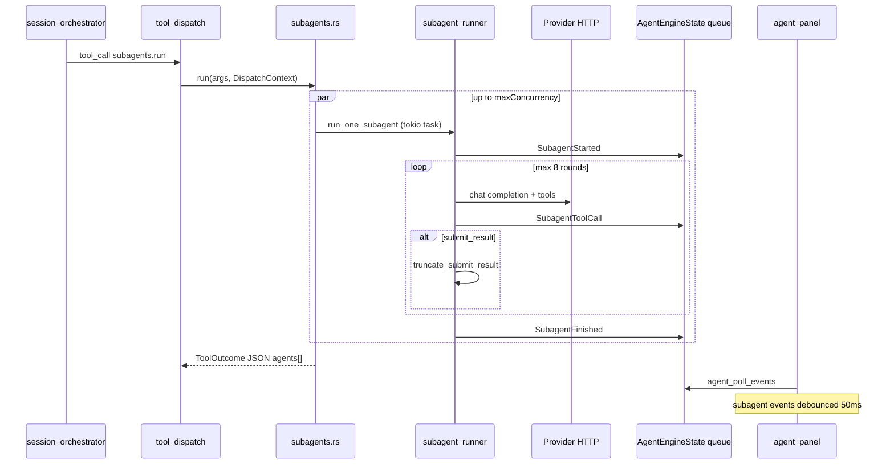

# Subagents (developer)

Coordinated subagents let the **coordinator** (main agent turn) spawn parallel, filtered tool loops that share `DispatchContext` (provider, API key, model, thinking level, workspace root). Results are structured JSON via `submit_result`; live progress is pushed on the shared `AgentEvent` queue.

For harness-wide context (core skills, web settings), see [Agent Harness](agent-harness.md). This document focuses only on the subagent stack.

## File map

| File | Responsibility |
|------|----------------|
| `subagents.rs` | `subagents.run` tool: validate spec, semaphore, spawn `run_one_subagent` per agent |
| `subagent_runner.rs` | HTTP completion loop (OpenAI-compatible + Anthropic), caps, events |
| `subagent_prompts.rs` | `SubagentRole`, defaults, system prompt, display names, `truncate_submit_result` |
| `tool_groups.rs` | `ToolGroup`, `registry_filtered`, coordinator vs subagent catalogs |
| `tool_dispatch.rs` | Shared tool routing (coordinator path; subagent runner has local handler) |
| `tools_extra.rs` | `subagents.run` and `submit_result` `ToolDef` schemas |
| `protocol.rs` / `agent_wire.rs` | `SubagentStarted`, `SubagentStep`, `SubagentToolCall`, `SubagentFinished` |

Frontend:

| File | Responsibility |
|------|----------------|
| `agent_panel/subagent_debounce.rs` | 50 ms debounce before `apply_agent_event` |
| `agent_panel/timeline.rs` | `TimelineItem::SubagentGroup`, card UI |
| `agent_timeline.rs` | `subagent_status_label`, `subagent_role_label`, `tool_label` |

## Control flow



Subagent message history is **transient** (per-task `Vec<Value>` in the runner). It is not appended to `AgentEngineState` conversation.

## `subagents.run` arguments

Parsed in `subagents.rs` as `RunSpec` / `AgentSpec` (camelCase JSON):

```json
{
  "agents": [
    {
      "id": "ui-review",
      "role": "review",
      "title": "Chat UI Review",
      "task": "Inspect timeline integration risks.",
      "successCriteria": ["List UI touchpoints", "Return concrete risks"],
      "allowedToolGroups": ["environment_read", "workspace_read", "diff_read"]
    }
  ],
  "mode": "parallel",
  "maxConcurrency": 3
}
```

| Field | Rules |
|-------|--------|
| `agents` | 1–5 entries, required |
| `role` | `scout` \| `review` \| `security_analyst` |
| `allowedToolGroups` | Optional; empty → `SubagentRole::default_groups()` |
| `maxConcurrency` | Default 3, capped at agent count |

After parsing groups, the runtime always appends `ToolGroup::SubagentSubmit` and removes `SubagentsRun` and `ShellWrite`.

## Default groups per role

From `subagent_prompts.rs`:

| Role | Groups |
|------|--------|
| `scout` | `environment_read`, `workspace_read`, `git_read`, `memory_read`, `plans_read`, `rules_skills_read` |
| `review` | `environment_read`, `workspace_read`, `diff_read`, `tasks_read` |
| `security_analyst` | `environment_read`, `workspace_read`, `diff_read`, `git_read` |

`web_read` is included only when `web_settings::web_tools_enabled()` is true at catalog build time.

## `submit_result`

Registered in `tools_extra.rs`; **only** in subagent-filtered catalogs (`ToolGroup::SubagentSubmit`). Coordinator `tool_dispatch` rejects or does not expose it on the main loop the same way — subagent runner handles it in `handle_tool_call` before `execute_subagent_tool`.

Required properties: `status`, `summary`. Typical payload:

```json
{
  "status": "completed",
  "role": "review",
  "displayName": "Review",
  "summary": "Three UI risks found.",
  "steps": [{ "id": "scan", "title": "Scan timeline.rs", "status": "completed" }],
  "findings": [{ "severity": "warning", "title": "...", "evidence": "...", "paths": ["src/..."] }],
  "artifacts": [{ "kind": "patch_hint", "title": "...", "content": "..." }],
  "recommendedNextActions": ["Add test for SubagentGroup serde"]
}
```

`truncate_submit_result` (coordinator-facing payload size):

- `findings` → max 20; `evidence` per finding → 2000 chars
- `artifacts` → max 10; `content` per artifact → 4000 chars

## Runner caps (`subagent_runner.rs`)

| Cap | Constant / behaviour |
|-----|----------------------|
| Tool rounds | `MAX_SUBAGENT_ROUNDS = 8` |
| Output tokens | `MAX_OUTPUT_TOKENS_ESTIMATE = 20_000` (usage field or char/4 estimate) |
| HTTP timeout | 180 s client timeout |
| Cancel | `state.cancelled()` → `shell_exec::kill_all_children()`, `blocked` result |

Exit without `submit_result` → `blocked_result` with summary `"max iterations reached without submit_result"`.

## Providers

```rust
pub enum SubagentProvider {
    OpenAi(Endpoint),  // OpenRouter or OpenAI-compatible
    Anthropic,
}
```

`SubagentProvider::from_settings` — if provider kind is unsupported, `subagents.run` returns an error ToolOutcome.

Implementation note: subagent loops use **non-streaming** completions (unlike the coordinator’s SSE streams).

## IPC events

| Event | When | UI effect |
|-------|------|-----------|
| `subagent_started` | Start of `run_one_subagent` | New card in last `SubagentGroup` |
| `subagent_step` | Protocol + timeline support | Merge/update step row by `step_id` |
| `subagent_tool_call` | Each tool before execute | Append `ToolActivity` on card |
| `subagent_finished` | After `submit_result` or cap | Set card `status` + `summary` |

**Note:** `subagent_runner` currently emits `SubagentStarted`, `SubagentToolCall`, and `SubagentFinished`. `SubagentStep` is handled in `timeline.rs` but not yet pushed from the runner — steps in UI mainly come from `submit_result` summary unless you add step events in the runner.

### Frontend debounce

`agent_panel/mod.rs` routes subagent timeline events through `SubagentEventDebounce` (50 ms generation counter). Voice and non-subagent events apply immediately.

## Tool catalog filtering

```rust
registry_filtered(groups, web_enabled)
render_for_openai_filtered(groups, web_enabled)
render_for_anthropic_filtered(groups, web_enabled)  // names via to_anthropic_name
```

`coordinator_groups(web_enabled)` includes `SubagentsRun` but not `SubagentSubmit`. Subagent runs never include `CoordinatorHarness` unless explicitly added via custom groups (unusual).

## System prompt contract

`system_prompt.rs` lists `subagents.run` in the tool index and states explicit-user activation only. Full parameter docs: core skill `harness_skills/subagents.md` via `skills_read`.

## Adding a role

1. `SubagentRole` enum + `parse` + `default_groups` in `subagent_prompts.rs`
2. `subagent_system_prompt` role line
3. `display_name_en` + `role_id`
4. Validate in `subagents.rs` (unknown role error)
5. `I18nKey::AgRole*` in `keys.rs` + all `locales/*.rs`
6. `agent_timeline::subagent_role_label`
7. Extend `harness_skills/subagents.md` and user [Subagents](../user/subagents.md) role table

## Tests

- `tool_groups.rs` — filtered registry must not leak `subagents.run` / `submit_result` incorrectly
- Run `cargo test -p blxcode` after changes to `subagents.rs` or `subagent_runner.rs`

## Plan reference

`.agents/plans/coordinated-subagents.md` — original design decisions (German), including truncation limits and harness-vs-shell notes.

## See also

- [Agent Harness](agent-harness.md) — `tool_dispatch`, environment cache, web settings
- [Tauri IPC](tauri-ipc.md) — agent poll/submit commands (no separate subagent commands)
- [Architecture](architecture.md) — agent subsystem overview
- [User: Subagents](../user/subagents.md) — end-user guide
