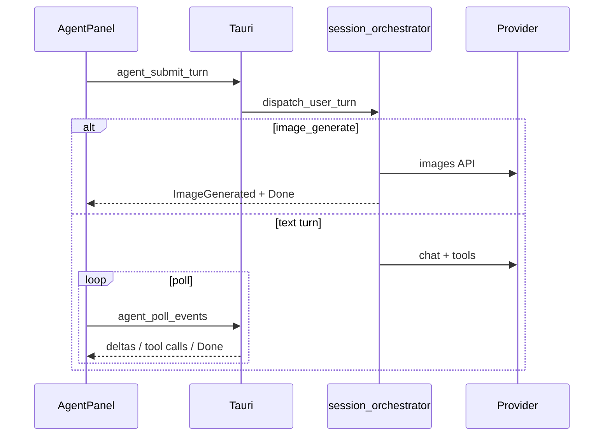
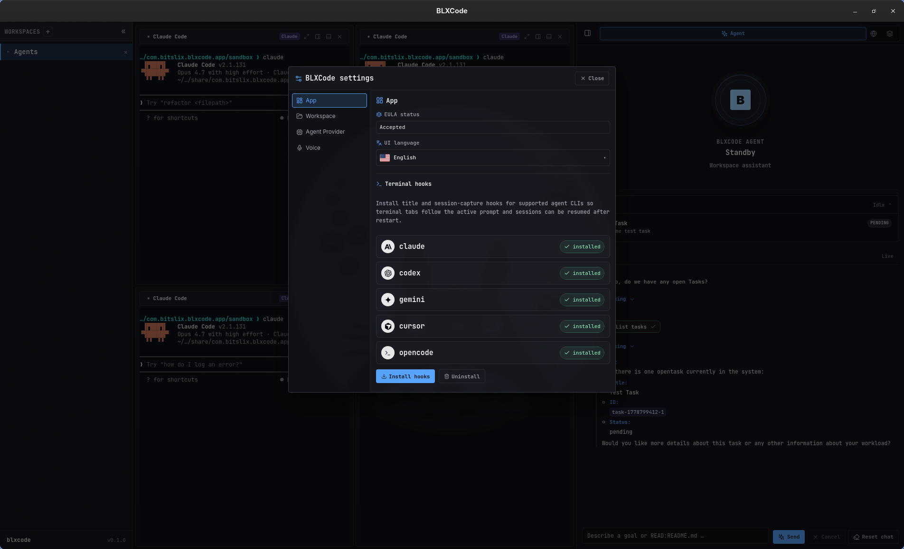

# Agent Providers

BLXCode includes an agent panel that can stream turns from remote model providers and execute registered tools. Provider settings are stored locally and can be changed from the app UI.

## Right panel tabs

| Tab | Purpose |
|-----|---------|
| **Agent** | Chat, context, tasks, voice orb |
| **Browser** | Embedded webview / iframe |
| **Plans** | Markdown plans — [Plans guide](plans.md) |
| **Memory** | Notes and graph — [Memory And Tasks](memory-and-tasks.md) |
| **Rules** | Workspace rules — [Rules And Skills](rules-and-skills.md) |
| **Skills** | Installable skills — [Rules And Skills](rules-and-skills.md) |

  

## Supported Provider Types

- **OpenRouter**: default provider kind. The default model ID is `openai/gpt-5`.
- **Anthropic**: native Anthropic Messages API path.
- **OpenAI-compatible**: OpenAI API-compatible chat/model path.

Model lists are fetched live when possible. If a provider request fails or returns no models, BLXCode falls back to cached or curated model entries.

## API Keys

All secrets are managed under **Settings → API Keys** (single Save/Discard pane). BLXCode stores them in the OS keyring (`BLXCode` service) with `BLX_*` env fallback when a slot is empty.

**Settings → BLXCode Agent** shows provider/model/thinking for text, image, and voice plus web-tool backend choice. Each column displays a short **configured / missing** hint — no password fields.

| Use | Keys in API Keys pane |
|-----|------------------------|
| Text agent | OpenRouter, Anthropic, OpenAI, … |
| Image mode | OpenAI, OpenRouter, fal.ai |
| Voice STT/TTS | OpenAI, OpenRouter, AWS (Polly) |
| Web search/fetch | Tavily, Brave |

See [Settings](settings.md) and [Voice](voice.md) / [Image Mode](image.md).

## Thinking Levels

Off, Low, Medium, High, Max — mapped per provider where supported.

## Agent context

The **Context** section lists attached items (memory categories, notes, plans, images). Each row shows status, remove, and re-attach controls.

**Context images** (vision / handoff, not image generation):

- Attach via drag-and-drop or paste (PNG, JPEG, WebP, GIF).
- Pending images are sent once on the next turn through vision payloads, then marked read.
- Handoff exports copies to `<workspace>/.blxcode/agent-context/images/` — see [Workspaces — Handoff](workspaces.md#terminal-agent-context-handoff).
- Client tools: `image_context_list`, `image_context_detach`.

Conversation history strips image bytes after a turn so large payloads are not persisted.

## Mandatory turn checklist

For non-trivial work, the system prompt requires this order:

1. `rules_list` + `rules_read` on active rules
2. `skills_list` + `skills_read` when relevant (including **core** harness skills — see [Agent Harness](agent-harness.md))
3. Resume from `task_list` / `activePlanPath` on continuation phrases (*continue*, *resume*, *weiter*, *fortsetzen*, …)
4. Memory, plans, and project context
5. Execute

See [Rules And Skills](rules-and-skills.md) for rule/skill behavior.

## Agent tools (overview)

The system prompt sends a **compact tool name index** only. Full parameter docs live in core skills (`skills_read file-access`, `skills_read git`, etc.).

Call `list_tools` for the full JSON catalog (name, server/client site, schema).

| Group | Examples |
|-------|-----------|
| Workspace files | `list_workspace_files`, `read_workspace_file`, `workspace_search` |
| Memory | `memory_list`, `memory_read`, `memory_create`, `memory_graph`, `memory_context_*`, … |
| Tasks | `task_list`, `task_create`, `task_update`, … |
| Plans | `plan_list`, `plan_read`, `plan_load`, `plan_context_*`, … |
| Rules / skills | `rules_*`, `skills_*` |
| Harness (client) | `harness.send_terminal_keys`, `harness.send_agent_context`, … |
| Environment / shell / git (server) | `environment_detect`, `shell_exec`, `git_*`, `workspace_diff`, … |
| Web (server, if configured) | `web_search`, `web_fetch` |
| Subagents (server) | `subagents.run` — only on explicit user request — [Subagents guide](subagents.md) |

`harness.send_agent_context` prefers explicit single-terminal targets; default `includeKinds` is `["memory","plans","tasks","images"]`.

**Web tools** need Tavily or Brave keys in **Settings → API Keys**, then a backend choice under **BLXCode Agent → Web Tools**. **Shell/Git** need `environment_detect` once per workspace session.

See [Agent Harness](agent-harness.md) for core skills and web keys; [Subagents](subagents.md) for roles, timeline, and tool groups.

## Conversation flow

The frontend polls `agent_poll_events` (not SSE). Voice turns set `voice_input`; chat turns may emit `voice_ready` for TTS. Image turns may play a short confirmation phrase when voice + TTS are enabled — [Image Mode](image.md).

## Hooks For External Agents

BLXCode bundles helper scripts under `content/hooks/` for session and title capture: Claude, Codex, Gemini, OpenCode, Cursor.

  

## Missing Key Behavior

If the selected provider has no configured API key, the agent panel reports the missing key instead of attempting a network request.

## See also

- [Agent Harness](agent-harness.md) — core skills, web/shell/git tools
- [Subagents](subagents.md) — parallel subagent runs
- [Image Mode](image.md) — chat image generation toggle
- [Plans](plans.md) — plan tools and context
- [Workspaces](workspaces.md) — handoff and terminals
- [Memory And Tasks](memory-and-tasks.md) — memory tools and graph
