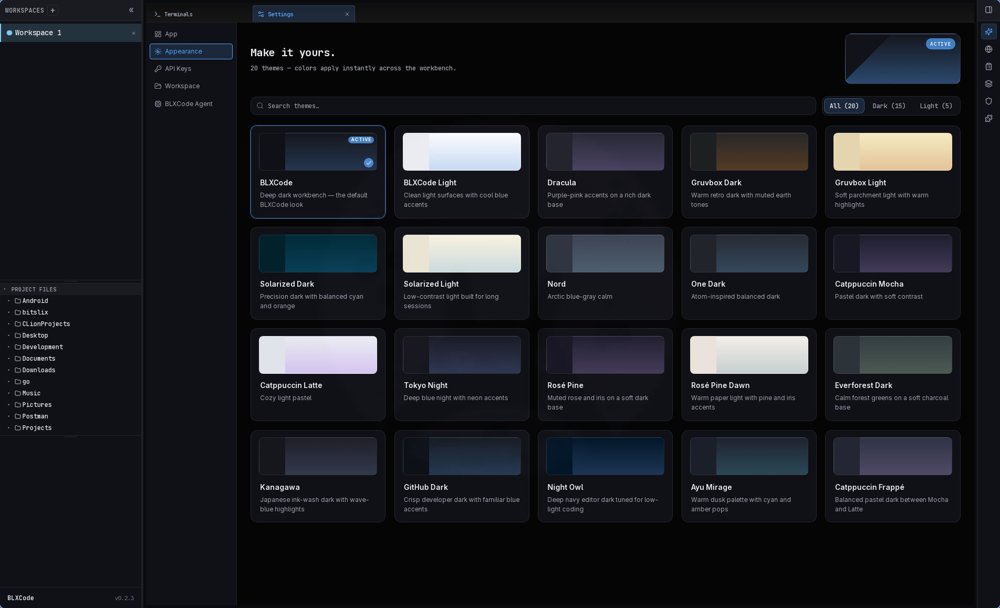

# Appearance & Themes

BLXCode ships **20 app themes** (15 dark + 5 light). Colors apply across the workbench — sidebar, settings, terminals, memory graph, and agent panels — via a shared token system.

## Open the theme picker

1. Open **Settings** (command palette → **Open Settings**, or your configured shortcut).
2. Select **Appearance** in the left sidebar.

The pane shows:

- A **hero preview** of the active theme (top right)
- A **search** field (filters by translated name and description)
- **All / Dark / Light** filters with counts (`All (20)`, `Dark (15)`, `Light (5)`)
- A **grid of theme cards** with mini layout previews

Click a card to apply the theme immediately. The active card shows an **ACTIVE** badge and accent border.

  

## Default theme

**BLXCode** (`blxcode-dark`) is the default — the same deep dark look BLXCode used before themes shipped. First launch and a cleared `localStorage` always fall back to this theme.

## Available themes

| Theme | Mode |
|-------|------|
| **BLXCode** | Dark |
| BLXCode Light | Light |
| Dracula | Dark |
| Gruvbox Dark / Light | Dark / Light |
| Solarized Dark / Light | Dark / Light |
| Nord | Dark |
| One Dark | Dark |
| Catppuccin Mocha / Latte / Frappé | Dark / Light / Dark |
| Tokyo Night | Dark |
| Rosé Pine | Dark |
| Rosé Pine Dawn | Light |
| Everforest Dark | Dark |
| Kanagawa | Dark |
| GitHub Dark | Dark |
| Night Owl | Dark |
| Ayu Mirage | Dark |

Theme names and descriptions follow your **Settings → App → Language** choice.

## Persistence

The selected theme is stored in browser `localStorage` under `blxcode_theme_v1` and restored on reload. A small inline script in `index.html` applies the saved theme before CSS loads to avoid a flash of the wrong colors.

## What themes do not change

Some surfaces are intentionally outside the theme selector:

- **Embedded browser page content** (Linux iframe) — only the app chrome around the page follows the theme.
- **Native child webviews** on Windows/macOS — outside SPA styling.
- **Memory category swatches** you set under Workspace → Category colors — user data, not app chrome.
- **Flag icons** in the language picker — national colors stay accurate.

See [Theme exceptions](../THEME_EXCEPTIONS.md) for the full list.

## See also

- [Settings](settings.md) — all settings categories
- [UI Language](language.md) — locale picker (App tab)
