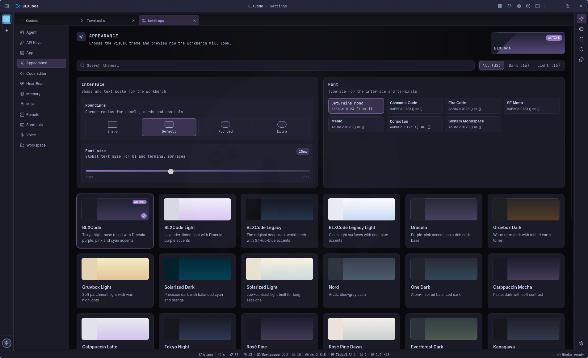

# Appearance & Themes

BLXCode ships **32 app themes** (16 dark + 16 light). Colors apply across the workbench — sidebar, settings, terminals, memory graph, and agent panels — via a shared token system. Two theme-independent **Roundings** and **Font** controls sit above the theme grid.

## Open the theme picker

1. Open **Settings** (command palette → **Open Settings**, or your configured shortcut).
2. Select **Appearance** in the left sidebar.

The pane shows:

- A **hero preview** of the active theme (top right)
- **Roundings** — a global corner-radius scale picker (*Sharp / Default / Rounded / Extra*)
- **Font** — a curated monospace picker (JetBrains Mono bundled, plus Cascadia Code, Fira Code, SF Mono, Menlo, Consolas, and System Monospace as system-dependent options)
- A **search** field (filters by translated name and description)
- **All / Dark / Light** filters with counts (`All (32)`, `Dark (16)`, `Light (16)`)
- A **grid of theme cards** with mini layout previews

Click a card to apply the theme immediately. The active card shows an **ACTIVE** badge and accent border.

  

## Default theme

**BLXCode** (`blxcode-dark`) is the default — the flagship Tokyo Night × Dracula dark look. First launch and a cleared `localStorage` always fall back to this theme. The previous GitHub-blue default lives on unchanged as **BLXCode Legacy / BLXCode Legacy Light** (ids `blxcode-legacy-dark` / `blxcode-legacy-light`), so anyone who preferred the old look can switch back.

## Available themes

| Theme | Mode |
|-------|------|
| **BLXCode** | Dark |
| BLXCode Light | Light |
| **BLXCode Legacy** | Dark |
| **BLXCode Legacy Light** | Light |
| Dracula | Dark |
| Gruvbox Dark / Light | Dark / Light |
| Solarized Dark / Light | Dark / Light |
| Nord | Dark |
| Nord Light | Light |
| One Dark | Dark |
| One Light (Atom) | Light |
| Catppuccin Mocha / Latte / Frappé | Dark / Light / Dark |
| Tokyo Night | Dark |
| Tokyo Night Light | Light |
| Rosé Pine | Dark |
| Rosé Pine Dawn | Light |
| Everforest Dark | Dark |
| Kanagawa | Dark |
| Claude Code | Dark |
| Night Owl | Dark |
| Ayu Mirage | Dark |
| Ayu Light | Light |
| GitHub Light | Light |
| Winter Light | Light |
| Paper Light | Light |
| Alpine Light | Light |
| Frost Light | Light |
| Lilac Light | Light |

> **BLXCode** (the default) draws heavily on **Tokyo Night** (night-blue base) fused with **Dracula** (purple accent `#bd93f9`, pink/cyan syntax). **BLXCode Legacy** is the previous GitHub-blue look, kept under new ids so it can be selected explicitly.
> **Claude Code** is a warm-charcoal dark theme modeled on the Claude Code CLI with a coral accent. It replaces the older `github-dark` slot, whose blue tones overlapped the default BLXCode dark theme.
> The ten new light themes are five brand light counterparts (Tokyo Night Light, Nord Light, GitHub Light, Ayu Light, One Light) and five custom cool designs (Winter Light, Paper Light, Alpine Light, Frost Light, Lilac Light).

Theme names and descriptions follow your **Settings → App → Language** choice.

## Roundings and Font

Two theme-independent controls sit above the theme grid and affect every theme equally.

### Roundings

A global corner-radius scale applied through a single `--radius-scale` multiplier over a semantic token set:

| Token | Role |
|-------|------|
| `--radius-xs` | Tightest radius (small chips, inline tags) |
| `--radius-sm` | Small surfaces (buttons, inputs) |
| `--radius-md` | Standard surfaces (cards, panels) |
| `--radius-lg` | Larger surfaces (modals, popovers) |
| `--radius-xl` | Largest radius (hero blocks) |
| `--radius-pill` | Pill-shaped controls (intentionally not scaled) |
| `--radius-circle` | Perfect-circle controls (intentionally not scaled) |

| Pick | Behavior |
|------|----------|
| **Sharp** | Minimal radius, square workbench feel |
| **Default** | The original BLXCode radius set |
| **Rounded** | Softer, more rounded surfaces |
| **Extra** | Pronounced rounding across the workbench |

The previous hardcoded `border-radius` declarations were migrated to these tokens, so the whole workbench re-rounds instantly when you change the scale.

## Font size

A separate, theme-independent **Font size** stepper (Small / Medium / Large / Extra) overrides the central `--font-size-base` token used by the workbench, plans/rules/skills cards, and the [App status line](workspaces.md#app-status-line). It is persisted in `localStorage`, applied as an inline custom property on `<html>`, and broadcast through `blxcode-theme-changed` so dynamic UI respects it.

### Font

A curated monospace picker that overrides the central `--font-mono` token. The xterm terminals read their `fontFamily` from `--font-mono` and re-measure/re-fit (with a PTY resize) when the font changes.

| Option | Notes |
|--------|-------|
| **JetBrains Mono** | Bundled — works offline |
| **Cascadia Code** | System-dependent (Windows, some Linux) |
| **Fira Code** | System-dependent (macOS, some Linux) |
| **SF Mono** | System-dependent (macOS) |
| **Menlo** | System-dependent (macOS) |
| **Consolas** | System-dependent (Windows) |
| **System Monospace** | OS-default monospace face |

Each option is rendered in its own typeface inside the picker so you can preview the choice before applying.

## Persistence

The selected theme, roundings, and font are stored in browser `localStorage` (under `blxcode_theme_v1` and related keys) and restored on reload. A small inline script in `index.html` applies the saved values before CSS loads to avoid a flash of the wrong colors. `ThemeService` (in `src/workbench/theme_service.rs`) sets `html[data-theme]`, persists the choice, and dispatches `blxcode-theme-changed` so the terminal and 3D graph bridges re-read CSS variables. The roundings scale is applied as an inline custom property on `<html>`, and the font overrides `--font-mono` on the same node.

## What themes do not change

Some surfaces are intentionally outside the theme selector:

- **Embedded browser page content** (Linux iframe) — only the app chrome around the page follows the theme.
- **Native child webviews** on Windows/macOS — outside SPA styling.
- **Memory category swatches** you set under Workspace → Category colors — user data, not app chrome.
- **Flag icons** in the language picker — national colors stay accurate.

Pill and circle controls (intentionally not affected by the **Roundings** scale) keep their original `--radius-pill` / `--radius-circle` tokens.

See [Theme exceptions](../THEME_EXCEPTIONS.md) for the full list.

## See also

- [Settings](settings.md) — all settings categories
- [UI Language](language.md) — locale picker (App tab)
