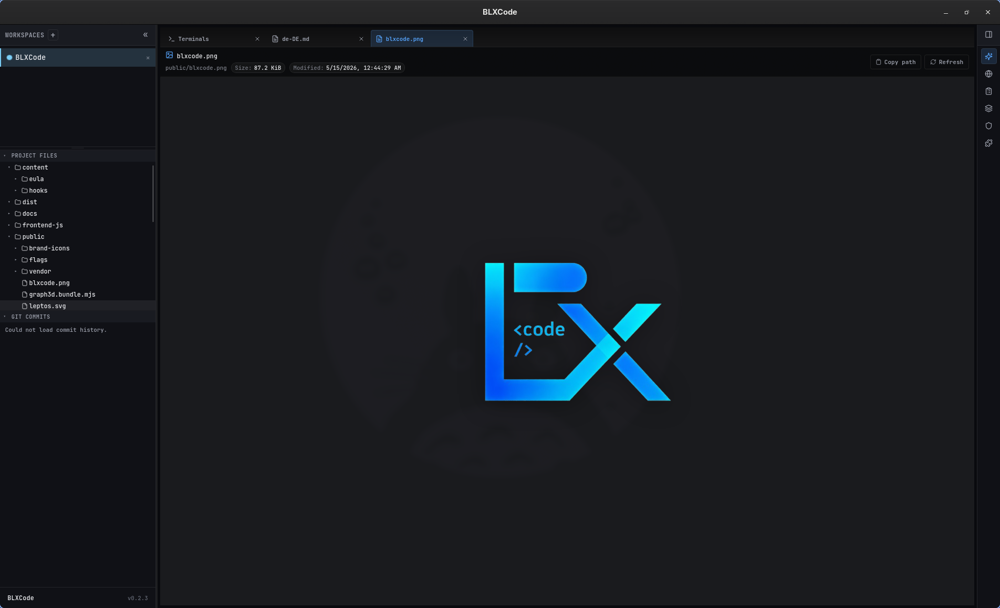
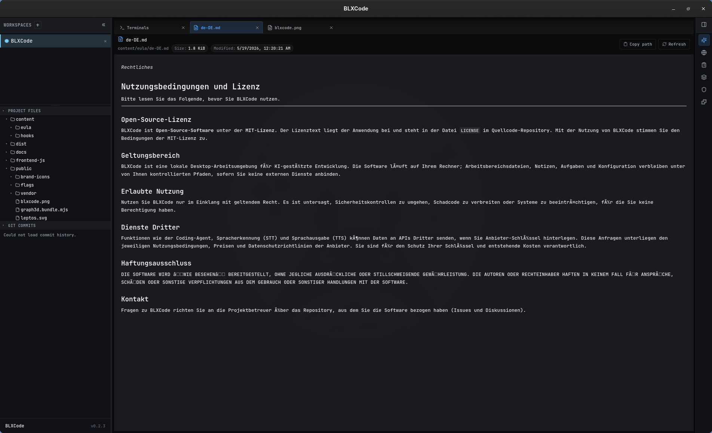
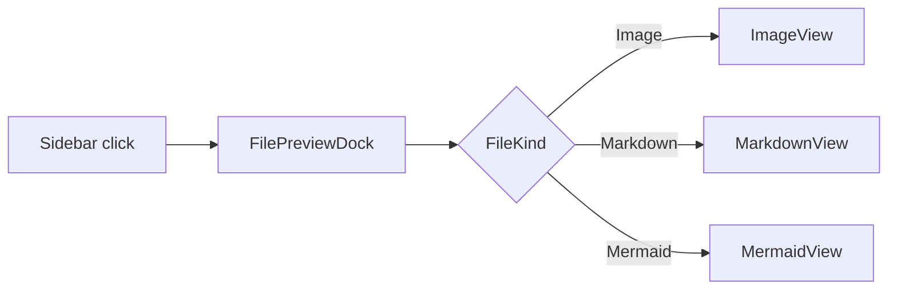
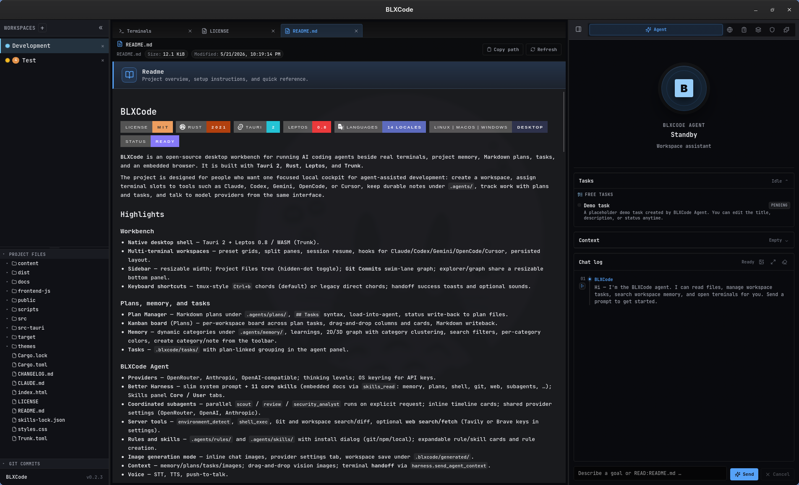
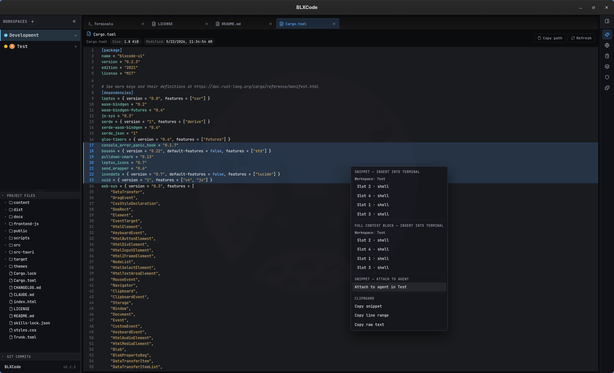

# File Preview

Clicking a file in the sidebar **Project Files** explorer opens (or reuses) a center workspace tab with a typed preview. The same tab is used for every file you open; switching files updates the contents instead of stacking new tabs.

## Supported file kinds

The preview picks a renderer based on the file extension:

| Kind | Extensions | Renderer |
|------|------------|----------|
| **Image** | `png`, `jpg`, `jpeg`, `webp`, `gif`, `avif`, `bmp`, `ico`, `svg` | Centered raster `` (base64 data URL) or sanitized inline SVG |
| **Video** | `mp4`, `webm`, `mov`, `m4v`, `mkv` | Native `<video controls>` with HTML5 playback |
| **Markdown** | `md`, `markdown` | `pulldown-cmark` (GFM tables, strikethrough, task lists, footnotes, smart punctuation) with sanitized HTML and inline Mermaid blocks |
| **Mermaid** | `mmd`, `mermaid` | Lazy-loaded [Mermaid 11](https://mermaid.js.org/) diagram via vendored bundle |
| **Code** | `rs`, `ts`, `tsx`, `js`, `jsx`, `mjs`, `cjs`, `py`, `go`, `java`, `kt`, `scala`, `swift`, `c`, `cpp`, `cs`, `rb`, `php`, `lua`, `dart`, `r`, `clj`, `ex`, `hs`, `elm`, `zig`, `nim`, `html`, `vue`, `svelte`, `css`, `scss`, `less`, `json`, `toml`, `yaml`, `xml`, `sh`, `bash`, `ps1`, `sql`, `graphql`, `proto`, `tf`, `nix`, `dockerfile`, `makefile`, `diff`, … | Two-column code view: gutter with **line numbers** + syntax-highlighted code (highlight.js 11). Click any row to **toggle a selection highlight** for that line. |
| **Text** | `txt`, `log`, `ini`, `conf`, `env`, `properties`, `csv`, `tsv`, `gitignore`, `editorconfig`, … | Same gutter + row-selection layout as Code, but without syntax highlighting (plain monospaced text). |
| **Binary** | everything else | "Preview not available for this file type" placeholder |

> **Note** — Common repository "policy" documents (`LICENSE`, `LICENCE`, `COPYING`, `CONTRIBUTING`, `CONTRIBUTORS`, `CODE_OF_CONDUCT`, `SECURITY`, `AUTHORS` / `MAINTAINERS` / `OWNERS` / `CODEOWNERS`, `CHANGELOG`, `README`) are detected by their **filename stem**, not their extension. They render as Markdown **with or without** a `.md` / `.markdown` suffix and get a special hero banner — see [Repository policy documents](#repository-policy-documents) below.

## Topbar

Every renderer shares the same topbar:

- **Type icon** — image/film/document/diagram glyph that matches the detected kind.
- **File name** — basename of the file.
- **Relative path** — workspace-relative path with a tooltip showing the full string when truncated.
- **Size chip** — formatted byte size (`87.2 KiB`, `1.4 MiB`, …).
- **Modified chip** — locale-aware timestamp from the filesystem `modified()` metadata.
- **Copy path** — copies the relative path to the clipboard; the button briefly switches to "Path copied".
- **Refresh** — re-reads the file from disk (file content **and** metadata).

<p align="center">
  
</p>

*Image preview: BLXCode logo (`public/blxcode.png`) rendered centered with a `drop-shadow` and the topbar showing `Size: 87.2 KiB · Modified: 5/15/2026, 12:44:29 AM`.*

## Images

- **Raster images** (PNG / JPG / WebP / GIF / AVIF / BMP / ICO) are sent from the backend as base64 and embedded as a `data:` URL. They render centered with `object-fit: contain` so they scale to the tab without stretching.
- **SVG** files are read as UTF-8 text, sanitized (see [Security](#security)), and inlined into the DOM so CSS variables and themes can affect the artwork.
- Files larger than **16 MiB** (`MAX_IMAGE_PREVIEW_BYTES`) show a localized "Datei zu groß für Vorschau" banner instead of the image so the WebView is never flooded.

## Videos

- Supported containers: MP4, WebM, MOV, M4V, MKV (codec support depends on the platform WebView).
- Videos play through a native `<video controls preload="metadata">` element fed by a base64 data URL.
- Cap: **64 MiB** (`MAX_VIDEO_PREVIEW_BYTES`). Larger files show the too-large banner. For long media, open the file in an external player instead.

## Markdown

The Markdown renderer uses [`pulldown-cmark`](https://docs.rs/pulldown-cmark) with these extensions enabled:

- Tables
- Strikethrough
- Task lists
- Footnotes
- Smart punctuation

Headings, blockquotes, tables, inline code, and code blocks are styled to match the active BLXCode theme. Links keep their `href` but `javascript:` / `vbscript:` URIs are stripped on the way in.

<p align="center">
  
</p>

*Markdown preview: `content/eula/de-DE.md` rendered with headings, paragraphs, and proper UTF-8 (umlauts and special characters preserved end-to-end through the sanitizer).*

### Inline Mermaid in Markdown

Fenced ```` ```mermaid ```` blocks inside a Markdown file are detected during the cmark event stream and replaced with a sentinel `<pre class="mermaid">` element. After the HTML is mounted, the preview runs Mermaid on every sentinel in the document:

````markdown

````

Regular ```` ```rust ```` / ```` ```ts ```` code blocks stay as syntax-highlightable `<pre><code>` and are **not** sent to Mermaid.

## Repository policy documents

Open-source repositories conventionally ship a small set of "policy" files at the repo root — `LICENSE`, `CONTRIBUTING`, `CHANGELOG`, etc. These are commonly Markdown but they are **just as commonly shipped without any extension at all**. The file preview detects these by their **filename stem** (case-insensitive), so `LICENSE`, `LICENSE.md`, `License`, and `LICENCE` all render as Markdown — even when the file has no extension.

Each policy doc gets a **hero banner** above the rendered Markdown body. The banner shows:

- A **kind-specific icon** (e.g. scales for License, pull-request glyph for Contributing, lock for Security, …).
- A **bold title** (translated into the active UI language).
- A **one-line subtitle** explaining the document's role.
- A **left accent bar** in a kind-specific color: `License` is tinted with the **success** token, `Security` with the **danger** token, the rest with the active **accent** color.

Recognized stems and their banner kinds:

| Banner kind | Matched stems (case-insensitive) | Icon |
|---|---|---|
| **License** | `license`, `licence`, `copying`, `copyright`, `unlicense` | Scale |
| **Contributing** | `contributing`, `contribution`, `contributions` | Git pull request |
| **Contributors** | `contributors`, `contributer`, `contributers` | Users |
| **Code of Conduct** | `code_of_conduct`, `code-of-conduct`, `codeofconduct` | Shield-check |
| **Security Policy** | `security`, `security-policy`, `security_policy` | Lock |
| **Authors** | `authors`, `maintainers`, `owners`, `codeowners` | User-round |
| **Changelog** | `changelog`, `changes`, `history`, `release_notes`, `release-notes`, `releasenotes` | History |
| **Readme** | `readme` | Book-open |

The match is performed on the **stem only** (the filename minus its extension), so a `.md` / `.markdown` suffix is fully optional. A bare `LICENSE` is treated identically to `LICENSE.md`. Files whose stem doesn't match any of the rows above keep their normal classification (Markdown, Code, Text, Image, Binary, …) and **do not** show the hero banner.

Why this matters: previously a stand-alone `LICENSE` (no extension) would be classified as `Binary` and the preview would show "Preview not available for this file type." Now you get a properly rendered, theme-aware Markdown view with an obvious "License" banner — same for every other policy doc in the table above.

<p align="center">
  
</p>

*Bare `LICENSE` (no extension, 1.1 KiB) opens with the **License** hero banner — Scale icon, success-green left bar, translated title, and a one-line subtitle — followed by the MIT license text rendered as Markdown.*

<p align="center">
  
</p>

*`README.md` opens with the **Readme** hero banner (Book-open icon, accent-blue left bar) above the rendered README body — including badge rows, headings, and lists.*

## Source code & plain text

Code files (Rust, TypeScript, JavaScript, Python, Go, Java, Kotlin, Swift, C/C++, C#, Ruby, PHP, Lua, Dart, R, Clojure, Elixir, Haskell, Elm, Zig, Nim, HTML, Vue, Svelte, CSS, SCSS, JSON, TOML, YAML, XML, shell scripts, SQL, GraphQL, Protobuf, Terraform/HCL, Nix, Dockerfile, Makefile, diff/patch, …) and plain-text files (txt, log, ini, conf, env, properties, csv, tsv, gitignore, editorconfig) both render in a dedicated two-column **CodeView**:

- **Line numbers gutter** on the left — right-aligned, tabular numerals, separated by a hairline divider. The gutter width auto-sizes to the largest line number (`--code-view-gutter-width`).
- **Syntax highlighting** on the right via [highlight.js 11](https://highlightjs.org/) for every file whose extension maps to a known language. The bundle is vendored at `public/vendor/highlight/highlight.min.js` (~127 KiB, 38 common languages) and lazy-loaded on first use; subsequent code previews reuse `globalThis.hljs` without re-downloading.
- **Plain text** (txt/log/ini/conf/env/csv/…) gets the **same gutter + selection layout** but without highlighting — useful for logs and config files where you still want to reference a line number.

### Row and range selection

- **Click** any line — either on the line number, the code, or the empty space at the end of the row — to **highlight that row**. The selection is shown as an accent-soft background with a bright accent-colored bar on the left and the line number switching to the accent color. Click the same row again to clear the selection.
- **Drag** with the left mouse button to extend the selection across multiple lines. Press down on the first row, drag up or down to the last row, and release: every line in between stays highlighted. Releasing the button anywhere on the page ends the drag, even when the cursor leaves the gutter.

The selection state survives **Refresh** because the preview only resets it when you open a different file. The selection is useful for:

- Pointing the agent or a teammate at a specific line.
- Keeping a visual marker while you scroll through a long file.
- Combining with the right-click handoff menu below to send the highlighted lines anywhere in the workbench.

### Right-click handoff menu

<p align="center">
  
</p>

*Right-clicking on a selected line range in `Cargo.toml` opens the handoff menu — the selected lines are highlighted in the gutter, and the menu lists every terminal slot in the **Test** workspace (Slots 1–4 · shell) under both *Snippet → Insert into terminal* and *Full context block → Insert into terminal*, plus *Attach to agent in Test* and the *Clipboard* actions.*

Right-clicking on any row inside the code view opens a contextual menu. If the click lands outside the current selection the menu first replaces the selection with that single line; otherwise the existing range stays. The menu groups four kinds of actions, all of which respect the highlighted line range:

| Section | What happens | Where it ends up |
|---|---|---|
| **Snippet → Insert into terminal** | Writes a fenced markdown block (`**path:start-end**` + ```` ```lang ```` body) directly into the chosen PTY session. | Any open terminal in **any workspace** — the menu lists every workspace that has at least one live terminal, with the preview's own workspace pinned to the top and tagged with a localized **current** badge. |
| **Full context block → Insert into terminal** | Wraps the same snippet inside the standard `⟪ BLXCode attached context ⟫` envelope (Session header + File snippet section + end marker) so terminal agents parse it identically to a workspace handoff. | Same terminal targets as above. |
| **Snippet → Attach to agent** | Adds an `AgentContextKind::FileSnippet` entry to the chosen workspace's agent context; the inline content rides on the prompt the next time you submit a turn. | Any workspace's BLXCode Agent context — the preview's workspace is again pinned first with the **current** badge. |
| **Clipboard** | `Copy snippet` (fenced markdown), `Copy line range` (raw text of the selected lines), `Copy raw text` (the whole file). | `navigator.clipboard` — a toast confirms each copy. |

When the **target workspace** differs from the **preview workspace** (e.g. you have file `src/foo.rs` open in workspace **Demo** and insert the snippet into a terminal in workspace **Backend**), the rendered block adds a `source workspace: ` `Demo` line so the receiving agent knows the file lives elsewhere. The same disambiguating header is added when you attach the snippet to a different workspace's agent.

Toasts surface success and failure for every action — e.g. *Snippet inserted into terminal Slot 2 · codex (Workspace Backend)*, *Snippet attached to Demo agent*, or *Failed to insert into terminal: <backend detail>*. The menu closes on any click outside, on `Escape`, or after any item is activated.

The menu is fully localized — all section headers, workspace group labels, slot labels (*Slot 3 · shell*), and toast strings use the new `CodeViewMenu*` / `CodeViewToast*` i18n keys with `{workspace}`, `{terminal}`, `{slot}`, `{agent}`, `{error}` placeholders.

### Language detection

The mapping from file extension to highlight.js language alias lives in `hljs_lang_for_ext` (`src/workbench/file_preview/util.rs`) — for example:

| Extension(s) | hljs language |
|---|---|
| `rs` | `rust` |
| `ts`, `tsx` | `typescript` |
| `js`, `jsx`, `mjs`, `cjs` | `javascript` |
| `py`, `pyw`, `pyi` | `python` |
| `cs` | `csharp` |
| `kt`, `kts` | `kotlin` |
| `html`, `htm`, `vue`, `svelte`, `xhtml` | `xml` |
| `sh`, `bash`, `zsh`, `fish` | `bash` |
| `ps1` | `powershell` |
| `toml` | `ini` |
| `tf`, `tfvars`, `hcl` | `hcl` |
| `dockerfile`, `containerfile` | `dockerfile` |
| `makefile`, `mk`, `cmake` | `makefile` |
| `diff`, `patch` | `diff` |

If a file uses an extension that highlight.js does not support, the preview falls back to plain text but still shows line numbers and supports row selection. If highlight.js itself fails on a particular file, the renderer also falls back to plain text and logs a warning to the DevTools console — the file content is never lost.

### Theme integration

The code-view chrome (gutter, hover, selection bar) is built with `color-mix` against the active BLXCode theme tokens (`--accent`, `--text`, `--text-muted`, `--surface`, `--border`), so switching themes from **Settings → Appearance** immediately re-tints both the layout and the syntax-highlighted tokens. Light themes (`blxcode-light`, `solarized-light`, `gruvbox-light`, `catppuccin-latte`) override a few of the brighter dark-theme colors (strings, numbers, types, attributes, tags) so the code stays legible on bright backgrounds.

## Mermaid files

`.mmd` and `.mermaid` files render as a single full-tab diagram. The first preview on a session lazily loads the vendored Mermaid bundle from `public/vendor/mermaid/mermaid.min.js` and calls `mermaid.initialize({ startOnLoad: false, securityLevel: 'strict', theme: 'dark' })`; subsequent previews reuse `globalThis.mermaid` without re-downloading.

If Mermaid fails to load or the graph source is invalid, the preview keeps the file's text on screen and shows the translated **"Mermaid diagram could not be rendered"** banner. The technical error goes to the browser DevTools console (`console.warn`) for debugging — it is not leaked into the localized UI.

## Errors and edge cases

Every renderer routes errors through a shared `FilePreviewError` enum so messages are consistent and localized:

| Variant | UI banner | When |
|---------|-----------|------|
| `NoTauri` | "File preview is available in the desktop app." | Page opened in a non-Tauri shell (e.g. `trunk serve` without Tauri). |
| `WorkspaceNotFound` | "Workspace not found." | The workspace id from the open tab no longer exists. |
| `TooLarge(bytes)` | "File too large for preview (16 MiB)." | Image or video exceeds the per-kind cap. |
| `Failed(detail)` | **<Renderer-specific label>: <backend detail>** | Backend rejected the read (missing file, traversal out of workspace, not valid UTF-8 for Markdown / Mermaid / text, etc.). |

Per-renderer failure labels (all translated into every supported UI language):

- Image → **"Failed to load image"**
- Video → **"Failed to load video"**
- Markdown → **"Failed to load Markdown file"**
- Mermaid → **"Failed to load Mermaid file"**
- Text → **"Failed to load file"**
- Metadata (topbar) → **"Failed to load file information"**

Backend error details — `path not found`, `path outside workspace`, `not a file`, `file is not valid UTF-8 text`, `not an image file`, `not a video file` — are appended after the localized label so you can act on the root cause.

## Security

The previewer never injects raw HTML from disk verbatim:

- **SVG** — `<script>` and `<foreignObject>` blocks are removed; `on*=` event handlers and `javascript:` / `vbscript:` URIs in `href` / `xlink:href` / `src` / `formaction` / `action` are stripped before the SVG is inlined.
- **Markdown** — output from `pulldown-cmark` is passed through the same sanitizer: `<script>`, `<style>`, `<iframe>`, `<object>`, `<embed>` blocks are removed, event handlers stripped, and dangerous URI schemes neutralized. Multi-byte UTF-8 codepoints (`ü`, `€`, `你好`, emoji, …) are preserved because the sanitizer scans only ASCII delimiters and copies content via UTF-8-safe string slicing.
- **Mermaid** — initialized with `securityLevel: 'strict'`, so Mermaid sanitizes the graph source itself.

The Tauri backend never reads outside the workspace root: all three file commands (`stat_workspace_file`, `read_workspace_image_file`, `read_workspace_video_file`) reuse the existing `canonical_root` / `resolve_under_root` sandbox from `fs_entries.rs`, the same one the file tree already uses.

## Tips

- **Refresh** picks up disk changes without closing the tab — useful when the agent edits the file you're previewing.
- **Copy path** gives you the workspace-relative path; combine it with the agent context handoff (see [Workspaces](workspaces.md#terminal-agent-context-handoff)) to point a chat at the file.
- The preview shares the workspace center-tab strip with **Terminals** and **Settings**, so you can keep an editor and a preview side by side without losing focus on the terminal grid.

## See also

- [Workspaces → Sidebar → Project Files](workspaces.md#project-files-explorer) — the file tree that opens the preview.
- [Settings](settings.md) — UI language picker (changes the preview labels and errors on the fly).
- [Architecture → Sidebar Explorer And Git Graph](../developer/architecture.md#sidebar-explorer-and-git-graph) — backend commands and frontend module layout.
