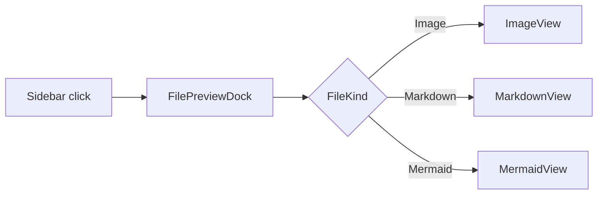

# File Preview

Clicking a file in the sidebar **Project Files** explorer opens (or reuses) a center workspace tab with a typed preview. The same tab is used for every file you open; switching files updates the contents instead of stacking new tabs.

## Supported file kinds

The preview picks a renderer based on the file extension:

| Kind | Extensions | Renderer |
|------|------------|----------|
| **Image** | `png`, `jpg`, `jpeg`, `webp`, `gif`, `avif`, `bmp`, `ico`, `svg` | Centered raster `` (base64 data URL) or sanitized inline SVG |
| **Video** | `mp4`, `webm`, `mov`, `m4v`, `mkv` | Native `<video controls>` with HTML5 playback |
| **Markdown** | `md`, `markdown` | `pulldown-cmark` (GFM tables, strikethrough, task lists, footnotes, smart punctuation) with sanitized HTML and inline Mermaid blocks |
| **Mermaid** | `mmd`, `mermaid` | Lazy-loaded [Mermaid 11](https://mermaid.js.org/) diagram via vendored bundle |
| **Text** | `txt`, `log`, `rs`, `ts`, `tsx`, `js`, `json`, `toml`, `yaml`, `html`, `css`, `py`, `go`, `rb`, `sh`, `sql`, `xml`, `ini`, `conf`, … | Monospaced `<pre><code>` (UTF-8 only) |
| **Binary** | everything else | "Preview not available for this file type" placeholder |

## Topbar

Every renderer shares the same topbar:

- **Type icon** — image/film/document/diagram glyph that matches the detected kind.
- **File name** — basename of the file.
- **Relative path** — workspace-relative path with a tooltip showing the full string when truncated.
- **Size chip** — formatted byte size (`87.2 KiB`, `1.4 MiB`, …).
- **Modified chip** — locale-aware timestamp from the filesystem `modified()` metadata.
- **Copy path** — copies the relative path to the clipboard; the button briefly switches to "Path copied".
- **Refresh** — re-reads the file from disk (file content **and** metadata).

<p align="center">
  
</p>

*Image preview: BLXCode logo (`public/blxcode.png`) rendered centered with a `drop-shadow` and the topbar showing `Size: 87.2 KiB · Modified: 5/15/2026, 12:44:29 AM`.*

## Images

- **Raster images** (PNG / JPG / WebP / GIF / AVIF / BMP / ICO) are sent from the backend as base64 and embedded as a `data:` URL. They render centered with `object-fit: contain` so they scale to the tab without stretching.
- **SVG** files are read as UTF-8 text, sanitized (see [Security](#security)), and inlined into the DOM so CSS variables and themes can affect the artwork.
- Files larger than **16 MiB** (`MAX_IMAGE_PREVIEW_BYTES`) show a localized "Datei zu groß für Vorschau" banner instead of the image so the WebView is never flooded.

## Videos

- Supported containers: MP4, WebM, MOV, M4V, MKV (codec support depends on the platform WebView).
- Videos play through a native `<video controls preload="metadata">` element fed by a base64 data URL.
- Cap: **64 MiB** (`MAX_VIDEO_PREVIEW_BYTES`). Larger files show the too-large banner. For long media, open the file in an external player instead.

## Markdown

The Markdown renderer uses [`pulldown-cmark`](https://docs.rs/pulldown-cmark) with these extensions enabled:

- Tables
- Strikethrough
- Task lists
- Footnotes
- Smart punctuation

Headings, blockquotes, tables, inline code, and code blocks are styled to match the active BLXCode theme. Links keep their `href` but `javascript:` / `vbscript:` URIs are stripped on the way in.

<p align="center">
  
</p>

*Markdown preview: `content/eula/de-DE.md` rendered with headings, paragraphs, and proper UTF-8 (umlauts and special characters preserved end-to-end through the sanitizer).*

### Inline Mermaid in Markdown

Fenced ```` ```mermaid ```` blocks inside a Markdown file are detected during the cmark event stream and replaced with a sentinel `<pre class="mermaid">` element. After the HTML is mounted, the preview runs Mermaid on every sentinel in the document:

````markdown

````

Regular ```` ```rust ```` / ```` ```ts ```` code blocks stay as syntax-highlightable `<pre><code>` and are **not** sent to Mermaid.

## Mermaid files

`.mmd` and `.mermaid` files render as a single full-tab diagram. The first preview on a session lazily loads the vendored Mermaid bundle from `public/vendor/mermaid/mermaid.min.js` and calls `mermaid.initialize({ startOnLoad: false, securityLevel: 'strict', theme: 'dark' })`; subsequent previews reuse `globalThis.mermaid` without re-downloading.

If Mermaid fails to load or the graph source is invalid, the preview keeps the file's text on screen and shows the translated **"Mermaid diagram could not be rendered"** banner. The technical error goes to the browser DevTools console (`console.warn`) for debugging — it is not leaked into the localized UI.

## Errors and edge cases

Every renderer routes errors through a shared `FilePreviewError` enum so messages are consistent and localized:

| Variant | UI banner | When |
|---------|-----------|------|
| `NoTauri` | "File preview is available in the desktop app." | Page opened in a non-Tauri shell (e.g. `trunk serve` without Tauri). |
| `WorkspaceNotFound` | "Workspace not found." | The workspace id from the open tab no longer exists. |
| `TooLarge(bytes)` | "File too large for preview (16 MiB)." | Image or video exceeds the per-kind cap. |
| `Failed(detail)` | **<Renderer-specific label>: <backend detail>** | Backend rejected the read (missing file, traversal out of workspace, not valid UTF-8 for Markdown / Mermaid / text, etc.). |

Per-renderer failure labels (all translated into every supported UI language):

- Image → **"Failed to load image"**
- Video → **"Failed to load video"**
- Markdown → **"Failed to load Markdown file"**
- Mermaid → **"Failed to load Mermaid file"**
- Text → **"Failed to load file"**
- Metadata (topbar) → **"Failed to load file information"**

Backend error details — `path not found`, `path outside workspace`, `not a file`, `file is not valid UTF-8 text`, `not an image file`, `not a video file` — are appended after the localized label so you can act on the root cause.

## Security

The previewer never injects raw HTML from disk verbatim:

- **SVG** — `<script>` and `<foreignObject>` blocks are removed; `on*=` event handlers and `javascript:` / `vbscript:` URIs in `href` / `xlink:href` / `src` / `formaction` / `action` are stripped before the SVG is inlined.
- **Markdown** — output from `pulldown-cmark` is passed through the same sanitizer: `<script>`, `<style>`, `<iframe>`, `<object>`, `<embed>` blocks are removed, event handlers stripped, and dangerous URI schemes neutralized. Multi-byte UTF-8 codepoints (`ü`, `€`, `你好`, emoji, …) are preserved because the sanitizer scans only ASCII delimiters and copies content via UTF-8-safe string slicing.
- **Mermaid** — initialized with `securityLevel: 'strict'`, so Mermaid sanitizes the graph source itself.

The Tauri backend never reads outside the workspace root: all three file commands (`stat_workspace_file`, `read_workspace_image_file`, `read_workspace_video_file`) reuse the existing `canonical_root` / `resolve_under_root` sandbox from `fs_entries.rs`, the same one the file tree already uses.

## Tips

- **Refresh** picks up disk changes without closing the tab — useful when the agent edits the file you're previewing.
- **Copy path** gives you the workspace-relative path; combine it with the agent context handoff (see [Workspaces](workspaces.md#terminal-agent-context-handoff)) to point a chat at the file.
- The preview shares the workspace center-tab strip with **Terminals** and **Settings**, so you can keep an editor and a preview side by side without losing focus on the terminal grid.

## See also

- [Workspaces → Sidebar → Project Files](workspaces.md#project-files-explorer) — the file tree that opens the preview.
- [Settings](settings.md) — UI language picker (changes the preview labels and errors on the fly).
- [Architecture → Sidebar Explorer And Git Graph](../developer/architecture.md#sidebar-explorer-and-git-graph) — backend commands and frontend module layout.
