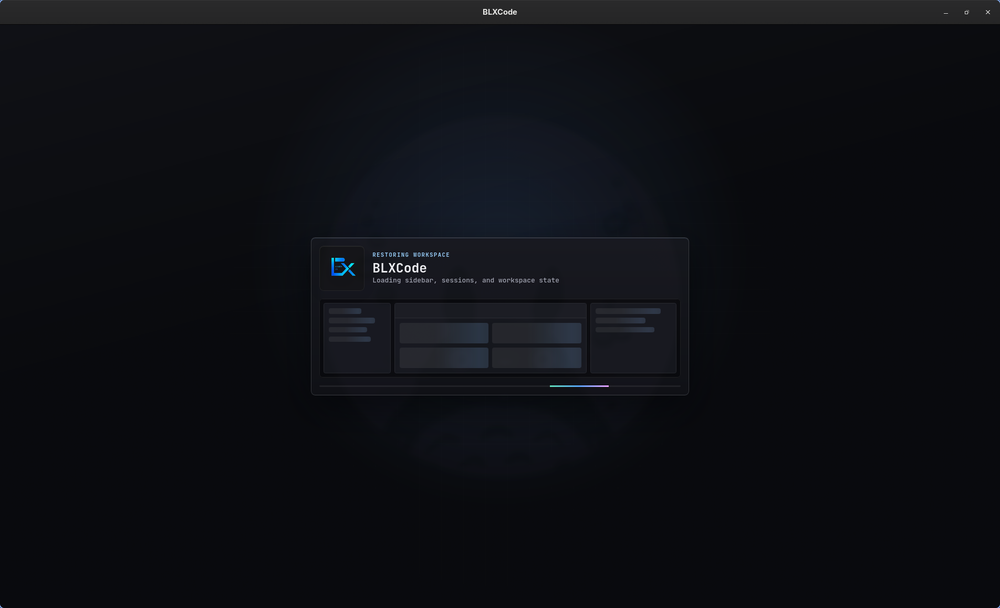

# Getting Started

BLXCode is a desktop app for AI-assisted development. It combines workspaces, terminal grids, an agent panel, project memory, tasks, and an embedded browser in one Tauri shell.

## Install Prerequisites

Install:

- Rust stable and Cargo.
- The `wasm32-unknown-unknown` Rust target.
- Trunk.
- Cargo Tauri CLI.
- Tauri 2 system dependencies for your operating system.

```bash
rustup target add wasm32-unknown-unknown
cargo install trunk tauri-cli
```

Linux users also need the WebKitGTK and native build dependencies required by Tauri 2. Package names vary by distribution.

## Run From Source

From the repository root:

```bash
cargo tauri dev
```

This launches the Tauri app and automatically starts Trunk using the command configured in `src-tauri/tauri.conf.json`. Trunk serves the frontend at `http://localhost:1420`.

## Boot loading screen

Before the WASM bundle is ready, BLXCode shows a branded boot screen — logo, eyebrow text, a faux workbench preview, and an animated progress rail — so the first paint happens immediately on the Trunk-served HTML, well before the Leptos app mounts. Once the workbench is ready, the boot screen hands off to the workbench shell.

<p align="center">
  
</p>

The eyebrow copy cycles through three phases — **Starting BLXCode** → **Restoring workspace** → **Opening workbench** — so you can tell whether the app is initializing fresh or rehydrating a saved snapshot.

## First Launch

On first launch, BLXCode shows the EULA gate in your detected UI language. Accepting it stores a local `blxcode_eula_v2` flag in browser local storage. Declining exits the app. BLXCode supports **14 UI locales**; see [UI Language](language.md) to change the language or review the full list.

After accepting, the workbench opens. In the desktop shell, BLXCode also creates a default sandbox folder under the app data directory so the agent always has a writable fallback workspace.

<p align="center">
  
</p>

## Create A Workspace

1. Open the workspace creation flow from the sidebar.
2. Choose a folder. The picker defaults to your home directory in the desktop shell.
3. Pick a terminal count. Supported presets include `1`, `2`, `4`, `6`, `8`, `9`, `12`, and `16`.
4. Optionally assign terminal slots to coding agents such as Claude, Codex, Gemini, OpenCode, or Cursor.
5. Confirm the workspace to open the terminal grid.

Workspace layout and recent workspace state are persisted by the Tauri backend and restored on the next launch. With [agent hooks](agent-providers.md) installed, terminal slots can **resume** prior Claude/Codex/Gemini/OpenCode/Cursor sessions and surface **completion badges** in the sidebar—see [Workspaces](workspaces.md#session-resume).

## Configure settings

Open **Settings** from the command palette (center tab). See [Settings](settings.md).

1. **API Keys** — add OpenRouter, Anthropic, OpenAI, and optional Tavily/Brave keys.
2. **BLXCode Agent** — pick text provider, model, thinking level; configure image/voice and web-tool backend.
3. **Workspace** — optional default project folder, sandbox root, and memory **category colors**.

Keys use the OS keyring when available, with `BLX_*` env fallback. The agent ships **core harness skills** (built-in tool guides) — see [Agent Harness](agent-harness.md).

## Where Data Lives

Workspace-local data is stored inside the workspace folder:

```text
.agents/memory/          # notes; subfolders = categories
.agents/learnings/      # repo learnings
.agents/plans/           # Markdown plans + PLANS.md index
.agents/rules/           # binding rule-*.md files
.agents/skills/          # skill folders with SKILL.md
.blxcode/tasks/          # task store (JSON)
.blxcode/generated/      # images from Image mode (when saved)
.blxcode/agent-context/  # handoff image exports + manifest
```

Opening or switching to a workspace runs `workspace_ensure_agents`, which creates the `.agents/` layout and migrates legacy memory when needed.

<p align="center">
  
</p>

**Next steps:**

- [Workspaces](workspaces.md) — terminals, sidebar explorer, handoff
- [Memory And Tasks](memory-and-tasks.md) — notes, graph, categories
- [Plans](plans.md) — plan Markdown and plan-linked tasks
- [Rules And Skills](rules-and-skills.md) — workspace rules and skills (core + user)
- [Agent Harness](agent-harness.md) — core skills, shell/git/web tools
- [Subagents](subagents.md) — parallel agent runs
- [Keyboard Shortcuts](keyboard-shortcuts.md) — tmux prefix vs legacy mode
- [Image Mode](image.md) — generate images from the agent panel

App layout, provider settings, and secrets live in platform-specific Tauri app config or app data directories.

## Build A Release Bundle

```bash
cargo tauri build
```

The configured bundle targets are controlled by `src-tauri/tauri.conf.json`.

For platform-specific Linux, macOS, and Windows instructions, see [Building BLXCode](building.md).
