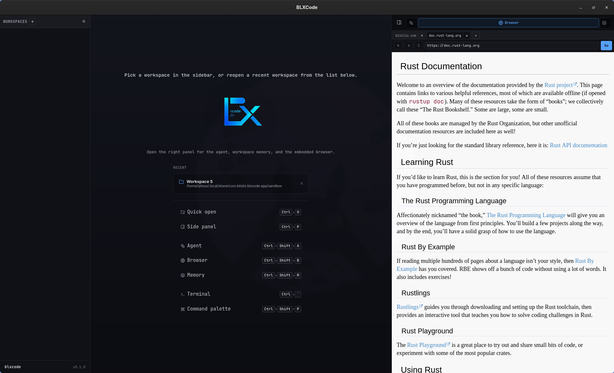

# Getting Started

BLXCode is a desktop app for AI-assisted development. It combines workspaces, terminal grids, an agent panel, project memory, tasks, and an embedded browser in one Tauri shell.

## Install Prerequisites

Install:

- Rust stable and Cargo.
- The `wasm32-unknown-unknown` Rust target.
- Trunk.
- Cargo Tauri CLI.
- Tauri 2 system dependencies for your operating system.

```bash
rustup target add wasm32-unknown-unknown
cargo install trunk tauri-cli
```

Linux users also need the WebKitGTK and native build dependencies required by Tauri 2. Package names vary by distribution.

## Run From Source

From the repository root:

```bash
cargo tauri dev
```

This launches the Tauri app and automatically starts Trunk using the command configured in `src-tauri/tauri.conf.json`. Trunk serves the frontend at `http://localhost:1420`.

## First Launch

On first launch, BLXCode shows the EULA gate in your detected UI language. Accepting it stores a local `blxcode_eula_v2` flag in browser local storage. Declining exits the app. BLXCode supports **14 UI locales**; see [UI Language](language.md) to change the language or review the full list.

After accepting, the workbench opens. In the desktop shell, BLXCode also creates a default sandbox folder under the app data directory so the agent always has a writable fallback workspace.

<p align="center">
  
</p>

## Create A Workspace

1. Open the workspace creation flow from the sidebar.
2. Choose a folder. The picker defaults to your home directory in the desktop shell.
3. Pick a terminal count. Supported presets include `1`, `2`, `4`, `6`, `8`, `9`, `12`, and `16`.
4. Optionally assign terminal slots to coding agents such as Claude, Codex, Gemini, OpenCode, or Cursor.
5. Confirm the workspace to open the terminal grid.

Workspace layout and recent workspace state are persisted by the Tauri backend and restored on the next launch. With [agent hooks](agent-providers.md) installed, terminal slots can **resume** prior Claude/Codex/Gemini/OpenCode/Cursor sessions and surface **completion badges** in the sidebar—see [Workspaces](workspaces.md#session-resume).

## Configure An Agent Provider

Open the agent/provider settings in the right panel. BLXCode supports provider settings for:

- OpenRouter.
- Anthropic.
- OpenAI-compatible API.

API keys are stored in the operating system keyring when available. On platforms where keyring storage is unavailable, BLXCode falls back to a private app-config file.

## Where Data Lives

Workspace-local data is stored inside the workspace folder:

```text
.agents/memory/
.agents/learnings/
.blxcode/tasks/
```

Opening or switching to a workspace runs `workspace_ensure_agents`, which creates the `.agents/` layout and migrates legacy memory when needed.

App layout, provider settings, and secrets live in platform-specific Tauri app config or app data directories.

## Build A Release Bundle

```bash
cargo tauri build
```

The configured bundle targets are controlled by `src-tauri/tauri.conf.json`.

For platform-specific Linux, macOS, and Windows instructions, see [Building BLXCode](building.md).
