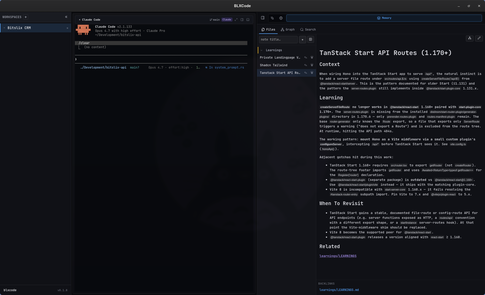
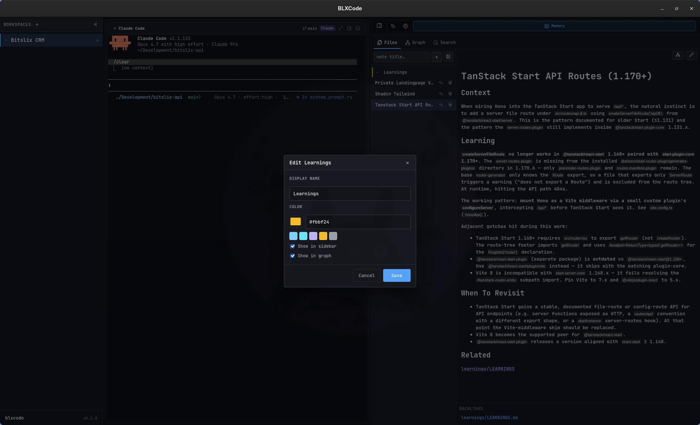
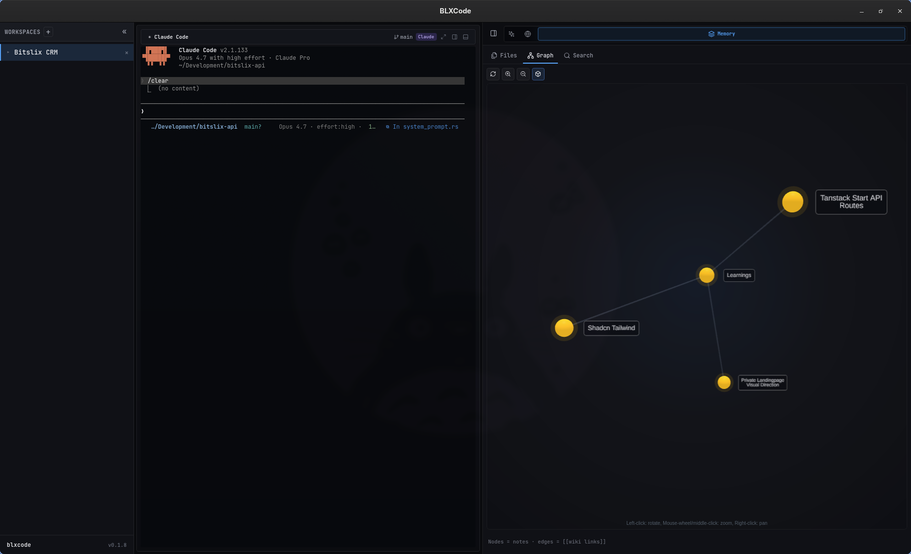
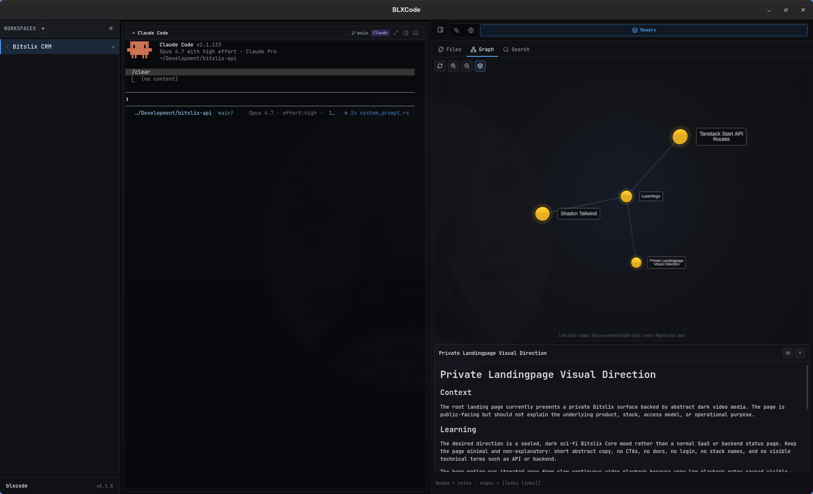
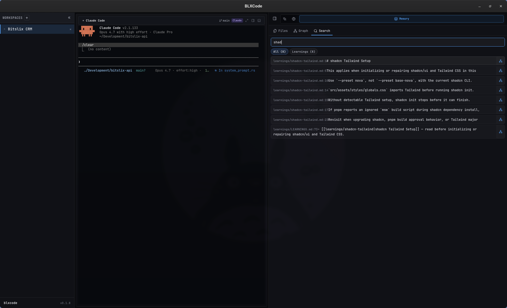
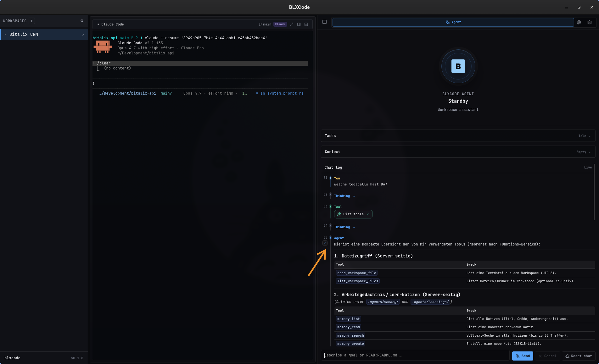

# Memory And Tasks

BLXCode keeps project memory and tasks inside the workspace folder so they can travel with the project.

## Memory Storage

General memory notes live here:

```text
<workspace>/.agents/memory/
```

Durable repo learnings (conventions, pitfalls, decisions) live here:

```text
<workspace>/.agents/learnings/
```

In the Memory panel and agent tools, learnings use API paths with a `learnings/` prefix (for example `learnings/my-topic.md`). General notes use paths relative to `.agents/memory/` (for example `notes/idea.md`).

Template notes live under:

```text
<workspace>/.agents/memory/_templates/
```

When you open a workspace, BLXCode calls `workspace_ensure_agents` to create `.agents/memory/` and `.agents/learnings/` if they are missing, seed a learnings index when needed, and upgrade existing learnings index links to wikilinks for the graph. If `.agents/memory/` is empty but legacy `.blxcode/memory/` still has notes, content is copied once into `.agents/memory/` (the legacy folder is left in place).

Paths are sandboxed per root. BLXCode rejects absolute paths, `..` escapes, and non-Markdown files for note operations.

## Memory Panel

Open the Memory panel from the right workbench rail (`Ctrl + Shift + M`). It has three tabs:

| Tab | Purpose |
|-----|---------|
| **Files** | Browse **Memory** and **Learnings** groups, open notes in the editor, toggle Markdown preview, and manage backlinks. |
| **Graph** | Explore note links as a 2D or 3D graph. Nodes are notes; edges are `[[wiki links]]`. Rotate, zoom, and pan to navigate. |
| **Search** | Full-text search across all notes with line-level snippets; open a hit or jump to its node in the graph. |

<p align="center">
  
</p>

Right-click a **Memory** or **Learnings** group header to **Edit** display settings or **Send to BLXCode Agent** (injects the whole category into agent context). Right-click an individual note for **Open** or **Send to BLXCode Agent**.

<p align="center">
  
</p>

### Category display

**Edit** on a group opens a dialog where you can set:

- **Display name** — sidebar and graph label (for example rename the default **Learnings** group).
- **Color** — accent for sidebar rows and graph nodes (hex field or preset swatches).
- **Show in sidebar** — hide the group from the Files tree while keeping files on disk.
- **Show in graph** — omit the category from the graph without deleting notes.

<p align="center">
  
</p>

## Note Links

Memory supports an Obsidian-style subset:

- `[[Note Name]]`: links to `Note Name.md` by basename.
- `[[folder/Note]]`: links to an explicit relative path.
- `[[learnings/topic|alias]]`: links to a learning note.
- `[[Note Name|alias]]`: uses display alias text while preserving graph linking.
- `#tag`: marks graph metadata.

Existing learnings that use Markdown index links (`[Title](topic.md)`) are upgraded to wikilinks when the workspace is opened so the graph can show connections.

## Graph And Search

The backend builds graph data from notes, backlinks, and tags across both memory and learnings. Selecting a node in **Graph** can show a split preview of the note content alongside the graph. From **Search**, open a result or use the graph jump control to focus the matching node (3D mode is used when jumping from search).

<p align="center">
  
</p>

<p align="center">
  
</p>

<p align="center">
  
</p>

## Agent Memory Pointers

BLXCode can install memory pointer files for agent tools. The current mapping is:

| Agent | Pointer File |
|---|---|
| Claude | `CLAUDE.md` |
| Codex | `AGENTS.md` |
| Gemini | `GEMINI.md` |

Pointers help external coding agents discover BLXCode workspace memory and learnings paths.

## Import And Export

Export writes `memory/` and `learnings/` subdirectories under the destination folder. Import accepts the same layout or a flat tree (imported into `.agents/memory/`).

## Task Storage

Tasks live here:

```text
<workspace>/.blxcode/tasks/index.json
```

Each task includes:

- ID.
- Title and description.
- Status.
- Position.
- Created, updated, and completed timestamps.
- Optional parent task.
- Optional notes.

Supported statuses are:

- `pending`
- `in_progress`
- `blocked`
- `completed`
- `cancelled`

Task writes are serialized through the backend and stored as pretty JSON. The store has a version number so future migrations can detect incompatible formats.

## Agent Memory Tools

The BLXCode agent can list, read, search, and create workspace notes through registered tools (`memory_list`, `memory_read`, `memory_search`, `memory_create`, and related file tools). Use **Send to BLXCode Agent** in the Memory panel to attach a note or whole category to the agent context without pasting paths manually.

<p align="center">
  
</p>

<p align="center">
  
</p>
