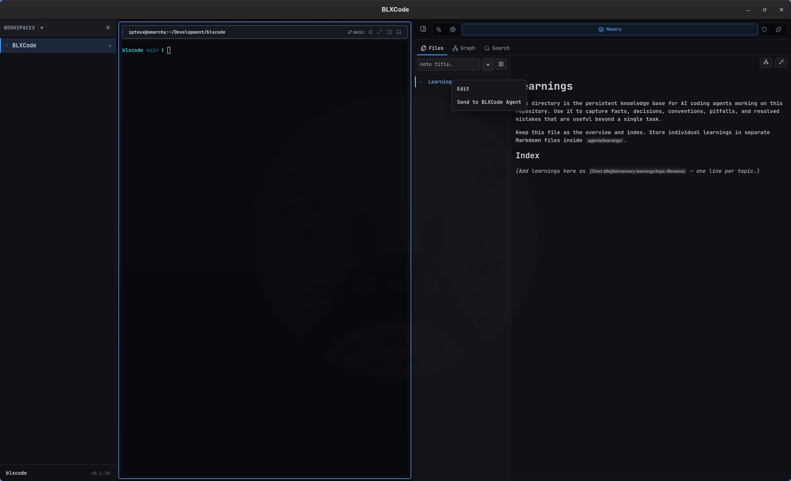
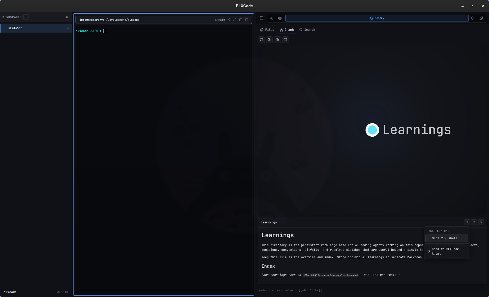
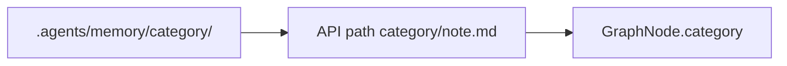
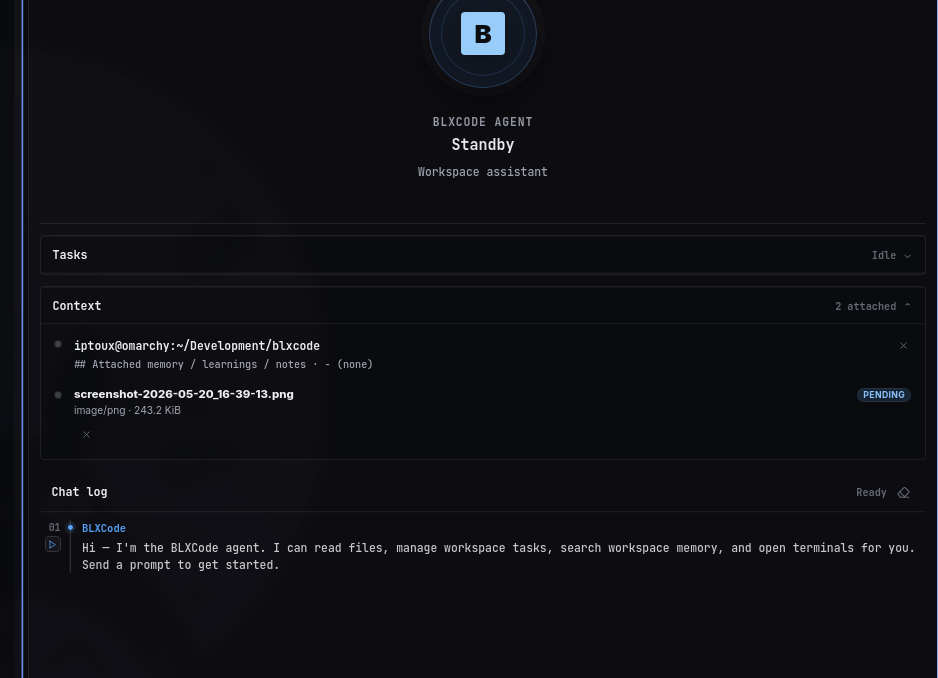

# Memory And Tasks

BLXCode keeps project memory and tasks inside the workspace folder so they can travel with the project.

## Memory Storage

General memory notes live here:

```text
<workspace>/.agents/memory/
```

Any **subdirectory** under `.agents/memory/` is a first-class category in the Files sidebar and graph (except built-in special cases below). For example `notes/`, `decisions/`, or `archive/`.

Durable repo learnings (conventions, pitfalls, decisions) live here:

```text
<workspace>/.agents/learnings/
```

Built-in categories **memory** (default notes at the memory root) and **learnings** keep their existing behavior and default colors. User-created folders get a deterministic accent color derived from the folder name.

In the Memory panel and agent tools, learnings use API paths with a `learnings/` prefix (for example `learnings/my-topic.md`). General notes use paths relative to `.agents/memory/` (for example `decisions/idea.md`).

Template notes live under:

```text
<workspace>/.agents/memory/_templates/
```

When you open a workspace, BLXCode calls `workspace_ensure_agents` to create `.agents/memory/` and `.agents/learnings/` if they are missing, seed a learnings index when needed, and upgrade existing learnings index links to wikilinks for the graph. If `.agents/memory/` is empty but legacy `.blxcode/memory/` still has notes, content is copied once into `.agents/memory/` (the legacy folder is left in place).

Paths are sandboxed per root. BLXCode rejects absolute paths, `..` escapes, and non-Markdown files for note operations.

## Memory Panel

Open the Memory panel from the right workbench rail (legacy: `Ctrl+Shift+M`; tmux: `Ctrl+b` then `m` — see [Keyboard Shortcuts](keyboard-shortcuts.md)). It has three tabs:

| Tab | Purpose |
|-----|---------|
| **Files** | Browse categories, open notes in the editor, toggle Markdown preview, and manage backlinks. |
| **Graph** | Explore note links as a 2D or 3D graph. Nodes cluster by category. |
| **Search** | Full-text search with category filter badges; jump to a node in the graph. |

<p align="center">
  
</p>

### Toolbar and dialogs

The Files toolbar provides:

- **+ Kategorie** — create a new folder under `.agents/memory/` (empty categories persist with a `.gitkeep`).
- **Collapse** — collapse or expand the file tree.

Each category header has a hover **+** button to create a note prefilled for that category.

Right-click a category header to **Edit** display settings or **Send to BLXCode Agent** (whole category). Right-click a note for **Open** or **Send to BLXCode Agent**.

### Category display

**Edit** on a group opens a dialog where you can set:

- **Display name** — sidebar and graph label.
- **Color** — accent for sidebar rows and graph nodes (hex or presets; user categories also get a deterministic default).
- **Show in sidebar** — hide the group from the Files tree while keeping files on disk.
- **Show in graph** — omit the category from the graph without deleting notes.

## Note Links

Memory supports an Obsidian-style subset:

- `[[Note Name]]`: links to `Note Name.md` by basename.
- `[[folder/Note]]`: links to an explicit relative path.
- `[[learnings/topic|alias]]`: links to a learning note.
- `[[Note Name|alias]]`: uses display alias text while preserving graph linking.
- `#tag`: marks graph metadata.

Existing learnings that use Markdown index links (`[Title](topic.md)`) are upgraded to wikilinks when the workspace is opened so the graph can show connections.

## Graph And Search

The backend builds graph data from notes, backlinks, and tags. Nodes carry a `category` field; the 2D and 3D layouts apply a cluster force so same-category notes stay visually grouped. Node fill matches each category's color setting.

Selecting a node in **Graph** opens a preview popover with **Open in Files**, wikilink navigation, and handoff to terminals (see [Workspaces](workspaces.md#terminal-agent-context-handoff)).

<p align="center">
  
</p>

<p align="center">
  
</p>

From **Search**, open a result or use **Show in graph** to focus the matching node (3D when jumping from search).

## Category data flow



## Agent Memory Pointers

BLXCode can install memory pointer files for external agents. The current mapping is:

| Agent | Pointer File |
|---|---|
| Claude | `CLAUDE.md` |
| Codex | `AGENTS.md` |
| Gemini | `GEMINI.md` |

Pointers help external coding agents discover BLXCode workspace memory and learnings paths.

## Import And Export

Export writes `memory/` and `learnings/` subdirectories under the destination folder. Import accepts the same layout or a flat tree (imported into `.agents/memory/`).

## Task Storage

Tasks live here:

```text
<workspace>/.blxcode/tasks/index.json
```

Each task includes ID, title, description, status, position, timestamps, optional parent, optional notes, and optionally **`planPath`** / **`planTaskId`** when linked to a [plan](plans.md).

Supported statuses: `pending`, `in_progress`, `blocked`, `completed`, `cancelled`.

**Plan-linked tasks** sync with Markdown under `.agents/plans/`. Tasks without a `planPath` are **free tasks**. See [Plans](plans.md) for syntax and the Plans panel.

## Agent Memory Tools

The BLXCode agent can list, read, search, create, rename, delete, and graph workspace notes. Category tools include `memory_list_categories`, `memory_create_category`, `memory_category_list`, and `memory_category_update` (any existing category key).

Context tools: `memory_context_list`, `memory_context_attach`, `memory_context_detach`.

Use **Send to BLXCode Agent** in the Memory panel to attach notes or categories without pasting paths. For the full tool catalog, call `list_tools` or see [Agent Providers](agent-providers.md).

<p align="center">
  
</p>

## See also

- [Plans](plans.md) — plan Markdown and plan-linked tasks
- [Rules And Skills](rules-and-skills.md) — binding workspace rules
- [Image Mode](image.md) — generating images (separate from context images for vision/handoff)
- [Workspaces](workspaces.md) — terminal handoff
