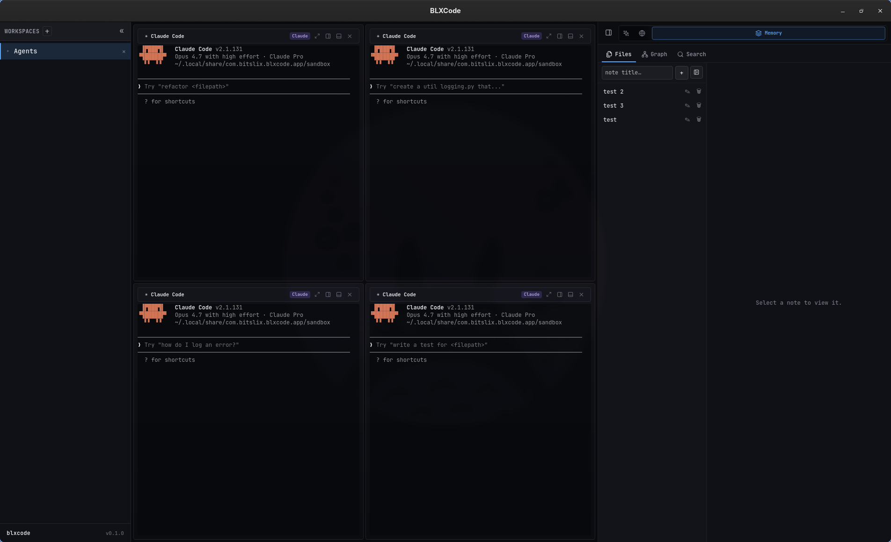
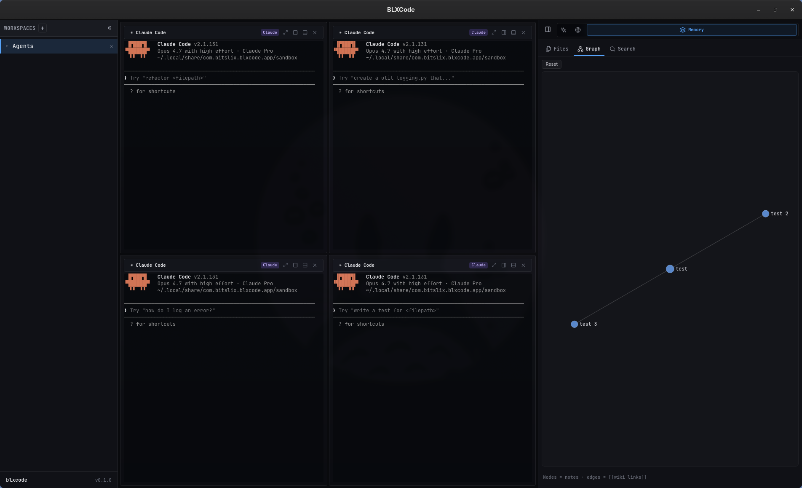
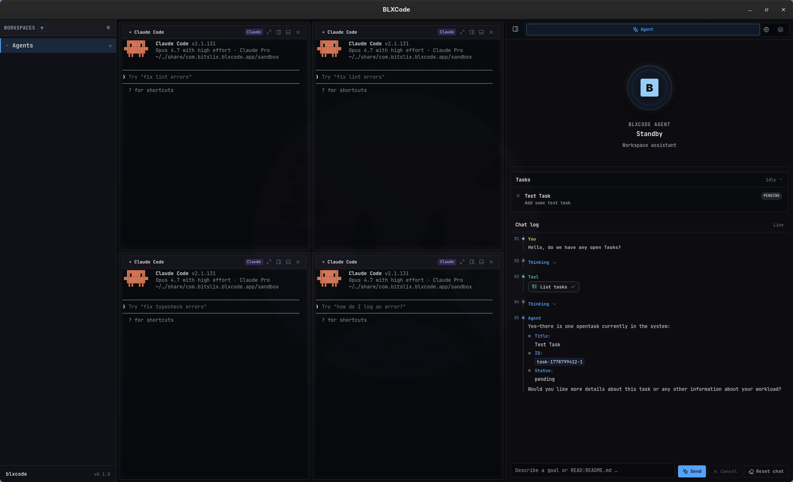

# Memory And Tasks

BLXCode keeps project memory and tasks inside the workspace folder so they can travel with the project.

## Memory Storage

Memory notes live here:

```text
<workspace>/.blxcode/memory/
```

The memory system stores Markdown files and supports nested directories. Template notes live under:

```text
<workspace>/.blxcode/memory/_templates/
```

Paths are sandboxed to the memory root. BLXCode rejects absolute paths, `..` escapes, and non-Markdown files for note operations.

<p align="center">
  
</p>

## Note Links

Memory supports an Obsidian-style subset:

- `[[Note Name]]`: links to `Note Name.md` by basename.
- `[[folder/Note]]`: links to an explicit relative path.
- `[[Note Name|alias]]`: uses display alias text while preserving graph linking.
- `#tag`: marks graph metadata.

## Graph And Search

The backend can build graph data from notes, backlinks, and tags. It can also search notes and return line-level snippets.

This makes `.blxcode/memory` useful both as a user-facing notebook and as context the agent can inspect through memory tools.

<p align="center">
  
</p>

## Agent Memory Pointers

BLXCode can install memory pointer files for agent tools. The current mapping is:

| Agent | Pointer File |
|---|---|
| Claude | `CLAUDE.md` |
| Codex | `AGENTS.md` |
| Gemini | `GEMINI.md` |

Pointers help external coding agents discover BLXCode workspace memory.

## Import And Export

The backend includes commands for memory import and export. Use these when moving notes between workspaces or backing up workspace context.

## Task Storage

Tasks live here:

```text
<workspace>/.blxcode/tasks/index.json
```

Each task includes:

- ID.
- Title and description.
- Status.
- Position.
- Created, updated, and completed timestamps.
- Optional parent task.
- Optional notes.

Supported statuses are:

- `pending`
- `in_progress`
- `blocked`
- `completed`
- `cancelled`

Task writes are serialized through the backend and stored as pretty JSON. The store has a version number so future migrations can detect incompatible formats.

<p align="center">
  
</p>
