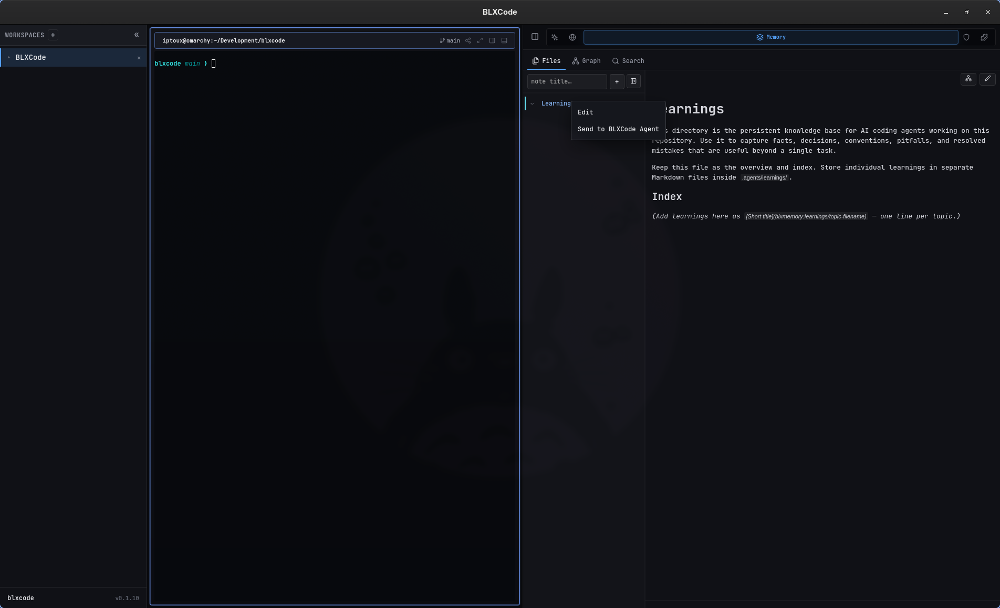
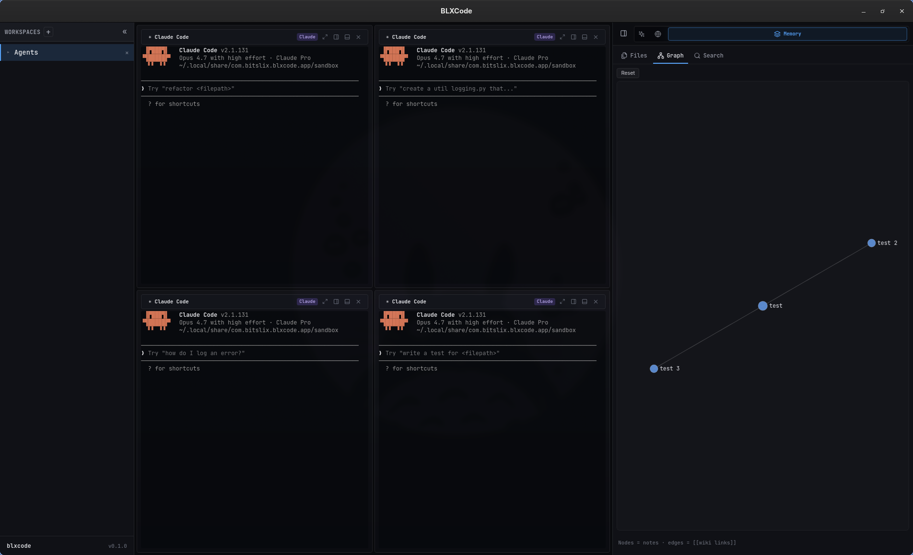
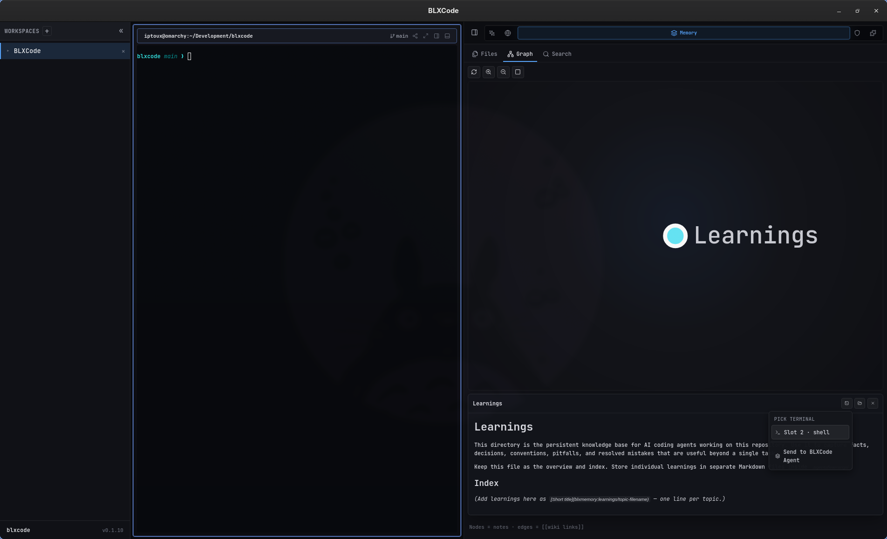
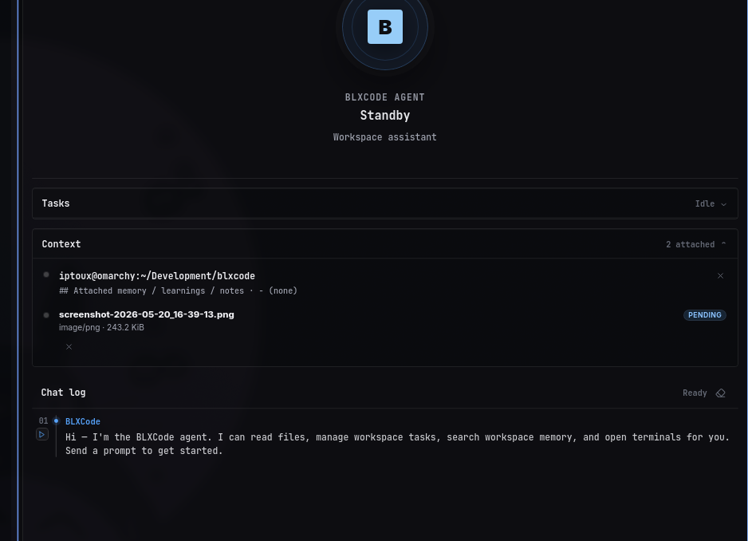

# Memory And Tasks

BLXCode keeps project memory and tasks inside the workspace folder so they can travel with the project.

## Memory Storage

General memory notes live here:

```text
<workspace>/.agents/memory/
```

Any **subdirectory** under `.agents/memory/` is a first-class category in the Files sidebar and graph (except built-in special cases below). For example `notes/`, `decisions/`, or `archive/`.

Durable repo learnings (conventions, pitfalls, decisions) live here:

```text
<workspace>/.agents/learnings/
```

Built-in categories **memory** (default notes at the memory root) and **learnings** keep their existing behavior and default colors. The harness-managed **`architecture`** category holds the workspace architecture map (see below). User-created folders get a deterministic accent color derived from the folder name.

In the Memory panel and agent tools, learnings use API paths with a `learnings/` prefix (for example `learnings/my-topic.md`). General notes use paths relative to `.agents/memory/` (for example `decisions/idea.md`).

Template notes live under:

```text
<workspace>/.agents/memory/_templates/
```

When you open a workspace, BLXCode calls `workspace_ensure_agents` to create `.agents/memory/` and `.agents/learnings/` if they are missing, seed a learnings index when needed, and upgrade existing learnings index links to wikilinks for the graph. If `.agents/memory/` is empty but legacy `.blxcode/memory/` still has notes, content is copied once into `.agents/memory/` (the legacy folder is left in place).

Paths are sandboxed per root. BLXCode rejects absolute paths, `..` escapes, and non-Markdown files for note operations.

## Memory Panel

Open the Memory panel from the right workbench rail (legacy: `Ctrl+Shift+M`; tmux: `Ctrl+b` then `m` — see [Keyboard Shortcuts](keyboard-shortcuts.md)). The **titlebar → NAVIGATE → Memory** action now opens or focuses the Memory **center tab** instead of switching the right sidebar to Memory, matching the centered workflow. It has three tabs:

| Tab | Purpose |
|-----|---------|
| **Files** | Browse categories, open notes in the editor, toggle Markdown preview, and manage backlinks. |
| **Graph** | Explore note links as a 2D or 3D graph. Nodes cluster by category. |
| **Search** | Full-text search with category filter badges; jump to a node in the graph. |

<p align="center">
  
</p>

### Memory as a center tab

When you open Memory from the titlebar **NAVIGATE** menu (or via the in-panel **Open memory in centered tab** button), Memory opens as a **center workbench tab** with a wider minimum column width (the files/categories column starts at double the normal minimum and cannot be resized below that wider center-tab minimum), and the redundant "Open memory in centered tab" button is hidden. Graph node details dock to the right of the graph canvas on wide center-tab layouts while retaining the bottom layout on narrow viewports. A new centered-only **Split View** toggle sits before the architecture refresh button, letting you intentionally keep the terminal grid visible beside Memory while the normal tab-exclusive behavior remains the default.

### Collapsed summary

When the right rail Memory panel is fully collapsed, the collapsed-header summary shows an **Open memory in centered tab** button (`LuPanelTopOpen`) and a live `X files / Y cats` count derived from the enabled, non-template workspace notes. Templates and the built-in `memory` pseudo-category are excluded from the category total. Both the button and the count are hidden when the panel is fully expanded.

### Default workspace index

When a workspace opens, the Memory panel auto-loads its `.agents/memory/README.md` index as the active note (if it exists) — the file tree no longer boots into a blank preview. The `load_note` helper seeds the active scope, path, editor-dirty, and preview state synchronously so the UI never flashes a stale selection.

### Exclusive group open

Category groups are **mutually exclusive**: opening a category auto-closes the previously open one. A single `set_exclusive_open_group` helper is reused by *New category*, *New note*, *Category click*, and the *Group-index click* path.

### Read-only note kinds

A `memory_note_is_read_only` helper lets the editor correctly identify read-only note kinds (architecture map notes, etc.) so the **Edit** button is hidden for them.

### Toolbar and dialogs

The Files toolbar provides:

- **+ Kategorie** — create a new folder under `.agents/memory/` (empty categories persist with a `.gitkeep`).
- **+ Note** / **+ Category** at the project or global root — create a note or folder directly under the memory root (not only inside subfolders).
- **Collapse** — collapse or expand the file tree.
- **Rebuild architecture** — regenerate the architecture map for the active workspace (when the architecture category exists).

Drag the vertical divider between the file tree and the editor to resize the tree column (160–520 px; persisted as `blxcode_memory_tree_width_px_v1`).

### Architecture map

BLXCode can build a **project architecture map** under `.agents/memory/architecture/`:

- `ARCHITECTURE.md` — curated index with a generated unit table and a manual section for your prose.
- `architecture/modules/*.md` — per-package or per-crate skeleton notes (names like `rust-blxcode`, `node-my-app`).

Rebuild works for Rust, Node/TypeScript, Python, CMake, Go, Zig, Makefile-based C/C++, and other trees via a generic fallback — not only `Cargo.toml` workspaces. In the Files tree, `ARCHITECTURE.md` opens from the **architecture** category header (it is not a duplicate row). The BLXCode Agent can call `memory_rebuild_architecture` / `memory_lint_architecture` and is steered to read the map before broad repo searches.

Commit `ARCHITECTURE.md` and `architecture/modules/*.md` with structural PRs; local staleness metadata lives in `.agents/memory/.meta/` (gitignored).

Each category header has a hover **+** button to create a note prefilled for that category.

Right-click a category header to **Edit** display settings or **Send to BLXCode Agent** (whole category). Right-click a note for **Open** or **Send to BLXCode Agent**.

### Category display

**Edit** on a group opens a dialog where you can set:

- **Display name** — sidebar and graph label.
- **Color** — accent for sidebar rows and graph nodes (hex or presets; user categories also get a deterministic default).
- **Show in sidebar** — hide the group from the Files tree while keeping files on disk.
- **Show in graph** — omit the category from the graph without deleting notes.

## Note Links

Memory supports an Obsidian-style subset:

- `[[Note Name]]`: links to `Note Name.md` by basename.
- `[[folder/Note]]`: links to an explicit relative path.
- `[[learnings/topic|alias]]`: links to a learning note.
- `[[Note Name|alias]]`: uses display alias text while preserving graph linking.
- `#tag`: marks graph metadata.

Existing learnings that use Markdown index links (`[Title](topic.md)`) are upgraded to wikilinks when the workspace is opened so the graph can show connections.

## Graph And Search

The backend builds graph data from notes, backlinks, and tags. Nodes carry a `category` field; the 2D and 3D layouts apply a cluster force so same-category notes stay visually grouped. Node fill matches each category's color setting.

Selecting a node in **Graph** opens a preview popover with **Open in Files**, wikilink navigation, and handoff to terminals (see [Workspaces](workspaces.md#terminal-agent-context-handoff)).

<p align="center">
  
</p>

<p align="center">
  
</p>

From **Search**, open a result or use **Show in graph** to focus the matching node (3D when jumping from search).

## Category data flow


```mermaid
flowchart LR
  Folder[".agents/memory/category/"]
  ApiPath["API path category/note.md"]
  GraphNode["GraphNode.category"]
  Folder --> ApiPath
  ApiPath --> GraphNode
```

## Agent Memory Pointers

BLXCode can install memory pointer files for external agents. The current mapping is:

| Agent | Pointer File |
|---|---|
| Claude | `CLAUDE.md` |
| Codex | `AGENTS.md` |
| Gemini | `GEMINI.md` |

Pointers help external coding agents discover BLXCode workspace memory and learnings paths.

## Import And Export

Export writes `memory/` and `learnings/` subdirectories under the destination folder. Import accepts the same layout or a flat tree (imported into `.agents/memory/`).

## Task Storage

Tasks live here:

```text
<workspace>/.blxcode/tasks/index.json
```

Each task includes ID, title, description, status, position, timestamps, optional parent, optional notes, and optionally **`planPath`** / **`planTaskId`** when linked to a [plan](plans.md).

Supported statuses: `pending`, `in_progress`, `blocked`, `completed`, `cancelled`.

**Plan-linked tasks** sync with Markdown under `.agents/plans/`. Tasks without a `planPath` are **free tasks**. See [Plans](plans.md) for syntax and the Plans panel.

## Agent Memory Tools

The BLXCode agent can list, read, search, create, rename, delete, and graph workspace notes. Category tools include `memory_list_categories`, `memory_create_category`, `memory_category_list`, and `memory_category_update` (any existing category key).

Context tools: `memory_context_list`, `memory_context_attach`, `memory_context_detach`.

Use **Send to BLXCode Agent** in the Memory panel to attach notes or categories without pasting paths. For the full tool catalog, call `list_tools` or see [Agent Providers](agent-providers.md).

<p align="center">
  
</p>

## See also

- [Plans](plans.md) — plan Markdown and plan-linked tasks
- [Rules And Skills](rules-and-skills.md) — binding workspace rules
- [Image Mode](image.md) — generating images (separate from context images for vision/handoff)
- [Workspaces](workspaces.md) — terminal handoff
