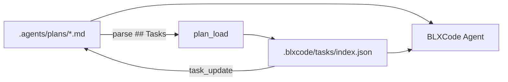

# Plans

BLXCode keeps durable Markdown plans inside the workspace so you can track multi-step work beside the task manager and the BLXCode Agent.

## Storage

```text
<workspace>/.agents/plans/
  PLANS.md              # protected index (never deleted)
  my-feature.md         # individual plan files
```

Opening or switching to a workspace runs `workspace_ensure_agents`, which creates `.agents/plans/` and seeds `PLANS.md` when missing.

`PLANS.md` is the plan index. BLXCode will not delete it through the UI. Other `.md` files in this folder are normal plans you can create, rename, or remove.

## Task syntax in plan Markdown

Each plan can declare a canonical task section:

- `## Tasks`, or
- `## Todos` (alias)

One task per line, using this form:

```markdown
## Tasks

- [ ] `setup-api` - Add REST endpoints
- [>] `wire-ui` - Connect the plans panel
- [!] `blocked-ci` - Waiting on runner quota
- [x] `seed-index` - Create PLANS.md entry
- [-] `spike-old` - Cancelled experiment
```

| Marker | Status |
|--------|--------|
| `[ ]` | pending |
| `[>]` | in progress |
| `[!]` | blocked |
| `[x]` | completed |
| `[-]` | cancelled |

The backtick-wrapped `task-id` is stable. BLXCode uses it when syncing with `.blxcode/tasks/`.

## Plans panel

Open **Plans** from the right workbench rail (between Browser and Memory).

<p align="center">
  
</p>

The panel provides:

- A resizable plan list (width persisted as `blxcode_plans_list_width_px_v1`).
- Per-plan **task summary chips** (counts by status with icons).
- A Markdown editor with debounced auto-save.
- Preview toggle.
- Create, rename, and delete (except `PLANS.md`).
- **Load into BLXCode Agent** — parses the plan's task section into the workspace task store and attaches the plan to agent context.

On workspace activation, BLXCode restores the last active plan path (`activePlanPath` in the workbench snapshot).

## Plan-linked tasks

Tasks in `.blxcode/tasks/index.json` can reference a plan:

- `planPath` — relative path under `.agents/plans/` (for example `my-feature.md`).
- `planTaskId` — the `` `id` `` from the plan Markdown line.

**Load into Agent** (`plan_load`) replaces only tasks whose `planPath` matches the loaded plan. **Free tasks** (no `planPath`) are left untouched.

When you change a plan-linked task's status in the Agent panel or via `task_update`, BLXCode writes the matching marker back into the plan Markdown automatically.

In the Agent panel task list, plan-linked tasks are grouped by plan first; unrelated tasks appear under **Free Tasks**.

See [Memory And Tasks](memory-and-tasks.md) for the task store format and [Agent Providers](agent-providers.md) for agent tools.

## Agent tools and context

Server-side plan tools (Tauri-backed):

- `plan_list`, `plan_read`, `plan_create`, `plan_write`, `plan_delete`, `plan_rename`
- `plan_load` — sync plan tasks into the task manager
- `plan_sync_from_tasks` — write task-store status back into plan Markdown

Client-side context tools:

- `plan_context_list`, `plan_context_attach`, `plan_context_detach`

Shared context kinds: `PlanIndex`, `PlanFile`, `PlanTaskGroup`. Attached plans are rendered separately from memory in the context prompt.

After a reload or harness restart, `plan_list` plus `task_list` reconstruct in-flight work; plan files and the task store survive on disk.

## Terminal handoff

When sending workspace context to an external CLI agent, `harness.send_agent_context` can include plans and tasks (see [Workspaces — Terminal agent context handoff](workspaces.md#terminal-agent-context-handoff)). The rendered Markdown block lists attached plans with per-plan status counts and compact task lists.

## Data flow



## See also

- [Memory And Tasks](memory-and-tasks.md) — free tasks and memory storage
- [Agent Providers](agent-providers.md) — turn checklist, resume keywords, tool groups
- [Workspaces](workspaces.md) — handoff and persistence
