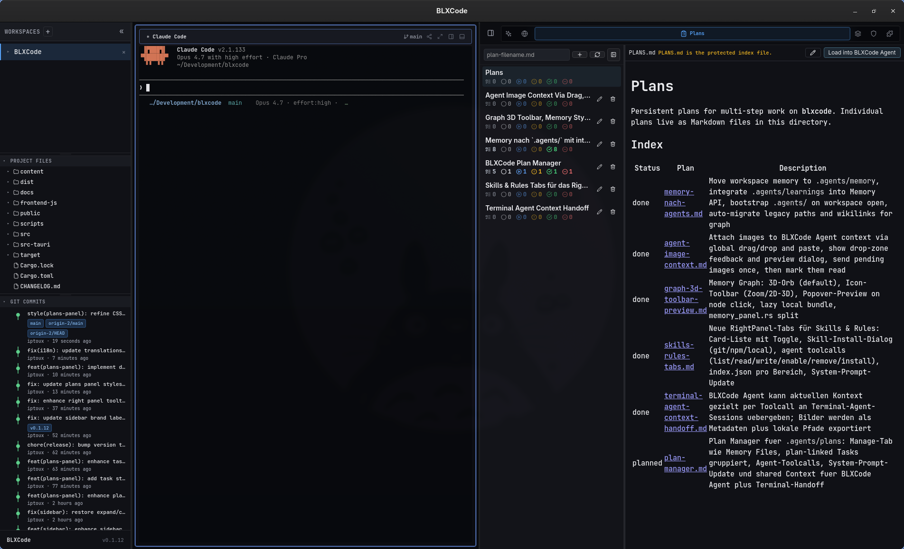
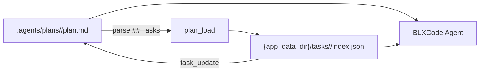

# Plans

BLXCode keeps durable Markdown plans inside the workspace so you can track multi-step work beside the task manager and the BLXCode Agent.

## Storage

```text
<workspace>/.agents/plans/
  PLANS.md              # protected index (never deleted)
  my-feature/
    plan.md             # canonical plan Markdown
    ...                 # optional plan-specific sidecar files
```

Opening or switching to a workspace runs `workspace_ensure_agents`, which creates `.agents/plans/` and seeds `PLANS.md` when missing.

`PLANS.md` is the plan index. BLXCode will not delete it through the UI. Normal plans live as `<slug>/plan.md`; extra files in the same folder are reserved for future plan attachments or notes.

The index table inside `PLANS.md` is **maintained automatically** when you create, rename, delete, or save a plan — you do not need to edit the table by hand. BLXCode derives which plans exist from canonical `plan.md` files and preserves your **Status** and **Description** cells per plan path across syncs. New plans get a default `planned` status and their Markdown heading as the description.

Legacy root files such as `.agents/plans/my-feature.md` are migrated automatically to `.agents/plans/my-feature/plan.md`. The migration runs in the background and shows compact progress in the app statusbar.

## Task syntax in plan Markdown

Each plan can declare a canonical task section:

- `## Tasks`, or
- `## Todos` (alias)

One task per line, using this form:

```markdown
## Tasks

- [ ] `setup-api` - Add REST endpoints
- [>] `wire-ui` - Connect the plans panel
- [!] `blocked-ci` - Waiting on runner quota
- [x] `seed-index` - Create PLANS.md entry
- [-] `spike-old` - Cancelled experiment
```

| Marker | Status |
|--------|--------|
| `[ ]` | pending |
| `[>]` | in progress |
| `[!]` | blocked |
| `[x]` | completed |
| `[-]` | cancelled |

The backtick-wrapped `task-id` is stable. BLXCode uses it when syncing with the per-installation task store.

## Plans panel

Open **Plans** from the right workbench rail (between Browser and Memory).

<p align="center">
  
</p>

The panel provides:

- A resizable plan list (width persisted as `blxcode_plans_list_width_px_v1`).
- Per-plan **task summary chips** (counts by status with icons).
- A Markdown editor with debounced auto-save.
- Preview toggle.
- Create, rename, and delete (except `PLANS.md`).
- **Load into BLXCode Agent** — parses the plan's task section into the workspace task store and attaches the plan to agent context.

On workspace activation, BLXCode restores the last active plan path (`activePlanPath` in the workbench snapshot).

### Plan card quick actions

A collapsed plan card exposes the three most common actions directly in its header alongside the expand/preview toggle:

| Action | Icon | Purpose |
|---|---|---|
| **Load into BLXCode Agent** | LuBot | Sync the plan's `## Tasks` into the task store and attach the plan to agent context |
| **Rename** | LuFilePenLine | Flip the card into rename mode (expands and lazy-loads the body if needed) |
| **Remove** | LuTrash2 | Delete the plan after a themed danger confirmation |

The quick-action row is **hidden once the card is expanded** — the body already exposes the same actions inline. Rename and Remove are **disabled on the `PLANS.md` index entry** to prevent editing the auto-generated table; the index file is also not shown as a plan card and is excluded from the status-tab counts.

### Collapsible status groups

The Plans panel's **All** view groups plans by their `status:` frontmatter into six status sections:

| Group | Description |
|---|---|
| **Blocked** | Plans waiting on something external before they can move forward. |
| **In progress** | Plans the agent is actively working on right now. |
| **Pending** | Plans that are queued but not yet started. |
| **Completed** | Plans that have been fully finished. |
| **Cancelled** | Plans that were dropped before completion. |
| **Empty** | Plans without a status, or without recognizable tasks. |

Each group header is a **toggle button** that collapses and re-expands its cards (chevron at the end of the line rotates when collapsed). A one-line description under each group title explains what the state means.

### AI-generated plans and tasks

The Plans panel header has two AI generation buttons next to the **+ New plan** action:

| Button | Icon | Behavior |
|---|---|---|
| **AI Plan** | LuSparkles | Generates a full Markdown plan from a short prompt; tasks generation is optional (toggle in the dialog). |
| **AI Tasks** | LuListPlus | Same flow with the *Generate tasks* toggle forced on and disabled — so the resulting plan always ships with a `## Tasks` section. |

Clicking either button opens a dialog where you type a short prompt (for example *"Add SSH key rotation support"*). While the agent generates, the prompt box shows a **shimmer loading animation** (a `prefers-reduced-motion` fallback replaces the shimmer with a static label). When the model finishes, the dialog renders a **scrollable Markdown preview** of the proposed plan with three actions:

- **Save** — writes the plan to `.agents/plans/<slug>/plan.md` through the existing `plan_create` tool and, when *Generate tasks* is enabled, runs `plan_load` so the `## Tasks` section is synced into the task store.
- **Regenerate** — re-asks the model with the same prompt.
- **Cancel** — closes the dialog and discards the draft.

Under the hood, generation calls a new `plan_generate_ai { prompt, with_tasks }` backend command (`src-tauri/src/agent/plan_ai.rs`) that reuses the same non-streaming one-shot path (`oneshot::complete_text`) that already powers AI commit messages — no chat conversation is created, no events are streamed, and no second LLM stack is used. The system prompt is Skill-conformant so the output always follows the built-in plan format: `# Title` + prose sections + a `## Tasks` section using the exact `- [ ] \`task-id\` - Title` line syntax. Post-processing strips any wrapping code fence, extracts the title (falling back to the prompt), and guarantees the `## Tasks` heading exists so `plan_load` never runs on an empty section.

The generated plan is saved through the same tools as a hand-written one — there is no separate write path to `.agents/plans` — so the `PLANS.md` index, frontmatter, and Kanban board update automatically. Empty prompts and missing-API-key cases surface the same friendly errors as AI commit messages.

## Kanban board view

Switch the Plans toolbar to **Kanban** (alongside **Editor** and **Preview**).

- Aggregates tasks from all canonical plan files in the workspace (`PLANS.md` index is excluded).
- **Free tasks** without `planPath` stay in the Agent task list only — not on the board.
- Columns match task statuses: pending, in progress, blocked, completed, cancelled.
- **Drag cards** between columns to change status; BLXCode writes the matching `[ ]` / `[>]` / `[!]` / `[x]` / `[-]` marker back into the plan Markdown.
- **Drag columns** to reorder; hide or show empty columns. Layout persists in `.agents/kanban/index.json`.

Quick-add and delete actions on cards keep the board and plan files in sync. When a card’s task is mirrored in the task store, status updates best-effort sync there too.

## Plan-linked tasks

Tasks in `{app_data_dir}/tasks/<workspace_hash>/index.json` can reference a plan:

- `planPath` — canonical relative path under `.agents/plans/` (for example `my-feature/plan.md`).
- `planTaskId` — the `` `id` `` from the plan Markdown line.

**Load into Agent** (`plan_load`) replaces only tasks whose `planPath` matches the loaded plan. **Free tasks** (no `planPath`) are left untouched.

When you change a plan-linked task's status in the Agent panel or via `task_update`, BLXCode writes the matching marker back into the plan Markdown automatically.

In the Agent panel task list, plan-linked tasks are grouped by plan first; unrelated tasks appear under **Free Tasks**.

See [Memory And Tasks](memory-and-tasks.md) for the task store format and [Agent Providers](agent-providers.md) for agent tools.

## Agent tools and context

Server-side plan tools (Tauri-backed):

- `plan_list`, `plan_read`, `plan_create`, `plan_write`, `plan_delete`, `plan_rename`
- `plan_load` — sync plan tasks into the task manager
- `plan_sync_from_tasks` — write task-store status back into plan Markdown

Client-side context tools:

- `plan_context_list`, `plan_context_attach`, `plan_context_detach`

Shared context kinds: `PlanIndex`, `PlanFile`, `PlanTaskGroup`. Attached plans are rendered separately from memory in the context prompt.

After a reload or harness restart, `plan_list` plus `task_list` reconstruct in-flight work; plan files and the task store survive on disk.

## Terminal handoff

When sending workspace context to an external CLI agent, `harness.send_agent_context` can include plans and tasks (see [Workspaces — Terminal agent context handoff](workspaces.md#terminal-agent-context-handoff)). The rendered Markdown block lists attached plans with per-plan status counts and compact task lists.

## Data flow


```mermaid
flowchart LR
  PlanMd[".agents/plans/<slug>/plan.md"]
  PlanLoad[plan_load]
  TaskJson["{app_data_dir}/tasks/<workspace_hash>/index.json"]
  Agent[BLXCode Agent]
  PlanMd -->|parse ## Tasks| PlanLoad
  PlanLoad --> TaskJson
  TaskJson -->|task_update| PlanMd
  PlanMd --> Agent
  TaskJson --> Agent
```

## See also

- [Memory And Tasks](memory-and-tasks.md) — free tasks and memory storage
- [Agent Providers](agent-providers.md) — turn checklist, resume keywords, tool groups
- [Workspaces](workspaces.md) — handoff and persistence
