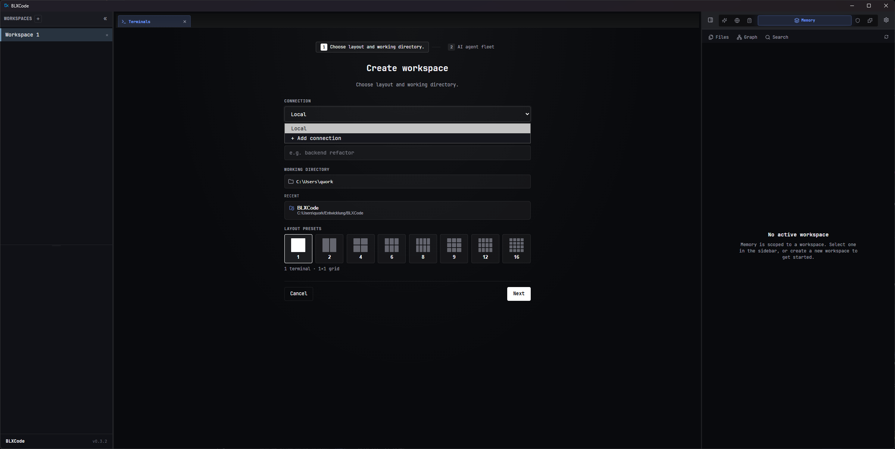

# Remote Workspaces (SSH)

A BLXCode workspace can run against a **remote machine over SSH**. The terminals, agent CLIs, file
explorer, file preview, and the Git sidebar all operate on the remote host — the local app is just the
client. You manage reusable **connection presets** once, then pick one when creating a workspace.

## Requirements

- **Locally:** the OpenSSH `ssh` client on your `PATH` (ships by default on Windows 11, macOS, and most
  Linux distros).
- **On the remote:** a POSIX shell. For the Git features you also need `git`; for **persistent (tmux)**
  session resume you need `tmux` (otherwise that mode falls back to a plain login shell).

## Manage connections — Settings → Remote

Open **Settings → Remote** to create and edit connection presets. The pane is a **master/detail
view**: saved presets render as a grid of compact **connection cards** inside a framed section card,
and clicking a card (or the **Add connection** button) opens a dedicated **editor view**.

### Connection cards

Each card shows:

- The preset **Name**.
- `user@host:port`.
- The **Authentication** method (Password / Key file / SSH agent).
- The **Session resume** mode (Persistent tmux / Keepalive only).
- A masked **Stored / Not set** secret badge — **no secret values ever leave the backend**.
- The default **Remote directory**.

The card's footer is a localized **Edit** hint; click the card (or any of its controls) to open the
editor.

### Connection editor

The editor opens with a **Back to connections** header, a **New connection** / **Edit connection**
title, and the full form:

| Field | Notes |
|-------|-------|
| **Name** | Label shown in the workspace wizard. |
| **Host** | Hostname or IP. |
| **Port** | Defaults to `22`. |
| **Username** | Remote login user. |
| **Authentication** | **Password**, **Key file** (+ optional passphrase), or **SSH agent**. |
| **Password / Passphrase** | Write-only — once saved it shows *Stored*; leave blank to keep the existing value. |
| **Private key file** | Absolute path to the key (Key-file auth). |
| **Session resume** | **Persistent (tmux)** or **Keepalive only** — see [below](#session-resume). |
| **Remote directory** | Optional start directory; defaults to the remote home. |

- **Save** persists the preset and returns to the refreshed list.
- **Test connection** validates host + auth end-to-end and reports success or a specific failure
  (auth failed, host unreachable, host-key changed, …).
- **Delete** removes the preset and its stored secrets, then returns to the list.
- **Back to connections** discards unsaved edits and returns to the list.

**Where secrets live:** passwords and key passphrases are stored in your OS keychain (Windows
Credential Manager / macOS Keychain / Linux secret service, with an encrypted file fallback on Linux).
They are resolved inside the app's Rust backend at connect time and are **never** written to the preset
file, shown in the UI again, or passed on the `ssh` command line. The masked **Stored / Not set** badge
on each card is the only hint the UI shows.

## Create a remote workspace

In the **Create workspace** wizard, the **Connection** dropdown chooses where the workspace runs:

  

- **Local** — a normal local workspace (default).
- A saved preset (e.g. *my-server · SSH*) — runs the workspace on that host.
- **+ Add connection** — jumps straight to **Settings → Remote** to create a preset, then come back to
  the wizard (your draft is preserved and the connection list reloads).

For a remote workspace the **Working directory** field is the **remote** start directory (optional). The
rest of the wizard — layout preset and agent fleet — works exactly as for local workspaces.

## What works remotely

Once open, a remote workspace behaves like a local one:

- **Terminals** — each pane is an SSH session; agent CLIs (Claude, Codex, …) run on the remote host.
- **File explorer & preview** — browse the remote tree and preview text, source, images, video,
  Markdown, and Mermaid; create files/folders.
- **Git** — full read + write: status, per-file diff, stage/unstage, commit, the commit graph, branch
  label, fetch/pull/push, and AI commit-message generation, all against the remote repo. The Git
  sidebar refreshes on a short interval (there is no remote filesystem watcher).
- **Session resume** — see below.

Remote workspaces show a small **SSH badge** in the sidebar so they're easy to tell apart from local
ones.

## Session resume

Each connection picks how its work survives disconnects:

- **Persistent (tmux)** — reattaches a server-side `tmux` session keyed to the terminal. Running agents
  and shells **survive idle, closing the workspace, and restarting the app**; reopening reattaches the
  exact session. Requires `tmux` on the remote (falls back to a login shell if it's missing).
- **Keepalive only** — the connection stays alive while idle, but reconnecting starts a **fresh shell**.
  No remote dependency.

For agent CLIs in **keepalive** mode (or after the remote process actually died), BLXCode also tries to
resume the newest agent session for the remote directory automatically.

## Connection limits & large grids

> **Important:** today **each terminal opens its own SSH connection** (plus one shared connection for
> file/git operations). A workspace with *N* terminals makes roughly *N + 1* SSH connections to the host.

This matters for **large terminal grids** (e.g. 12 or 16 panes), because the remote `sshd` enforces two
defaults that can reject the extra connections:

- **`MaxSessions`** (default **10**) — max concurrent sessions per connection/host.
- **`MaxStartups`** (default `10:30:100`) — limits the rate/burst of *unauthenticated* connections, so
  many panes opening at once can be throttled or dropped.

If some panes in a big grid fail to connect, either use a smaller grid, stagger opening, or raise those
limits in the server's `sshd_config`. Each connection also re-authenticates, so password auth prompts
once per terminal (injected automatically) and large grids cost more handshake latency.

> A planned change will multiplex **all** terminals over a single authenticated connection per
> preset, which removes the per-terminal connection cost (tracked in the developer notes).

## Security

- Secrets stay in the OS keychain / app memory — never in the preset file, the UI, or `ssh` arguments.
- Host keys use **trust-on-first-use** (`accept-new`): a new host is trusted and recorded in your
  `known_hosts`; a **changed** key is refused with a clear error (protects against MITM).
- Remote file operations are confined to the workspace directory (path traversal is rejected).

## Troubleshooting

- **"ssh not found" / connection never starts** — install/repair the OpenSSH client and ensure `ssh` is
  on your `PATH`.
- **Some terminals in a large grid won't connect** — the remote `sshd` is capping connections; see
  [Connection limits & large grids](#connection-limits--large-grids).
- **Persistent resume didn't reattach** — the remote is missing `tmux`; install it or use Keepalive.
- **"host key verification failed" / changed key** — the remote's key changed since first use. Verify
  it's legitimate, then remove the stale `known_hosts` line on your machine.
- **SSH agent on Windows** — agent auth depends on a running OpenSSH/Pageant agent; if it isn't picked
  up, use key-file or password auth.

## See also

- [Workspaces](workspaces.md) — creation, terminal grids, sidebar, Git diff/sync.
- [Settings](settings.md) — the settings categories incl. **Remote**.
- Developer internals: [SSH remote transport](../developer/ssh-remote.md).
