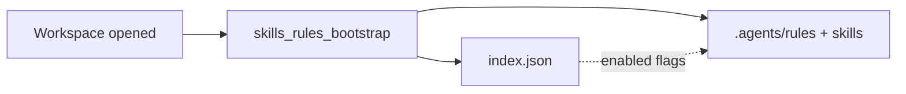

# Rules And Skills

BLXCode ships workspace-scoped **rules** (binding constraints) and **skills** (optional how-to guides) that the BLXCode Agent can list, read, and honor. Both live under `.agents/` and are managed from the right panel.

## On-disk layout

```text
<workspace>/.agents/rules/
  index.json              # enabled flags (harness-managed)
  rule-my-convention.md   # one rule per file

<workspace>/.agents/skills/
  index.json              # enabled flags + source metadata
  my-skill/
    SKILL.md              # required for a valid skill folder
```

`index.json` files track which entries are enabled and (for skills) install provenance (`git`, `npm`, `local`, or `agent`). BLXCode writes them atomically (tmp + rename) and prunes orphan entries when reading.

Do not hand-edit `index.json` unless you know what you are doing; use the UI or agent tools instead.

## Rules panel

Open **Rules** from the right workbench rail (`LuShield` icon).

Each rule is an **expandable card** (same pattern as Skills):

| Collapsed | Expanded |
|-----------|----------|
| Title, summary, **Enabled** / **Disabled** pill, enable toggle | Full rule body (Markdown), inline **edit** and save, remove |

Use **Create rule** at the top of the tab to add a new `rule-*.md` file. The form validates name and body before writing to `.agents/rules/`.

Disabled rules are invisible to the agent — the system prompt treats them as if they did not exist.

Active rules are **binding and non-negotiable**; they outrank skill guidance when both apply.

## Skills panel

Open **Skills** from the right workbench rail (`LuPuzzle` icon).

<p align="center">
  
</p>

### Core vs User tabs

BLXCode ships **core harness skills** inside the app (Better Harness). They are not files on disk in your workspace — they are embedded Markdown the agent reads via `skills_read`.

| Tab | Contents |
|-----|----------|
| **Core** | Built-in guides: `file-access`, `memory`, `plans`, `tasks`, `rules-skills`, `harness`, `environment`, `shell`, `git`, `web`, `subagents` |
| **User** | Skills under `<workspace>/.agents/skills/` that you install or author |

Core skills show a **core** badge. You can enable or disable them per workspace, but you cannot remove them. **Install skill** appears only on the **User** tab.

The **web** core skill may show **disabled_no_key** when no Tavily/Brave API key is configured — configure keys under Harness settings → Agent → Web Tools ([Agent Harness](agent-harness.md)). The **subagents** core skill documents `subagents.run` — see [Subagents](subagents.md).

Use the **Core** / **User** pill tabs at the top of the panel (counts per tab).

Each skill is an **expandable card**:

| Collapsed | Expanded |
|-----------|----------|
| Name, summary, source badge (`core`, `git`, `npm`, `local`, `agent`), enable switch | Lazy-loaded `SKILL.md` body on first expand |

- **SKILL.md missing** warning (user skills only) when the folder has no top-level `SKILL.md`
- Enable/disable; **remove** only for non-core skills

Use **Install skill** (User tab) to add a skill from:

| Source | Fields |
|--------|--------|
| **Git** | name, repository URL, optional ref |
| **npm** | name, package name, optional version |
| **Local** | name, path to a folder containing `SKILL.md` |

Installs stage into `.install.<name>.tmp/`, verify `SKILL.md` at the top level, then promote or roll back on failure.

## Workspace bootstrap

When a workspace path is set (wizard, switch, or workbench restore), BLXCode runs `skills_rules_bootstrap`:

- Creates `.agents/rules/` and `.agents/skills/` if needed
- Seeds each `index.json` from on-disk content (existing files enter as `enabled: true`)
- Skills without provenance default to `source.kind = "local"`
- Manually disabled entries survive later bootstraps

## Agent turn checklist

Every non-trivial agent turn should follow this order (documented in the system prompt):

1. `rules_list` + `rules_read` on relevant **active** rules
2. `skills_list` + `skills_read` on matching skills when the task warrants it (including **core** skills such as `git` or `shell` when using those tools)
3. **Resume check** — continue from `task_list` / `activePlanPath` when the user says *continue*, *resume*, *weiter*, *fortsetzen*, and similar
4. Memory, plans, and project context as needed
5. Execute

Trivial conversational turns may skip steps 1–2.

Install or remove skills/rules only when the user explicitly asks.

## Agent tools

| Group | Tools |
|-------|--------|
| Rules | `rules_list`, `rules_read`, `rules_write`, `rules_set_enabled`, `rules_remove` |
| Skills | `skills_list`, `skills_read`, `skills_write`, `skills_set_enabled`, `skills_remove`, `skills_install` |

Use `list_tools` when you need the full catalog and parameter schemas.

## Bootstrap flow



## See also

- [Agent Harness](agent-harness.md) — core skills, environment/shell/git/web tools
- [Subagents](subagents.md) — coordinated parallel agents
- [Agent Providers](agent-providers.md) — provider settings, context, and `list_tools`
- [Plans](plans.md) — plan files and task sync
- [Getting Started](getting-started.md) — `.agents/` layout overview
