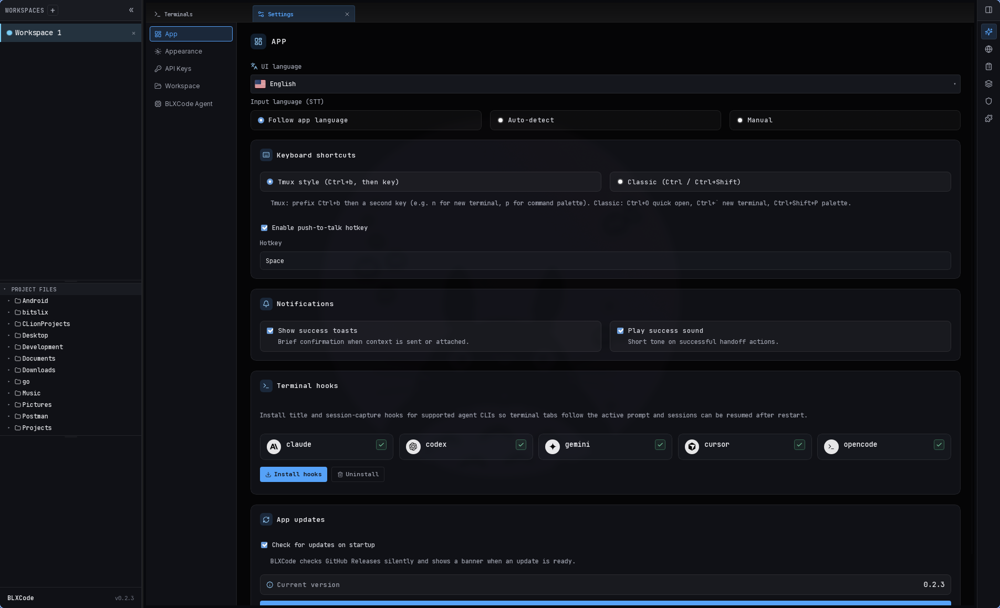
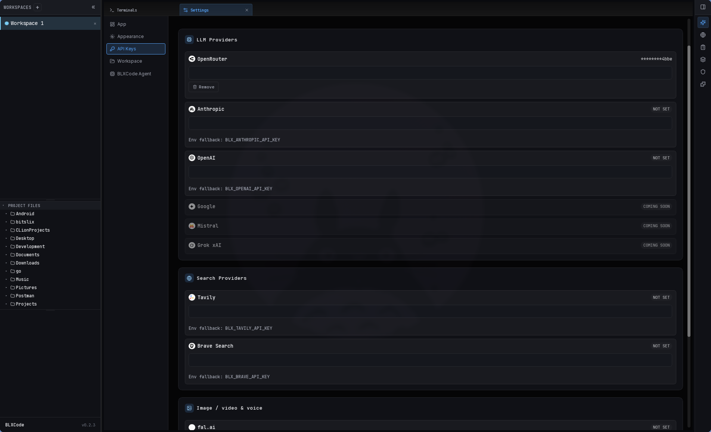

# Settings

BLXCode opens settings in a **center workbench tab** (not a modal). The command palette entry **Open Settings** focuses an existing settings tab or creates one per workspace — see [Workspaces → Center tabs](workspaces.md#center-tabs) for the tab lifecycle. Settings can be opened even **without an active workspace** — BLXCode lazily provisions an ephemeral shell workspace that hosts only the Settings tab and is disposed when you close it.

## Sidebar categories

| Category | What it configures |
|----------|-------------------|
| **App** | UI language, STT language + push-to-talk, keyboard shortcut mode, notifications, terminal hooks, app updates |
| **Appearance** | App themes — 20 presets, search, Dark/Light filters; see [Appearance & Themes](appearance-themes.md) |
| **API Keys** | All provider secrets in one pane — see below |
| **Workspace** | Default project directory, agent sandbox root, embedded browser URL, **category colors** for Memory |
| **BLXCode Agent** | Text, image, and voice inference — see below |

Legacy saved categories (`Image`, `Voice`, `Memory`) still open the correct pane.

## App

**Settings → App** collects shell-wide preferences that aren't tied to a single workspace: UI language, voice/STT defaults, keyboard shortcut mode (Tmux-style vs Classic), notification toasts and sounds, terminal hooks, and the GitHub Releases auto-updater.

  

## Appearance

**Settings → Appearance** lets you pick an app theme:

- **BLXCode** (default) — the original dark workbench look
- Eleven additional dark/light presets (Dracula, Gruvbox, Solarized, Nord, One Dark, Catppuccin, Tokyo Night, BLXCode Light)
- Search and **All / Dark / Light** filters
- Instant preview on each card; choice persists across restarts

Themes affect sidebar, panels, terminals, graphs, and settings chrome. Embedded web pages, native webviews, and your Memory category color swatches are documented exceptions.

Full guide: [Appearance & Themes](appearance-themes.md).

## API Keys

**Settings → API Keys** is the only place to enter provider secrets.

- LLM providers: OpenRouter, Anthropic, OpenAI, and coming-soon rows (Google, Mistral, Grok xAI).
- Media / search: Tavily, Brave, **fal.ai** (image), **Amazon Polly** (AWS voice).
- One **Save** / **Discard** footer for the whole pane; per-row remove marks keys for deletion on save.
- Keys use the OS keyring (`BLXCode` service) with `BLX_*` env fallback when the store is empty; the UI shows **via env** when a fallback is active.

Agent, image, and voice panes show a short status line pointing here — they do not contain password fields.

  

## BLXCode Agent

**Settings → BLXCode Agent** uses a grid:

| Area | Settings |
|------|----------|
| **Text** | Provider, thinking level, model (`AgentModelPicker`), refresh |
| **Image** | Provider, quality level, model, auto-save |
| **Voice** | Provider (OpenAI / OpenRouter / AWS), STT + TTS models, recording quality, post-STT behavior, voice picks, speak replies |
| **Web Tools** | Tavily / Brave / disabled backend |

One **Save** / **Discard** at the bottom persists text provider + web tools together. Image and voice sections auto-save on change.

  

Details: [Agent Providers](agent-providers.md), [Image Mode](image.md), [Voice](voice.md).

## Workspace

**Settings → Workspace**:

- **Paths & sandbox** — default folder for new workspaces and BLXCode Agent file sandbox root.
- **Embedded browser** — default URL for the Browser tab.
- **Category colors** — presets used for Memory category dots and sidebar accents (formerly under a separate Memory settings tab).
- **Confirm before closing a workspace** — when enabled (default), BLXCode asks before closing a workspace from the sidebar ×, context menu, or Terminals tab close path.
- **Architecture LLM prose** — reserved for a future optional LLM pass when rebuilding the architecture map; rebuilds today are deterministic and do not call a model.

See [Workspaces](workspaces.md) for File Diff, Git sync, and the architecture map in Memory.

## See also

- [Agent Harness](agent-harness.md) — core skills, web tools behavior
- [Troubleshooting](troubleshooting.md) — keyring and key errors
