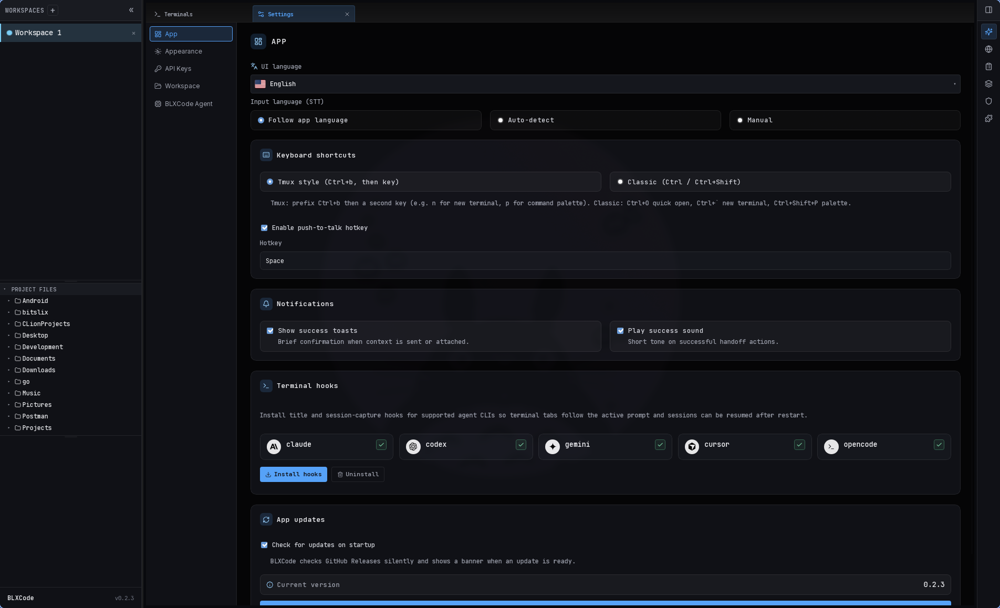
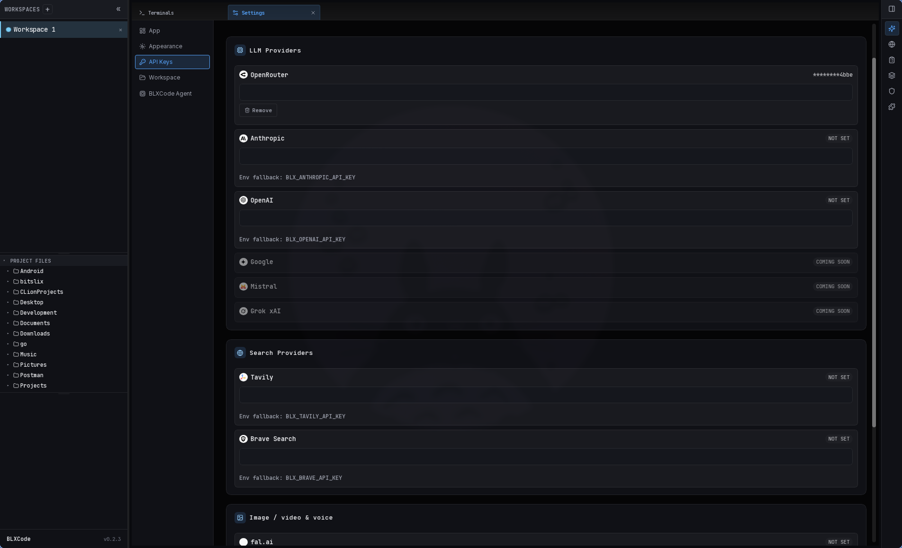

# Settings

BLXCode opens settings in a **center workbench tab** (not a modal). The command palette entry **Open Settings** focuses an existing settings tab or creates one per workspace — see [Workspaces → Center tabs](workspaces.md#center-tabs) for the tab lifecycle. Settings can be opened even **without an active workspace** — BLXCode lazily provisions an ephemeral shell workspace that hosts only the Settings tab and is disposed when you close it.

## Sidebar categories

| Category | What it configures |
|----------|-------------------|
| **App** | UI language, STT language + push-to-talk, notifications, terminal hooks, app log, app updates (Stable/Beta channel, background checks, structured release-notes dialog), help/About |
| **Appearance** | App themes — 32 presets, search, Dark/Light filters, plus theme-independent **Roundings**, **Font**, and **Font size** controls; see [Appearance & Themes](appearance-themes.md) |
| **Shortcuts** | Keyboard shortcut preset, prefix key, and per-action rebinding (incl. **Push-to-Talk**); see [Keyboard Shortcuts](keyboard-shortcuts.md) |
| **API Keys** | All provider secrets in one pane — see below |
| **Memory** | Memory right-panel toggle, folder-grouping and split-view toggles, **Agent memory pointers** flow, architecture-rebuild controls, **Memory Indexer** settings/stats |
| **HeartBeat** | HeartBeat interval, enable/disable, service listing, **Run now**, per-service status snapshots |
| **MCP** | Model Context Protocol servers (stdio / HTTP transports), per-server on/off, **connection test**, reload-required hints; see [MCP Servers](#mcp-servers) |
| **Workspace** | Default project directory, agent sandbox root, embedded browser URL, **category colors** for Memory, **terminal naming** mode and name pool, confirm-before-closing |
| **Code Editor** | **Vim key bindings** (default on), in-editor shortcuts (Save / Find / Replace / Go to line / Toggle comment / Fold / Move line / Duplicate line / Format) |
| **BLXCode Agent** | Text, image, and voice inference; **Auto-compact** threshold; **tool-loop limit**; **Agent orb** (3D / 2D); personal nickname; see below |
| **Remote** | SSH connection presets for remote workspaces (host/port/user, password / key / agent auth, encrypted secrets, session-resume model); see [Remote (SSH)](remote-ssh.md) |

Legacy saved categories (`Image`, `Voice`, `Memory`) still open the correct pane.

## App

**Settings → App** collects shell-wide preferences that aren't tied to a single workspace: UI language, voice/STT defaults, push-to-talk, notification toasts and sounds, terminal hooks, the in-app **app log**, and the GitHub Releases auto-updater. Keyboard shortcuts moved to their own **Shortcuts** category (see [Keyboard Shortcuts](keyboard-shortcuts.md)).

The **App log** panel is reachable from the **Help** menu in the titlebar and from the App settings area. It shows structured app events (MCP lifecycle, hook install outcomes, async command errors, …) from a rotating log file with timestamps, level chips, and per-event metadata. Levels: `debug` / `info` / `warn` / `error`.

A **Help / About** menu lives in the titlebar next to the bell. It opens a popover with product metadata (name, version, commit, build channel), a link grid (Docs, Releases, Report issue, Discord, Sponsor), and an integrated *Check for updates* action wired to the manual update check.

App updates support two channels:

- **Stable** uses final GitHub Releases.
- **Beta** includes GitHub prereleases such as `0.6.0-pre.ed4dc`, and also accepts newer final stable releases when they supersede the current beta.

When **Check for updates on startup** is enabled, BLXCode checks immediately after launch and then every 10 minutes while the app is open. Background checks are quiet when nothing changed, show a discreet statusline item only during the check, and add a titlebar/native notification when a new update is available. Clicking that notification opens the update dialog.

The update dialog reuses the structured release-notes view from `post_update_release_notes(version, channel)` (hero summary, sections, loading state, fallback to the updater manifest body) instead of showing the manifest body as plain text — the update-specific controls (current → available version, install/download progress, retry, restart, **Later**) stay in place. Beta builds prefer `docs/releases/v{version}.md` for the exact prerelease tag and fall back to the stable base notes when needed.

  

## Appearance

**Settings → Appearance** lets you pick an app theme and adjust two theme-independent knobs:

- **Roundings** — a global corner-radius scale (Sharp / Default / Rounded / Extra) that re-rounds the whole workbench instantly.
- **Font** — a curated monospace picker (JetBrains Mono bundled, plus Cascadia Code, Fira Code, SF Mono, Menlo, Consolas, and System Monospace as system-dependent options). The xterm terminals read their `fontFamily` from the same token and re-fit when the font changes.
- **BLXCode** (default) — the redesigned Tokyo Night × Dracula dark workbench look.
- **BLXCode Legacy / BLXCode Legacy Light** — the previous GitHub-blue default, kept under explicit ids.
- Thirty additional dark/light presets (Dracula, Gruvbox, Solarized, Nord, One Dark/Light, Catppuccin, Tokyo Night & Light, Rosé Pine / Dawn, Everforest, Kanagawa, **Claude Code** warm-charcoal, Night Owl, Ayu Mirage / Light, GitHub Light, plus a family of cool light themes — Winter, Paper, Alpine, Frost, Lilac).
- Search and **All / Dark / Light** filters (16 dark, 16 light).
- Instant preview on each card; choice persists across restarts.

Themes affect sidebar, panels, terminals, graphs, and settings chrome. Embedded web pages, native webviews, and your Memory category color swatches are documented exceptions.

Full guide: [Appearance & Themes](appearance-themes.md).

## API Keys

**Settings → API Keys** is the only place to enter provider secrets.

- LLM providers: OpenRouter, Anthropic, OpenAI, Hugging Face, Cloudflare Workers AI, Together AI, Portkey, and coming-soon rows (Google, Mistral, Grok xAI).
- Media / search: Tavily, Brave, **fal.ai** (image), **Amazon Polly** (AWS voice).
- One **Save** / **Discard** footer for the whole pane; per-row remove marks keys for deletion on save.
- Keys use the OS keyring (`BLXCode` service) with `BLX_*` env fallback when the store is empty; the UI shows **via env** when a fallback is active.

Agent, image, and voice panes show a short status line pointing here — they do not contain password fields.

  

## BLXCode Agent

**Settings → BLXCode Agent** uses a grid:

| Area | Settings |
|------|----------|
| **Text** | Provider, thinking level, **tool-loop limit (1–500, default 36)**, model (`AgentModelPicker`), refresh |
| **Auto-compact** | Toggle (default on) and threshold (50–95 %, default 85 %) — runs a non-tool summarization pass when the context window crosses the threshold, between turns, at most once per crossing |
| **Image** | Provider, quality level, model, auto-save |
| **Voice** | Provider (OpenAI / OpenRouter / AWS), STT + TTS models, recording quality, post-STT behavior, voice picks, speak replies, **Push-to-Talk** mode, target, target mode, live partial transcript, TTS-collision policy |
| **Agent orb** | **3D Drobo** (default) or **2D logo** — pick which mode the voice orb renders in |
| **Web Tools** | Tavily / Brave / disabled backend |

One **Save** / **Discard** at the bottom persists text provider, tool-loop limit, auto-compact, and web tools together. Image and voice sections auto-save on change. The **Agent orb** switch updates the open Agent tab without restarting.

  

Details: [Agent Providers](agent-providers.md), [Image Mode](image.md), [Voice](voice.md).

## Memory

**Settings → Memory** centralizes everything related to the Memory feature. The right-sidebar **Memory** tab is removed; the Memory **center tab** and this settings pane together cover the full surface.

| Section | What it does |
|---------|---------------|
| **Right-panel toggle** | Show the memory file tree in the right sidebar (default **off** so the right rail no longer auto-shows the tree for new users). |
| **Folder grouping** | Group notes under their category folder. |
| **Split view** | Keep the terminal grid visible beside the Memory panel. |
| **Agent memory pointers** | Install/uninstall the memory pointer blocks (`CLAUDE.md`, `AGENTS.md`, `GEMINI.md`) that let external coding agents discover BLXCode's memory and learnings paths. |
| **Architecture** | Rebuild or lint the workspace architecture map (`memory_rebuild_architecture` / `memory_lint_architecture`). |
| **Memory Indexer** | HeartBeat-driven indexing of all open workspaces (see [Memory Indexer](#memory-indexer-heartbeat) below). |

See [Memory And Tasks](memory-and-tasks.md) for the panel itself, the graph, and the agent tools.

### Memory Indexer (HeartBeat)

A new **Memory Indexer** service is registered with the HeartBeat runtime. It indexes all currently open workspaces asynchronously:

- Per-workspace runs never overlap (skipped while one is already in flight).
- A run is marked **stalled** after three consecutive skips.
- Generated Memory notes use frontmatter and are written into the existing Memory categories (`rules`, `skills`, `plans`) for both workspace memory (`.agents/memory/...`) and global memory (`~/.blxcode/memory/...`), so the existing Memory graph and Graph3D clustering consume them without a separate `index` category.

The **Settings → Memory** pane shows Memory Indexer stats plus independent provider/model settings, and the left statusbar process area rotates active processes every three seconds — including **Memory Indexer running or stalled** state.

## HeartBeat

**Settings → HeartBeat** configures the **HeartBeat runtime** — a small, plugin-ready orchestrator that runs registered services on a clampable interval (10 minutes to 24 hours). The first registered service is the **Memory Indexer**.

| Setting | Behavior |
|---------|----------|
| **Interval** | How often the HeartBeat fires (clamped 10 min – 24 h). |
| **Service enable / disable** | Each registered service can be toggled on or off globally. |
| **Service listing** | The pane lists every registered service with its on/off state and a short status snapshot. |
| **Run now** | A button to fire a service manually without waiting for the next tick. |

The left statusbar process area rotates active processes every three seconds, including the **Memory Indexer running or stalled** state, so you can see at a glance whether the background work is healthy.

See [Memory Indexer](#memory-indexer-heartbeat) below for the indexer itself.

## MCP Servers

**Settings → MCP** registers and manages **Model Context Protocol (MCP)** servers. Each server is exposed to the in-app BLXCode Agent and to the bundled terminal CLI agents (`claude`, `codex`, `gemini`, `opencode`, `cursor`) on workspace launch.

| Field | Description |
|-------|-------------|
| **Name** | Display name and `mcp.<server>.<tool>` prefix. |
| **Transport** | **stdio** (command, args, env) or **HTTP** (url, headers). |
| **On / off** | Individual switch per server. Enable applies to the in-app agent after a session reset and to terminal CLIs after an app reload. |
| **Add / Edit / Remove** | CRUD on the central registry at `{app_data_dir}/mcp/servers.json`. |
| **Test connection** | Runs `initialize` + `tools/list` end-to-end and reports the live tool count. |

For terminal CLIs the enabled servers are translated into each CLI's native, project-scoped config (`.mcp.json`, `.codex/config.toml`, `.gemini/settings.json`, `opencode.json`, `.cursor/mcp.json`) on launch, with merge-safe semantics and a `.blxcode/mcp-managed.json` sidecar that tracks the BLXCode-managed keys. Remote SSH workspaces are skipped.

The available tool set is fixed at session start, so the **MCP** pane shows a **mandatory session-reset reminder** (with a one-click *reset session* button) and raises a **reload-required hint** whenever a server is added, edited, removed, enabled, or disabled.

See [Agent Providers — MCP servers](agent-providers.md#mcp-servers) for how the tools are wired into the agent.

## Code Editor

**Settings → Code Editor** adds a **Vim key bindings** switch (default **on**) and rebindable **file editor / preview shortcuts**.

| Section | Behavior |
|---------|----------|
| **Vim key bindings** | Enables `@replit/codemirror-vim` for the in-app file editor **and** the read-only file preview. Vim lives in its own CodeMirror `Compartment`, so toggling it reconfigures the live editor without a remount (`setVim`). |
| **Editor shortcuts** | Save, Find, Find & replace, Go to line, Toggle comment, Fold / unfold, Move line up/down, Duplicate line, Format. Persisted separately (`EDITOR_SHORTCUT_BINDINGS_KEY`) and dispatched through a dedicated CodeMirror keymap compartment. |
| **VIM status indicator** | While a file editor/preview tab is focused and Vim is on, the status bar's left slot shows a **VIM** indicator. |
| **Disabled-while-Vim** | Because Vim owns the keymap, the editor shortcuts section is **disabled with an inline hint** while Vim mode is active. |

All file editor and preview settings persist under `blxcode_editor_settings_v1` in `localStorage`. See [File Preview](file-preview.md#vim-mode) for the in-editor experience.

## Workspace

**Settings → Workspace**:

- **Paths & sandbox** — default folder for new workspaces and BLXCode Agent file sandbox root.
- **Embedded browser** — default URL for the Browser tab.
- **Category colors** — presets used for Memory category dots and sidebar accents (formerly under a separate Memory settings tab).
- **Confirm before closing a workspace** — when enabled (default), BLXCode asks before closing a workspace from the sidebar ×, context menu, or Terminals tab close path.
- **Terminal naming** — switch terminal title bars from the native `#1`, `#2` slot numbers to friendly **agent names** (Devon, Tom, Mia, …) drawn from an editable, app-wide name pool. Assignment is deterministic from each terminal's stable `slot_id` (the technical identity used for PTY routing, `sessions.json`, and terminal_key never changes), so a terminal keeps its name as siblings come and go. Add / remove / reset-to-defaults entries in the pool from the same section. Any single terminal can be given a **custom name** via **double-click on its header title** or the header **right-click menu (Rename / Reset name)**; the override persists per slot (`slot_name_overrides`, keyed by `slot_id`) and survives restarts.
- **Architecture LLM prose** — reserved for a future optional LLM pass when rebuilding the architecture map; rebuilds today are deterministic and do not call a model.

See [Workspaces](workspaces.md) for File Diff, Git sync, and the architecture map in Memory.

## Themed UI chrome

BLXCode replaces several browser-native controls with theme-aware alternatives:

- **`<select>` popups** — dropdown menus in the Create Workspace wizard, Remote connection picks, and other settings selectors use the active theme's surface and text colors instead of the OS default white background.
- **Confirmation dialogs** — destructive actions (closing a workspace, removing plans, deleting SSH connections) show a themed modal dialog instead of `window.confirm()`. The dialog uses the app's accent/ danger tokens and keyboard navigation (Tab, Enter, Esc).
- **Create Workspace backdrop** — the wizard overlay has a soft top-edge glow (`box-shadow`) that matches the active theme's accent color. This replaces a flat dimmed backdrop.

## Notifications and titlebar feed

Agent completions, plan/task state changes, blocked tasks, MCP reload-required hints, and background update availability are surfaced through a shared **NotificationService** and shown in a **titlebar notification popover** (a bell icon with an unread badge in the titlebar). Each notification has an icon, title, body, timestamp, and an optional deep-link target — e.g. `{ "view": "kanban" }`, `{ "view": "update" }`, `{ "view": "agent" }` — that navigates to the right center tab or dialog. Notification kind, badge counts, and target navigation persist across restarts. Best-effort native notifications are also fired through the existing permission path.

## See also

- [Agent Harness](agent-harness.md) — core skills, web tools behavior
- [Agent Providers](agent-providers.md) — providers, MCP, agent nickname
- [Memory And Tasks](memory-and-tasks.md) — Memory settings, HeartBeat/Memory Indexer
- [Plans](plans.md) — plans, multi-Kanban, Mermaid diagrams
- [Workspaces](workspaces.md) — app status line, sidebar context drag-and-drop
- [Troubleshooting](troubleshooting.md) — keyring and key errors
