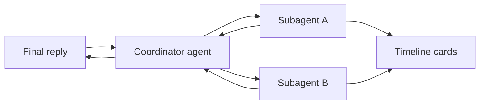

# Subagents

**Subagents** are short, focused agent runs that share your main agent’s provider, model, API key, and thinking level. The coordinator (main agent) starts them with `subagents.run`; you see progress as **inline cards** in the Agent chat timeline.

This guide is only about subagents. For core skills, web keys, and shell/Git tools, see [Agent Harness](agent-harness.md).

## How it works

1. You send a message that **explicitly** asks for subagents.
2. The coordinator may call `skills_read subagents` (core skill) and then `subagents.run`.
3. Each subagent runs its own tool loop in the background (up to 3 in parallel by default).
4. Results return as structured JSON; the coordinator writes a **single** answer for you.

Subagents do **not** appear in long-term chat history as separate threads — only the coordinator’s conversation is persisted.

## When subagents run

The coordinator must **not** spawn subagents unless you ask. Phrases that typically trigger a run:

| Intent | Example prompts |
|--------|------------------|
| Parallel review | “Use subagents to review the agent panel changes” |
| Security pass | “Run a security analyst subagent on auth code” |
| Exploration | “Scout the repo structure with a subagent” |
| Named role | “Start a review subagent for the timeline UI” |

If nothing happens, your wording may be too vague — say **subagent**, **parallel**, or a role name (`scout`, `review`, `security_analyst`).

## Roles

| Role | ID | Focus | Default tool access |
|------|-----|--------|---------------------|
| **Scout** | `scout` | Structure, files, rules, skills, plans | Environment, workspace files, Git read, memory read, plans read, rules/skills read |
| **Review** | `review` | Bugs, regressions, UX, diff risks | Environment, workspace, diff/Git status, tasks read |
| **Security Analyst** | `security_analyst` | Secrets, injection, tool scope, risky flows | Environment, workspace, diff, Git read |

The coordinator can override defaults with `allowedToolGroups` per agent (see [Tool groups](#tool-groups)).

### Display names

- Optional `title` in the run spec (e.g. “Chat UI Review”).
- Otherwise localized defaults: Scout, Review, Security Analyst.
- Duplicate titles get suffixes: `Review 1`, `Review 2`.

## Limits and costs

| Limit | Value |
|-------|--------|
| Agents per `subagents.run` | 5 max |
| Parallel runs (`maxConcurrency`) | 3 default, 5 max |
| Tool rounds per subagent | 8 |
| Output budget per subagent | ~20 000 tokens (estimate) |
| Nesting | Subagents cannot call `subagents.run` |
| Shell writes | Subagents never get `shell_write` |

Parallel subagents multiply API usage and latency. The system prompt tells the coordinator to use them sparingly.

If a subagent hits a cap or never calls `submit_result`, status becomes **blocked** with an explanation in the card summary.

## Chat timeline

During a turn, the Agent panel shows a **Subagents** group (localized title):

- One **expandable card** per subagent.
- **Status**: running → completed / blocked / failed (localized).
- **Tool list** inside the card (localized tool labels).
- **Summary** when finished.

Updates are **debounced by 50 ms** so rapid tool events do not flicker.

Subagent cards attach to the **last** timeline group for that turn. A new coordinator message starts a new group on the next run.

## Tool groups

Subagents only see tools from groups the coordinator assigns. Empty `allowedToolGroups` uses the **role defaults** above.

| Group ID | Tools (summary) |
|----------|-----------------|
| `environment_read` | `environment_detect` |
| `workspace_read` | List/read files, `workspace_search` |
| `diff_read` | `workspace_git_status`, `workspace_diff`, `git_status`, `git_diff`, `git_show` |
| `git_read` | Status, diff, log, show, branches, ls-files |
| `git_write` | `git_apply_patch`, `git_add`, `git_commit` (coordinator-only in practice; not in subagent defaults) |
| `shell_read` | `shell_exec` read-only allowlist |
| `shell_write` | **Not available** to subagents |
| `web_read` | `web_search`, `web_fetch` (only if web API key configured) |
| `memory_read` / `memory_write` | Memory tools |
| `plans_read` / `plans_write` | Plan tools |
| `tasks_read` / `tasks_write` | Task tools |
| `rules_skills_read` / `rules_skills_write` | Rules and skills tools |

Every subagent also receives **`submit_result`** (required to finish). They never receive **`subagents.run`**.

### Environment before shell/Git

Subagents follow the same rule as the coordinator: call **`environment_detect`** once per workspace session before `shell_exec` or Git tools. Switch workspace → cache clears → detect again.

## What you get back

Each subagent ends with **`submit_result`** JSON (`completed`, `blocked`, or `failed`) including:

- `summary` — short outcome text (shown on the card)
- `steps` — optional step list
- `findings` — severity, title, evidence, paths (truncated for the coordinator)
- `artifacts` — plans, patch hints, notes (truncated)
- `recommendedNextActions` — strings for the coordinator to consider

The coordinator’s tool result aggregates all agents; your final chat message synthesizes that — you do not need to read raw JSON unless you expand tooling.

## Providers

Subagents use the **same** provider as configured under Harness → Agent:

| Provider | Supported for subagents |
|----------|------------------------|
| OpenRouter | Yes |
| OpenAI-compatible | Yes |
| Anthropic | Yes |

No separate subagent API keys or models.

## Core skill

The built-in core skill **`subagents`** (Skills panel → **Core** tab) documents `subagents.run` parameters for the model. Enable it like any other core skill.

## See also

- [Agent Harness](agent-harness.md) — settings, core skills, environment/shell/git/web
- [Agent Providers](agent-providers.md) — provider keys and turn checklist
- [Troubleshooting — Subagents](troubleshooting.md#subagents-not-appearing) — subagents not showing up
