# Workspaces

A BLXCode workspace is a project folder plus the UI state needed to work inside it: terminal grid, split panes, assigned agent labels, agent timeline, embedded browser tabs, recent workspace data, and right-panel layout.

## Custom Titlebar

BLXCode uses a **token-themed, cross-platform custom titlebar** instead of the OS default window chrome. The bar reads the active theme and includes:

- A persistent **brand cluster** on the left.
- A left-aligned **Worktree Management** menu, bound to the active workspace when that workspace belongs to a Git repository.
- **Sidebar** and **right-panel** toggle buttons.
- **Centered workspace breadcrumbs** with a live focused-terminal crumb that includes the slot marker plus the terminal title.
- A compact **NAVIGATE** quick menu on the right with quick access to **Terminals**, **New terminal**, **Plans**, **Memory**, **Skills**, **Settings**, and fullscreen.
- A future-ready **Notifications** popover.
- Native window controls (minimize / maximize / close) on the trailing edge, themed where the platform allows.

The old version badge was removed from the titlebar; the sidebar footer still shows the app version. Terminal-count badges in the sidebar are replaced by tiny **workspace-colored grid previews** that mirror each workspace's terminal layout. The **NAVIGATE** terminal actions show the active workspace name in small parentheses for context.

## Workspace Creation

The workspace configurator lets you:

- Choose a **Local** workspace or a **Remote (SSH)** connection — pick a saved preset (or **+ Add connection**) to run the workspace, its terminals, files, and Git on a remote host. See [Remote (SSH)](remote-ssh.md).
- Select or create a project directory.
- Create a **Git worktree workspace** from an existing local or remote repository. Pick the base repository, branch name, optional start point, and optional target path. If BLXCode finds that branch or path already checked out as a worktree, it opens the existing worktree instead of creating a duplicate.
- Type `cd ...` style navigation commands for fast path movement.
- Pick a terminal-grid preset.
- Assign terminal slots to a fleet of coding tools.
- Skip agent assignment when you only want plain terminals.
- **Recent directories** — when you have opened workspaces before, previously used folders appear below the working-directory field; click a row to fill the path in one step.
- **Welcome-screen "Create Workspace" action** — the empty/welcome screen leads with a prominent, highlighted **Create Workspace** call-to-action (folder-plus icon + hint) above the Agent/Memory/Browser/Kanban destinations row. It is backed by a real, rebindable shortcut — `ShortcutAction::CreateWorkspace` (default **Ctrl+B then C**) — that appears in **Settings → Shortcuts** like every other binding and dispatches through the shared harness action path to open the inline Create-Workspace configurator. The welcome destination cards and utility links also **hide their keybinding hints when the workspace panel is narrow** (e.g. split view) via a container query, so the `kbd` chips no longer overlap or crowd the labels.
- **Session role** — pick a BLXCode Agent harness *session mode* (e.g. Coordinator, Architect, Codewright, Security Reviewer) from the dropdown. The picker shows each role's title with a dimmed sub-line summarising its description, skills, tools, and recommended models. The selected role is loaded and handed to the BLXCode Agent as a trailing system-prompt block, so the agent adopts that working style for the session. The role ranks **below** the Security rules and the active Agent Chat mode and can never expand scope. The BLXCode Agent always runs on the **provider/model configured in Settings** — a role never changes its model; its `provider`/`models` are advisory metadata only. The role is saved with the workspace, so it is restored when you reload the workspace, and it appears as a **colored sub-line in the agent name badge** (the color comes from the role definition). The default session role is also seeded from the one-time onboarding dialog and editable in three places — the dialog, **Settings → BLXCode Agent**, and **Settings → Workspace** — with a cross-link explaining they share the same `defaultSessionRole` value.
- **Per-agent model and effort (step 2)** — when you assign a CLI agent (claude/codex/gemini/opencode/cursor) to terminal slots, a small model dropdown appears for that agent with its built-in model options. Leaving it on **Default** uses the CLI's own default; otherwise the chosen model is passed to the launch command (`--model …`). CLIs that support a safe launch-time reasoning-effort override also show an **Effort** dropdown. Launch profiles map supported effort values into the correct CLI mechanism: **Claude** via `CLAUDE_CODE_EFFORT_LEVEL`, **Codex** via `-c model_reasoning_effort=...`, and **Gemini / OpenCode / Cursor** as model-only until their CLIs expose confirmed launch-time effort flags. Selections are persisted on workspaces and presets, kept aligned when terminal slots are reordered, swapped, transferred, added, or removed, and applied when launching/resuming terminal agents. Gemini, OpenCode, and Cursor currently keep effort in their own config/UI, so BLXCode does not pass an effort value at launch for them.
- **Presets** — save a fleet configuration (terminal count, assigned agents, their models, their supported effort levels, per-slot names, and the session role) and relaunch it in one click. Presets are stored globally per installation in the application-data folder (not committed with any workspace). Use **+ New** to save the current configuration as a preset, the **✕** on a preset chip to delete it.

The supported fleet labels are:

- `claude`
- `codex`
- `gemini`
- `opencode`
- `cursor`

The available session roles come from the built-in specialized harness skills (`src-tauri/src/agent/harness_skills/specialized/*.md`): `architect`, `branch-steward`, `codewright`, `coordinator`, `doc-updater`, `harness-optimizer`, `pr-test-analyzer`, `refactor-cleaner`, and `security-reviewer`. Leaving the dropdown on **Default agent** runs the agent without a role.

## Git Worktree Workspaces

A Git worktree workspace is a normal BLXCode workspace whose root is a Git worktree checkout. It has its own terminal grid, center tabs, agent timeline, `.agents` rules, skills, memory, plans, and tasks, while sharing Git object storage with the base repository.

Use it when you want several branches open at once without cloning the repository again. Common examples are keeping `main` open while a feature branch runs tests, reviewing another branch in parallel, or letting a terminal agent work in a separate checkout.

The **Worktree Management** menu in the titlebar is scoped to the active workspace:

- **List / refresh** shows the worktrees attached to the active repository.
- **Open** switches BLXCode to an existing worktree workspace, or creates a workspace entry for that path if it is not already open.
- **Create** asks for branch, optional start point, and optional path. BLXCode checks existing worktrees first and opens a match instead of duplicating it.
- **Remove** only removes clean worktrees. If Git reports uncommitted or untracked changes, BLXCode blocks removal so you can commit, stash, or clean up deliberately.

Remote SSH workspaces use the same flow on the remote host. BLXCode runs the Git worktree commands through the active remote connection and starts remote terminals inside the selected worktree directory.

The BLXCode Agent is worktree-aware. Its system prompt includes the active worktree root, branch, base repository, and local/remote scope, so file tools, shell tools, rules, skills, plans, memory, and terminal handoffs stay anchored to the selected worktree. You can ask the Agent to list or create worktree workspaces; for creation it previews the target, checks whether the branch/path already exists, and asks you to confirm before it creates or opens anything.

  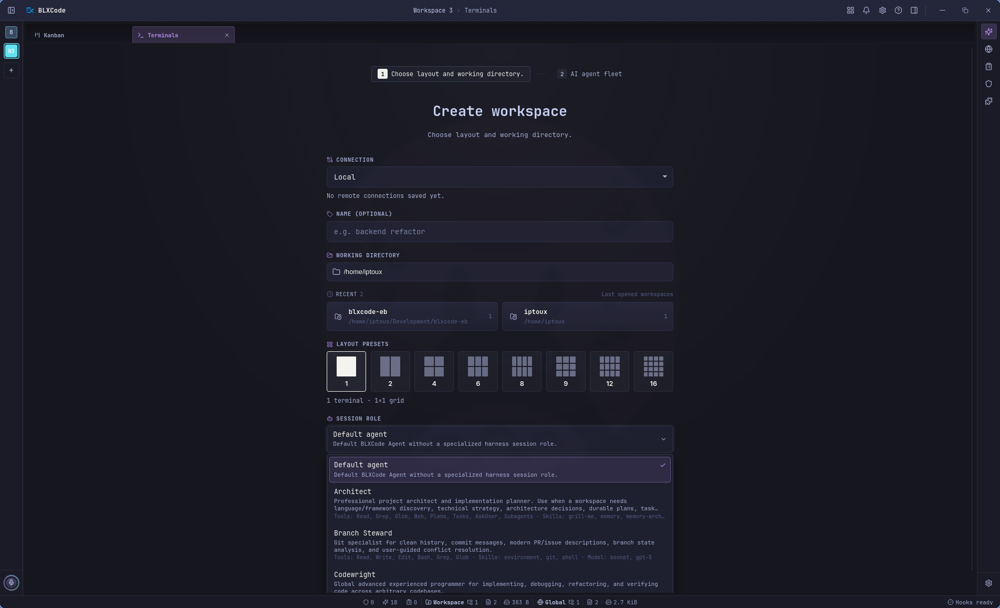

  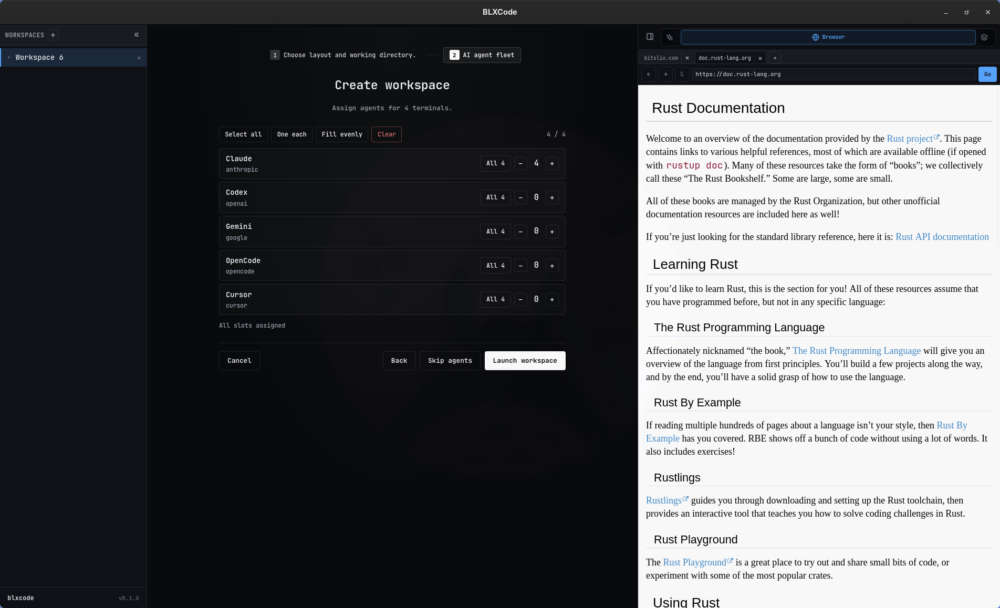

  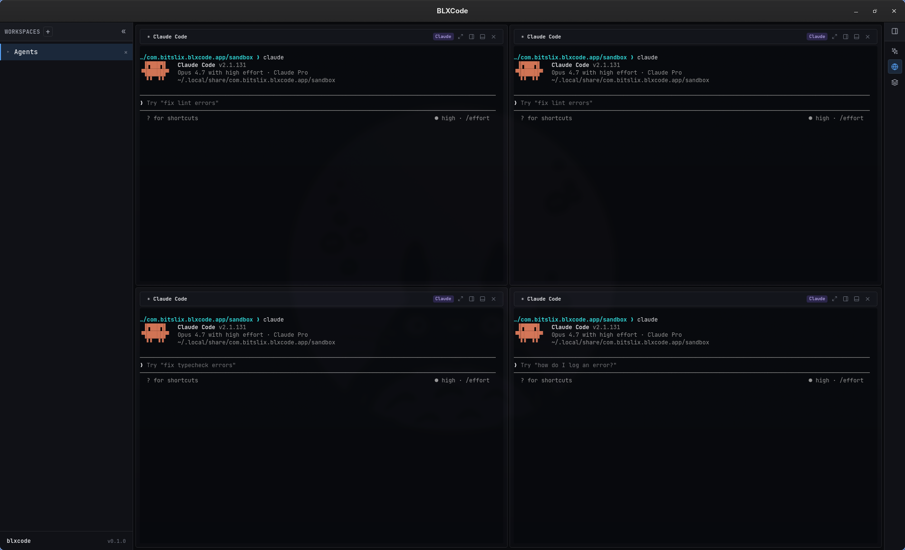

## Center tabs

The workspace pane uses a VS Code–style **tab strip** above the terminal grid. Tabs share the same workspace context (sidebar, agent panel, right panel) and let you keep multiple views side-by-side without unmounting the live terminals.

  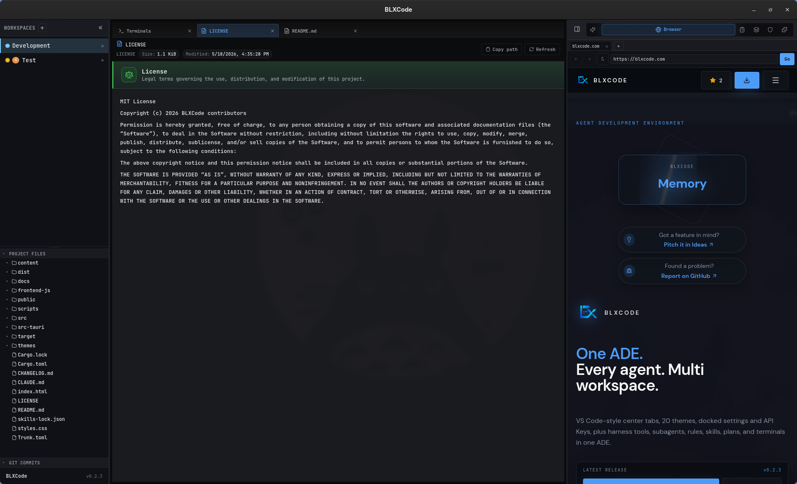

*Three center tabs open in the same workspace: the pinned **Terminals** tab, the **LICENSE** file preview with its policy-doc hero banner, and **README.md**. Switching tabs hides the inactive views — the running PTYs in the Terminals tab keep their state, scrollback, and agent sessions.*

### Tab types

| Tab | Opened by | Closeable | Singleton |
|---|---|---|---|
| **Terminals** | Pinned by default; reopened via command palette **Terminals** or by opening a new terminal slot | ✅ — with a 3 s confirmation dialog | ✅ one per workspace |
| **Canvas** | Switch the terminal view mode to **Canvas** | ✅ — shares the live terminal workspace view | ✅ one per workspace |
| **Swarm** | Switch the terminal view mode to **Swarm** | ✅ — shares the live terminal workspace view | ✅ one per workspace |
| **File preview** | Click a file row in the sidebar Project Files explorer | ✅ | ✅ shared — opening another file replaces the contents instead of stacking tabs (see [File Preview](file-preview.md)) |
| **Settings** | Command palette **Open Settings**, or the configured shortcut | ✅ | ✅ one per workspace — reopening focuses the existing tab |

### Switching, hiding, and persistence

- The active tab is highlighted; **clicking another tab** switches the view immediately.
- The Terminals tab is **hidden, not unmounted**, while another tab is active — xterm sessions, PTYs, agent CLIs, scrollback, and focus all stay alive. Terminal focus/resize observers only fire when the Terminals tab is visible, so background tabs don't trigger unnecessary work.
- Open tabs, active tab, and per-tab content are persisted as part of the workspace snapshot. Older snapshots without a `center_tabs` field self-heal to include the Terminals tab on the next launch.

### Closing the Terminals tab

The pinned Terminals tab can be closed too. Clicking its **×** raises a confirmation dialog with a **3-second countdown** — the **Close** button stays disabled until the countdown finishes, so you don't accidentally tear down running agents. Confirming saves the workspace, terminates its PTYs, and pushes it onto the recent-workspaces list (same path as closing the workspace from the sidebar).

`Escape` dismisses the dialog and keeps the workspace intact. Reopen the Terminals tab any time via the command palette entry **Terminals** without spawning a new PTY.

### Closing the last non-Terminals tab

If the **last remaining tab** in a real workspace is not the Terminals tab and you close it, BLXCode also closes the workspace — the welcome screen reappears when no workspaces remain. This prevents an empty workbench shell that has no visible content.

### Settings without an active workspace

You can open **Settings** even when no workspace is open. BLXCode lazily creates an ephemeral **shell workspace** (empty `cwd`, no terminal slots, hidden from the sidebar list) that hosts only the Settings tab. Closing the Settings tab disposes the shell workspace automatically — you never see it in the sidebar and it never persists across restarts.

This means **Settings → API Keys / Appearance / Workspace / BLXCode Agent** are always one shortcut away from the welcome screen, before you've created or opened any project.

## Terminal Grids And Panes

Each workspace has a top-level terminal grid. Preset counts map to balanced grid dimensions:

| Terminals | Grid |
|---:|:---|
| 1 | 1 x 1 |
| 2 | 1 x 2 |
| 4 | 2 x 2 |
| 6 | 2 x 3 |
| 8 | 2 x 4 |
| 9 | 3 x 3 |
| 12 | 3 x 4 |
| 16 | 4 x 4 |

Individual terminal slots can also keep split-pane state. BLXCode persists pane IDs, split axis, and terminal layout so the workbench can restore the surface after restart.

### Terminal view modes

The **View mode** control switches the live terminal tab between three layouts without restarting PTYs:

| Mode | Purpose |
|---|---|
| **Grid** | The standard terminal grid with balanced preset layouts and split panes. |
| **Canvas** | A freeform workspace where terminal slots become draggable, resizable nodes with `stdin` / `stdout` ports. Connect edges to route output into another terminal as either raw text or a structured BLXCode Canvas context block. |
| **Swarm** | A graph view for terminal-agent roles. It shows the BLXCode Agent control hub and terminal agents as nodes, with a side panel for the selected terminal agent. |

Canvas layouts, user-created routing edges, the default raw/structured transfer mode, and Swarm node positions are saved with the workspace snapshot.

  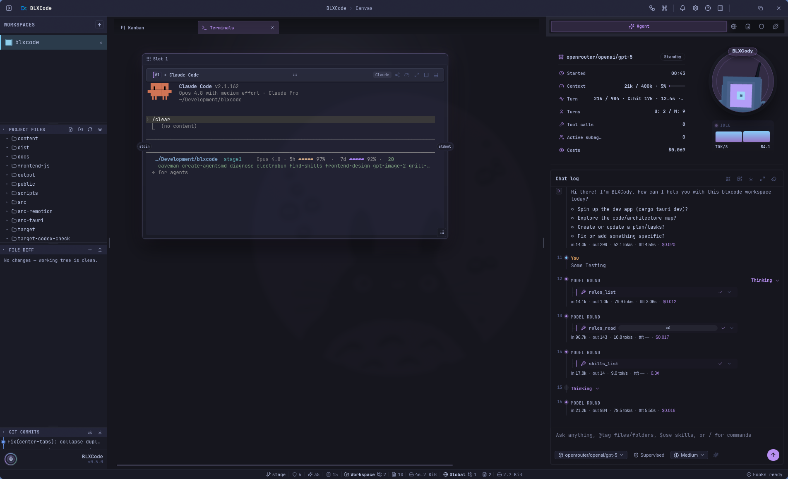

  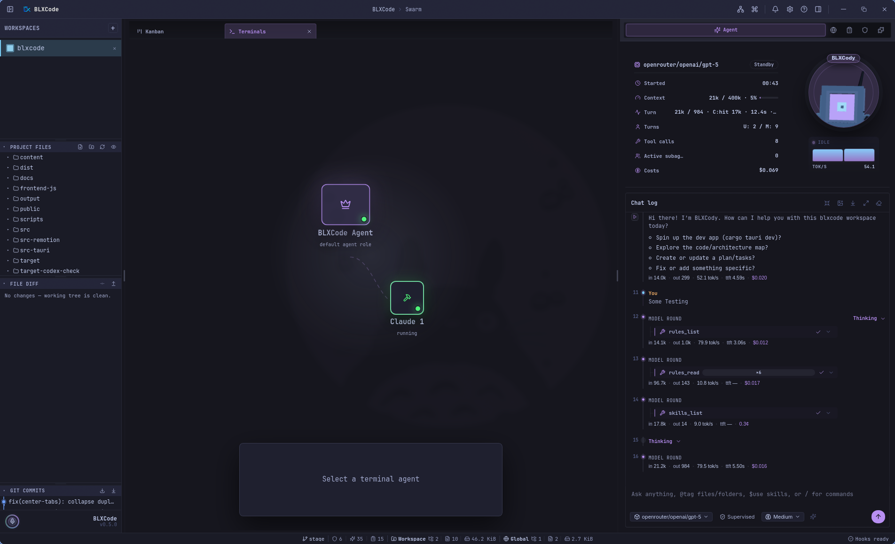

  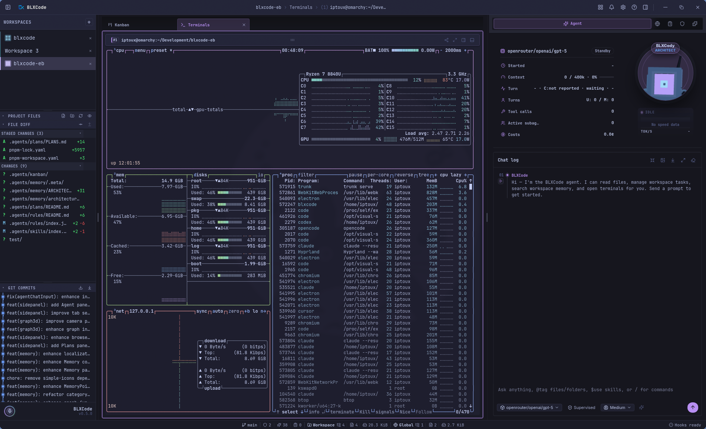

### Named terminals

By default, the terminal titlebar shows `#1`, `#2`, `…` — the slot's grid number. Switching to **named** mode (under **Settings → Workspace → Terminal naming**) replaces those numbers with friendly **agent names** (Devon, Tom, Mia, …) drawn from an editable name pool.

- **Deterministic, collision-free** — each name is derived from the terminal's stable `slot_id`, so a slot keeps its name as siblings come and go.
- **Custom name per slot** — double-click the terminal header title or use the header right-click menu (**Rename** / **Reset name**) to override the auto-assigned name. The override persists per slot (`slot_name_overrides`, keyed by `slot_id`) and survives restarts.
- **Backend identity is unchanged** — `slot_id` stays the technical handle used by PTY routing, `terminal_key`, and `sessions.json`. Names are a pure display/addressing layer resolved in the frontend.
- **The agent knows the names** — `harness.list_terminals` returns the resolved `name` plus `namingMode` for every slot, and `harness.send_terminal_keys` / `send_agent_context` / `read_terminal_output` / `wait_terminal_output` / `terminal_interrupt` accept a `name` argument (case-insensitive) alongside `slotId` and `agentSlug`. You can therefore ask the BLXCode Agent *"ask Devon to run the tests"* and it will route the request to the right slot.

  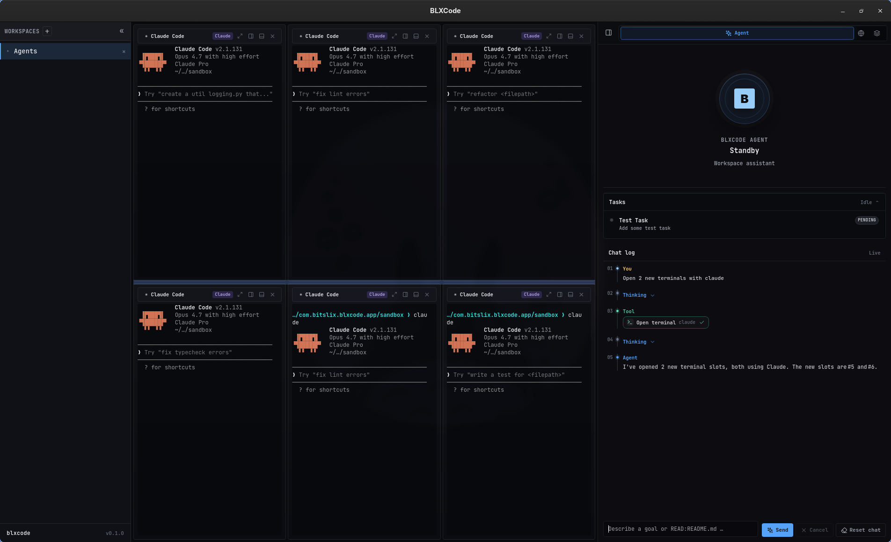

### Reordering terminals with drag & drop

Every terminal slot exposes a grip handle (`⋮⋮`) on the far left of its titlebar. Drag a slot by its handle and drop it on any other slot in the same workspace grid to swap positions — the two slots exchange their cells in the grid, agent labels and split-pane layout travel along, and running PTY sessions are preserved (no shell restart, no agent CLI re-launch).

Visual cues while dragging:

- The source slot fades to ~55% opacity.
- The slot under the cursor gets a dashed accent outline.
- A transluscent ghost preview marks the target grid cell.

Drag is disabled while the workspace configurator is open, while a slot is in full-size mode, and while the sidebar is collapsed. Drag direction is unconstrained — any source slot can be dropped on any other slot, and repeated reorders compose freely. Cross-workspace transfer is not supported in this release; individual split panes inside a slot cannot be dragged out on their own.

## Shell Environment

The backend spawns PTY sessions through `portable-pty`. On Unix-like systems it uses `$SHELL`, falling back to `/bin/sh`.

BLXCode injects a few environment variables into terminal sessions when needed:

- `BLX_TERMINAL_KEY`: stable terminal/session mapping key.
- `BLX_AGENT_SLUG`: assigned agent label for the slot.
- `BLX_SESSIONS_PATH`: app-managed session mapping file path.
- `BLX_NOTIFICATIONS_PATH`: app-managed unread counter file for agent completion hooks.
- `BLX_AGENT_CONTEXT_DIR`: workspace-local directory (`<workspace>/.blxcode/agent-context`) where the handoff feature exports images and writes the manifest. Hooks may inspect this path; injection is **always** explicit via the BLXCode Agent or the titlebar dropdown.
- `BLX_AGENT_CONTEXT_MANIFEST`: JSON manifest path (`<workspace>/.blxcode/agent-context/manifest.json`) listing the most recently exported images (id, label, mime, size, on-disk filename).

These values support session capture, notification hooks, and the terminal-agent context handoff feature.

## Sidebar

The left sidebar combines the workspace list with a resizable bottom panel for project tooling.

  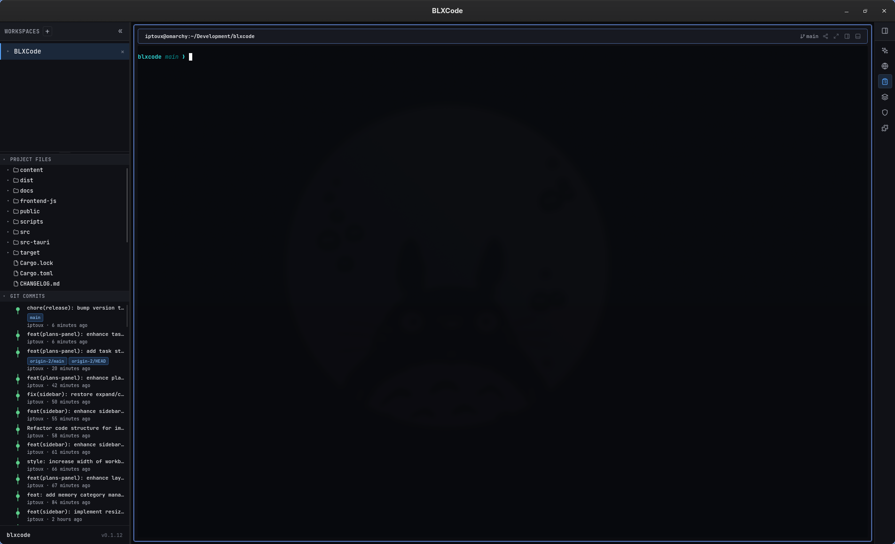

### Layout and resize

- **Sidebar width** — drag the right edge of the sidebar (default **260px**, persisted as `blxcode_sidebar_width_px_v1`).
- **Workspace list vs. bottom panel** — drag the horizontal handle between the workspace list and the combined Explorer/Diff/Git block (default **50%** of sidebar height, `blxcode_sidebar_panels_height_pct_v1`).
- **Three inner panels** — drag the handles between **Project Files**, **File Diff**, and **Git Commits** (`blxcode_sidebar_explorer_height_pct_v1`, `blxcode_sidebar_diff_height_pct_v1`; each clamped so no section collapses below its minimum).

### Project Files (Explorer)

- Lazy file tree for the active workspace `cwd` (sandboxed under the workspace root).
- **Refresh** toolbar action.
- **New File** and **New Folder** — always-visible toolbar actions; inline naming (VS Code style). The selected folder (or a file’s parent folder) is the creation target. Hover a folder row for per-folder **New File** / **New Folder** icons.
- **Show/hide hidden files** — eye toggle for dot-prefixed entries (`blxcode_sidebar_explorer_show_hidden_v1`, default off).
- Click a folder row to expand or collapse; clicking a folder also selects it as the creation target.
- **Click a file row** to open it in a shared center preview tab. Images, video, Markdown, source code (with line numbers + syntax highlighting), and Mermaid render as rich content; text falls back to a gutter-and-selection monospaced view; binary types show an "unsupported" placeholder. Repository policy docs (`LICENSE`, `CONTRIBUTING`, `CONTRIBUTORS`, `SECURITY`, `CHANGELOG`, `README`, …) render as Markdown with a kind-specific hero banner whether or not they ship with a `.md` extension. See [File Preview](file-preview.md) for the full feature matrix, byte caps, and security notes.

### File Diff

When the workspace is a Git repository, the **File Diff** section lists changed files in two collapsible groups:

| Group | Contents |
|-------|----------|
| **Changes** | Unstaged and untracked files |
| **Staged Changes** | Index entries ready to commit |

Each row shows status (`M` / `A` / `D` / `?` / …), path, and `+`/`-` line counts. Hover for **stage** (`+`) or **unstage** (`−`) on a single file; group headers offer **Stage all** / **Unstage all**.

The toolbar provides:

- **Commit** — opens a dialog to enter a message or use **Commit with AI** (uses your BLXCode Agent text provider and API key from Settings).
- **Push** — enabled only when every change is staged and a remote branch is reachable (see Git sync below).

Click a row to open a center **diff** tab with inline `+`/`-` highlighting. The list refreshes automatically when Git reports a dirty index (`git status` watcher).

### Git Commits

- Swim-lane commit graph (up to 100 commits) when `.git` is present.
- Ref badges and author/time metadata.
- Toolbar **Fetch** and **Pull** (fetch + merge) when a remote is configured; buttons reflect ahead/behind counts and disable during an in-flight sync.
- If `git` is not on `PATH`, the section stays visible with a hint instead of an empty graph.

Fetch, pull, and push share one busy state with File Diff so only one Git network operation runs at a time. Outcomes appear as localized toasts (up to date, merge conflict, auth failure, missing upstream, and more). Force-push, rebase-pull, submodules, and stash are not in scope.

Explorer, File Diff, and Git section open/collapsed state restores per workspace after reload.

### Sidebar typography

The **File Diff** and **Git Commits** sidebar sections use the same compact font sizing as the **Project Files** tree, so the three inner panels read as a single consistent list when stacked. The tree rows, diff rows, and commit rows all share row height, label weight, and the same dim-secondary metadata text.

## Workspace settings

**Settings** (center tab) → **Workspace**:

| Section | Purpose |
|---------|---------|
| **Paths & sandbox** | Default directory for new workspaces; agent sandbox root for file tools |
| **Embedded browser** | Default URL when opening the Browser tab |
| **Category colors** | Named color presets for Memory categories (sidebar dots, graph accents) |
| **Confirmations** | Optional “Confirm before closing a workspace” (sidebar ×, context menu, and Terminals tab) |
| **Architecture map** | Per-workspace toggle for future LLM prose on rebuild (default off; rebuilds are deterministic today) |

One **Save** / **Discard** footer applies path and browser changes together. Category color edits save immediately when you change a swatch or label.

See [Settings](settings.md).

## Terminal Agent Context Handoff

Each terminal cell exposes a share icon in its titlebar. The menu lists every live terminal in the workspace, a separator, and **Send to BLXCode Agent**.

  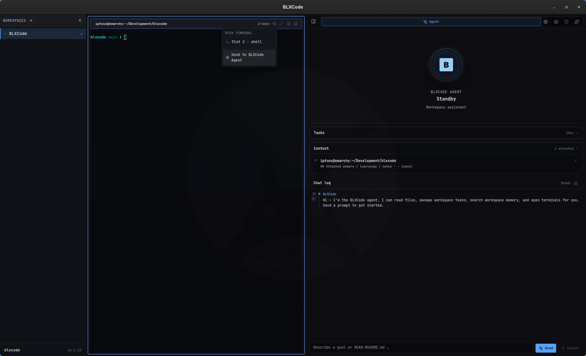

- **Pick a terminal** → BLXCode renders a Markdown context block and writes it into that terminal's PTY. The block can include workspace root, attached memory/plans/tasks, and image paths. Image bytes are exported to `<workspace>/.blxcode/agent-context/images/` with a JSON manifest; base64 is never written into the prompt.
- **Send to BLXCode Agent** → attaches workspace context (from a terminal: slot title + preview; from Memory: selected note or category).

The same menu is available from the Memory **Graph** note preview ([memory-graph-handoff.png](../images/memory-graph-handoff.png) in [Memory And Tasks](memory-and-tasks.md)).

**Feedback:** successful handoffs show a bottom-right toast (optional) and optional short sound. Configure under **BLXCode Settings** → **App** → **Notifications** — see [Keyboard Shortcuts](keyboard-shortcuts.md). Errors always show an error toast.

The BLXCode Agent can trigger handoff via `harness.send_agent_context` with optional `includeKinds`: `memory`, `plans`, `tasks`, `images` (default: all four). The rendered Markdown includes an **Attached plans / tasks** section when those kinds are included. See [Agent Providers](agent-providers.md).

## Session resume

With agent hooks installed, BLXCode records each terminal slot’s external agent session id in `sessions.json`. When you reopen a slot in the same workspace (same agent label and working directory), the launch command uses the provider’s resume syntax—for example `claude --resume <id>` or `codex resume <id>`—so you pick up where the CLI left off instead of starting a blank session.

Captured session titles appear on terminal chrome (for example **Test session setup**, **Just a test**, **sandbox**, **Chat Pal**), so a multi-slot grid gives you an at-a-glance overview of running agents across Claude, Codex, Cursor, and the rest of the fleet.

## Agent completion badges

When agent hooks are installed (Harness → Agent hooks), each terminal CLI fires a **Stop** (or OpenCode `session.idle`) hook when a turn finishes. The hook increments an unread counter in `notifications.json`.

The workspace sidebar shows two badges per workspace:

| Badge | Meaning | Color |
|-------|---------|-------|
| Active | Unread count on the **focused** terminal in that workspace | Same accent as the focused terminal’s agent |
| Total | Sum of unread counts across **all** terminals in the workspace | Orange |

Unread counts clear when you **focus** the terminal cell (click or tab into it). A short beep plays when a task completes in a background workspace or unfocused terminal.

Re-run **Install agent hooks** after upgrading blxcode so notify hooks are registered alongside title and session-capture hooks.

  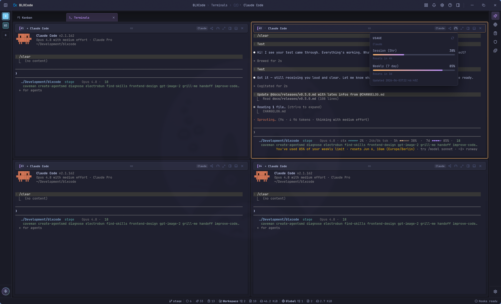

*Example: four resumed Claude sessions in a 2×2 grid; the focused terminal exposes captured 5-hour and 7-day Claude usage in the status line and popover.*

## Embedded Browser

BLXCode captures HTTP and HTTPS links from markdown, terminal integration events, and DOM clicks, then opens them in the embedded browser area.

On Windows and macOS, the backend can use native child webviews through Tauri unstable APIs. On Linux, BLXCode falls back to an iframe-based embedded surface because native child inset support is disabled.

Some websites block iframe embedding through `X-Frame-Options` or `Content-Security-Policy: frame-ancestors`. BLXCode probes these headers and can route around blocked embeds when possible.

## Persistence

Workbench state is saved through Tauri commands with a short debounce. BLXCode also performs a best-effort save when the window is closing.

Persisted state includes:

- Open workspaces.
- Active workspace.
- Recent workspaces.
- Sidebar and right-panel collapsed state.
- Right-panel width and active tab.
- Embedded browser tabs.
- Workspace terminal and pane layout.
- Agent timeline and compose draft.

If a saved snapshot has an unsupported schema version, BLXCode ignores it and starts with defaults rather than crashing.

## App status line

An always-visible **status bar** at the bottom of the workbench surfaces live, low-noise context for the active workspace:

- **Rules / skills chip group** — enabled counts; clickable links to **Settings**.
- **Memory scope** — Project vs. Global, with the loaded note path.
- **Active editor** — file name + `line:col` for the focused CodeMirror tab.
- **Git branch** — the workspace branch (with detached/upstream-aware states).
- **Claude usage** — when the focused terminal session is Claude, the bar doubles as a passive Claude meter that captures 5-hour and 7-day usage from the CLI's status line (silently falls back when Claude isn't running).
- **Plans / memory chips** — counts that jump to the corresponding center tab.
- **Update indicator** — `Checking…` while a check runs, `Update available (vX.Y.Z)` when a new release is found, `Up to date` for manual checks.
- **Process rotator** — every three seconds, the left slot rotates through active processes (Memory Indexer running or stalled, hook install outcomes, …).
- **VIM indicator** — `VIM` shows in the left slot while a file editor/preview tab is focused and Vim mode is on.
- **Help button** — opens the titlebar Help menu (product metadata, link grid, About, integrated *Check for updates*).

All sections are theme-token styled, hide themselves when no relevant context exists (e.g. no rules), and respect the existing app font-size token.

## Sidebar → Agent context drag-and-drop

The agent drop-zone (the chat input area) now accepts four kinds of context, each with its own kind-specific icon, color, and cursor-following overlay:

| Source | Kind | What's attached |
|--------|------|-----------------|
| Terminal cells | `TerminalSession` | Live terminal session, slot metadata, recent output tail. |
| **Project Files** | `FileRef` | **File** or **Folder** rows — path-only; the agent reads content via its own tools. Folders land with a trailing `/` so the agent knows it is a directory. |
| **File Diff** rows | `GitDiff` | The inline diff text (read via `git_file_diff`). |
| **Git Commits** rows | `GitCommit` | The commit subject/body and changed files (read via `git_commit_details`). |

All are **persistent** in the agent context list and removable with the existing `×` action. Backend prompt rendering and the terminal handoff `render_agent_context_block` both branch on the new kinds — `FileRef` collapses to a `files:` path list, `GitDiff` / `GitCommit` emit inline fenced blocks.

## Hook installation dialog

A themed `HookInstallDialog` prompts the user to install or refresh the missing **terminal CLI agent hooks** (Claude, Codex, Gemini, OpenCode, Cursor). The **Settings → App** pane's hook list uses a 3-column grid layout (collapsing to 2 / 1 below 900 / 600 px) with icon-only status pills (check / X) and full text in `title` + `aria-label`. A new in-app log shows the install/refresh outcome.

`HookStatusService` tracks which hooks are installed for the active workspace, and the dialog is shown again whenever a hook is missing after a workspace switch or app upgrade.

## See also

- [File Preview](file-preview.md) — image / video / Markdown / Mermaid renderers triggered from the sidebar
- [Memory And Tasks](memory-and-tasks.md) — memory panel and graph handoff
- [Plans](plans.md) — plan files included in handoff
- [Keyboard Shortcuts](keyboard-shortcuts.md) — tmux/legacy chords and notification settings
- [Agent Providers](agent-providers.md) — `harness.send_agent_context`
